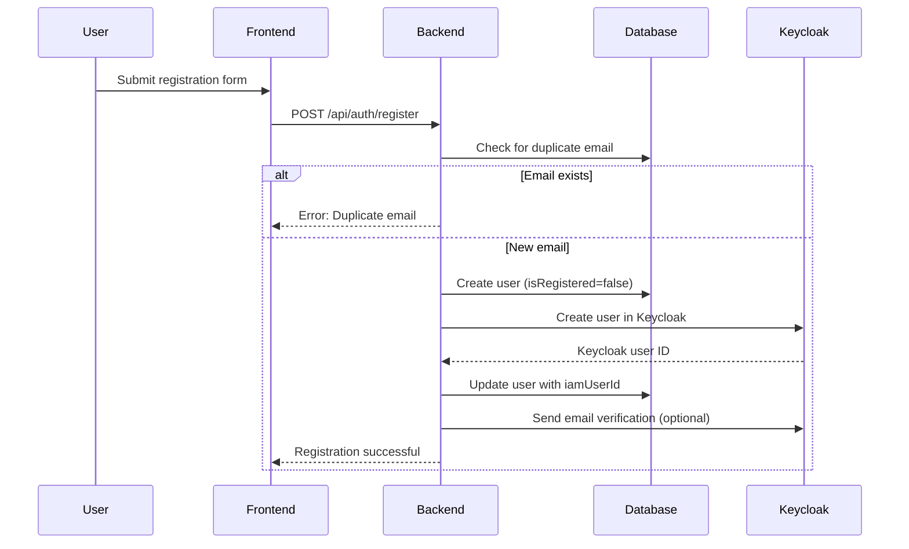
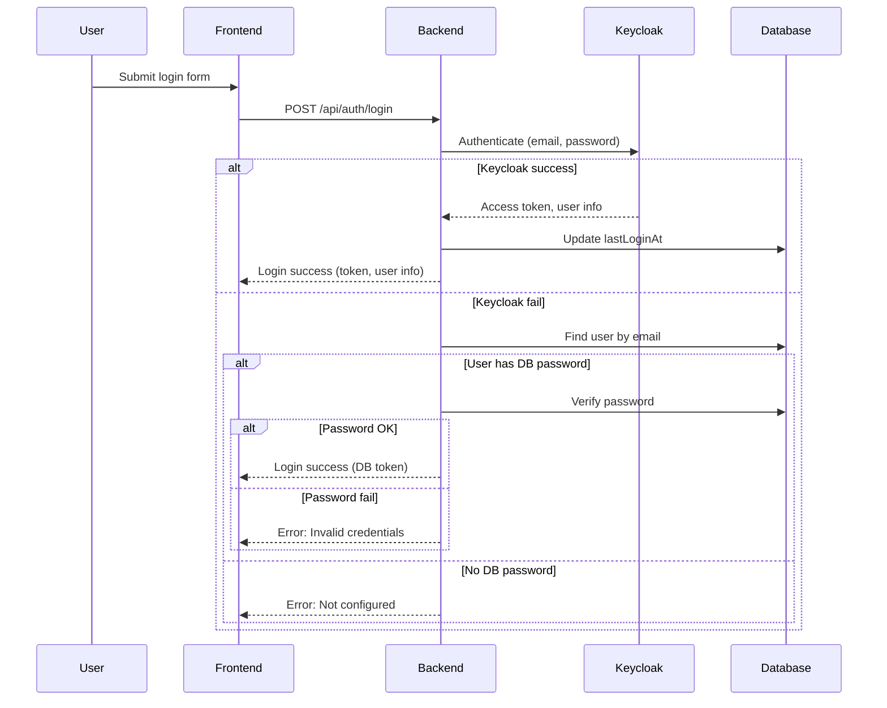

# User Registration and Login Architecture

This document explains the architecture, design, and implementation of the user registration and login flows in the Contract Management System backend. It covers Keycloak integration, database interactions, error handling, and security considerations.

---

## Overview

- **Authentication Provider:** Keycloak (OpenID Connect)
- **User Data Storage:** PostgreSQL (via Sequelize ORM)
- **Backend:** Node.js (Express)
- **Frontend:** React (not covered here)

---

## Registration Flow

### 1. User Registration (API: `/api/auth/register`)

#### Steps:
1. **User submits registration form** (name, email, password, party type, etc.)
2. **Backend validates input** (required fields, email format, password complexity).
3. **Check for duplicate email** in the local database.
4. **Create user in local database** (with `isRegistered=false`, `emailVerified=false`).
5. **Create user in Keycloak**:
    - Set email, name, party type, etc. as Keycloak attributes.
    - Set a temporary password (if not provided).
    - Assign appropriate roles.
6. **Update local user with Keycloak ID** (`iamUserId`).
7. **Send email verification** (if enabled).
8. **Respond to frontend** with registration status.

#### Mermaid Diagram


---

## Login Flow

### 2. User Login (API: `/api/auth/login`)

#### Steps:
1. **User submits login form** (email, password).
2. **Backend validates input** (required fields).
3. **Try Keycloak authentication** (Resource Owner Password Credentials grant):
    - If successful:
        - Fetch user info from Keycloak.
        - Update `lastLoginAt` in local DB.
        - Return JWT access token and user info.
    - If Keycloak fails:
        - Fallback to database authentication (legacy users only).
        - If DB password matches, return JWT token.
        - If not, return error.

#### Mermaid Diagram


---

## Keycloak Integration

- **User Source of Truth:** Keycloak for authentication, local DB for profile/metadata.
- **Client:** `contract-management-backend` (confidential, direct access grants enabled)
- **Admin Operations:** Use `admin-cli` for user management (create, reset password, etc.)
- **Attributes:** Custom user attributes (partyType, walletAddress, etc.) are stored in Keycloak and synced to DB.
- **Email Verification:** Sent via Keycloak (if enabled).

---

## Database Interactions

- **User Table:** Stores user profile, registration status, Keycloak ID, and metadata.
- **Sync:** On registration, user is created in both DB and Keycloak. On login, `lastLoginAt` is updated.
- **Fallback:** If Keycloak is down, legacy DB authentication is attempted (for users with DB passwords).

---

## Error Handling

- **Duplicate Email:** Checked before registration.
- **Keycloak Errors:** Logged and returned as user-friendly messages.
- **DB Errors:** Logged and returned as generic errors.
- **Security:** No sensitive error details are exposed to the frontend.

---

## Security Considerations

- **Passwords:** Only stored in Keycloak, not in DB (except legacy users).
- **Tokens:** JWT tokens are signed with a strong secret, short-lived.
- **Rate Limiting:** Login endpoint is rate-limited to prevent brute force.
- **Email Verification:** Required for account activation (if enabled).
- **Roles:** Assigned in Keycloak, enforced in backend via token claims.
- **Audit Logging:** All auth events are logged for monitoring.

---

## Implementation Notes

- **Environment Variables:** All Keycloak and DB credentials are loaded from `config.env`.
- **KeycloakService:** Handles all Keycloak API interactions (auth, user management, token validation).
- **Error Codes:** Consistent error codes are returned for frontend handling.
- **Extensibility:** New user attributes and roles can be added via Keycloak and synced to DB.

---

## Example API Calls

### Registration
```http
POST /api/auth/register
Content-Type: application/json
{
  "name": "Test User",
  "email": "test@example.com",
  "password": "StrongPass!123",
  "partyType": "TDP"
}
```

### Login
```http
POST /api/auth/login
Content-Type: application/json
{
  "email": "test@example.com",
  "password": "StrongPass!123"
}
```

---

## Troubleshooting

- **"Client not allowed for direct access grants":** Enable "Direct Access Grants" in Keycloak client settings.
- **"Invalid user credentials":** Check password, reset if needed.
- **No password in DB:** User must authenticate via Keycloak.
- **Email not received:** Check Keycloak email settings and SMTP server.

---

## References
- [Keycloak Documentation](https://www.***REMOVED-KEYCLOAK_DB_PASSWORD***.org/docs/latest/)
- [OpenID Connect Spec](https://openid.net/specs/openid-connect-core-1_0.html)
- [Sequelize ORM](https://sequelize.org/) 