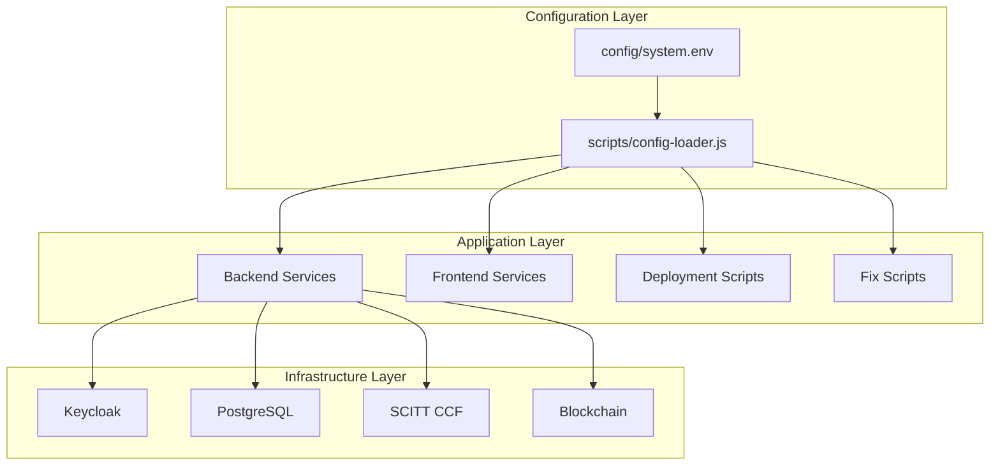

# 🏗️ Centralized Configuration Architecture

## 📋 Overview

This document describes the centralized configuration architecture that solves the configuration chaos problem in the Contract Management System.

## 🚨 **The Problem: Configuration Chaos**

### **Before: Multiple Inconsistent Sources**

The system had **93 files** with different configurations:

```javascript
// auto-fix-keycloak.js
this.baseUrl = process.env.KEYCLOAK_URL || 'http://localhost:8080';

// sync-users-to-keycloak.js  
const KEYCLOAK_BASE_URL = 'https://localhost:8443';

// setup-keycloak-realm.js
const KEYCLOAK_BASE_URL = 'http://localhost:8080';
```

**Problems:**
- ❌ **Inconsistent URLs** (8080 vs 8443)
- ❌ **Hardcoded values** everywhere
- ❌ **No single source of truth**
- ❌ **Configuration drift** over time
- ❌ **Deployment failures** due to mismatched configs

## ✅ **The Solution: Centralized Configuration**

### **Architecture Overview**



### **1. Single Source of Truth**

**File: `config/system.env`**
```bash
# =============================================================================
# CONTRACT MANAGEMENT SYSTEM - CENTRALIZED CONFIGURATION
# =============================================================================
# This is the SINGLE SOURCE OF TRUTH for all system configurations
# All scripts, services, and deployment tools MUST use this file
# =============================================================================

# KEYCLOAK CONFIGURATION (SINGLE SOURCE OF TRUTH)
KEYCLOAK_URL=https://localhost:8443
KEYCLOAK_REALM=contract-management
KEYCLOAK_ADMIN_USER=admin
KEYCLOAK_ADMIN_PASSWORD=admin123
KEYCLOAK_CLIENT_ID=contract-management-frontend
KEYCLOAK_CLIENT_SECRET=
KEYCLOAK_ENABLED=true

# DATABASE CONFIGURATION
DB_HOST=localhost
DB_PORT=5433
DB_NAME=contract_management
DB_USER=postgres
DB_PASSWORD=postgres
DB_SSL=false

# BACKEND CONFIGURATION
BACKEND_PORT=5001
BACKEND_HOST=localhost
NODE_ENV=development
JWT_SECRET=your-super-secret-jwt-key-change-in-production
JWT_EXPIRES_IN=24h
```

### **2. Configuration Loader**

**File: `scripts/config-loader.js`**
```javascript
class ConfigLoader {
  constructor() {
    this.config = {};
    this.configPath = path.join(__dirname, '..', 'config', 'system.env');
    this.load();
  }

  getKeycloak() {
    return {
      url: this.get('KEYCLOAK_URL'),
      realm: this.get('KEYCLOAK_REALM'),
      adminUser: this.get('KEYCLOAK_ADMIN_USER'),
      adminPassword: this.get('KEYCLOAK_ADMIN_PASSWORD'),
      clientId: this.get('KEYCLOAK_CLIENT_ID'),
      clientSecret: this.get('KEYCLOAK_CLIENT_SECRET'),
      enabled: this.get('KEYCLOAK_ENABLED') === 'true'
    };
  }
}
```

### **3. Unified Scripts**

**File: `scripts/fix-auth-unified.sh`**
```bash
# Load centralized configuration
load_config() {
    CONFIG_OUTPUT=$(node -e "
        const config = require('./scripts/config-loader');
        console.log(JSON.stringify(config.getKeycloak()));
    ")
    
    KEYCLOAK_URL=$(echo "$CONFIG_OUTPUT" | jq -r '.url')
    KEYCLOAK_REALM=$(echo "$CONFIG_OUTPUT" | jq -r '.realm')
    # ... all other configs
}
```

## 🔧 **Implementation Details**

### **Configuration Categories**

#### **1. System Identification**
```bash
SYSTEM_NAME=ContractManagement
SYSTEM_VERSION=1.0.0
SYSTEM_ENV=development
```

#### **2. Keycloak Configuration**
```bash
KEYCLOAK_URL=https://localhost:8443
KEYCLOAK_REALM=contract-management
KEYCLOAK_ADMIN_USER=admin
KEYCLOAK_ADMIN_PASSWORD=admin123
KEYCLOAK_CLIENT_ID=contract-management-frontend
KEYCLOAK_CLIENT_SECRET=
KEYCLOAK_ENABLED=true
```

#### **3. Database Configuration**
```bash
DB_HOST=localhost
DB_PORT=5433
DB_NAME=contract_management
DB_USER=postgres
DB_PASSWORD=postgres
DB_SSL=false
```

#### **4. Backend Configuration**
```bash
BACKEND_PORT=5001
BACKEND_HOST=localhost
NODE_ENV=development
JWT_SECRET=your-super-secret-jwt-key-change-in-production
JWT_EXPIRES_IN=24h
```

#### **5. Frontend Configuration**
```bash
FRONTEND_PORT=3000
FRONTEND_HOST=localhost
CORS_ORIGIN=http://localhost:3000
```

#### **6. Docker Configuration**
```bash
DOCKER_NETWORK=cms-network
DOCKER_KEYCLOAK_PORT=8443
DOCKER_POSTGRES_PORT=5433
DOCKER_BACKEND_PORT=5001
DOCKER_FRONTEND_PORT=3000
```

#### **7. SCITT CCF Configuration**
```bash
SCITT_CCF_ENABLED=false
SCITT_CCF_NODE_PORT=8000
SCITT_CCF_GOVERNANCE_PORT=8001
SCITT_CCF_URL=http://localhost:8000
MIGRATION_MODE=ETHEREUM_ONLY
```

#### **8. Blockchain Configuration**
```bash
BLOCKCHAIN_ENABLED=true
BLOCKCHAIN_NETWORK=localhost
BLOCKCHAIN_RPC_URL=http://localhost:8545
CONTRACT_ADDRESS=0xe7f1725E7734CE288F8367e1Bb143E90bb3F0512
```

#### **9. Security Configuration**
```bash
SESSION_SECRET=your-session-secret-here
ENCRYPTION_KEY=your-encryption-key-here
SSL_ENABLED=true
SSL_CERT_PATH=./certs/server.crt
SSL_KEY_PATH=./certs/server.key
```

#### **10. Email Configuration**
```bash
EMAIL_ENABLED=false
EMAIL_HOST=smtp.gmail.com
EMAIL_PORT=587
EMAIL_USER=your-email@gmail.com
EMAIL_PASS=your-app-password
EMAIL_FROM=your-email@gmail.com
```

#### **11. Logging Configuration**
```bash
LOG_LEVEL=info
LOG_FILE=./logs/system.log
LOG_MAX_SIZE=10m
LOG_MAX_FILES=5
```

#### **12. Testing Configuration**
```bash
TEST_DB_NAME=contract_management_test
TEST_KEYCLOAK_REALM=contract-management-test
TEST_MODE=false
```

#### **13. Deployment Configuration**
```bash
DEPLOYMENT_ENV=local
DEPLOYMENT_DOMAIN=localhost
DEPLOYMENT_SSL=false
DEPLOYMENT_BACKUP_ENABLED=true
DEPLOYMENT_MONITORING_ENABLED=true
```

### **Configuration Loader Features**

#### **1. Hierarchical Loading**
```javascript
// 1. Load from config file
this.load();

// 2. Override with environment variables
this.overrideWithEnvVars();

// 3. Validate required configurations
this.validate();
```

#### **2. Environment Variable Override**
```javascript
overrideWithEnvVars() {
  const envOverrides = [
    'KEYCLOAK_URL', 'KEYCLOAK_REALM', 'KEYCLOAK_ADMIN_USER', 'KEYCLOAK_ADMIN_PASSWORD',
    'DB_HOST', 'DB_PORT', 'DB_NAME', 'DB_USER', 'DB_PASSWORD',
    'BACKEND_PORT', 'FRONTEND_PORT', 'NODE_ENV'
  ];

  for (const key of envOverrides) {
    if (process.env[key]) {
      this.config[key] = process.env[key];
    }
  }
}
```

#### **3. Configuration Validation**
```javascript
validate() {
  const required = [
    'KEYCLOAK_URL', 'KEYCLOAK_REALM', 'KEYCLOAK_ADMIN_USER', 'KEYCLOAK_ADMIN_PASSWORD',
    'DB_HOST', 'DB_PORT', 'DB_NAME', 'DB_USER', 'DB_PASSWORD',
    'BACKEND_PORT', 'FRONTEND_PORT'
  ];

  const missing = required.filter(key => !this.config[key]);
  
  if (missing.length > 0) {
    throw new Error(`Missing required configuration: ${missing.join(', ')}`);
  }
}
```

#### **4. Categorized Access**
```javascript
// Get specific configuration categories
const keycloak = config.getKeycloak();
const database = config.getDatabase();
const backend = config.getBackend();
const frontend = config.getFrontend();
const docker = config.getDocker();
const scittCcf = config.getScittCcf();
const blockchain = config.getBlockchain();
const security = config.getSecurity();
const email = config.getEmail();
const logging = config.getLogging();
const testing = config.getTesting();
const deployment = config.getDeployment();
```

## 🚀 **Usage Examples**

### **1. In Backend Services**
```javascript
// backend/services/keycloakService.js
const config = require('../scripts/config-loader');

class KeycloakService {
  constructor() {
    this.keycloak = config.getKeycloak();
    this.baseUrl = this.keycloak.url;
    this.realm = this.keycloak.realm;
    this.adminUser = this.keycloak.adminUser;
    this.adminPassword = this.keycloak.adminPassword;
  }
}
```

### **2. In Fix Scripts**
```bash
# scripts/fix-auth-unified.sh
load_config() {
    CONFIG_OUTPUT=$(node -e "
        const config = require('./scripts/config-loader');
        console.log(JSON.stringify({
            keycloak: config.getKeycloak(),
            database: config.getDatabase(),
            backend: config.getBackend()
        }));
    ")
    
    KEYCLOAK_URL=$(echo "$CONFIG_OUTPUT" | jq -r '.keycloak.url')
    KEYCLOAK_REALM=$(echo "$CONFIG_OUTPUT" | jq -r '.keycloak.realm')
    # ... all other configs
}
```

### **3. In Deployment Scripts**
```bash
# deployment/deploy-to-ubuntu-vm.sh
load_config() {
    CONFIG_OUTPUT=$(node -e "
        const config = require('./scripts/config-loader');
        console.log(JSON.stringify(config.getDeployment()));
    ")
    
    DEPLOYMENT_ENV=$(echo "$CONFIG_OUTPUT" | jq -r '.env')
    DEPLOYMENT_DOMAIN=$(echo "$CONFIG_OUTPUT" | jq -r '.domain')
    DEPLOYMENT_SSL=$(echo "$CONFIG_OUTPUT" | jq -r '.ssl')
}
```

### **4. In Docker Compose**
```yaml
# docker-compose.keycloak-dev.yml
services:
  keycloak:
    environment:
      KEYCLOAK_ADMIN: ${KEYCLOAK_ADMIN_USER}
      KEYCLOAK_ADMIN_PASSWORD: ${KEYCLOAK_ADMIN_PASSWORD}
      KC_DB_URL: jdbc:postgresql://postgres:5432/keycloak
    ports:
      - "${DOCKER_KEYCLOAK_PORT}:8443"
```

## 📊 **Benefits**

### **1. Single Source of Truth**
- ✅ **One file** contains all configurations
- ✅ **No more** configuration drift
- ✅ **Consistent** across all components

### **2. Environment Override**
- ✅ **Environment variables** can override config file
- ✅ **Flexible** for different environments
- ✅ **Secure** for sensitive data

### **3. Validation**
- ✅ **Required configurations** are validated
- ✅ **Early error detection** for missing configs
- ✅ **Clear error messages** for debugging

### **4. Categorized Access**
- ✅ **Organized** by functional areas
- ✅ **Easy to use** in different contexts
- ✅ **Type-safe** access patterns

### **5. Centralized Management**
- ✅ **One place** to update configurations
- ✅ **Version controlled** configuration changes
- ✅ **Audit trail** for configuration updates

## 🔄 **Migration Strategy**

### **Phase 1: Create Centralized Config**
1. ✅ Create `config/system.env`
2. ✅ Create `scripts/config-loader.js`
3. ✅ Create unified fix script

### **Phase 2: Update Existing Scripts**
1. 🔄 Update `fix-auth.sh` to use centralized config
2. 🔄 Update `fix-database-setup.sh` to use centralized config
3. 🔄 Update `fix-keycloak.sh` to use centralized config

### **Phase 3: Update Services**
1. 🔄 Update backend services to use centralized config
2. 🔄 Update frontend services to use centralized config
3. 🔄 Update deployment scripts to use centralized config

### **Phase 4: Cleanup**
1. 🔄 Remove hardcoded configurations
2. 🔄 Remove duplicate configuration files
3. 🔄 Update documentation

## 🎯 **Best Practices**

### **1. Always Use Config Loader**
```javascript
// ✅ Good
const config = require('./scripts/config-loader');
const keycloak = config.getKeycloak();

// ❌ Bad
const KEYCLOAK_URL = 'https://localhost:8443';
```

### **2. Validate Configurations**
```javascript
// ✅ Good
const config = require('./scripts/config-loader');
config.validate(); // Throws error if required configs missing

// ❌ Bad
const keycloak = config.getKeycloak();
// No validation - might fail at runtime
```

### **3. Use Environment Overrides**
```bash
# ✅ Good
export KEYCLOAK_URL=https://production.keycloak.com
node server.js

# ❌ Bad
# Hardcode production URL in config file
```

### **4. Categorize Access**
```javascript
// ✅ Good
const keycloak = config.getKeycloak();
const database = config.getDatabase();

// ❌ Bad
const keycloakUrl = config.get('KEYCLOAK_URL');
const keycloakRealm = config.get('KEYCLOAK_REALM');
// ... repeat for all keycloak configs
```

## 📋 **Configuration Checklist**

### **Before Deployment**
- [ ] All required configurations are set
- [ ] Environment variables are properly configured
- [ ] Configuration validation passes
- [ ] All services use centralized config
- [ ] No hardcoded values remain

### **After Deployment**
- [ ] All services start successfully
- [ ] Authentication works
- [ ] Database connections work
- [ ] All APIs respond correctly
- [ ] Configuration changes are reflected

## 🚀 **Next Steps**

1. **Implement Phase 2**: Update existing fix scripts
2. **Implement Phase 3**: Update all services
3. **Implement Phase 4**: Cleanup and documentation
4. **Add Configuration Management**: Web UI for config updates
5. **Add Configuration Monitoring**: Track config changes
6. **Add Configuration Backup**: Backup and restore configs

---

**Last Updated**: September 2, 2025  
**Version**: 1.0.0  
**Status**: Implementation in Progress
