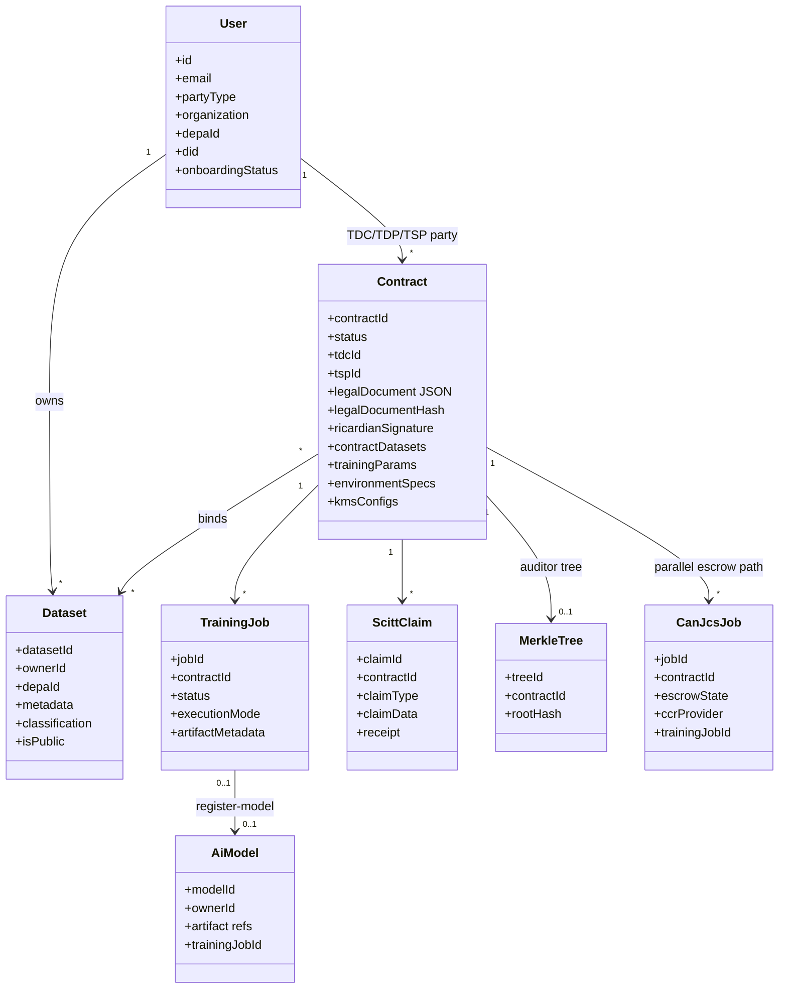
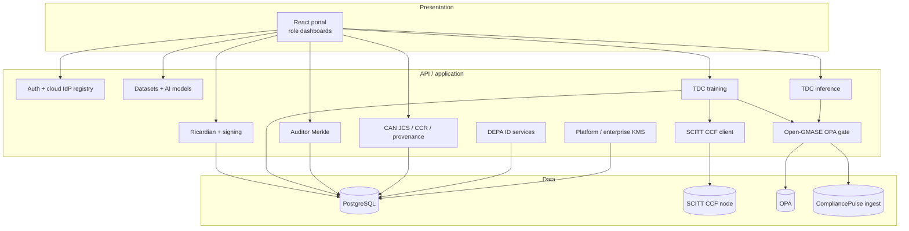
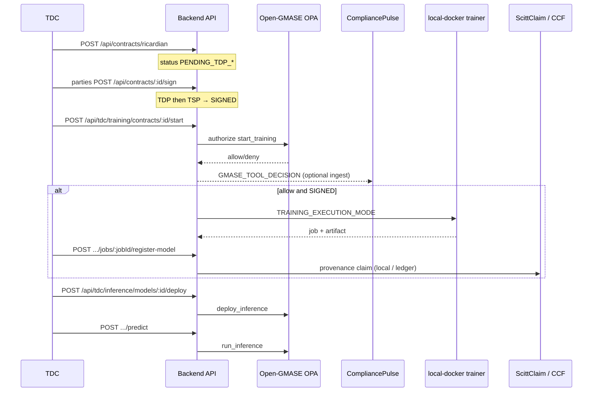
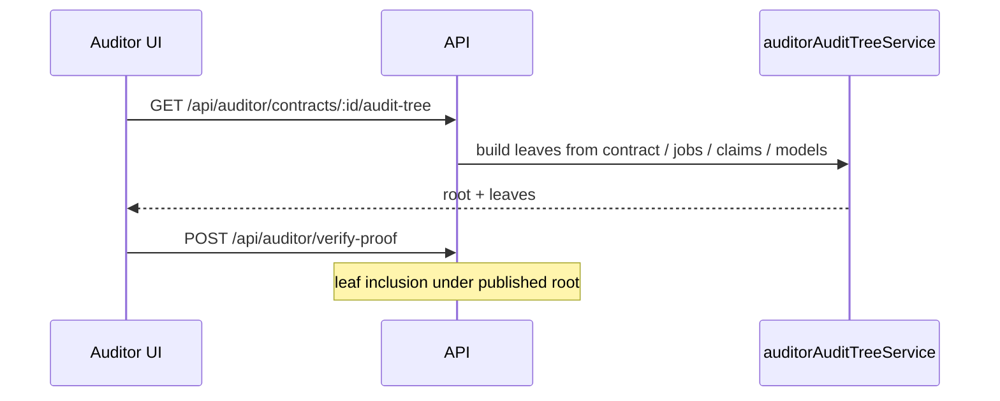
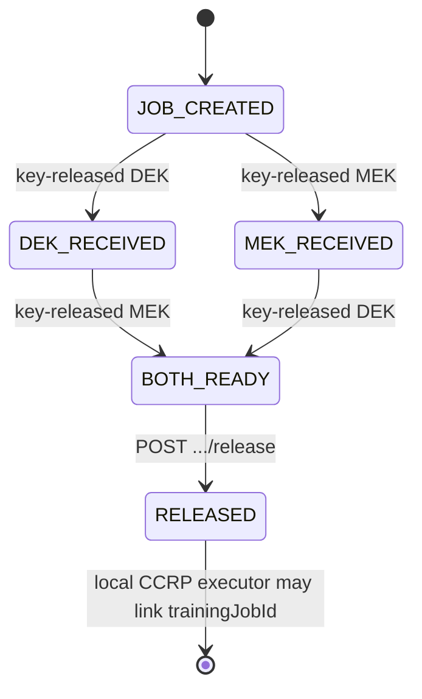
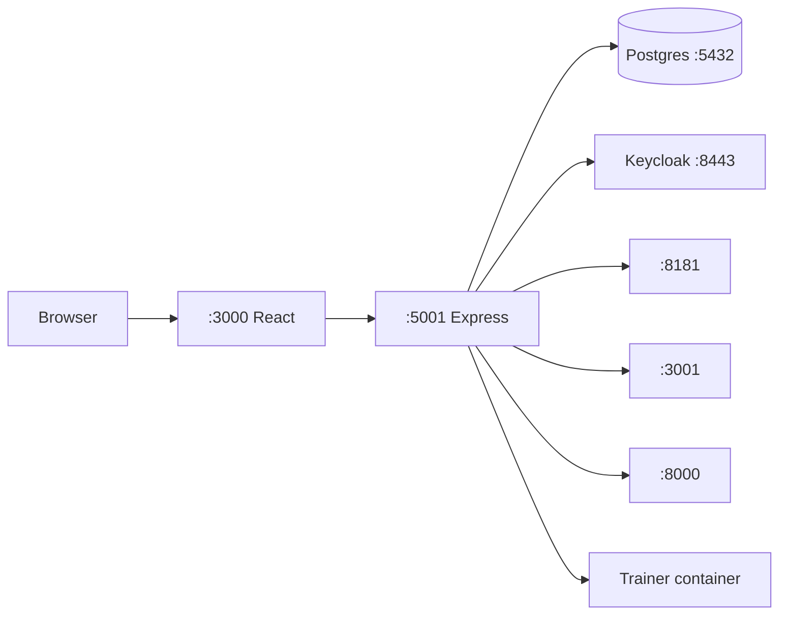

# UML 4+1 architecture — Confidential AI Network

| Field | Value |
|-------|--------|
| **Version** | 4.0 |
| **Last updated** | 2026-08-18 |
| **Scope** | Logical, process, development, physical, and scenario views aligned to the current monorepo |
| **Maturity** | Local stack primary; Azure/OCI IaC partial |

Kruchten [4+1](https://en.wikipedia.org/wiki/4%2B1_architectural_view_model) for **Confidential AI Network (CAN)**: logical, process, development, physical, and scenarios.

**Related:** [docs/ARCHITECTURE.md](../ARCHITECTURE.md) · [Ricardian contracts](../contracts/RICARDIAN_CONTRACT_GUIDE.md) · [Azure security](../production/AZURE_SECURITY_ARCHITECTURE.md) · [Multi-cloud patterns](../production/MULTI_CLOUD_SECURITY_ARCHITECTURE_PATTERNS.md) · [NIST/CIS/OWASP map](../compliance/SECURITY_CONTROLS_NIST_CIS_MAPPING.md)

---

## Conventions

| Label | Meaning |
|-------|---------|
| **Live** | Implemented and runnable on the local stack (or covered by e2e) |
| **Pilot** | Cloud IaC / integration present; operator follow-through required |
| **Design** | Specified target; not yet mounted or not yet deployed |
| **Legacy** | Retained for compatibility |

**Identity:** Local = Keycloak (`AUTH_PROVIDER=keycloak`, HTTPS `:8443`). Azure = Microsoft Entra. OCI = IAM Identity Domains. Keycloak is local-only.

**Roles:** `TDP` | `TDC` | `TSP` | `AppAdmin` | `Auditor`. `CCRP` aliases `TSP` (`/api/ccrp` → TSP router; `/ccrp/*` → `/tsp/*`).

---

## 1. Logical view

Object model and service boundaries as the application layer sees them.

### 1.1 Domain model (core)



**Contract status (primary):** `PENDING_TDP(_APPROVAL)` → `PENDING_TSP(_APPROVAL)` → **`SIGNED`** → `EXECUTING` → `COMPLETED` | `FAILED` | `REJECTED`. Legacy DB values `PENDING_CCRP*` map to TSP states.

**Ricardian binding:** Human-readable `legalDocument` hashed to `legalDocumentHash`; machine fields (`contractDatasets`, `trainingParams`, `environmentSpecs`, `kmsConfigs`) drive runtime gates. Create path is **`POST /api/contracts/ricardian` only** (plain `POST /api/contracts` rejected).

### 1.2 Logical packages



### 1.3 API surface (mounted)

| Prefix | Responsibility | Maturity |
|--------|----------------|----------|
| `/api/auth`, `/api/users` | Session / profile | Live |
| `/api/contracts` | Ricardian create, party sign, lifecycle | Live |
| `/api/signing` | Party signing keys / enterprise KMS hooks | Live (crypto verify often Phase target) |
| `/api/datasets`, `/api/ai-models` | Catalog | Live |
| `/api/tdc/training` | Start train, jobs, register-model | Live |
| `/api/tdc/inference` | Deploy + predict | Live |
| `/api/tdp`, `/api/tdc`, `/api/tsp`, `/api/admin`, `/api/auditor` | Role APIs | Live |
| `/api/scitt-ccf` | Ledger client + local claims | Live (local node) |
| `/api/can/jcs`, `/api/can/ccr`, `/api/can/provenance` | Escrow / key-release **signals** / events | Live (MVP parallel) |
| `/api/depa` | DEPA entity IDs | Live |
| `/api/platform-encryption`, `/api/enhanced-encryption` | Encryption helpers | Live |
| `/api/infrastructure` | Cloud credential / infra stubs | Partial |
| `/api/blockchain` | Legacy | Legacy (`BLOCKCHAIN_ENABLED=false`) |
| `/api/training`, `/api/provenance`, `/api/tee`, `/api/multi-cloud-tee`, `/api/marketplace` | Older surfaces | **Disabled** in `server.js` |

Primary modules: `backend/services/ricardianContractService.js`, `tdcTrainingExecutionService.js`, `gmaseOpaService.js`, `gmaseSideEffectGate.js`, `auditorAuditTreeService.js`, `scittCcfService.js`, `canJcsService.js`, `keycloakService.js`, `cloudIdpRegistry.js`.

---

## 2. Process view

Concurrency and control flow for the paths that ship.

### 2.1 Primary: Ricardian → SIGNED → train → register → infer



| Gate | Env | Default |
|------|-----|---------|
| Training start | `GMASE_TRAINING_GATE` | on |
| Deploy / predict | `GMASE_INFERENCE_GATE` | on |
| OPA | `OPA_URL` (default `http://localhost:8181`), package `open_gmase/can_contracts` | |
| CP forward | `COMPLIANCEPULSE_INGEST_URL` (default `http://localhost:3001`; `false` disables) | |

Training modes: `TRAINING_EXECUTION_MODE=local-docker` (default) | `local-native` | `local-mlx`. Cloud Job runners (e.g. OKE) exist as providers; confidential TEE pools remain **Design**.

### 2.2 Auditor Merkle verification



Auditor APIs: `/api/auditor/*`. Legacy `/api/provenance` is unmounted.

### 2.3 Parallel: CAN JCS escrow (DEK/MEK signals)

Parallel to the portal party-sign flow. Principals authenticate via CAN auth (`X-CAN-Principal-Id` in MVP). JCS records **key-release signals** (Phase 1); attested delivery into a TEE is Phase 2+ (Azure SKR on the cloud path).



### 2.4 Design / unmounted process paths

| Path | Status |
|------|--------|
| `/api/marketplace` | Unmounted |
| `/api/multi-cloud-tee` | Unmounted |
| `/api/tee` | Unmounted |
| Ethereum ledger | `BLOCKCHAIN_ENABLED=false` |

See `docs/production/` and provider stubs for the Design narrative.

---

## 3. Development view

Module organization for implementers.

### 3.1 Monorepo

```text
Confidential-AI-Network/
├── frontend/                 # React 18 + MUI + CRA (:3000)
├── backend/                  # Express + Sequelize + pg (:5001)
│   ├── routes/               # flat routers (mounted in server.js)
│   ├── services/
│   ├── models/
│   ├── middleware/
│   └── local-training/       # trainer image / scripts
├── open-gmase-core/          # OPA policies, SPIFFE scaffolds, Compose (OPA :8181)
├── compliancepulse-ai/       # control-plane (ingest :3001)
├── deployment/
│   ├── azure/terraform/      # pilot: networking, AKS, Entra, KV, Blob, WI
│   └── oci/terraform/        # OKE, IAM Domains, optional SCITT/SPIRE/Vault
├── docker/                   # postgres, Keycloak, SCITT CCF compose
├── scitt-ccf/                # ledger packaging / ops notes
├── blockchain/               # Hardhat legacy
├── docs/                     # architecture, security, blogs (GitHub Pages)
└── scripts/                  # start-system, auth fix, e2e helpers
```

Backend layout is flat (`backend/routes|services|models`), not `backend/src/`.

### 3.2 Frontend structure (roles)

| Area | Path |
|------|------|
| Routing | `frontend/src/App.js` |
| Dashboards | `frontend/src/pages/dashboards/*` |
| TDC | `/tdc/*` — contracts, training, inference, models |
| TDP | `/tdp/*` — datasets, contracts |
| TSP | `/tsp/*` — credentials, environments, contracts |
| AppAdmin | `/admin/*` |
| Auditor | `/auditor/*` — audit-tree |
| Ricardian create | `/contracts/create-ricardian` |

### 3.3 Cross-cutting libraries

| Concern | Location |
|---------|----------|
| OPA side-effect gate | `gmaseOpaService.js`, `gmaseSideEffectGate.js`, `open-gmase-core/.../can-contracts.rego` |
| Merkle / proofs | `MerkleTreeBuilder.js`, `ProofGenerator.js`, `auditorAuditTreeService.js` |
| Cloud IdP | `cloudIdpRegistry.js`, `entraIdentityService.js`, `ociIdentityService.js` |
| Providers | `services/providers/{aws,azure,gcp,oci}Provider.js` |

---

## 4. Physical view

Topology for local, Azure pilot, and OCI.

### 4.1 Local (primary demo)



Typical bring-up: `./start-system.sh` (or compose under `docker/`) + `cd open-gmase-core && docker compose up -d` + CompliancePulse when testing ingest. SCITT optional via `docker/docker-compose.scitt-ccf-dev.yml`.

### 4.2 Azure pilot

Terraform under `deployment/azure/terraform/`:

| Module | Default |
|--------|---------|
| Networking, AKS (OIDC/WI), Postgres, ACR, LB, Entra app roles | on |
| Key Vault, Blob, workload identity (UAMI + FIC + RBAC) | on |
| Front Door / WAF, SPIRE namespace | off |
| Confidential compute pool, SCITT on Azure, APIM JWT code | **not** in TF / Design |

See [AZURE_READINESS.md](../deployment/AZURE_READINESS.md). Human IdP = Entra only.

### 4.3 OCI

Terraform under `deployment/oci/terraform/`: OKE, IAM Domains, OCIR, optional Vault / WIF / SPIRE / SCITT / training Job. Human IdP = OCI IAM (no Keycloak on cluster).

### 4.4 Trust planes (deployment-shaped)

```text
Humans     → cloud IdP (or Keycloak local)
Cloud APIs → workload identity / WI / instance principal
Peers      → SPIFFE/SPIRE where enabled (scaffold / opt-in)
Evidence   → ScittClaim rows + optional CCF node; Auditor Merkle roots
```

SPIFFE/SPIRE covers workload identity; TEE attestation and SKR are on the confidential-compute path ([AZURE_SPIFFE_SPIRE_WIF.md](../deployment/AZURE_SPIFFE_SPIRE_WIF.md), [AZURE_SECURITY_ARCHITECTURE.md](../production/AZURE_SECURITY_ARCHITECTURE.md)).

---

## 5. Scenarios (+1)

### S1 — Multi-party Ricardian agreement

1. TDC creates contract via `POST /api/contracts/ricardian` (+ UI preview).
2. TDP and TSP sign (`POST /api/contracts/:id/sign`).
3. Status reaches **`SIGNED`** (training gate).

### S2 — Governed local training

1. Preconditions: `SIGNED`; OPA reachable when gates are enabled.
2. `POST /api/tdc/training/contracts/:contractId/start`.
3. Job completes under `TRAINING_EXECUTION_MODE`; register model; local SCITT claim written.

### S3 — Governed inference

1. Deploy model → OPA `deploy_inference`.
2. Predict → OPA `run_inference`.
3. Decisions in AuditLogs; optional CompliancePulse ingest (decision metadata).

### S4 — Auditor inclusion proof

1. Open `/auditor/contracts/:id/audit-tree`.
2. `POST /api/auditor/verify-proof` against the published root.
3. Confirms leaf inclusion (lineage), not semantic model evaluation.

### S5 — CAN JCS dual-key escrow (MVP)

1. Create JCS job for a contract.
2. DEK then MEK (or reverse) `key-released` signals.
3. `release` → optional local CCRP executor linkage.

---

## 6. Architecture decisions

| Decision | Choice | Notes |
|----------|--------|-------|
| Ledger | SCITT CCF + local `ScittClaim` | Ethereum path legacy/off |
| Contract create | Ricardian-only API | Legal prose + machine binding |
| Train gate | `status === SIGNED` + OPA | TDC sign not required for start |
| Signing verify | Authz gate live; crypto verify / Key Vault target | |
| DEK/MEK | Principal-owned; JCS release signals | Azure SKR for attested delivery |
| Cloud IAM | Entra / OCI IAM / … | Keycloak local-only |
| TEE marketplace APIs | Unmounted | Design |

---

## 7. Document history

| Version | Date | Change |
|---------|------|--------|
| 3.x | 2025-01 | Earlier CMS + SCITT-centric UML |
| **4.0** | **2026-08-18** | CAN roles, Ricardian→train→infer+OPA/CP, Auditor Merkle, Azure/OCI topology |
