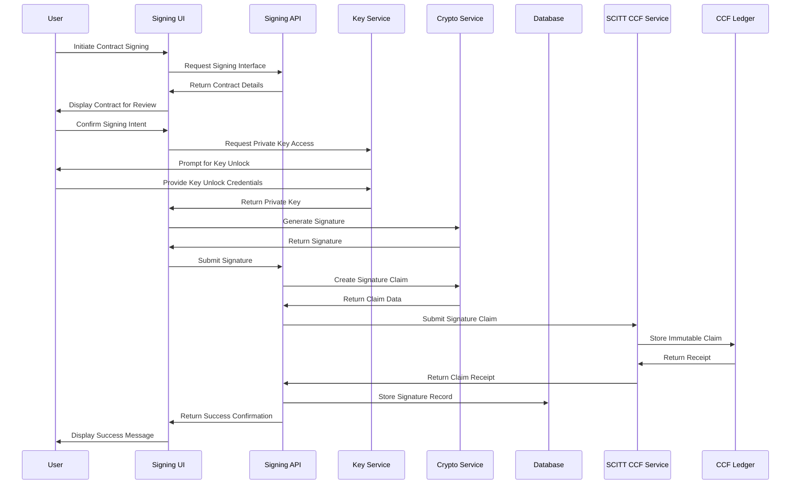
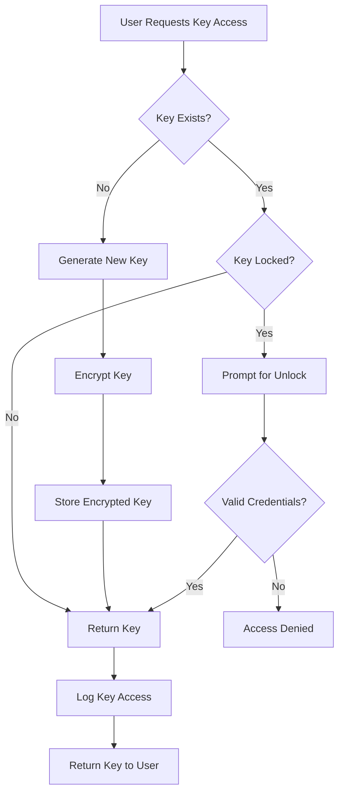
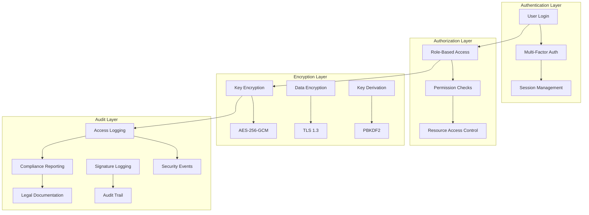
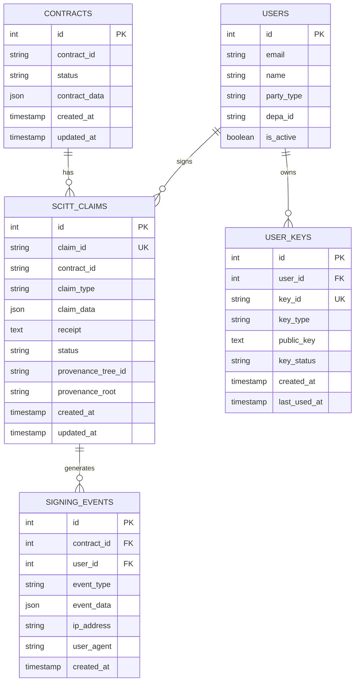
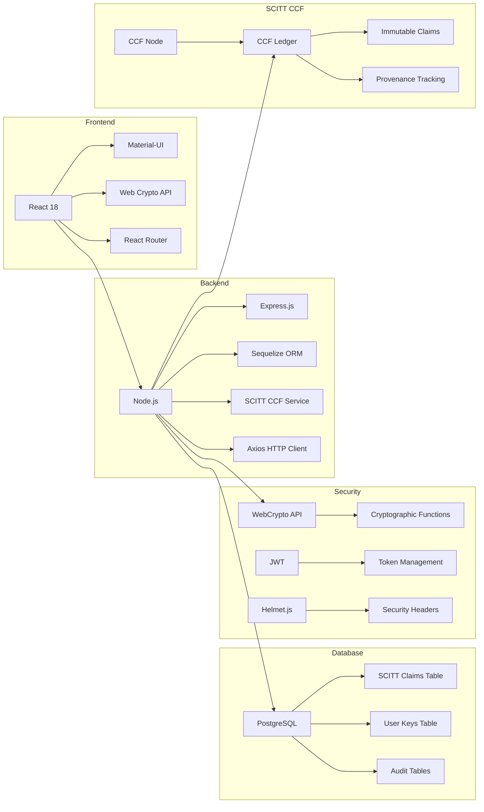
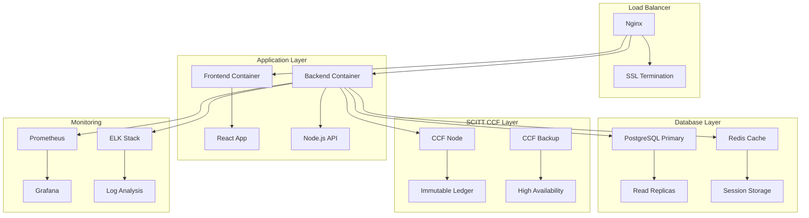
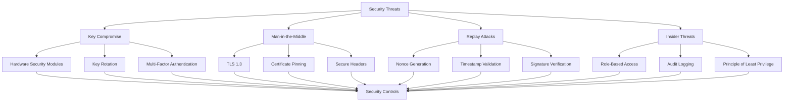

# Contract Signing Architecture Diagram

## System Architecture with SCITT CCF Integration

```mermaid
graph TB
    subgraph "Frontend Layer"
        A[Contract Signing UI] --> B[Key Management UI]
        A --> C[Signature Verification UI]
        B --> D[Key Generator]
        B --> E[Key Importer/Exporter]
        C --> F[Signature Display]
    end
    
    subgraph "API Layer"
        G[Signing Service API] --> H[Key Management API]
        G --> I[Verification API]
        H --> J[Key Storage API]
        I --> K[SCITT CCF API]
    end
    
    subgraph "Service Layer"
        L[Signing Service] --> M[Key Management Service]
        L --> N[Crypto Service]
        L --> O[SCITT CCF Service]
        M --> P[Key Storage Service]
        N --> Q[Signature Generation]
        N --> R[Signature Verification]
        O --> S[Claim Submission]
        O --> T[Claim Verification]
    end
    
    subgraph "Storage Layer"
        U[Local Key Storage] --> V[Browser Storage<br/>AES-256-GCM Encrypted]
        U --> W[Hardware Security Module<br/>Future Enhancement]
        X[Database] --> Y[SCITT Claims Table]
        X --> Z[Signing Events Table]
        X --> AA[User Keys Table]
    end
    
    subgraph "SCITT CCF Layer"
        BB[SCITT CCF Ledger] --> CC[Immutable Claims]
        BB --> DD[Provenance Tracking]
        BB --> EE[Receipt Verification]
        FF[CCF Node] --> BB
    end
    
    subgraph "Security Layer"
        GG[Authentication] --> HH[Authorization]
        GG --> II[Audit Logging]
        JJ[Encryption] --> KK[Key Derivation<br/>PBKDF2]
        JJ --> LL[Secure Communication<br/>TLS 1.3]
    end
    
    A --> G
    B --> H
    C --> I
    G --> L
    H --> M
    I --> N
    L --> X
    M --> U
    N --> BB
    O --> BB
    L --> GG
    M --> JJ
```

## Signing Workflow

## Key Management Flow

## Security Architecture

## Database Schema

## Technology Stack

## Deployment Architecture

## Security Considerations

This architecture provides a comprehensive, secure, and scalable solution for contract signing that meets enterprise requirements while maintaining user experience and legal compliance.
