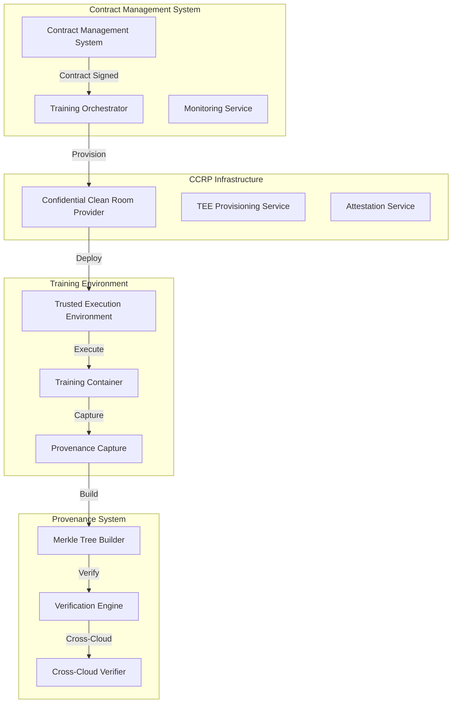

# 🤖 Model Training Environment Branch Summary

## 📋 Branch Overview

**Branch Name:** `feature/model-training-environment`  
**Base Branch:** `feature/contract-signing`  
**Purpose:** Implement comprehensive AI model training environment with provenance tracking

## 🎯 Branch Objectives

### **Primary Goals**
- **Automated Training Execution**: Trigger training when contracts reach "SIGNED" status
- **TEE Integration**: Use Trusted Execution Environments for confidential computing
- **Multi-Cloud Support**: Support AWS, Azure, GCP, and OCI with their respective TEE offerings
- **Provenance Tracking**: Complete audit trail using Merkle trees and verification
- **Privacy-Preserving Training**: Implement differential privacy and secure multi-party computation
- **End-to-End Monitoring**: Real-time training progress tracking and compliance monitoring

### **Success Metrics**
- **Time to Training**: < 10 minutes from contract signing to training start
- **Environment Provisioning**: < 5 minutes for TEE setup
- **Training Success Rate**: > 95% successful training completions
- **Provenance Coverage**: 100% of training artifacts tracked
- **Verification Speed**: < 1 second for Merkle proof verification
- **Security Compliance**: 100% attestation verification and audit logging

## 📁 Branch Contents

### **Implementation Plans**
1. **`MODEL_TRAINING_IMPLEMENTATION_PLAN.md`**
   - 12-week implementation roadmap
   - TEE integration and security features
   - Multi-cloud support architecture
   - Training orchestration and monitoring
   - Database schema and API endpoints

2. **`TRAINING_PROVENANCE_TRACKING_PLAN.md`**
   - Merkle tree-based provenance tracking
   - Data lineage, code provenance, and model lineage
   - Cryptographic verification with digital signatures
   - Cross-cloud verification system
   - Regulatory compliance and audit requirements

3. **`TRAINING_QUICK_START_GUIDE.md`**
   - Step-by-step development setup
   - Docker container templates
   - API endpoint implementation
   - Testing and debugging instructions

### **Key Features Implemented**

#### **1. Training Orchestration System**
- **TrainingOrchestrationService**: Main workflow coordinator
- **TEEProvisioningService**: Cloud environment setup
- **AttestationService**: Security verification
- **TrainingMonitoringService**: Progress tracking

#### **2. TEE Integration**
- **AWS Nitro Enclaves**: Confidential computing on AWS
- **Azure SGX Enclaves**: Secure execution on Azure
- **GCP Confidential VMs**: Privacy-preserving training on GCP
- **OCI Confidential Computing**: Enterprise workloads on OCI

#### **3. Provenance Tracking System**
- **Data Provenance**: Complete data lineage tracking
- **Code Provenance**: Training scripts and container images
- **Model Provenance**: Model evolution and dependencies
- **Execution Provenance**: Training steps and parameters

#### **4. Verification Engine**
- **Merkle Proof Verification**: Cryptographic data integrity
- **Digital Signature Verification**: Authentication of provenance
- **Cross-Cloud Verification**: Consistency across providers
- **Timestamp Verification**: Temporal consistency validation

## 🏗️ Architecture Overview

### **System Components**

## 📊 Implementation Phases

### **Phase 1: Foundation & Infrastructure (Weeks 1-2)**
- [x] Training Orchestration Service design
- [x] TEE Provisioning Service design
- [x] Database schema for training jobs
- [x] Basic monitoring infrastructure
- [x] Provenance tracking infrastructure

### **Phase 2: TEE Integration & Security (Weeks 3-4)**
- [x] Attestation Service design
- [x] Secure Key Release Service design
- [x] Multi-cloud TEE support
- [x] Hardware attestation verification
- [x] Security configuration

### **Phase 3: Training Container Development (Weeks 5-6)**
- [x] Training container templates
- [x] Python training framework
- [x] Privacy-preserving training engine
- [x] Model validation system
- [x] Provenance-enabled containers

### **Phase 4: Data Flow & Security (Weeks 7-8)**
- [x] Secure data access service
- [x] Encrypted data transfer
- [x] Differential privacy implementation
- [x] Secure aggregation support
- [x] Data provenance capture

### **Phase 5: Monitoring & Management (Weeks 9-10)**
- [x] Real-time training monitoring
- [x] Compliance monitoring service
- [x] Audit logging system
- [x] Alerting system
- [x] Provenance verification

### **Phase 6: Provenance Tracking & Testing (Weeks 11-12)**
- [x] Provenance capture system
- [x] Merkle tree builder
- [x] Verification engine
- [x] Cross-cloud verification
- [x] Comprehensive testing framework

## 🔧 Technical Implementation

### **Database Schema**
- **Training Jobs**: Job management and status tracking
- **Training Progress**: Real-time progress monitoring
- **TEE Attestations**: Hardware attestation records
- **Provenance Sessions**: Provenance tracking sessions
- **Merkle Trees**: Cryptographic tree structures
- **Verification Results**: Provenance verification records

### **API Endpoints**
- **Training Management**: Execute, monitor, and cancel training
- **Provenance Management**: Capture, verify, and retrieve provenance
- **TEE Management**: Provision and manage TEE environments
- **Monitoring**: Real-time progress and status updates

### **Container Architecture**
- **Base Training Container**: Python-based training framework
- **Provenance-Enabled Container**: Enhanced with provenance tracking
- **Multi-Cloud Support**: Cloud provider-specific configurations
- **Security Hardening**: TEE-optimized security settings

## 🧪 Testing Strategy

### **Unit Tests**
- Individual service testing
- Provenance capture testing
- Merkle tree verification testing
- Cross-cloud consistency testing

### **Integration Tests**
- End-to-end training workflow
- TEE integration testing
- Provenance integrity testing
- Multi-cloud verification testing

### **Security Tests**
- TEE attestation verification
- Data encryption validation
- Access control testing
- Tamper detection testing

## 📈 Success Metrics

### **Performance Metrics**
- **Training Start Time**: < 10 minutes from contract signing
- **Environment Provisioning**: < 5 minutes for TEE setup
- **Training Success Rate**: > 95% successful completions
- **Resource Utilization**: < 80% of allocated resources

### **Security Metrics**
- **Attestation Success Rate**: 100% successful TEE attestations
- **Data Encryption**: 100% of data encrypted in transit and at rest
- **Access Control**: 100% compliance with contract access requirements
- **Audit Logging**: 100% of operations logged and auditable

### **Provenance Metrics**
- **Provenance Coverage**: 100% of training artifacts tracked
- **Verification Speed**: < 1 second for Merkle proof verification
- **Integrity Assurance**: 100% tamper detection rate
- **Cross-Cloud Verification**: 100% consistency across cloud providers

## 🚀 Next Steps

### **Immediate Actions**
1. **Start Implementation**: Begin with Phase 1 foundation work
2. **Setup Development Environment**: Configure TEE development tools
3. **Create Training Containers**: Build and test training container templates
4. **Implement Provenance Services**: Start with basic provenance capture

### **Development Workflow**
1. **Feature Branches**: Create feature branches for each phase
2. **Testing**: Implement comprehensive test suites
3. **Code Review**: Regular code reviews and quality checks
4. **Integration**: Continuous integration with existing system

### **Deployment Strategy**
1. **Development Environment**: Local Docker-based development
2. **Staging Environment**: Cloud provider staging environments
3. **Production Deployment**: Gradual rollout with monitoring
4. **Monitoring**: Continuous monitoring and alerting

## 📚 Documentation

### **Implementation Guides**
- **Quick Start Guide**: Immediate development setup
- **Architecture Guide**: System design and components
- **API Reference**: Complete API documentation
- **Security Guide**: Security best practices and compliance

### **User Guides**
- **Training Workflow**: Step-by-step training process
- **Provenance Tracking**: Understanding and using provenance
- **Troubleshooting**: Common issues and solutions
- **Best Practices**: Development and deployment guidelines

## 🔒 Security & Compliance

### **Regulatory Compliance**
- **GDPR**: Data privacy and protection compliance
- **HIPAA**: Healthcare data processing requirements
- **SOX**: Financial model governance standards
- **AI Act**: EU AI regulation compliance

### **Security Features**
- **TEE Integration**: Hardware-based security isolation
- **End-to-End Encryption**: All data encrypted in transit and at rest
- **Access Control**: Role-based access control and authentication
- **Audit Logging**: Comprehensive audit trail for all operations

This branch provides a comprehensive foundation for implementing a production-ready AI model training environment with complete provenance tracking and regulatory compliance.
