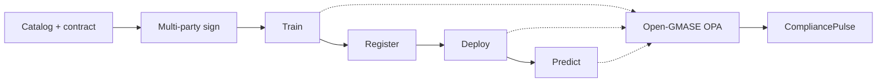

Most shared-AI projects still start with a copy of the data and an NDA. **Confidential AI Network (CAN)** starts with a **written, machine-enforceable agreement**, trains only where that agreement allows, and—when the job finishes—lets you **register, deploy, and call the model** without dropping the control plane.

Screenshots: [product tour]({{ '/product-tour/' | relative_url }}). Runnable governance seam: [CAN ↔ Open-GMASE ↔ CompliancePulse](). Source: [GitHub](https://github.com/gitmujoshi/Confidential-AI-Network).

> **Status:** Active research and engineering. The paths marked **live** run on the local stack today. Hosted multi-tenant SaaS and turnkey cloud clean-room automation remain on the roadmap.

---

## The problem CAN solves

**Training needs multi-party data. Regulation and competition forbid bulk export. Audits need proof, not screenshots.**

CAN treats collaboration as a protocol:

1. Publish **catalog metadata and policy**, not the corpus  
2. Negotiate a **Ricardian contract** (human-readable terms + enforceable state)  
3. Train only inside a **policy-bound** environment (local trainer today; TSP / CCRP clean rooms in the cloud design)  
4. Leave an **auditable trail** (job outcomes, signatures, SCITT CCF path)

The parties are familiar: **TDP** (data), **TDC** (model), **TSP / CCRP** (isolated compute). Humans authenticate through Keycloak in development or the cloud IdP in production. Design roots sit with iSPIRT [DEPA](https://depa.world). Longer architecture narrative: [Building Confidential AI Network]().

What closes the loop for stakeholders is everything **after** the signatures: a model you can train, ship into an inference app, and call—while every consequential side effect still clears an **Open-GMASE** gate.

---

## What you get end to end

| Capability | Live today | Why it matters |
| --- | --- | --- |
| Multi-party Ricardian contracts | Yes | No training without agreement |
| Local training under contract | `local-docker` / `local-native` / `local-mlx` | Demo without waiting on cloud provisioners |
| Tabular, text, and vision jobs | Logreg · DistilBERT · TinyCNN / CIFAR path | One UX across modalities |
| Differential privacy on NLP | Opacus DP-SGD + `privacyMetrics` | ε/δ in the same conversation as accuracy |
| Register → deploy → predict | Inference app at `/tdc/inference` | A callable artifact, not only a job log |
| Policy gates on side effects | Open-GMASE OPA (fail-closed, default on) | Authorization is infrastructure, not prompt text |
| External evidence path | CompliancePulse `audit/ingest` (default localhost) | Same allow/deny outside CAN—**decisions**, not datasets |

Board-level framing of the wider stack: [Governed AI for the enterprise]().

---

## The path: contract → train → predict



In practice:

1. Onboard (or use seeded) **TDP / TDC / TSP** users.  
2. Publish a dataset; create a contract with `taskType` set to tabular, text, or vision.  
3. Collect the required **signatures**.  
4. **Start training** — OPA evaluates `start_training` first.  
5. When the job is **COMPLETED**, **register** the artifact and **Deploy for inference**.  
6. In the Inference app, run a sample input and read both the **label** and the **policy-gate** panel.  
7. If CompliancePulse is running, the same decision appears on its audit trail as `external_ingest`.

Walk it in UI: [product tour]({{ '/product-tour/' | relative_url }}). Prove the gate: [demo slice]().

---

## What the demos actually predict

| Demo path | Task | Sample request | Typical label |
| --- | --- | --- | --- |
| Fast governance shots | Tabular classification | `{ "features": [5.1, 3.5, 1.4, 0.2] }` | **setosa** |
| Lifecycle product tour | AG News text (DistilBERT) | Headline about markets / tech | **Business** |
| Vision path | CIFAR-10-style image | `{ "imageBase64": "…" }` + preview in UI | Class name (e.g. **airplane**) |

The local inferencer lives in `backend/local-training/infer.py`. Prediction is the side effect: Open-GMASE must **ALLOW** `run_inference` before the container runs.

---

## Where policy sits

CAN side effects use the same **inner gate** pattern as governed agent tools:

| Action | Tool name | Gate |
| --- | --- | --- |
| Start training | `start_training` | `GMASE_TRAINING_GATE` (default on) |
| Deploy for inference | `deploy_inference` | `GMASE_INFERENCE_GATE` (default on) |
| Run prediction | `run_inference` | same |

Authorize fail-closed → write `GMASE_TOOL_DECISION` in CAN AuditLogs → **forward by default** to CompliancePulse (`COMPLIANCEPULSE_INGEST_URL=http://localhost:3001`; disable with `false`).

| Sent to CompliancePulse | Not sent |
| --- | --- |
| `tool_name`, `allow`, `reason`, package, audit id | Training corpora / images / text |
| `model_id`, `contract_id` | Inference payloads (`imageBase64`, features) |
| `source: confidential-ai-network` | Model weights / raw logits |

Community packs: [`open-gmase-core/`](https://github.com/gitmujoshi/Confidential-AI-Network/tree/main/open-gmase-core). Control-plane path: [`compliancepulse-ai/`](https://github.com/gitmujoshi/Confidential-AI-Network/tree/main/compliancepulse-ai/). Depth: [G-MASE deep dive]() · [CompliancePulse AI deep dive]().

---

## Honest boundaries

| You can show today | Still research / roadmap |
| --- | --- |
| Local train + inference under contract | Full auto-provisioned multi-cloud CCRP for every demo |
| Open-GMASE OPA on CAN train / deploy / predict | Hosted enterprise IdP + HSM as a product |
| CompliancePulse ingest + trail API | Multi-tenant SaaS, RLS, CMEK, certified packs |
| Product tour and Playwright coverage | Finished “SOC swarm console” as a turnkey product |

---

## Start here

| Goal | Link |
| --- | --- |
| See the UI path | [Product tour]({{ '/product-tour/' | relative_url }}) |
| Run OPA + CompliancePulse + CAN | [Demo slice]() |
| Read the monorepo | [README](https://github.com/gitmujoshi/Confidential-AI-Network#readme) |
| Executive overview | [CISO note]() |
| KMS / DEK·MEK escrow | [KMS post]() |
| TEE attest → decrypt → train | [TEE post]() |

```bash
./start-system.sh
cd open-gmase-core && docker compose up -d
cd compliancepulse-ai/backend && npm run dev   # :3001
```

**Bottom line:** CAN binds multi-party training in a Ricardian contract, runs the job where policy allows, and takes the artifact through **governed inference**—with Open-GMASE deciding allow/deny and CompliancePulse able to hold the same decision for evidence conversations.
