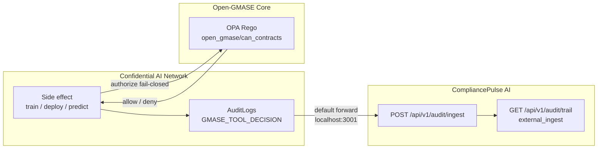

**Status:** Research demo path for the **control-plane seam** between Confidential AI Network, Open-GMASE, and CompliancePulse.

| Capability | Status |
| --- | --- |
| Open-GMASE OPA on tool proposals | Live (`open_gmase/tools`, `open_gmase/can_contracts`) |
| Gate **TDC training start** | Live (`GMASE_TRAINING_GATE`, default on) |
| Gate **TDC deploy / predict** | Live (`GMASE_INFERENCE_GATE`, default on) |
| Decisions in CAN AuditLogs | Live (`GMASE_TOOL_DECISION`) |
| Forward decisions → **CompliancePulse ingest** | Live by default (`http://localhost:3001`; warn if CP down; `COMPLIANCEPULSE_INGEST_URL=false` to disable) |
| E2E asserts OPA + CP ingest | Live (`npm run test:e2e:inference`) |
| CompliancePulse multi-tenant SaaS / swarm UI / SPIRE | Still research roadmap |

TDC **start training**, **deploy**, and **predict** call `open_gmase/can_contracts` fail-closed. The same allow/deny is written to CAN AuditLogs **and forwarded** to CompliancePulse `POST /api/v1/audit/ingest`. Inference UI shows the policy gate panel; Playwright requires OPA + CP by default.

## Three layers, one decision path



| Layer | Role in this demo |
| --- | --- |
| **CAN** | Product surface (contracts, training, inference) + durable AuditLogs |
| **Open-GMASE** | Community OPA packs — the *inner gate* before the side effect |
| **CompliancePulse** | Commercial-path ingest receiver — stores the same decision for control-plane / evidence conversations |

Honest scope: CP ingest is a **research stub** (in-memory audit store), not a finished multi-tenant SaaS console.

## Model trained & inference (what the screenshots show)

The governance screenshots below come from the **fast tabular** E2E path (quick enough to gate repeatedly). The full product-tour lifecycle uses a richer **NLP** model so labels read well for stakeholders.

| | **GMASE gate screenshots** (this post) | **Lifecycle / product tour** |
| --- | --- | --- |
| **Task** | Tabular classification | Text classification (AG News topics) |
| **Catalog model** | `e2e-model-tabular-logreg` | `e2e-model-nlp-distilbert-quality` |
| **Architecture** | Logistic regression (`taskType: tabular`) | DistilBERT / transformer (`taskType: text`) |
| **Framework** | scikit-style tabular trainer in the local Docker image | PyTorch + Hugging Face (`distilbert-base-uncased`) |
| **Dataset** | Iris-style CSV features (4 floats) | AG News headlines |
| **Train** | Local Docker (`TRAINING_EXECUTION_MODE=local-docker`) under a signed Ricardian contract | Same local-docker path; quality profile uses a larger train subset |
| **Artifact** | Registered from the completed job → `AIModel` → **Deploy for inference** | Same register → deploy flow |
| **Example request** | `{ "features": [5.1, 3.5, 1.4, 0.2] }` | `{ "text": "Wall Street rallies as tech stocks climb on strong earnings." }` |
| **Example label** | **setosa** (Iris class 0) | **Business** (AG News class 2) |
| **Runtime** | `infer.py` in `contractmanagement/local-trainer` (Docker) | Same inferencer, text path |

In both cases the **prediction is the side effect**: Open-GMASE must **ALLOW** `run_inference` (and earlier `deploy_inference` / `start_training`) before the local inferencer runs. The UI then shows the label **and** the policy-gate panel; CompliancePulse receives the same decision via ingest.

## What you will see

1. A proposed tool call (for example `execute_sql` with `DROP TABLE`, or `start_training` / `run_inference`) is evaluated by community Rego packs.  
2. Allow or deny comes back **fail-closed** if OPA is unreachable.  
3. The decision is written into CAN’s audit trail.  
4. On the Inference app, an **Open-GMASE policy gate** panel shows ALLOW/DENY with package + audit id.  
5. Training start returns `job.governance` the same way.  
6. CAN **forwards** the decision to CompliancePulse ingest by default (non-blocking; warns if CP is down).  
7. You can list those events on CP as `external_ingest` via the audit trail API.

## Screenshots (from E2E)

<figure class="shot">
  
  <figcaption>Deploy for inference on the trained tabular logreg artifact — OPA authorizes <code>deploy_inference</code>; decision also goes to CompliancePulse</figcaption>
</figure>

<figure class="shot">
  
  <figcaption>Inference app — iris feature vector ready (<code>task: tabular</code>, logistic-regression)</figcaption>
</figure>

<figure class="shot">
  
  <figcaption>Label <strong>setosa</strong> plus <strong>Open-GMASE policy gate</strong> ALLOW — same decision ingested by CompliancePulse</figcaption>
</figure>

The lifecycle product tour uses **quality DistilBERT** on AG News (prediction **Business**) and the same gate when OPA is up — see [`24-tdc-inference-predict.png`]({{ '/assets/lifecycle/24-tdc-inference-predict.png' | relative_url }}) on the [product tour]({{ '/product-tour/' | relative_url }}#infer).

## CompliancePulse integration (how to show it)

### Start the three processes

```bash
# 1) Open-GMASE OPA
cd open-gmase-core && docker compose up -d

# 2) CompliancePulse ingest receiver (default target for CAN)
cd compliancepulse-ai/backend && npm run dev
# listens on http://localhost:3001

# 3) CAN stack
./start-system.sh
# COMPLIANCEPULSE_INGEST_URL defaults to http://localhost:3001
# Disable: COMPLIANCEPULSE_INGEST_URL=false
```

### Prove the forward after a gated action

After a deploy/predict (or the smoke script below):

```bash
# CAN side — decisions in AuditLogs
curl -s 'http://localhost:5001/api/debug/gmase-tool-decisions?limit=5'

# CompliancePulse side — same decisions as external_ingest
curl -s 'http://localhost:3001/api/v1/audit/trail?eventTypes=external_ingest&limit=5'
```

Expected shape on CP (fields may vary slightly):

```json
{
  "events": [
    {
      "eventType": "external_ingest",
      "action": "ingest:run_inference",
      "result": "success",
      "metadata": {
        "source": "confidential-ai-network",
        "tool_name": "run_inference",
        "allow": true,
        "package": "open_gmase/can_contracts",
        "model_id": "…"
      }
    }
  ]
}
```

E2E (`npm run test:e2e:inference`) **requires** OPA + CP by default and asserts ≥2 ingest events per model (`deploy_inference` + `run_inference`).

## Run locally (full slice)

```bash
cd open-gmase-core && docker compose up -d
cd compliancepulse-ai/backend && npm run dev   # separate terminal
./start-system.sh                             # separate terminal

./scripts/demo-gmase-can-slice.sh

cd frontend
E2E_WAIT_FOR_LOCAL_TRAINING=true BACKEND_URL=http://127.0.0.1:5001 npm run test:e2e:inference
```

Ad-hoc deny path (CAN debug API):

```bash
curl -s http://localhost:5001/api/debug/gmase-opa-health

curl -s -X POST http://localhost:5001/api/debug/gmase-tool-check \
  -H 'Content-Type: application/json' \
  -d '{
    "tool_name": "execute_sql",
    "environment": "production",
    "parameters": { "query": "DROP TABLE users;" },
    "metadata": { "contract_id": "demo-1" }
  }'

curl -s 'http://localhost:5001/api/debug/gmase-tool-decisions?limit=5'
curl -s 'http://localhost:3001/api/v1/audit/trail?eventTypes=external_ingest&limit=5'
```

## Stakeholder script (three minutes)

1. Show the CAN [product tour]({{ '/product-tour/' | relative_url }}) (contracts → training → inference).  
2. On the Inference app, point at the **Open-GMASE policy gate** ALLOW panel.  
3. Show the **same decision** in CAN AuditLogs *and* CompliancePulse `audit/trail` (`external_ingest`).  
4. Say clearly: multi-tenant CP SaaS UI, swarm agents, and SPIRE attestation are still roadmap—this is the **inner gate** plus the **commercial-path ingest** seam.

## Code & full runbook

| Artifact | Location |
| --- | --- |
| Runbook | [`docs/guides/CAN_GMASE_DEMO_SLICE.md`](https://github.com/gitmujoshi/Confidential-AI-Network/blob/main/docs/guides/CAN_GMASE_DEMO_SLICE.md) |
| Screenshots | [`docs/guides/gmase-integration/`](https://github.com/gitmujoshi/Confidential-AI-Network/tree/main/docs/guides/gmase-integration) |
| Side-effect gate + CP forward | [`backend/services/gmaseSideEffectGate.js`](https://github.com/gitmujoshi/Confidential-AI-Network/blob/main/backend/services/gmaseSideEffectGate.js) |
| CompliancePulse ingest API | [`compliancepulse-ai/`](https://github.com/gitmujoshi/Confidential-AI-Network/tree/main/compliancepulse-ai) — `POST /api/v1/audit/ingest` |
| Smoke script | [`scripts/demo-gmase-can-slice.sh`](https://github.com/gitmujoshi/Confidential-AI-Network/blob/main/scripts/demo-gmase-can-slice.sh) |
| Policies | [`open-gmase-core/execution-guardrails/opa-policies/`](https://github.com/gitmujoshi/Confidential-AI-Network/tree/main/open-gmase-core/execution-guardrails/opa-policies) |

## Related reading

- [Governed AI for the enterprise — CISO overview]()  
- [Governing autonomous AI agents]()  
- [Unified Governed Agentic SecOps Framework]()  
- [Open-GMASE Core](https://github.com/gitmujoshi/Confidential-AI-Network/tree/main/open-gmase-core)  
- [CompliancePulse AI](https://github.com/gitmujoshi/Confidential-AI-Network/tree/main/compliancepulse-ai)
