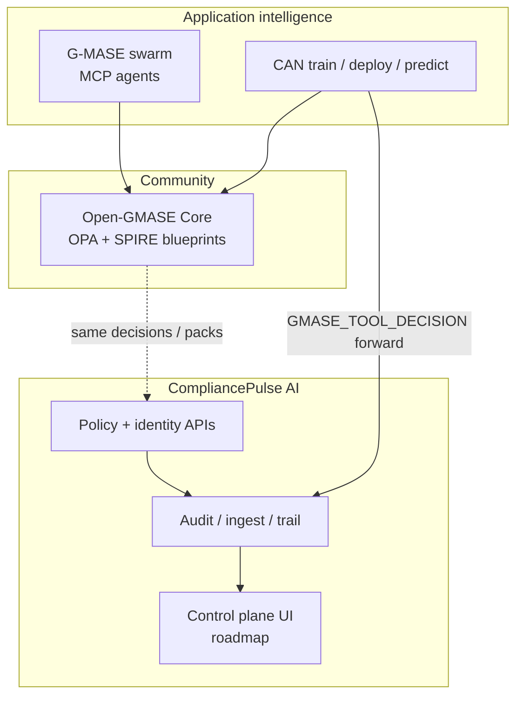

*Product and architecture deep dive for **CompliancePulse AI**—the commercial / enterprise control plane that wraps governed agent execution with identity, policy, and evidence.*

**Related reading:** [G-MASE deep dive]() · [Unified framework]() · [CAN ↔ Open-GMASE ↔ CompliancePulse demo]() · [compliancepulse-ai/](https://github.com/gitmujoshi/Confidential-AI-Network/tree/main/compliancepulse-ai) · [Open-GMASE Core](https://github.com/gitmujoshi/Confidential-AI-Network/tree/main/open-gmase-core)

---

## 1. Positioning in one table

CompliancePulse AI is the **enterprise product path** for the G-MASE stack—not a second competing agent framework.

| Layer | Role | License / intent |
| --- | --- | --- |
| **G-MASE** | SecOps swarm pattern (orchestrator, triage, forensic, remediation) | Architecture + agents |
| **Open-GMASE Core** | Community SPIFFE / OPA / BAML / starter agents | Apache 2.0 |
| **CompliancePulse AI** | Multi-tenant control plane, enterprise IdP, compliance packs, SOC evidence UI | Commercial / SaaS (open-core upgrade) |
| **Confidential AI Network (CAN)** | Contract-governed training product that *consumes* OPA gates and can *forward* decisions into CP ingest | Research + product surface |



---

## 2. Problem CompliancePulse exists to solve

Enterprises that adopt autonomous agents need answers auditors and CISOs ask in the same breath:

- **Who** (which workload identity) proposed this tool call?
- **What** policy allowed or denied it—independent of the model prompt?
- **Where** is the immutable evidence for SOC 2 / ISO 27001 / HIPAA-style reviews?
- **How** do we isolate tenants, keys, and dashboards without every team running its own OPA Compose stack?

Open-GMASE answers the *local* “fail closed before side effect” question. CompliancePulse aims to answer the *organizational* “operate, prove, and scale” question.

---

## 3. Product pillars (control plane view)

| Pillar | What CompliancePulse adds on top of Open-GMASE |
| --- | --- |
| **Cryptographic workload identity** | Productized SPIFFE/SPIRE ops; roadmap for Okta / Entra / Ping federation and HSM-backed keys |
| **Policy-as-code** | Hosted / managed evaluation APIs; roadmap for SOC2, HIPAA, PCI, NIST packs and dynamic threat policies |
| **Typed schemas (BAML)** | Schema services in the platform API surface |
| **Immutable audit** | Ingest + query trail; target architecture with PostgreSQL RLS, CMEK, analytics warehouse |
| **Agent lifecycle** | Register agents, evaluate proposals, swarm investigate hooks, HITL workflows |
| **Enterprise UX** | React control plane for operators (research → product) |

The **G-MASE agents** (orchestrator / triage / forensic / remediation) ship as the *application package* that this control plane is designed to govern—see the [G-MASE deep dive]().

---

## 4. Architecture (as implemented vs roadmap)

### 4.1 What you can run locally today

Under [`compliancepulse-ai/`](https://github.com/gitmujoshi/Confidential-AI-Network/tree/main/compliancepulse-ai):

| Area | Status |
| --- | --- |
| Express/TypeScript API (`:3001`) | Live research backend |
| `POST /api/v1/audit/ingest` | Live — accepts CAN forwards (optional auth) |
| `GET /api/v1/audit/trail` | Live — query `external_ingest` and other events |
| OPA / SPIFFE / BAML service stubs | Scaffolded for local Compose |
| Agent starters (orchestrator, triage, forensic, remediation) | Present under `agents/` |
| Multi-tenant SaaS, RLS, CMEK, full SOC dashboard | **Roadmap** |
| Certified compliance packs | **Roadmap** |

### 4.2 Target control-plane shape

```text
Agents / CAN / MCP clients
        │
        ▼
┌───────────────────────────────┐
│  CompliancePulse API         │
│  · register / evaluate        │
│  · identity issue             │
│  · audit ingest + trail       │
│  · swarm investigate          │
└───────────────┬───────────────┘
                │
     ┌──────────┼──────────┐
     ▼          ▼          ▼
  SPIRE      OPA/Rego    Audit store
  (SVID)     (decide)    (evidence)
```

Intended production posture (from product docs): Node 20+, PostgreSQL with RLS, SPIFFE trust domain, OPA server, optional BigQuery/analytics, KMS/CMEK. Cloud diagrams are **target architecture** until multi-tenant SaaS ships.

---

## 5. API surface (operators care about)

Base URL (local): `http://localhost:3001/api/v1`

| Endpoint | Purpose |
| --- | --- |
| `GET /health` | Liveness of SPIFFE / OPA / BAML / audit stubs |
| `POST /api/v1/agents/register` | Register an agent workload |
| `POST /api/v1/policy/evaluate` | Evaluate a tool invocation |
| `POST /api/v1/identity/issue` | Issue SPIFFE SVID (platform path) |
| `POST /api/v1/audit/ingest` | **External governance ingest** (CAN research path; optional auth) |
| `GET /api/v1/audit/trail` | Query evidence (`eventTypes=external_ingest`, …) |
| `POST /api/v1/swarm/investigate` | Trigger G-MASE-style investigation workflow |

Full reference: [`compliancepulse-ai/docs/API.md`](https://github.com/gitmujoshi/Confidential-AI-Network/blob/main/compliancepulse-ai/docs/API.md).

---

## 6. The live CAN → CompliancePulse seam

This is the part you can **available today** on the research seam.

When CAN authorizes a side effect through Open-GMASE (`start_training`, `deploy_inference`, `run_inference`):

1. OPA returns allow/deny (fail closed if unreachable).
2. CAN writes `GMASE_TOOL_DECISION` to its AuditLogs.
3. CAN **forwards the same decision** to CompliancePulse:

```http
POST /api/v1/audit/ingest
```

Default target: `http://localhost:3001` (`COMPLIANCEPULSE_INGEST_URL`). If CP is down, CAN **warns and continues**. Set `COMPLIANCEPULSE_INGEST_URL=false` to disable.

### What is forwarded (and what is not)

| Included in ingest | Not included |
| --- | --- |
| `tool_name`, `allow`, `reason`, deny/warn | Training datasets / images / text corpora |
| `model_id`, `contract_id`, OPA `package` | Inference `imageBase64` / feature vectors |
| `auditId`, `source: confidential-ai-network` | Model weights / prediction logits |

So captions like “Deploy for inference — gated by OPA; forwarded to CompliancePulse” mean the **governance decision event**, not a copy of the artifact.

Verify:

```bash
curl -s 'http://localhost:5001/api/debug/gmase-tool-decisions?limit=5'
curl -s 'http://localhost:3001/api/v1/audit/trail?eventTypes=external_ingest&limit=5'
```

Runnable guide: [demo slice]().

---

## 7. Open-core funnel

From [OPEN_CORE.md](https://github.com/gitmujoshi/Confidential-AI-Network/blob/main/open-gmase-core/OPEN_CORE.md):

1. Clone **Open-GMASE Core** → `docker compose up` → validate guardrails in a sandbox.  
2. Contribute Rego packs / agent templates.  
3. Move to **CompliancePulse AI** when you need multi-tenant ops, enterprise IdP, or certified compliance packs.

| Open (community) | Commercial path |
| --- | --- |
| Local SPIRE/OPA Compose | Managed identity + federation |
| Base destructive/rate Rego | SOC2 / HIPAA / PCI / NIST packs |
| Starter MCP agents | Advanced swarm algorithms, consensus, fine-tuning |
| Local JSON / OTel-friendly logs | Multi-tenant control plane, RLS, CMEK, SOC dashboard |

---

## 8. Security & compliance narrative (how to talk to GRC)

**Threats CP is designed to address** (with Open-GMASE primitives underneath):

| Threat | Control story |
| --- | --- |
| Prompt injection → malicious tool call | OPA decision independent of prompt text |
| Hallucinated parameters | BAML / typed schemas |
| Long-lived agent API keys | Short-lived SPIFFE SVIDs |
| “Who approved this?” gaps | Append-only / ingestible audit trail |
| Tenant bleed (future SaaS) | PostgreSQL RLS + CMEK (roadmap) |

Compliance claims should track **evidence you can actually produce** today (local audit trail + CAN forwards) versus **roadmap** certifications. Prefer “ready logging patterns” over “we are certified” until audits exist.

---

## 9. Local quick start (research)

```bash
# Open-GMASE OPA (shared gate)
cd open-gmase-core && docker compose up -d

# CompliancePulse API
cd compliancepulse-ai/backend && npm run dev   # :3001

# CAN (separate terminal) — defaults COMPLIANCEPULSE_INGEST_URL=http://localhost:3001
./start-system.sh
```

Then run a gated deploy/predict or `npm run test:e2e:inference` with `E2E_WAIT_FOR_LOCAL_TRAINING=true` (asserts OPA + CP ingest by default).

---

## 10. Takeaways

1. **CompliancePulse AI** is the control-plane / evidence product; **G-MASE** is the SecOps swarm pattern it governs.  
2. **Open-GMASE Core** remains the open inner gate; CP productizes and scales it.  
3. The **CAN ingest path is real today** for decision events—not for datasets or model bytes.  
4. Multi-tenant SaaS, enterprise IdP packs, and certified policy packs are the **upgrade roadmap**—say that clearly to stakeholders.

Pair with the [G-MASE deep dive]() for the swarm side, or jump straight to the [hands-on demo]().
