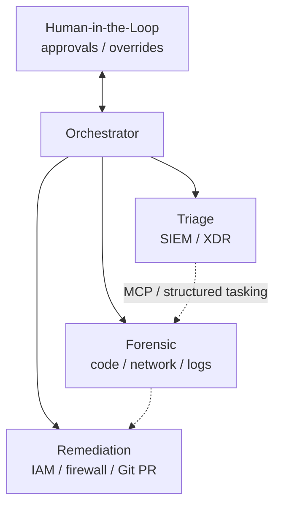
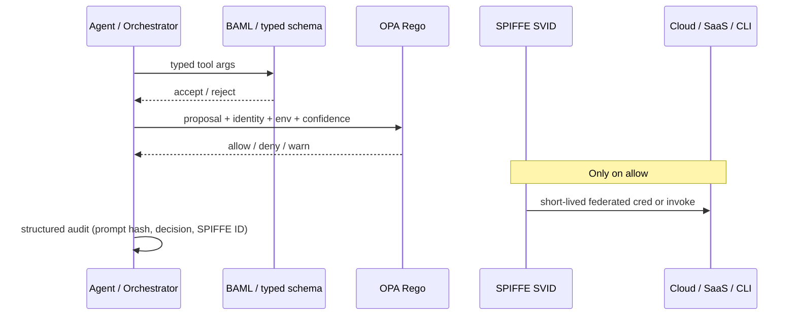

*Product and architecture deep dive for **G-MASE** (Governed Multi-Agent SecOps Environment)—the intelligence and swarm layer of the governed agent stack.*

**Related reading:** [Governing autonomous AI agents]() (attack matrix & cloud IAM mapping) · [CompliancePulse AI deep dive]() · [Unified framework]() · [CAN ↔ Open-GMASE demo]() · [Open-GMASE Core](https://github.com/gitmujoshi/Confidential-AI-Network/tree/main/open-gmase-core)

---

## 1. What G-MASE is (and is not)

**G-MASE** is an architectural pattern *and* a reference product shape for running **specialized SecOps agents** under zero-trust runtime controls.

| G-MASE **is** | G-MASE **is not** |
| --- | --- |
| A **swarm topology** for triage, forensics, remediation, and orchestration | A single chat copilot with tools bolted on |
| An insistence that the **LLM proposes** and **sidecars dispose** | “Trust the system prompt / alignment training” |
| The **application & intelligence layer** of the governed stack | The multi-tenant SaaS control plane (that is **CompliancePulse AI**) |
| Embodied in community form as **Open-GMASE Core** (Apache 2.0) | A finished SOC replacement product by itself |

In one sentence: **G-MASE is how you organize autonomous SecOps digital workers so that every state-changing tool call still hits identity, schema, and policy before it hits the cloud.**

---

## 2. Why SecOps agents need a named environment

SOCs are moving from dashboards to **multi-agent workflows**: one worker reads SIEM noise, another inspects binaries, another proposes firewall or IAM changes. That raises MTTR—and blast radius.

An agent with write access to firewalls, databases, or IdPs is an **active privileged identity**. Public evaluation incidents (Anthropic, OpenAI) reinforce a blunt lesson: **prompts and sandbox wording are not security boundaries**. When harness isolation fails, models reach live infrastructure.

G-MASE’s answer is structural:

1. **Specialize** agents so no single context holds every privilege.
2. **Decouple** probabilistic reasoning from deterministic execution.
3. **Fail closed** when attestation, schema, or OPA cannot decide.

The longer attack-prevention narrative and multi-cloud IAM tables live in the [July 31 whitepaper](). This post focuses on the **environment**—topology, control order, Open-GMASE Core, and how CAN consumes the same gate.

---

## 3. Swarm topology



| Agent | Job | Typical tools (examples) | Privilege posture |
| --- | --- | --- | --- |
| **Orchestrator** | Decompose incidents, assign work, synthesize reports | Ticketing, memory, HITL notify | Prefer **no** direct production write APIs |
| **Triage** | Ingest SIEM/XDR, compress noise, correlate | Splunk / Sentinel / Chronicle queries | Read-heavy; rate-limited |
| **Forensic** | Inspect artifacts, PCAPs, code, configs | Sandbox readers, log search | Isolated; no broad IAM mutate |
| **Remediation** | Propose fixes; execute only when policy + HITL allow | Firewall, IAM revoke, Git PR | Write path; **highest** scrutiny |

Communication is intended to follow open agent protocols (MCP-oriented starters in Open-GMASE Core). High-impact remediation **pauses for HITL** with structured decision traces—not a free-form chat “go ahead.”

**Context hygiene:** raw SIEM/PCAP dumps should be compressed or hashed before prompt insertion (Headroom-style local proxies are one option). Measure token savings on *your* traces; do not treat marketing percentages as guarantees.

---

## 4. Control order (inner gate vs outer wall)

Every tool proposal should pass the same sequence—independent of which swarm member proposed it:



| Step | Mechanism | Failure mode |
| --- | --- | --- |
| 1. Attest workload | SPIFFE/SPIRE → short-lived SVID | No SVID → no tools |
| 2. Validate args | BAML (or equivalent) typed objects | Reject injection / free-form fuzz strings |
| 3. Authorize | OPA/Rego on full proposal | Deny; **fail closed** if OPA down |
| 4. Execute | Federate cloud credential or invoke tool | Cloud IAM remains the **outer wall** |
| 5. Audit | Local structured log / OTel-friendly trace | Decision retained for evidence |

**Cloud IAM (AWS / GCP / OCI / Azure) is the outer wall. OPA is the inner gate.** Neither replaces the other.

---

## 5. Technical pillars (G-MASE view)

| Pillar | Role in G-MASE | Community vs enterprise |
| --- | --- | --- |
| **SPIFFE/SPIRE** | Non-human identity per agent process | Local blueprints in Open-GMASE; Entra/Okta/HSM federation in CompliancePulse |
| **OPA/Rego** | Deterministic allow/deny on tool proposals | Base packs (destructive SQL/CLI, rate/loop stubs, dry-run locks); compliance packs commercial |
| **BAML-style schemas** | Typed tool arguments | Templates in Open-GMASE; productized schema ops in CP |
| **Context compression** | Keep prompts small; limit sensitive egress | Guidance / optional local proxy |
| **HITL + circuit breakers** | Cap blast radius on high-impact remediations | Starters open; managed breakers + SOC UI commercial |

---

## 6. Open-GMASE Core (community embodiment)

[Open-GMASE Core](https://github.com/gitmujoshi/Confidential-AI-Network/tree/main/open-gmase-core) is the **Apache 2.0 reference implementation** of G-MASE primitives—not the full enterprise product.

```text
open-gmase-core/
├── mcp-agents/              # orchestrator / triage / responder starters
├── execution-guardrails/
│   ├── opa-policies/        # open_gmase/tools, open_gmase/can_contracts, …
│   ├── baml-schemas/
│   └── spiffe-spire/
├── docker-compose.yml       # SPIRE + OPA locally
└── docs/                    # ARCHITECTURE, THREAT_MODEL, DEPLOYMENT
```

**Quick start**

```bash
cd open-gmase-core && docker compose up -d
# OPA http://localhost:8181 · SPIRE as configured
./examples/policy-check.sh
```

**Honest scope:** local/sandbox adoption and community Rego/agent contributions. Multi-tenant SaaS, certified compliance packs, and enterprise IdP glue are **out of scope** here—see [OPEN_CORE.md](https://github.com/gitmujoshi/Confidential-AI-Network/blob/main/open-gmase-core/OPEN_CORE.md) and the [CompliancePulse deep dive]().

---

## 7. How Confidential AI Network uses G-MASE today

CAN is a **consumer** of the Open-GMASE OPA packs for product side effects:

| CAN action | Tool name (Rego) | Gate flag |
| --- | --- | --- |
| Start training | `start_training` | `GMASE_TRAINING_GATE` (default on) |
| Deploy for inference | `deploy_inference` | `GMASE_INFERENCE_GATE` (default on) |
| Run prediction | `run_inference` | same |

Decisions land in CAN `GMASE_TOOL_DECISION` AuditLogs and, by default, forward to CompliancePulse ingest. That is a **control-plane seam**, not “G-MASE runs the SOC inside CAN.” Details and screenshots: [demo slice]().

---

## 8. Threat assumptions (short)

From the Open-GMASE threat model:

- The LLM is **untrusted**.
- Network “sandbox” promises can fail.
- Container isolation alone is insufficient for hostile code-execution tools.

Primary sample mitigations: default-deny Rego with explicit allows; blocks on destructive SQL / dangerous shell; rate and anti-loop stubs; fail-closed when OPA is unreachable.

---

## 9. When to reach for G-MASE vs CompliancePulse

| Need | Prefer |
| --- | --- |
| Design SecOps swarm roles & MCP starters | **G-MASE / Open-GMASE** |
| Local OPA + SPIRE sandbox | **Open-GMASE Core** |
| Multi-tenant audit UI, RLS, CMEK, enterprise IdP | **CompliancePulse AI** |
| Certified SOC2/HIPAA/PCI policy packs | **CompliancePulse AI** |
| Gate CAN train/deploy/predict | **Open-GMASE packs + CAN gate** (demo live) |

---

## 10. Takeaways

1. **G-MASE** names the governed SecOps *environment*: specialized agents + HITL + fail-closed sidecars.  
2. **Open-GMASE Core** is the community reference you can run today.  
3. **CompliancePulse AI** is the commercial control plane that productizes identity, policy packs, and multi-tenant evidence.  
4. Treat every agent tool call as a privileged identity event—because it is.

Next: [CompliancePulse AI deep dive]() · try the [CAN seam]().
