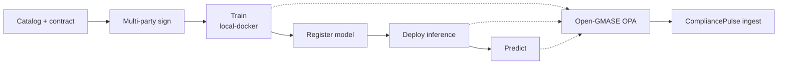

*If you last looked at CAN as “contracts + SCITT + clean rooms,” this is the update: what stayed the same, what shipped, and where to click next.*

**Prefer pictures?** [Product tour]({{ '/product-tour/' | relative_url }}) · **Prefer a runnable seam?** [CAN ↔ Open-GMASE ↔ CompliancePulse]() · **Repo:** [Confidential-AI-Network](https://github.com/gitmujoshi/Confidential-AI-Network)

> **Status:** Active research and engineering. Features below that say **live** run in the local stack today; multi-tenant SaaS and full cloud clean-room automation remain roadmap.

---

## 1. The thesis (unchanged)

**Training needs multi-party data; regulation forbids bulk export; audits need proof.**

CAN is still a **protocol**, not a data lake:

1. TDPs publish **metadata and policy**, not corpora  
2. Parties negotiate a **Ricardian contract** and **sign**  
3. Training runs only in a **policy-bound** environment  
4. Outcomes leave an **auditable trail** (job audit + SCITT CCF path)

Roles remain **TDP / TDC / TSP·CCRP**, with Keycloak (dev) or cloud IdP (production). The July walkthrough still holds: [Building Confidential AI Network]().

What changed is the **closed loop after the contract**: train → register → deploy → predict, under an **Open-GMASE policy gate**, with decisions optionally landing in **CompliancePulse**.

---

## 2. What’s new (at a glance)

| Area | What’s live | Why it matters |
| --- | --- | --- |
| **Local training** | `local-docker` / `local-native` / `local-mlx` under signed contracts | Stakeholder demos without waiting on cloud provisioning |
| **Modalities** | Tabular (logreg), text (DistilBERT / AG News), vision (TinyCNN / CIFAR path) | Same contract + job UX across modalities |
| **Privacy** | Optional **DP-SGD** (Opacus) on NLP paths; `privacyMetrics` on completed jobs | Talk ε/δ with GRC, not just accuracy |
| **Inference app** | Register artifact → **Deploy for inference** → predict in `/tdc/inference` | End-to-end “model you can call” after training |
| **Open-GMASE gates** | Fail-closed OPA on **start training**, **deploy**, **predict** (default on) | Side effects are authorized, not prompt-trusted |
| **CompliancePulse ingest** | Default forward of `GMASE_TOOL_DECISION` to `POST /api/v1/audit/ingest` | Same allow/deny visible outside CAN (decision only—not pixels/weights) |
| **Evidence UX** | Inference **Open-GMASE policy gate** panel (ALLOW + audit id) | Demoable governance for non-engineers |
| **Docs / blog** | Product tour, demo slice, [G-MASE]() & [CompliancePulse]() deep dives | One story from CAN → open gate → control plane |

---

## 3. The loop you can run today



1. **Onboard** TDP / TDC / TSP (or use seeded E2E users).  
2. **Publish** a dataset; **create** a Ricardian contract with training params (`taskType`: tabular / text / vision).  
3. **Sign** as the required parties.  
4. **Start training** — Open-GMASE evaluates `start_training` first.  
5. On **COMPLETED**, **register** the artifact, then **Deploy for inference**.  
6. Open the **Inference app**, run a sample (iris features, AG News headline, or CIFAR-style `imageBase64`).  
7. See the label **and** the policy-gate panel; curl CompliancePulse `external_ingest` if CP is up.

Hands-on: [demo slice]() · screenshots: [product tour]({{ '/product-tour/' | relative_url }}).

---

## 4. Models & inference (what demos show)

| Path | Model / task | Example input | Example label |
| --- | --- | --- | --- |
| Fast gate / GMASE shots | Tabular logistic regression | `{ "features": [5.1, 3.5, 1.4, 0.2] }` | **setosa** |
| Lifecycle tour | Quality DistilBERT · AG News | Wall Street headline text | **Business** |
| Vision (API / Inference UI) | TinyCNN · CIFAR-10 subset | Sample PNG `imageBase64` | CIFAR class name (e.g. **airplane**) |

Local inferencer: `backend/local-training/infer.py` (Docker trainer image mounts host `infer.py` so label maps ship without rebuild).

---

## 5. Governance seam (CAN + Open-GMASE + CompliancePulse)

CAN is no longer only “contracts for training.” Side effects that matter now hit the same **inner gate** as agent tool proposals:

| CAN action | OPA tool | Env flag |
| --- | --- | --- |
| Start training | `start_training` | `GMASE_TRAINING_GATE` (default on) |
| Deploy for inference | `deploy_inference` | `GMASE_INFERENCE_GATE` (default on) |
| Run prediction | `run_inference` | same |

Flow: **authorize (fail-closed)** → CAN `GMASE_TOOL_DECISION` AuditLogs → **default forward** to CompliancePulse (`COMPLIANCEPULSE_INGEST_URL=http://localhost:3001`).

**Forwarded:** `tool_name`, `allow`, `reason`, `model_id`, `contract_id`, package, audit id.  
**Not forwarded:** datasets, `imageBase64`, model weights, prediction logits.

Open community packs live in [`open-gmase-core/`](https://github.com/gitmujoshi/Confidential-AI-Network/tree/main/open-gmase-core). The commercial control-plane path is [`compliancepulse-ai/`](https://github.com/gitmujoshi/Confidential-AI-Network/tree/main/compliancepulse-ai/). Architecture narrative: [G-MASE deep dive]() · [CompliancePulse deep dive]().

---

## 6. What is still roadmap (say this out loud)

| Live research demo | Not finished product yet |
| --- | --- |
| Local Docker/native training + inference | Full multi-cloud CCRP auto-provision for every demo |
| Open-GMASE OPA on CAN side effects | Enterprise IdP packs + HSM as a hosted service |
| CompliancePulse **ingest stub** + trail API | Multi-tenant SaaS console, RLS, CMEK, certified packs |
| Product tour + Playwright E2E | “Turnkey SOC swarm” UI |

The CISO one-pager remains the board-friendly framing: [Governed AI for the enterprise]().

---

## 7. Where to start

| You want… | Go here |
| --- | --- |
| Screenshots of the happy path | [Product tour]({{ '/product-tour/' | relative_url }}) |
| Run OPA + CP + CAN locally | [Demo slice]() |
| Clone and read the monorepo | [GitHub README](https://github.com/gitmujoshi/Confidential-AI-Network#readme) |
| SecOps swarm / control plane depth | [G-MASE]() · [CompliancePulse]() |
| Original technical walkthrough | [Building CAN]() |

```bash
./start-system.sh
cd open-gmase-core && docker compose up -d
cd compliancepulse-ai/backend && npm run dev   # :3001
# then follow the demo slice / product tour
```

---

## One sentence

**CAN is still contract-governed multi-party training—now with a local train-to-inference loop and an Open-GMASE policy gate whose decisions can land in CompliancePulse.**
