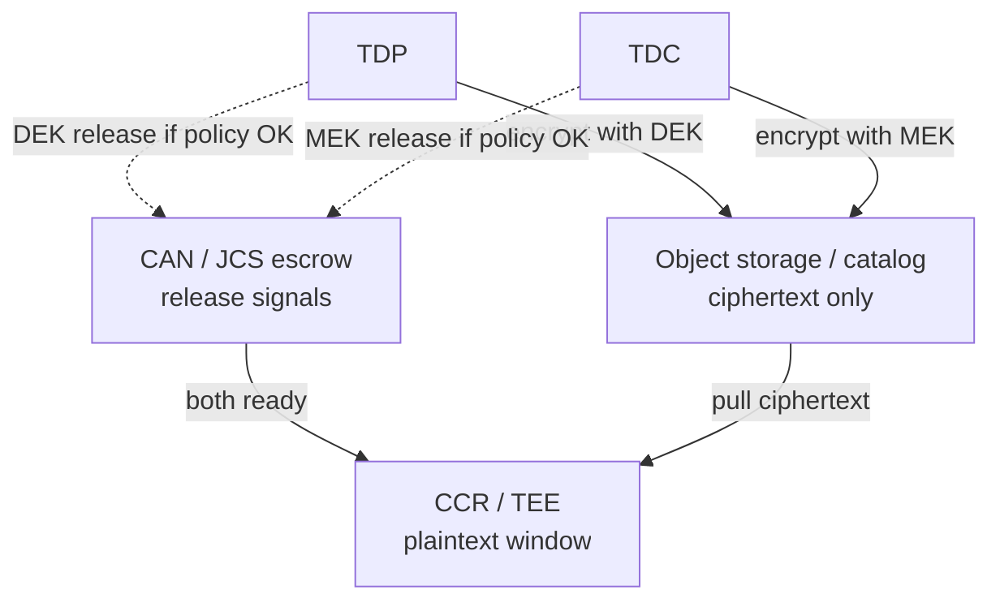

*Key management for multi-party training: ciphertext everywhere outside the clean room, dual-key escrow before train, cloud KMS as the outer key service—not a shared “god key” for the lake.*

**Companion:** [TEE execution — attest, verify contract, then decrypt]() · [Azure confidential computing (SKR / Key Vault)]() · **Lifecycle source of truth:** [Participant onboarding & E2E](https://github.com/gitmujoshi/Confidential-AI-Network/blob/main/docs/guides/PARTICIPANT_ONBOARDING_AND_E2E_LIFECYCLE.md) · **Product loop:** [Contract to governed prediction]()

> **Status:** Architecture and partial implementation. Local demos often train on staged artifacts without a hardware TEE. CAN/JCS Phase 1 uses **key-release signals** (no key bytes to the Node API). **Attested TLS delivery of DEK/MEK into the enclave** is the Phase 2 target.

---

## 1. Why KMS matters in CAN

CAN is inspired by iSPIRT’s **[DEPA](https://depa.world)** (Data Empowerment and Protection Architecture): use-bound, accountable sharing—not a central data lake. Cryptographically that means:

1. The **platform must not** hold principal-owned dataset or model keys in plaintext.  
2. **Ciphertext** may live in object storage or the catalog path; **plaintext** exists only inside an attested clean room for a bounded job window.  
3. Training starts only when **both** data and model keys are released under contract + attestation policy (**dual-key escrow**).

Without that discipline, “confidential training” collapses to “trust the operator’s disk.”

---

## 2. Two principal-owned keys

| Key | Name | Owner | Protects | Typical algorithm |
| --- | --- | --- | --- | --- |
| **DEK** | Data Encryption Key | **TDP** / data principal | Training dataset | AES-256-GCM (design) |
| **MEK** | Model Encryption Key | **TDC** / model owner | Base model / weights IP | AES-256-GCM (design) |



**Rule of thumb:** DEK and MEK are **not** the same as cloud “customer managed keys” for disk encryption of the portal database. Those are infrastructure. DEK/MEK are **workload secrets for the training job**, owned by parties to the Ricardian contract.

---

## 3. What “KMS” means in this stack

CAN talks to **key services** at two layers:

| Layer | Examples | Role |
| --- | --- | --- |
| **Cloud KMS / Vault** | OCI Vault, Azure Key Vault, AWS KMS, GCP KMS | Wrap/store customer keys, HSM-backed operations, IAM-bound use |
| **CAN / JCS coordination** | `/api/can/jcs/*` job escrow | Record **when** DEK/MEK may be released; bind to contract + CCR session; timeout → destroy |

Wizard fields such as `kmsConfigs` on contracts capture **which provider / region / key id** the parties expect for the clean-room path. The CCRP / TSP offering must be able to run in an environment that can use those keys under IAM and attestation policy.

Deep design notes in-repo:

- [KMS_TRAINING_ENVIRONMENT_ARCHITECTURE.md](https://github.com/gitmujoshi/Confidential-AI-Network/blob/main/docs/architecture/KMS_TRAINING_ENVIRONMENT_ARCHITECTURE.md)  
- [MULTI_TENANT_KMS_ARCHITECTURE.md](https://github.com/gitmujoshi/Confidential-AI-Network/blob/main/docs/architecture/MULTI_TENANT_KMS_ARCHITECTURE.md)  
- [DECENTRALIZED_KMS_ARCHITECTURE.md](https://github.com/gitmujoshi/Confidential-AI-Network/blob/main/docs/architecture/DECENTRALIZED_KMS_ARCHITECTURE.md)

---

## 4. Dual-key escrow (the gate before train)

Target sequence:

1. Contract is **SIGNED** (all required parties).  
2. CCRP provisions a clean-room session (TEE / confidential VM / attested K8s job).  
3. Job enters escrow: waiting for **DEK released** and **MEK released**.  
4. Each principal releases **only after** verifying attestation + contract binding (see [TEE post]()).  
5. When **both** signals (and, in Phase 2, key material into the TEE) are present → training may start.  
6. Hard timeout → session **EXPIRED** / CCR **DESTROYED**; keys must be zeroized in a real enclave.

**Phase 1 MVP:** principals post `key-released` **signals** with `keyType: DEK|MEK`. The API **rejects raw key bytes** to the Node process. Coordinates release without accepting key material into the Node API.

```bash
# Illustrative — see CAN_QUICKSTART in the repo
POST /api/can/jcs/jobs
POST /api/can/jcs/jobs/{id}/attestation   # bundle (simulated today)
POST /api/can/jcs/jobs/{id}/key-released  # keyType: DEK
POST /api/can/jcs/jobs/{id}/key-released  # keyType: MEK
# → release → CCR executor may start
```

---

## 5. Encryption modes (maturity)

| Mode | Who encrypts | Who holds DEK/MEK | Decrypt where | Maturity |
| --- | --- | --- | --- | --- |
| Local demo / Docker train | Often staged plaintext or demo artifacts | N/A for host path | Host trainer | **Live** (host path) |
| Platform-assisted encrypt | Platform path | Risk: platform custody | Varies | Partial / legacy paths |
| TDP/TDC local encrypt | Principal before upload | Principal only | TEE after attested release | **Design** ([TDP flow](https://github.com/gitmujoshi/Confidential-AI-Network/blob/main/docs/flows/TDP_ENCRYPTED_DATASET_TEE_FLOW.md) · [TDC flow](https://github.com/gitmujoshi/Confidential-AI-Network/blob/main/docs/flows/TDC_ENCRYPTED_AI_MODEL_TEE_FLOW.md)) |
| CAN principal DEK/MEK + attested TLS | Principal | Principal | CCR via attested channel | **Target Phase 2** |

For stakeholder demos of *contracts → train → infer*, the [local Docker path]() is the right story. For *keys and clean rooms*, see [KMS / DEK·MEK]() and [TEE attest → decrypt]().

---

## 6. What auditors should ask

| Question | Good answer |
| --- | --- |
| Does the SaaS hold DEK/MEK plaintext? | **No** in the target model; Phase 1 API refuses key material. |
| When does decrypt happen? | Only after **contract verification** + **hardware (or simulated) attestation** + **dual release**. |
| What if escrow times out? | Session destroyed; no lingering training window. |
| How does this relate to Open-GMASE? | OPA can gate **start_training** even after keys exist; KMS/TEE answer *where plaintext may exist*, G-MASE answers *whether the side effect may run*. |

---

## 7. Takeaways

1. **DEK ≠ MEK** — data principal and model owner keep separate custody.  
2. **Dual-key escrow** is the economic and cryptographic AND-gate before train.  
3. **Cloud KMS** wraps infrastructure and customer keys; **CAN/JCS** orchestrates release against the Ricardian contract.  
4. Local demos cover product UX; **attested key delivery into TEE** is the clean-room target.

Next: [TEE execution — attestation, contract check, decrypt-in-memory]().
