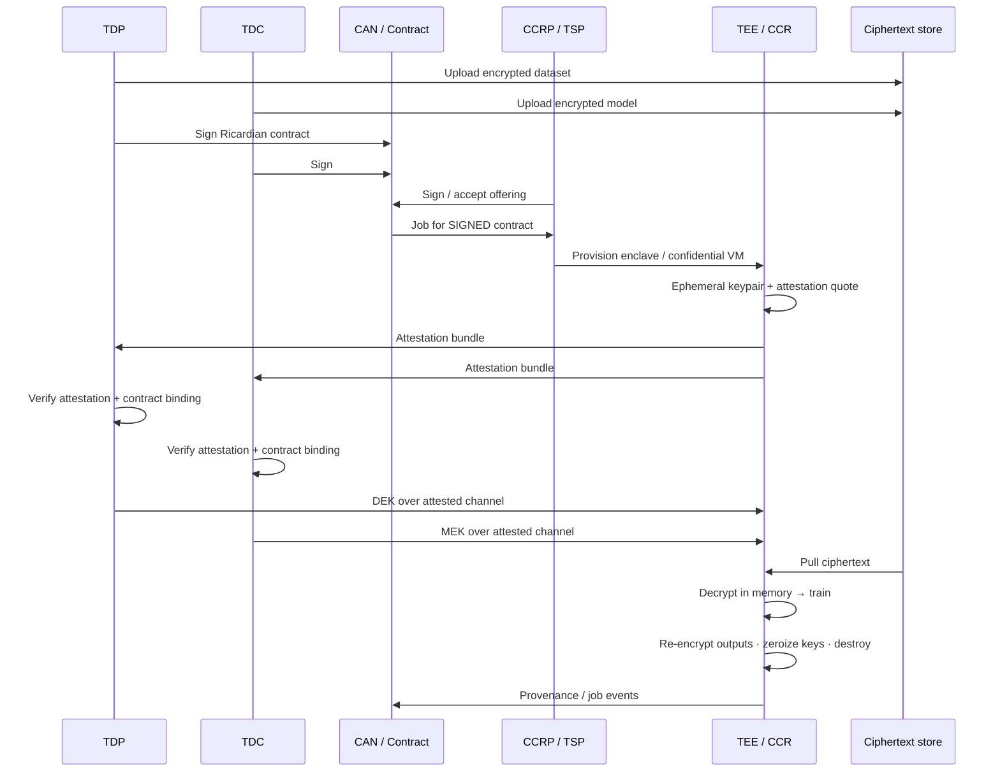

*The clean-room rule: ciphertext may travel; plaintext and keys exist only inside an attested TEE for the training window—and only after the contract says that environment is allowed.*

**Companion:** [KMS — DEK, MEK, and dual-key escrow]() · [Azure confidential computing deep dive]() · **Flows:** [TDP encrypted dataset](https://github.com/gitmujoshi/Confidential-AI-Network/blob/main/docs/flows/TDP_ENCRYPTED_DATASET_TEE_FLOW.md) · [TDC encrypted model](https://github.com/gitmujoshi/Confidential-AI-Network/blob/main/docs/flows/TDC_ENCRYPTED_AI_MODEL_TEE_FLOW.md) · **iSPIRT DEPA:** [depa.world](https://depa.world)

> **Status:** Target architecture for CCRP / confidential-compute paths (Azure confidential computing, OCI confidential VMs, etc.). **Local Docker / native training is not a hardware TEE**—it proves contracts and job UX. CAN/JCS today uses **simulated attestation bundles** and **key-release signals**; real attested TLS / SKR key delivery is Phase 2+.

---

## 1. The control you actually want

Boards ask: *Can the clean-room operator, or the SaaS, read our data and model?*

CAN’s answer is not “trust the NDA.” It is a **decrypt gate** with two locks:

1. **Hardware attestation** — the enclave proves its measurement / identity (CPU/firmware/image claims the cloud vendor supports).  
2. **Contract verification** — the Ricardian agreement names allowed regions, TEE requirements, parties, and use; keys release only for **that** job/session.

Only then may **DEK** (dataset) and **MEK** (model) enter the TEE so ciphertext can be decrypted **in memory**, training can run, outputs can be re-encrypted, and keys zeroized when the session ends.

That is DEPA-shaped thinking for enterprises: **use-bound access with evidence**, not bulk export into a lake.

---

## 2. End-to-end sequence (target)



Same idea in one block (from the lifecycle guide):

```text
CCRP provisions TEE
  → TEE generates ephemeral TLS keypair + attestation
  → Principals verify attestation independently
  → CCR pulls encrypted dataset + encrypted base model
  → TDP delivers DEK over attested TLS into TEE
  → TDC delivers MEK over attested TLS into TEE
  → Decrypt in memory → train → re-encrypt outputs
  → Zeroize keys → destroy CCR session
  → Emit provenance (created, attested, keys released, started, completed, destroyed)
```

---

## 3. What “hardware attestation” means here

| Claim | Why principals check it |
| --- | --- |
| **Enclave / confidential VM measurement** | Code and config match what the contract allowed |
| **Ephemeral session identity** | Keys are bound to **this** job, not a long-lived shared host |
| **Freshness** | Replay of an old quote must not unlock new ciphertext |
| **Cloud root of trust** | Vendor attestation service / cert chain as designed for that cloud |

**SPIFFE/SPIRE** (workload identity for agents and pods) **complements** TEE attestation; it does **not** replace it for DEK/MEK release. See [Three identity planes]().

---

## 4. What “contract verification” means here

Before a principal releases DEK or MEK, the contract (and job binding) should establish at least:

| Check | Example |
| --- | --- |
| Parties | TDP / TDC / CCRP identities match signers |
| Purpose / use | Training only; no bulk export clause |
| Environment | Region, TEE required, `attestation_required`, residency |
| KMS / key ids | Keys referenced in contract `kmsConfigs` / encryption metadata |
| Escrow window | Deadline; missed → destroy session |
| Isolation | Offering matches published CCRP capability |

**Open-GMASE** can still **deny `start_training`** even if keys are present—policy on the side effect is a separate fail-closed gate ([demo slice]()). TEE answers *where plaintext may exist*; OPA answers *whether the job may start*.

---

## 5. Dataset path vs model path

### TDP — encrypted dataset (DEK)

1. TDP encrypts locally (target) → uploads **ciphertext** + metadata (`tee_only`, key id references).  
2. Contract requires TEE + attestation.  
3. After attestation + contract OK → DEK into TEE → decrypt dataset in memory.

### TDC — encrypted base model (MEK)

1. TDC encrypts model IP locally (target) → uploads **ciphertext**.  
2. Same clean-room session pulls model ciphertext.  
3. After attestation + contract OK → MEK into TEE → decrypt model in memory → train with dataset.

Symmetric stories; **both** keys required. Details: [TDP flow](https://github.com/gitmujoshi/Confidential-AI-Network/blob/main/docs/flows/TDP_ENCRYPTED_DATASET_TEE_FLOW.md) · [TDC flow](https://github.com/gitmujoshi/Confidential-AI-Network/blob/main/docs/flows/TDC_ENCRYPTED_AI_MODEL_TEE_FLOW.md).

---

## 6. Live today vs target (say this in demos)

| Path | What happens | TEE? |
| --- | --- | --- |
| **Local Docker / native / MLX** | Signed contract → train on host/trainer image → register → infer | **No** — product UX demo |
| **CAN/JCS MVP** | Job + **simulated** attestation + DEK/MEK **release signals** (no key bytes to API) | Coordination demo |
| **Target CCR** | Real quote → attested TLS → DEK+MEK in enclave → decrypt → train → zeroize | **Yes** |

Local product-tour screenshots show the **runnable** loop. Azure confidential VMs + Key Vault / SKR are the **cloud target**—see [Azure confidential computing deep dive](). Don’t conflate host training with TEE claims.

---

## 7. Provenance events (evidence)

A clean-room job should leave a trail such as:

- Job created (bound to `contractId`)  
- Attestation presented / verified  
- DEK released · MEK released  
- Training started / completed (or failed)  
- Session destroyed / keys zeroized  

Ledger-backed claims (SCITT CCF) and CAN AuditLogs / CompliancePulse ingest sit beside this for GRC. The cryptographic story only works if **destroy** is real when escrow expires.

---

## 8. Takeaways

1. **Decrypt is a privilege**, not a default—gated by **attestation ∧ contract ∧ dual-key escrow**.  
2. **Plaintext stays in the TEE** for the job window; storage holds ciphertext.  
3. **Local demos ≠ confidential VMs**—label them correctly for CISOs.  
4. Pair with [KMS / DEK / MEK]() for who owns which key, and with [Open-GMASE]() for whether training may start at all.

**One sentence:** In CAN’s clean-room design, encrypted data and models are decrypted only after the enclave proves what it is and the Ricardian contract proves that enclave is allowed to train.
