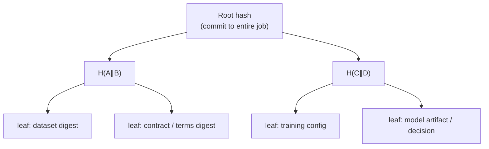

*When a model produces a harmful, biased, or contract-violating outcome, the question is not only “what did it output?”—it is “what inputs, policy, and artifacts led here, and can we prove nobody rewrote the trail?”*

**Related:** [Contract → governed prediction]() · [Open-GMASE]() · [TEE attest → decrypt]() · In-repo: [MERKLE_TREE_PROVENANCE_IMPLEMENTATION.md](https://github.com/gitmujoshi/Confidential-AI-Network/blob/main/docs/security/MERKLE_TREE_PROVENANCE_IMPLEMENTATION.md) · [Provenance integration](https://github.com/gitmujoshi/Confidential-AI-Network/blob/main/docs/features/provenance/PROVENANCE_INTEGRATION_GUIDE.md)

> **Status:** Merkle builders, proofs, and an **Auditor** role/UI exist (`/auditor/*`, `/api/auditor/*`). Product demos also show the **provenance report UI** and **SCITT** path. Treat cross-cloud Merkle replication and every historical leaf type as **architecture + partial coverage**, not “every leaf is GA everywhere.” See [AUDITOR_ROLE.md](https://github.com/gitmujoshi/Confidential-AI-Network/blob/main/docs/features/AUDITOR_ROLE.md).

---

## 1. Why “the model misbehaved” needs cryptography

A bad prediction, a leaked feature, or a training run that used the wrong dataset creates a GRC incident. Typical evidence fails under scrutiny:

| Weak evidence | What an adversary (or honest mistake) can do |
| --- | --- |
| Log file on disk | Edit after the fact |
| Screenshot of the UI | No binding to bytes that trained the model |
| “Trust our SIEM export” | Incomplete or reordered without proof |
| Model card PDF | Not tied to the artifact hash |

You need a structure where:

1. Every material event is **hashed**.  
2. Hashes are **aggregated** so one **root** commits to the whole set.  
3. Anyone can check a single event with a short **inclusion proof** against a published root (and optionally a ledger receipt).

That structure is a **Merkle tree**.

---

## 2. Merkle trees in one diagram



- **Leaf** = cryptographic hash of a provenance record (dataset chunk, config JSON, checkpoint, policy decision, …).  
- **Parent** = hash of its children (order fixed; algorithm usually SHA-256).  
- **Root** = single digest that commits to all leaves.  
- **Inclusion proof** = sibling hashes along the path from leaf → root. Anyone with the root can recompute and verify the leaf was in the tree **when that root was published**.

Change one byte of training data or swap a config field → leaf changes → root changes. That is the audit property.

---

## 3. What CAN puts under the tree

Aligned with the provenance design and training job lifecycle:

| Phase | Example leaves |
| --- | --- |
| **Before train** | Contract id / terms digest · dataset ciphertext or content hash · model base digest · KMS / Key Vault refs · TEE attestation digest (when present) |
| **During train** | Hyperparams · DP config (ε/δ if used) · epoch checkpoints · Open-GMASE `start_training` decision id |
| **After train** | Final artifact hash · metrics · provenance report bundle |
| **Infer** | Deploy / predict governance decisions · input digest (careful with PII) · output label / class |

The **Merkle Tree Service** aggregates nodes; PostgreSQL stores trees/nodes/proofs; **SCITT CCF** can hold a **receipt** that anchors the root (or claim) on a confidential ledger—so the root itself is harder to rewrite than an app database row alone.

```text
Events → hash leaves → Merkle root → (optional) SCITT receipt
                ↑
     inclusion proof for one disputed event
```

---

## 4. Incident playbook: model misbehaves

Suppose an inference result looks wrong, unsafe, or outside the Ricardian use terms.

### 4.1 Freeze the claim

1. Capture **model id**, **job id**, **contract id**, timestamp, and the disputed output.  
2. Load the job’s published **Merkle root** (and SCITT receipt if enabled).  
3. Do **not** only trust the live UI—export the proof package.

### 4.2 Verify the lineage you care about

| Question | Merkle answer |
| --- | --- |
| Was this the dataset we signed for? | Prove dataset leaf ∈ tree under root R |
| Were DP / residency flags the ones in the contract? | Prove config leaf ∈ tree |
| Did Open-GMASE ALLOW this predict? | Prove `GMASE_TOOL_DECISION` / audit leaf ∈ tree (or linked decision hash) |
| Is the artifact we served the one we trained? | Prove model artifact leaf matches deployed bytes |

If the inclusion proof fails, the trail was altered or you have the wrong root—**stop** and escalate integrity, not only model quality.

### 4.3 Separate “bad model” from “bad process”

| Finding | Interpretation |
| --- | --- |
| Proofs verify; output still harmful | Model / data / policy design problem—lineage is intact |
| Proofs fail or root ≠ receipt | Integrity / ops incident—do not treat UI history as truth |
| ALLOW decision missing or DENY bypassed | Control-plane failure (gate, keys, or deployment) |

Merkle trees do not make models ethical. They make **denial and rewriting of history expensive**.

---

## 5. How this fits Open-GMASE and CompliancePulse

| Layer | Role when something goes wrong |
| --- | --- |
| **Open-GMASE OPA** | May have **denied** a bad side effect before it ran—or ALLOW’d it with a recorded reason |
| **CAN AuditLogs** | `GMASE_TOOL_DECISION` and job events |
| **Merkle provenance** | Binds those events (and artifacts) into a **root** with inclusion proofs |
| **CompliancePulse ingest** | External copy of governance decisions for control-plane review |
| **SCITT** | Ledger receipt for the claim/root |

Together: **prevent** where possible (OPA), **record** always (audit), **prove** under challenge (Merkle + receipt).

---

## 6. What auditors should ask for

1. Algorithm (e.g. SHA-256) and leaf canonicalization rules (JSON field order, hashing of files).  
2. Published **root** per training job / contract epoch.  
3. **Inclusion proof** for the disputed leaf.  
4. Optional **SCITT receipt** verifying the root/claim.  
5. Mapping from leaf → human-readable event (dataset id, decision id).  

If the vendor cannot produce (3) against (2), you have a narrative, not evidence.

---

## 7. Honest limits

| Merkle / provenance helps | It does not replace |
| --- | --- |
| Detecting tampering of the recorded trail | Stopping a model from being wrong on valid data |
| Efficient proofs for one event among thousands | Full replay of GPU nondeterminism without careful leaf design |
| Binding artifacts to a contract job | DEK/MEK custody (see [KMS]()) or TEE isolation (see [TEE]()) |
| Supporting NIST/CIS-style audit evidence | Certified compliance by itself |

Hashing **raw prompts that contain secrets** into leaves can create a new leakage path—hash digests or redacted envelopes, not plaintext PII, in the published tree.

---

## 8. Takeaways

1. A **Merkle root** is a compact commitment to the whole provenance set for a job.  
2. When a model misbehaves, **inclusion proofs** answer “was this dataset / config / decision / artifact in the committed history?”  
3. CAN’s design pairs Merkle provenance with **SCITT receipts**, **AuditLogs**, and **Open-GMASE** decisions so incidents separate **integrity** from **model quality**.  
4. Ask for proofs under challenge—not screenshots.

**One sentence:** Merkle trees let CAN turn “trust our logs” into “verify this leaf against a published root”—the right tool when a model’s behavior is under dispute.
