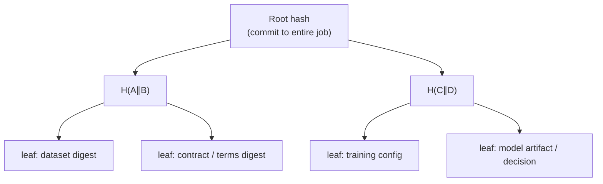

*When a model produces a harmful, biased, or contract-violating outcome, the question is not only “what did it output?”—it is “what inputs, policy, and artifacts led here, and can we prove nobody rewrote the trail?”*

**Related:** [Contract → governed prediction]() · [Ricardian contracts in CAN]() · [Product tour — Auditor]({{ '/product-tour/#auditor' | relative_url }}) · [Open-GMASE]() · [TEE attest → decrypt]() · In-repo: [AUDITOR_ROLE.md](https://github.com/gitmujoshi/Confidential-AI-Network/blob/main/docs/features/AUDITOR_ROLE.md) · [MERKLE_TREE_PROVENANCE_IMPLEMENTATION.md](https://github.com/gitmujoshi/Confidential-AI-Network/blob/main/docs/security/MERKLE_TREE_PROVENANCE_IMPLEMENTATION.md)

> **Status:** Merkle builders, proofs, and an **Auditor** role/UI exist (`/auditor/*`, `/api/auditor/*`). The Auditor **Verify** action checks **leaf inclusion under a published root** for durable contract evidence—not model correctness. Product demos also show the **provenance report UI** and **SCITT** path. Treat cross-cloud Merkle replication and every aspirational leaf type as **architecture + partial coverage**. See [AUDITOR_ROLE.md](https://github.com/gitmujoshi/Confidential-AI-Network/blob/main/docs/features/AUDITOR_ROLE.md).

---

## 1. Why “the model misbehaved” needs cryptography

A bad prediction, a leaked feature, or a training run that used the wrong dataset creates a GRC incident. Typical evidence fails under scrutiny:

| Weak evidence | What an adversary (or honest mistake) can do |
| --- | --- |
| Log file on disk | Edit after the fact |
| Screenshot of the UI | No binding to bytes that trained the model |
| “Trust our SIEM export” | Incomplete or reordered without proof |
| Model card PDF | Not tied to the artifact hash |

You need a structure where:

1. Every material event is **hashed**.  
2. Hashes are **aggregated** so one **root** commits to the whole set.  
3. Anyone can check a single event with a short **inclusion proof** against a published root (and optionally a ledger receipt).

That structure is a **Merkle tree**.

---

## 2. Merkle trees in one diagram



- **Leaf** = cryptographic hash of a provenance record (dataset chunk, config JSON, checkpoint, policy decision, …).  
- **Parent** = hash of its children (order fixed; algorithm usually SHA-256).  
- **Root** = single digest that commits to all leaves.  
- **Inclusion proof** = sibling hashes along the path from leaf → root. Anyone with the root can recompute and verify the leaf was in the tree **when that root was published**.

Change one byte of training data or swap a config field → leaf changes → root changes. That is the audit property.

---

## 3. What CAN puts under the tree

### 3.1 Target design (full lifecycle)

Aligned with the provenance design and training job lifecycle:

| Phase | Example leaves |
| --- | --- |
| **Before train** | Contract id / terms digest · dataset ciphertext or content hash · model base digest · KMS / Key Vault refs · TEE attestation digest (when present) |
| **During train** | Hyperparams · DP config (ε/δ if used) · epoch checkpoints · Open-GMASE `start_training` decision id |
| **After train** | Final artifact hash · metrics · provenance report bundle |
| **Infer** | Deploy / predict governance decisions · input digest (careful with PII) · output label / class |

The **Merkle Tree Service** aggregates nodes; PostgreSQL stores trees/nodes/proofs; **SCITT CCF** can hold a **receipt** that anchors the root (or claim) on a confidential ledger—so the root itself is harder to rewrite than an app database row alone.

```text
Events → hash leaves → Merkle root → (optional) SCITT receipt
                ↑
     inclusion proof for one disputed event
```

### 3.2 What the Auditor UI builds today

The Auditor workspace (`/auditor/dashboard` → **Audit tree**) builds a **contract-scoped** tree from durable DB evidence. Each **Verify** click checks inclusion of one of these leaf kinds:

| Leaf kind | What the leaf commits to |
| --- | --- |
| **contract** | Contract id, status, legal-document hash, parties, environment specs, training params, linked datasets |
| **training_job** | Job id/status, metrics, artifact hashes (when recorded), timestamps |
| **scitt_claim** | SCITT claim type/status/data markers for that contract |
| **ai_model** | Registered model metadata (name, framework, architecture, ids) |

Not every row in the “target design” table above is a separate leaf yet (for example raw DP config or every G-MASE decision may live in AuditLogs / CompliancePulse until folded into this tree). The product-tour screens show this path: [Auditor section]({{ '/product-tour/#auditor' | relative_url }}).

---

## 4. What an Auditor actually verifies

Two different jobs—do not conflate them.

### 4.1 What **Verify** checks (cryptography)

That a **leaf is included** in the tree under the published **root hash**.

In other words: *“This evidence record belongs to this committed provenance set and has not been silently dropped or swapped relative to this root.”*

| Verified by inclusion proof | Not verified by inclusion proof |
| --- | --- |
| Integrity of lineage for that leaf under root R | That the model’s prediction was correct |
| Consistency of the audit trail for that contract | Ethics / fairness of the model |
| Binding of listed contract / job / claim / model digests | That every aspirational leaf type is always present |

If the inclusion proof **fails**, treat it as an **integrity / ops** problem first—not only a model-quality problem.

### 4.2 What the Auditor **reviews** (human)

After Verify succeeds (or while investigating), they open the **Ricardian contract** the training was based on and ask process questions:

- Was this the agreed use, data, and environment?  
- Which training job produced the disputed artifact?  
- Which SCITT markers were recorded for sign / train / deploy?

Merkle trees do not make models ethical. They make **denial and rewriting of history expensive**. Auditors prove **lineage integrity**, then judge **process fit to the contract**—not model quality by itself.

---

## 5. Incident playbook: model misbehaves

Suppose an inference result looks wrong, unsafe, or outside the Ricardian use terms.

### 5.1 Freeze the claim

1. Capture **model id**, **job id**, **contract id**, timestamp, and the disputed output.  
2. Open the Auditor **audit tree** for that contract (or export the proof package)—load the published **Merkle root** (and SCITT receipt if enabled).  
3. Do **not** only trust the live training UI screenshot.

### 5.2 Verify the lineage you care about

| Question | Merkle / Auditor answer (today vs target) |
| --- | --- |
| Is this contract’s trail intact under root R? | **Today:** Verify **contract** / **training_job** / **scitt_claim** / **ai_model** leaves |
| Was this the dataset we signed for? | **Target:** dataset leaf ∈ tree; **today:** review `contractDatasets` on the contract leaf + catalog |
| Were DP / residency flags the ones in the contract? | **Target:** config leaf; **today:** compare contract `trainingParams` / env specs + job metrics |
| Did Open-GMASE ALLOW this predict? | Prefer AuditLogs / CompliancePulse decision id; fold into Merkle when that leaf type is published |
| Is the artifact we served the one we trained? | Job **artifactHashes** / registered model leaf vs deployed bytes |

### 5.3 Separate “bad model” from “bad process”

| Finding | Interpretation |
| --- | --- |
| Proofs verify; output still harmful | Model / data / policy design problem—lineage is intact |
| Proofs fail or root ≠ receipt | Integrity / ops incident—do not treat UI history as truth |
| ALLOW decision missing or DENY bypassed | Control-plane failure (gate, keys, or deployment) |

---

## 6. How this fits Open-GMASE and CompliancePulse

| Layer | Role when something goes wrong |
| --- | --- |
| **Open-GMASE OPA** | May have **denied** a bad side effect before it ran—or ALLOW’d it with a recorded reason |
| **CAN AuditLogs** | `GMASE_TOOL_DECISION` and job events |
| **Merkle provenance** | Binds durable contract evidence into a **root** with inclusion proofs (Auditor UI) |
| **CompliancePulse ingest** | External copy of governance decisions for control-plane review |
| **SCITT** | Ledger receipt / claim markers for the contract trail |

Together: **prevent** where possible (OPA), **record** always (audit), **prove** under challenge (Merkle + receipt).

---

## 7. What auditors should ask for

1. Algorithm (e.g. SHA-256) and leaf canonicalization rules (JSON field order, hashing of files).  
2. Published **root** for the contract (Auditor audit-tree view).  
3. **Inclusion proof** for the disputed leaf (**Verify** in the UI, or API `POST /api/auditor/verify-proof`).  
4. Optional **SCITT receipt** verifying the root/claim.  
5. Mapping from leaf → human-readable event (contract id, job id, claim id, model id).  
6. The **Ricardian contract** record itself—terms the training was based on.

If the vendor cannot produce (3) against (2), you have a narrative, not evidence.

---

## 8. Honest limits

| Merkle / provenance helps | It does not replace |
| --- | --- |
| Detecting tampering of the recorded trail | Stopping a model from being wrong on valid data |
| Efficient proofs for one event among thousands | Full replay of GPU nondeterminism without careful leaf design |
| Binding artifacts / jobs to a contract | DEK/MEK custody (see [KMS]()) or TEE isolation (see [TEE]()) |
| Supporting NIST/CIS-style audit evidence | Certified compliance by itself |
| Auditor **Verify** = inclusion under root | A judgment that the output was “correct” or “ethical” |

Hashing **raw prompts that contain secrets** into leaves can create a new leakage path—hash digests or redacted envelopes, not plaintext PII, in the published tree.

---

## 9. Takeaways

1. A **Merkle root** is a compact commitment to the provenance set for a contract / job.  
2. Auditor **Verify** answers: “Is this leaf in the committed history under root R?”—**integrity of lineage**, not model quality.  
3. After proofs succeed, review the **governing Ricardian contract** to separate bad process from bad model.  
4. CAN pairs Merkle with **SCITT**, **AuditLogs**, and **Open-GMASE** so incidents separate **integrity** from **model quality**.  
5. Ask for proofs under challenge—not screenshots.

**One sentence:** Merkle trees let CAN turn “trust our logs” into “verify this leaf against a published root”—and the Auditor role is where that check happens when a model’s behavior is under dispute.
