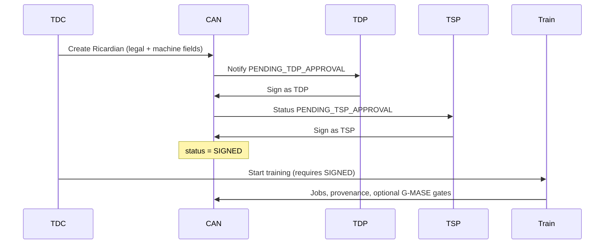

Most “AI collaboration” deals are a PDF plus hope. When something goes wrong—wrong dataset, wrong region, a model used beyond its purpose—the PDF does not stop a training job or prove what parties actually agreed.

**Confidential AI Network (CAN)** uses a **Ricardian contract**: one agreement that is **readable by lawyers and humans**, and **binding for the platform**—datasets, training parameters, environment, keys, and signatures—so training and inference only proceed under that state.

**Related:** [Contract → governed prediction]() · [Contract management — signing keys & verify]() · [Product tour]({{ '/product-tour/' | relative_url }}) · [Merkle / Auditor]() · [KMS DEK/MEK]() · [TEE attest → decrypt]() · In-repo: [RICARDIAN_CONTRACT_GUIDE.md](https://github.com/gitmujoshi/Confidential-AI-Network/blob/main/docs/contracts/RICARDIAN_CONTRACT_GUIDE.md)

> **Status:** Creating, previewing, multi-party signing, and **SIGNED → train** gates are live on the local stack. Treat on-chain deploy and some signature crypto as **demo / Phase 1** (see §8). Cloud clean-room key release remains [Phase 2 in the TEE narrative]().

---

## 1. What “Ricardian” means here

Ian Grigg’s Ricardian idea (simplified): a contract should be **one document** that:

1. Humans can read (legal prose, parties, obligations).  
2. Machines can hash and reference without ambiguity.  
3. Signatures bind parties to **that** exact document—not a vague “we agreed somehow.”

In CAN’s glossary: *human-readable legal terms bound to a machine-enforceable structure* (datasets, training params, privacy, clean-room host).

```text
Legal prose  ──hash──►  legalDocumentHash  ──bound to──►  Contract row
     ▲                                                      │
     │                                                      ▼
Human review / signatures                         Runtime gates (train / infer)
```

Without the machine side, you have an NDA. Without the legal side, you have opaque JSON. Ricardian is the bridge.

---

## 2. The dual layer in CAN

| Layer | Fields | Purpose |
| --- | --- | --- |
| **Legal** | `legalDocument` (JSONB) | Title, parties, recitals, terms, accumulated `signatures[]` |
| **Binding digests** | `legalDocumentHash`, `ricardianSignature` | Commit to the document bytes; platform-level binding marker |
| **Machine / execution** | `contractDatasets`, `aiModelIds`, `trainingParams`, `environmentSpecs`, `kmsConfigs`, `tspCloudProvider`, party ids | What training and policy gates actually read |

Creation (simplified):

1. TDC runs the wizard → `POST /api/contracts/ricardian`.  
2. Service **generates** `legalDocument` from a template (`AI_TRAINING` or `BASIC`).  
3. Canonical JSON → **SHA-256** → `legalDocumentHash` (`0x…`).  
4. Platform records `ricardianSignature` over that hash (see honesty note in §8).  
5. Optional smart-contract address (real chain if configured; otherwise **mock**).  
6. Persist `Contract` at **`PENDING_TDP_APPROVAL`** and notify linked TDPs.

Screens: [product tour — contract create & sign]({{ '/product-tour/' | relative_url }}#local).

---

## 3. Who the parties are

| Role | In the contract | What they do |
| --- | --- | --- |
| **TDC** | Training Data Consumer | Creates the Ricardian contract; selects datasets & catalog model; starts training after **SIGNED** |
| **TDP** | Training Data Provider | Owns data; reviews terms; **signs** to approve use |
| **TSP** | Tech Service Provider (formerly CCRP) | Hosts the environment (Local Docker today; cloud confidential compute in design); **signs** as assigned host |
| **Auditor** | Not a party | Read-only: Merkle tree + contract review when a model is disputed ([Auditor role](https://github.com/gitmujoshi/Confidential-AI-Network/blob/main/docs/features/AUDITOR_ROLE.md)) |

Design roots sit with iSPIRT [DEPA](https://depa.world)—consent-style, multi-party sharing with identifiers (**DEPA IDs**) on parties, datasets, contracts, and jobs.

---

## 4. Lifecycle: from draft intent to enforced runtime



### 4.1 Create (TDC)

Five-step UI (`CreateRicardianContract`):

1. Template  
2. Details & dataset selection (1–3 datasets)  
3. Environment & TSP (compute, security, KMS refs)  
4. Review generated legal document  
5. Submit  

### 4.2 Sign (TDP → TSP)

- **TDP** signs via `POST /api/contracts/:id/sign` with `partyType=TDP` → moves toward TSP approval.  
- **TSP** (assigned `tspId`) signs → status becomes **`SIGNED`**.  
- Each approval appends to `legalDocument.signatures[]` and writes a best-effort **SCITT** claim (`contract_approval`).

**Runtime note:** The training gate today requires **`status === 'SIGNED'`** (reached when TSP completes). A separate `tdcSigned` column exists on the model; do not assume every UML “all three parties must sign” path is what the local trainer enforces. Prefer the live path above.

### 4.3 Train and infer

- **Train:** `tdcTrainingExecutionService` refuses jobs unless the contract is **SIGNED** (and env / cloud / privacy constraints are present).  
- **Infer:** Deployed models stay tied to the training `contractId`; Open-GMASE can gate deploy/predict via package `open_gmase/can_contracts` ([demo slice]()).

No signature → no training. That is the product claim that replaces “we emailed a Word doc.”

---

## 5. What the machine side binds

These fields are not decoration—they are what jobs and gates consume:

| Binding | Contract fields | Examples |
| --- | --- | --- |
| **Data** | `contractDatasets`, primary dataset ids | Which TDP catalogs are in scope (max 1–3) |
| **Model** | `aiModelIds` | Catalog base model (e.g. DistilBERT for NLP tours) |
| **Training rules** | `trainingParams` | Epochs, DP (`epsilon`/`delta`), accuracy floors, run limits |
| **Environment** | `environmentSpecs` | Instance shape, `security.attestationRequired`, encryption, network isolation |
| **Keys** | `kmsConfigs` (often from wizard `environmentSpecs.kms`) | Provider, key id / Vault OCID, region — see [KMS post]() |
| **Where it runs** | `tspId`, `tspCloudProvider` | Local, OCI, Azure, … |

Wizard defaults lean secure: attestation required, encryption at rest/in transit, network isolation—even when the local trainer is Docker rather than a hardware TEE.

---

## 6. How the contract shows up in evidence

When a model misbehaves, the contract is the spine of the audit story:

| Evidence path | Contract role |
| --- | --- |
| **Provenance report** | Exposes `legalDocumentHash`, `ricardianSignature`, parties, jobs |
| **Auditor Merkle tree** | **contract** leaf commits to hash, signature, env specs, training params, datasets ([Merkle post]()) |
| **SCITT claims** | `contract_creation` / `contract_approval` markers |
| **Open-GMASE** | OPA input includes `contract_id`, `contract_status`, classification / region hints from the contract |

Auditors do **not** use the Ricardian text to prove the model was “correct.” They use it to prove **which agreement governed the run**, then Verify Merkle inclusion for that trail.

---

## 7. Why this is better than “PDF + NDA”

| Approach | Stops unauthorized train? | Tamper-evident? | Ties artifact to terms? |
| --- | --- | --- | --- |
| PDF in email | No | No | Manual at best |
| Checkbox ToS in UI | Soft | Usually not | Weak |
| **CAN Ricardian** | Yes — status gate | Hash + signatures + SCITT/Merkle path | Job and model carry `contractId` |

That is the DEPA-shaped idea applied to AI training: **use is licensed by agreement**, not by whoever has a copy of the CSV.

---

## 8. Honest limits (Phase 1)

| Topic | Reality today |
| --- | --- |
| **`ricardianSignature`** | Platform binding digest for demos—not full multi-party ECDSA / cloud KMS signing of the legal hash (target for GA IdP + KMS). Deep dive: [Contract management — signing & verify]() |
| **On-chain deploy** | Real only if blockchain is enabled and available; otherwise **mock** network/address |
| **TDC signature** | Model supports `tdcSigned`; **SIGNED** for training is driven by the **TSP** completing the current flow |
| **Templates** | Built-in `AI_TRAINING` / `BASIC`; rich clause libraries / customer templates are not a finished product surface |
| **TEE / key release** | Contract can *require* attestation; local Docker is not hardware TEE—see [TEE post]() |
| **Naming** | Runtime prefers **TSP**; older templates/DB columns may still say **CCRP** |

Use the same honesty bar as the KMS/TEE/Merkle posts: ship the governance UX, say clearly what crypto and cloud isolation still mean “target.”

---

## 9. Takeaways

1. A **Ricardian contract** in CAN is legal prose **plus** hashed binding **plus** machine fields the runtime enforces.  
2. Lifecycle: **create → TDP sign → TSP sign → SIGNED → train/infer**.  
3. Machine bindings (`datasets`, `trainingParams`, `environmentSpecs`, `kmsConfigs`, cloud) are first-class—not footnotes.  
4. Provenance, Merkle, SCITT, and Open-GMASE all hang off the **same contract id**.  
5. Ask vendors for the hash, the signature trail, and the **SIGNED** gate—not a PDF alone.

**One sentence:** CAN’s Ricardian contract is how multi-party AI collaboration becomes enforceable state instead of an email attachment—readable by people, hashed for integrity, and checked before training runs.
