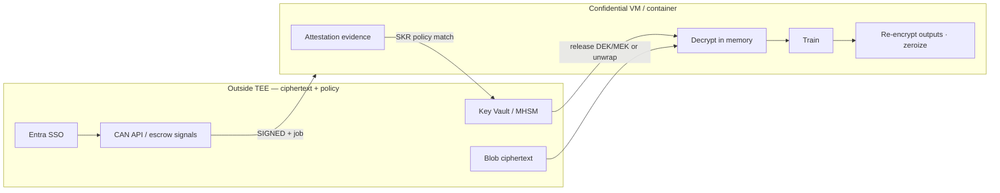
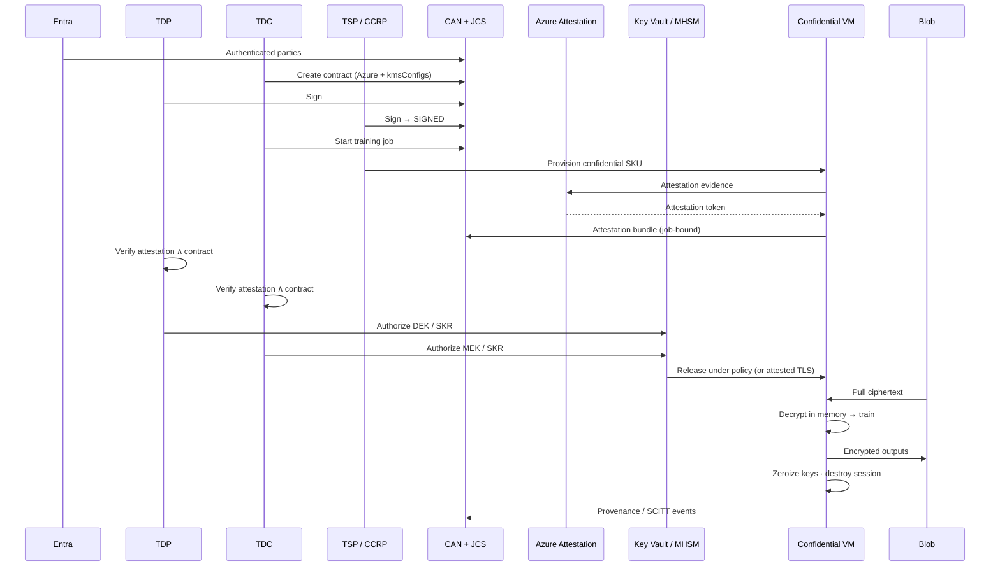

*On Azure, “confidential training” is not a checkbox on a VM SKU. It is a threat model, a key custody story, an attestation policy, and a destroy path—bound to a signed Ricardian contract.*

**Related:** [Product tour]({{ '/product-tour/' | relative_url }}) · [Azure GA deck]() · [KMS DEK/MEK]() · [TEE attest → decrypt]() · [Entra architecture note]() · In-repo: [AZURE_SECURITY_ARCHITECTURE.md](https://github.com/gitmujoshi/Confidential-AI-Network/blob/main/docs/production/AZURE_SECURITY_ARCHITECTURE.md) · [AZURE_FEATURES_AND_CONFIGURATION.md](https://github.com/gitmujoshi/Confidential-AI-Network/blob/main/docs/deployment/AZURE_FEATURES_AND_CONFIGURATION.md)

> **Honesty first:** The [local Docker product tour]({{ '/product-tour/#local' | relative_url }}) proves contracts → train → infer → Auditor on a laptop. That path is **not** a hardware TEE. Azure confidential compute + **Secure Key Release (SKR)** is the **production target** for CAN clean rooms. Today: Key Vault refs and ACI/AKS job scaffolding are **Partial**; attestation is often **simulated** in JCS; DCsv3 / confidential containers + real SKR are **Design / Phase 3**.

---

## 1. What Azure must prove for CAN

Boards ask four questions on Azure:

1. Can Microsoft operators, or our TSP/CCRP operators, read dataset or model plaintext?  
2. Can the CAN control plane (Node API) ever hold DEK/MEK?  
3. What evidence shows *this* job ran in *this* attested environment under *this* contract?  
4. What happens when escrow times out or attestation fails?

CAN’s Azure answer is layered:

| Layer | Azure building block | CAN rule |
| --- | --- | --- |
| Human identity | Microsoft Entra ID + Conditional Access | No Keycloak in Azure RGs |
| App / party roles | Entra app roles / groups (`TDC` · `TDP` · `TSP`/`CCRP` · `AppAdmin` · `Auditor`) | Least privilege on APIs |
| Ciphertext store | Blob (private endpoints; CMK from Key Vault) | Ciphertext only outside TEE |
| Platform secrets | Azure Key Vault | Ops secrets ≠ DEK/MEK |
| Principal keys | Customer Key Vault / MHSM + SKR or attested TLS | Platform never plaintext DEK/MEK |
| Clean room | Confidential VM (e.g. DCsv3 / SEV-SNP) or confidential containers | Decrypt in memory only |
| Evidence | Azure Attestation + SCITT / provenance / Merkle | Job-bound audit trail |

Microsoft docs worth keeping open: [Azure Attestation](https://learn.microsoft.com/azure/attestation/) · [Secure Key Release overview](https://learn.microsoft.com/azure/key-vault/managed-hsm/secure-key-release-overview) · [Azure Key Vault](https://learn.microsoft.com/azure/key-vault/).

---

## 2. Threat model (Azure clean-room training)

### 2.1 Assets

| Asset | Sensitivity | Where it should live |
| --- | --- | --- |
| Dataset plaintext | Critical | TEE memory only, job window |
| Base-model / weights plaintext | Critical | TEE memory only, job window |
| **DEK** / **MEK** | Critical | Principal custody → released into TEE (never Node) |
| Contract terms + signatures | High | App DB + optional SCITT; signing keys → Key Vault/MHSM target |
| Blob ciphertext | High | Private Blob + CMK |
| Portal / API tokens | High | Entra; short-lived |
| Infra secrets (DB, TLS) | High | Platform Key Vault |

### 2.2 Adversaries (what we design against)

| Adversary | Goal | Primary controls |
| --- | --- | --- |
| **Curious cloud admin / host hypervisor** | Read guest memory / disks | Confidential VM memory encryption (e.g. AMD SEV-SNP); no plaintext on disk |
| **Malicious or compromised TSP/CCRP operator** | Exfiltrate via logs, sidecars, mis-SKU | Attestation policy + SKR; fail closed if measurement wrong; no long-lived keys in pods |
| **Compromised CAN control plane** | Steal keys via API | Node accepts **signals** / wrapped material only—**rejects raw DEK/MEK bytes** |
| **Rogue party / insider TDC or TDP** | Train outside agreement | Contract **SIGNED** gate; Open-GMASE side-effect deny; purpose / region bindings |
| **Network attacker** | Intercept keys or ciphertext | Private endpoints, TLS, no public DB/Blob |
| **Replay / confused deputy** | Reuse old attestation or job id | Fresh quotes; job-bound escrow deadline; destroy on expiry |

### 2.3 What confidential computing does *not* cover

- It does **not** make bad contract terms safe.  
- It does **not** prove the model is fair, accurate, or free of poisoning (see Auditor / Merkle for *lineage*, not ethics).  
- It does **not** replace Entra MFA, WAF, or network segmentation.  
- Local Docker demos deliberately sit **outside** this threat model—label them as UX, not TEE.



---

## 3. Azure Key Vault layout for CAN

Do not collapse every secret into one vault key. Separate **infra**, **signing**, and **principal crypto**.

| Class | Example name pattern | Content | Who uses it |
| --- | --- | --- | --- |
| Platform secrets | `can-{env}-db-connection`, Entra client secret | Ops | Backend MSI / External Secrets |
| Blob / PG CMK | env-scoped CMK | Disk/object encryption | Storage / PostgreSQL |
| Signing (target) | `can-{env}-user-sign-{depaId}` | Party signing key in HSM | Sign via KV crypto ops; DB stores key id + public only |
| Wrap / KEK (optional) | Customer or platform wrap key | Wrap session material | Never a substitute for principal DEK/MEK |
| Principal DEK/MEK | In **customer** vault / MHSM or client HSM | Dataset / model keys | Released only under attestation + contract |

Contract JSON `kmsConfigs` should bind the Azure path parties expect, for example:

| Field | Example | Role |
| --- | --- | --- |
| `provider` | `AZURE_KEY_VAULT` / MHSM | Which key service |
| `vaultUrl` | `https://….vault.azure.net/` | Vault URI |
| `keyId` / key name | env-scoped | Key reference principals agreed |
| Region / residency | contract `environmentSpecs` | Binding for audit |

**Maturity:** configs are persisted today; training does not yet fully enforce live Key Vault calls on every path. Treat live resolve-at-train as a go-live checklist item ([features catalog](https://github.com/gitmujoshi/Confidential-AI-Network/blob/main/docs/deployment/AZURE_FEATURES_AND_CONFIGURATION.md)).

---

## 4. Secure Key Release (SKR) policy

[Secure Key Release](https://learn.microsoft.com/azure/key-vault/managed-hsm/secure-key-release-overview) is Azure’s way to say: *this HSM-backed key may be released only to a workload that presents attestation claims matching a release policy*.

For CAN, SKR is the Azure-native twin of “attested TLS delivery of DEK/MEK into the TEE.”

### 4.1 Policy intent (what the policy should encode)

A useful SKR / attestation policy for a CAN job asserts roughly:

| Claim | Why |
| --- | --- |
| Confidential compute SKU / TEE type | Not a normal node pool pretending to be clean |
| Measurement / image / signer claims | Trainer image matches what parties approved |
| Attestation authority | Azure Attestation (or agreed authority) |
| Optional: environment / geography | Residency bindings from the contract |
| Optional: workload identity | MSI / federated identity that may request release |

If claims fail → **no key**. Fail closed.

### 4.2 How SKR fits dual-key escrow

CAN still needs **both** DEK and MEK (TDP + TDC). SKR does not remove dual-key escrow; it hardens *how* each key (or a wrap key) leaves the HSM:

```text
Contract SIGNED
  → CCRP provisions confidential environment
  → TEE obtains attestation token (Azure Attestation)
  → Escrow OPEN (deadline)
  → TDP path: DEK (or wrap) released only if SKR/attestation policy OK
  → TDC path: MEK (or wrap) released only if SKR/attestation policy OK
  → BOTH_READY → decrypt in memory → train
  → Re-encrypt outputs · zeroize · DESTROY
```

**Alternate delivery:** principals push DEK/MEK over **attested TLS** into the TEE without SKR, still never through the Node API. SKR is preferred when keys live in Azure Managed HSM / Key Vault with release policy.

### 4.3 Anti-patterns

| Anti-pattern | Why it fails the threat model |
| --- | --- |
| Release key to AKS pod without confidential SKU | Host admin / node compromise reads key |
| Same SKR policy for all contracts | Cross-job / cross-tenant confused deputy |
| Log attestation tokens or key material | Sentinel gold for attackers |
| Soft-fail attestation “for demo” in prod | Converts TEE into theater |

---

## 5. End-to-end training on Azure

Two flows share the same product UX; only the **crypto boundary** differs.

### 5.1 Flow A — Portal train on Azure compute (Phase 1 pilot)

Stakeholder path aligned with the [Azure GA deck]():

```text
Entra SSO (MSAL) → Portal + APIM JWT
  → TDP publishes dataset (ciphertext preferred; demo clear only in non-prod)
  → TDC creates Ricardian contract (Azure env + Key Vault kmsConfigs)
  → TDP then TSP/CCRP sign
  → Optional SCITT claim
  → TDC starts training (ACI / AKS Job target)
  → Register artifact → deploy → predict (Open-GMASE gate when wired)
  → Auditor: Merkle tree + contract review
```

| Step | Azure control | Status |
| --- | --- | --- |
| Login | Entra + Conditional Access | Design → GA |
| Roles | Entra app roles | Design |
| Sign | Authz + Key Vault–backed keys (target) | Partial / Design |
| Train | ACI / AKS Job / later DCsv3 | Partial scaffolding |
| Artifacts | Private Blob + CMK | Design |

Use this when you need Azure tenancy smoke without claiming full TEE custody yet—and **say so**.

### 5.2 Flow B — Dual-key escrow → confidential clean room (production target)



Same story as the multi-cloud [TEE post](), with Azure-specific roots of trust (Attestation + SKR).

### 5.3 Provenance events GRC should expect

- Contract signed (parties, hash, Key Vault refs)  
- Job created (bound to `contractId`)  
- Attestation presented / verified  
- DEK released · MEK released (signals and/or SKR audit)  
- Training started / completed / failed  
- Session destroyed / keys zeroized  
- Optional SCITT receipt + Auditor Merkle inclusion  

Timeout without both keys → **EXPIRED / DESTROYED**, not “retry forever with soft keys.”

---

## 6. Maturity matrix (say this in demos)

| Capability | Local Docker tour | Azure Phase 1 | Azure CAN prod |
| --- | --- | --- | --- |
| Entra SSO | Keycloak | Required | Required |
| Contract → SIGNED → train UX | **Live** | Live / pilot | Live |
| Key Vault for infra secrets | N/A / local | Partial | Required |
| Signing keys in HSM | No | Design | Required |
| DEK/MEK principal custody | Partial | Design | Required |
| Dual-key escrow signals | MVP | Wire to Azure CCR | Required |
| Azure Attestation + SKR | No | Design | Required |
| Confidential VM / container train | **No** | Spike | Required for CAN claims |
| Auditor Merkle review | **Live** | Live | Live |

---

## 7. Operator checklist (crypto go-live)

- [ ] Signing keys off DB plaintext → Key Vault / MHSM; verify on sign  
- [ ] Blob containers **ciphertext only**; CMK on  
- [ ] DEK/MEK never logged; Node rejects raw key material  
- [ ] Confidential SKU + attestation policy + SKR (or attested TLS) for CCR path  
- [ ] Escrow timeout destroys compute; alert on late key attempts  
- [ ] Provenance/SCITT for signed → attested → released → started → completed → destroyed  
- [ ] No Keycloak in Azure resource groups  

Full architecture and RBAC tables: [AZURE_SECURITY_ARCHITECTURE.md §16](https://github.com/gitmujoshi/Confidential-AI-Network/blob/main/docs/production/AZURE_SECURITY_ARCHITECTURE.md).

---

## 8. Takeaways

1. **Threat model first** — confidential SKUs defeat host memory snooping; they do not replace contract gates or Entra.  
2. **Key Vault is layered** — platform secrets, CMK, signing HSM, and principal DEK/MEK are different jobs.  
3. **SKR is policy-as-key-custody** — release only to attested measurements the contract allows.  
4. **E2E train on Azure** = Entra → SIGNED contract → attested environment → dual-key release → decrypt-in-memory → zeroize → provenance.  
5. **Label demos correctly** — Local product tour = runnable UX; this post = Azure confidential target.

**One sentence:** On Azure, CAN treats training as decrypt-in-enclave under Entra identity, Key Vault custody, and Secure Key Release / attestation policy—never as “trust the TSP’s disk.”
