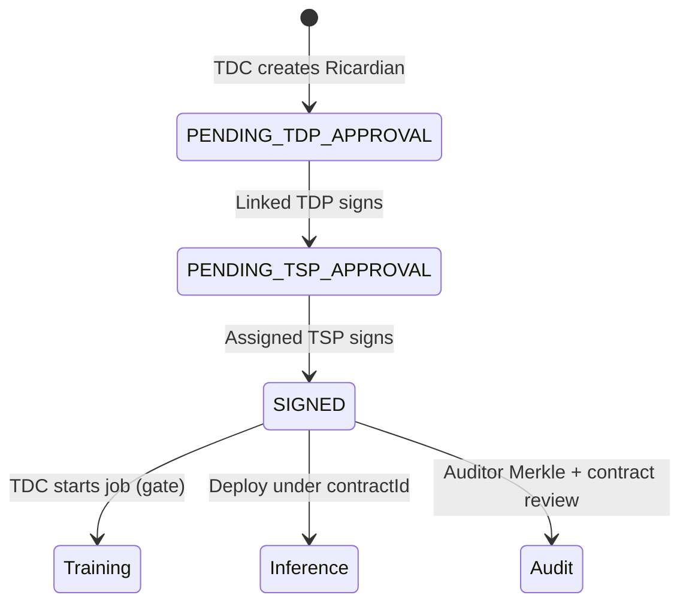
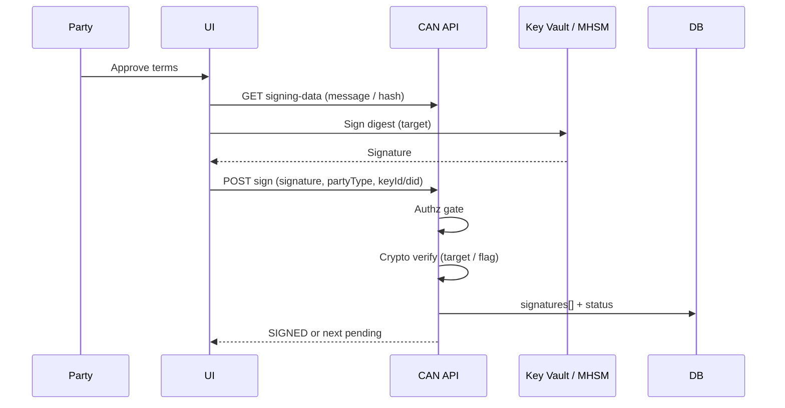

*Contracts in CAN are not “upload a PDF.” They are lifecycle state: create → party signs → **SIGNED** → train may start. Signing keys are a separate custody story from DEK/MEK.*

**Related:** [Ricardian contracts]() · [Contract → prediction]() · [KMS DEK/MEK]() · [Azure CC / Key Vault]() · [Merkle / Auditor]() · [Product tour]({{ '/product-tour/' | relative_url }}) · In-repo: [CONTRACT_SIGNING_TECHNICAL_REFERENCE.md](https://github.com/gitmujoshi/Confidential-AI-Network/blob/main/docs/features/contract-signing/CONTRACT_SIGNING_TECHNICAL_REFERENCE.md) · [CONTRACT_SIGNING_USER_GUIDE.md](https://github.com/gitmujoshi/Confidential-AI-Network/blob/main/docs/features/contract-signing/CONTRACT_SIGNING_USER_GUIDE.md)

> **Honesty first:** Multi-party **authorization** to sign (who may flip `tdpSigned` / `tspSigned` and reach `SIGNED`) is **live**. Full **cryptographic verification** of party signatures against HSM-backed keys is **target** (`SIGNING_REQUIRE_CRYPTO_VERIFY` / Key Vault). The main Contract Detail UI often submits a hash or placeholder as `signature`. Treat DEK/MEK (data/model encryption) as a **different** key class from **party signing keys**.

---

## 1. Two key classes (do not conflate)

| Key class | Purpose | Owner | Lives where (target) |
| --- | --- | --- | --- |
| **Party signing key** | Bind a human/org to the Ricardian agreement | Each party (TDC / TDP / TSP) | Key Vault / MHSM (or client wallet); public material in app |
| **DEK** | Encrypt dataset ciphertext | **TDP** | Customer vault / HSM → TEE only after attestation |
| **MEK** | Encrypt base model ciphertext | **TDC** | Same pattern |

Signing keys answer: *Did this party approve **these** terms?*  
DEK/MEK answer: *May plaintext exist in the clean room for this job?*

Mixing them in one “KMS” slide confuses CISOs.

---

## 2. Contract management lifecycle



| Stage | What happens | Primary APIs / artifacts |
| --- | --- | --- |
| **Create** | Wizard → legal template + machine bindings → `legalDocumentHash` | `POST /api/contracts/ricardian` |
| **Notify** | Linked TDPs / assigned TSP get signature requests | Notifications |
| **Sign** | Party posts signature payload; status advances | `GET …/signing-data` · `POST …/sign` |
| **SIGNED** | Training allowed | `status === 'SIGNED'` (TSP completion in current flow) |
| **Evidence** | SCITT `contract_approval`, Merkle **contract** leaf, provenance | Auditor UI |

Human-readable terms + machine fields are covered in the [Ricardian post](). This post focuses on **keys, sign, and verify**.

---

## 3. How party signing keys are managed today

### 3.1 Data model

Keys are stored as **`UserKey`** rows (`user_keys`):

| Field | Role |
| --- | --- |
| `userId` | Party user who owns the key |
| `keyId` | Unique key id |
| `keyType` | e.g. `ECDSA-P256`, `RSA-2048`, `RSA-4096` |
| `publicKey` | PEM / JWK — what verifiers should use |
| `privateKey` | Optional TEXT — **should not** be platform plaintext in prod |
| `keyStatus` | `active` / `inactive` / `revoked` / `expired` |

APIs under `/api/signing` (authenticated):

| Endpoint | Behavior |
| --- | --- |
| `GET /api/signing/keys` | List active keys (metadata; not private material in list) |
| `POST /api/signing/keys/generate` | Generate pair via `keyManagementService`; persist key metadata |
| `POST /api/signing/keys/import` | Import key material / public |
| Events | `SigningEvent` rows for generate / import / use |

Config is env-driven (`KEY_ALGORITHMS`, `DEFAULT_KEY_ALGORITHM`, `KEY_ID_PREFIX`, …). The service can encrypt private PEM with a password helper; production design is **not** “store raw PEM forever in Postgres.”

### 3.2 What the live Contract Detail path actually does

On the primary UI path (`ContractDetail`):

1. `GET /api/contracts/:id/signing-data` → builds a **message** and **SHA-256 `contractHash`**.  
2. UI sets `signature` to that hash **or** a `ui-{party}-…` placeholder.  
3. `POST /api/contracts/:id/sign` with `{ signature, partyType, did?, walletAddress? }`.  
4. Backend checks **auth**: JWT party type, linked TDP / assigned TSP (`contractSigningGate`).  
5. Appends entry to `legalDocument.signatures[]`, sets `tdpSigned` / `tspSigned`, advances status.  
6. Best-effort SCITT `contract_approval` claim.

So today the gate that matters for training is: **authenticated party allowed to sign + status machine**. It is **not** yet “ECDSA verify over `legalDocumentHash` with Key Vault key, fail closed.”

### 3.3 Richer signing surfaces (partial)

There are additional components (`ContractSigning`, DID modal, `es256sign.js` WebCrypto, `/api/signing/sign`) aimed at stronger crypto/DID flows. Treat them as **available scaffolding**, not as “every product-tour click is HSM-verified.”

---

## 4. Sign authorization (what is enforced)

```text
Authenticated user
  → partyType must match claimed partyType (rolesAllowSigning)
  → TDP: must be linked dataset owner (unless AppAdmin)
  → TSP: must be contract.tspId (unless AppAdmin)
  → Append legalDocument.signatures[]
  → TDP → PENDING_TSP_APPROVAL (typical)
  → TSP → SIGNED
```

**Runtime note:** Training checks **`status === 'SIGNED'`**, reached when the **assigned TSP** completes the current flow. A `tdcSigned` column may exist; do not assume “all three roles must crypto-sign” is what local train enforces. Prefer the live path above ([Ricardian §4.2]()).

**Auditor** never signs — read-only Merkle + contract review.

---

## 5. Verification — today vs target

### 5.1 Today

| Check | Status |
| --- | --- |
| Role / linkage authz on `POST …/sign` | **Met** |
| Persist signature blob + metadata | **Met** (in `legalDocument.signatures`) |
| `verifyDIDSignature` helper (`didService.verifySignature`) | **Exists** — **not wired** into the main sign route |
| `SIGNING_REQUIRE_CRYPTO_VERIFY` / `SIGNING_REQUIRE_DID_VERIFY` | Documented for prod; examples often `false` until Key Vault signing ships |
| Independent re-verify of all signatures before train | **Not** the hard gate today — **status** is |

### 5.2 Target (Azure / enterprise)

| Step | Behavior |
| --- | --- |
| Generate | Create ECDSA/RSA key in **Key Vault / Managed HSM**; app DB stores **key id + public only** |
| Sign | Client or backend calls Key Vault **sign** over a stable message (ideally digest of `legalDocumentHash` + party + nonce) |
| Verify | On `POST …/sign` (and optionally at train start): verify signature with public key / DID document; fail closed if flags on |
| Audit | SCITT claim + Merkle contract leaf include hash + signature metadata |

Naming pattern (Azure): `can-{env}-user-sign-{depaId}` — see [Azure security architecture §16.4](https://github.com/gitmujoshi/Confidential-AI-Network/blob/main/docs/production/AZURE_SECURITY_ARCHITECTURE.md).



---

## 6. What “verification” means for auditors

| Question | Mechanism |
| --- | --- |
| Was this party allowed to approve? | Authz + linkage at sign time |
| What exact legal bytes? | `legalDocumentHash` |
| Who recorded approval? | `legalDocument.signatures[]` + SCITT `contract_approval` |
| Is the hash in the audit tree? | Auditor **Verify** = Merkle **inclusion** under published root — not “model was ethical” ([Merkle post]()) |
| Was the ECDSA/DID signature valid? | **Target** crypto verify; do not overclaim Phase 1 UI |

---

## 7. Maturity matrix

| Capability | Local demo today | Azure / prod target |
| --- | --- | --- |
| Create Ricardian + hash | Live | Live |
| Multi-party sign → SIGNED | Live (authz) | Live + crypto verify |
| Party keys in `UserKey` | Live (public / partial private) | Key id + public only |
| Private key in Postgres | Gap / demo risk | **Forbidden** — HSM only |
| WebCrypto / DID verify on sign | Partial / not main UI | Required when claimed |
| Key Vault sign ops | Design | Required |
| Train gated on SIGNED | Live | Live |
| DEK/MEK escrow | Separate path | Separate path + SKR |

---

## 8. Operator checklist (signing go-live)

- [ ] `SIGNING_KEY_BACKEND=azure-keyvault` (or MHSM); no private PEM in DB  
- [ ] `SIGNING_REQUIRE_CRYPTO_VERIFY=true`  
- [ ] `SIGNING_REQUIRE_DID_VERIFY=true` when DID is present  
- [ ] Sign message binds **`legalDocumentHash`** (not only a timestamp string)  
- [ ] Train start optionally re-checks signature set / status  
- [ ] Pen test: forged signature blob with wrong role / wrong party rejected  
- [ ] Keep DEK/MEK release APIs free of signing-key material and vice versa  

---

## 9. Takeaways

1. **Party signing keys** prove agreement; **DEK/MEK** unlock clean-room plaintext — different custody.  
2. **Contract management** is a state machine: create → TDP → TSP → **SIGNED** → train/infer/audit.  
3. **Today** the hard gate is **authenticated authorization + status**; stored “signatures” may be hashes/placeholders on the main UI path.  
4. **Target** is HSM/Key Vault sign + verify-on-submit (and optional verify-on-train), with public keys / DIDs in the app.  
5. Auditors verify **lineage under Merkle** and read the Ricardian; they do not get cryptographic signature verification until verify flags and Key Vault signing are enabled.

**One sentence:** CAN manages contracts as enforceable lifecycle state; party signing keys should live in Key Vault/HSM and be verified on sign—while today’s demos correctly gate training on who is allowed to mark the contract **SIGNED**.
