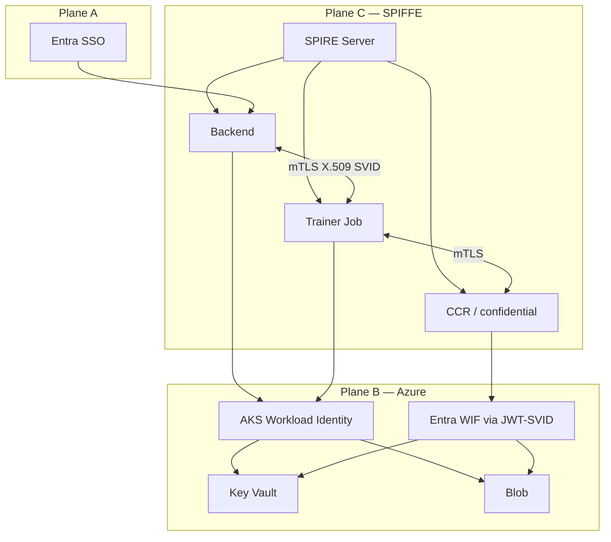

*Humans use Entra. Pods must not share a node’s credentials forever. Peers prove who they are with SPIFFE. Azure APIs get short-lived tokens—natively on AKS or by exchanging a SPIFFE JWT-SVID.*

**Related:** [Three identity planes]() · [SPIFFE on OCI]() · [Azure confidential computing]() · [Azure Entra architecture]() · [Contract signing keys]() · In-repo: [AZURE_SPIFFE_SPIRE_WIF.md](https://github.com/gitmujoshi/Confidential-AI-Network/blob/main/docs/deployment/AZURE_SPIFFE_SPIRE_WIF.md) · [Azure Terraform README](https://github.com/gitmujoshi/Confidential-AI-Network/blob/main/deployment/azure/terraform/README.md)

> **Status:** **Path N is in Terraform** (`enable_workload_identity`, default on): AKS OIDC issuer, user-assigned identities, federated credentials, Key Vault Secrets User + Blob Data Contributor for `backend` / `training-job` / `external-secrets`. **SPIRE** is scaffolded (`enable_spire` + Helm values)—full mesh and **Path F** (SPIFFE JWT → Entra) remain phased. Microsoft Path F tutorial: [Federate SPIFFE/SPIRE with Entra ID](https://learn.microsoft.com/entra/workload-id/workload-identity-federation-spiffe-spire).

---

## 1. The three planes on Azure (again)

| Plane | Mechanism | CAN use |
| --- | --- | --- |
| **Humans** | Microsoft Entra ID | Portal / API roles (TDC, TDP, TSP, …) |
| **Workloads → Azure APIs** | AKS Workload Identity **or** Entra WIF via SPIFFE JWT | Key Vault, Blob, ACR — no static SP secrets in pods |
| **Workload → workload** | SPIFFE/SPIRE X.509 SVID + mTLS | Backend ↔ trainer ↔ CAN escrow / CCR |

SPIFFE does **not** replace [TEE attestation / SKR]() for DEK/MEK release. It answers *which process*; the enclave answers *what hardware measurement*.

---

## 2. Two Azure paths

### Path N — native AKS Workload Identity (**IaC ready**)

```text
Pod SA → federated Entra identity → Azure RBAC → Key Vault / Blob
(+ later: SPIRE X.509 SVID for east-west mTLS)
```

Best for pods that stay on AKS and only need Azure APIs. Wired in `deployment/azure/terraform/modules/workload_identity`.

### Path F — SPIRE JWT → Entra federation (**design**)

```text
SPIRE JWT-SVID (aud = api://AzureADTokenExchange)
  → Entra federated identity credential (issuer = SPIRE OIDC, subject = exact SPIFFE ID)
  → Access token → Azure SDK (ClientAssertionCredential)
```

Best when the **same SPIFFE ID** must work off-cluster (CI, multi-cloud CCR) or you want one portable identity mapped into Entra.



---

## 3. SPIFFE IDs for CAN on Azure

Trust domain example: `spiffe://can.{env}.azure.example`

| Workload | Path example |
| --- | --- |
| Backend | `/ns/contract-management/sa/backend` |
| Training Job | `/ns/cms-training/sa/training-job` |
| CAN JCS | `/ns/cms-can/sa/can-jcs` |
| CCR agent | `/ns/cms-can/sa/can-ccr` |
| External Secrets | `/ns/external-secrets/sa/eso` |

**Prod rule:** Entra federated credential `subject` = **exact** SPIFFE ID — no wildcards.

---

## 4. What ships when

| Phase | Outcome |
| --- | --- |
| **Design** | This post + [AZURE_SPIFFE_SPIRE_WIF.md](https://github.com/gitmujoshi/Confidential-AI-Network/blob/main/docs/deployment/AZURE_SPIFFE_SPIRE_WIF.md) |
| **Path N (done)** | AKS OIDC + UAMI + FIC + KV/Blob RBAC — `enable_workload_identity` |
| **Key Vault + Blob (done)** | `enable_key_vault` / `enable_storage` (default on) |
| **SPIRE scaffold (partial)** | `enable_spire` + `deployment/azure/helm/spire/values.yaml` |
| **Path F** | SPIRE OIDC Discovery + Entra FICs for SPIFFE subjects |
| **CCR + SKR** | Session IDs bound to Attestation / Secure Key Release |

Local Docker still has no hardware SPIRE story. Azure pilot can claim **Path N short-lived cloud access** without claiming a full SPIFFE mesh.

---

## 5. Takeaways

1. **Entra for people; SPIFFE for peers; AKS WI / Entra WIF for Azure APIs.**  
2. Prefer **Path N** on AKS (now in TF); use **Path F** for portable / off-cluster SPIFFE.  
3. **Exact** SPIFFE subjects on federated credentials.  
4. Pair with **Attestation + SKR** for DEK/MEK — SPIFFE alone is not a clean-room.  
5. Apply with [Azure Terraform README](https://github.com/gitmujoshi/Confidential-AI-Network/blob/main/deployment/azure/terraform/README.md); optional SPIRE via Helm after `enable_spire=true`.

**One sentence:** On Azure, CAN’s Zero Trust plan is SPIRE for east-west identity and either AKS Workload Identity or SPIFFE→Entra token exchange for northbound cloud APIs—never long-lived keys in the training pod.
