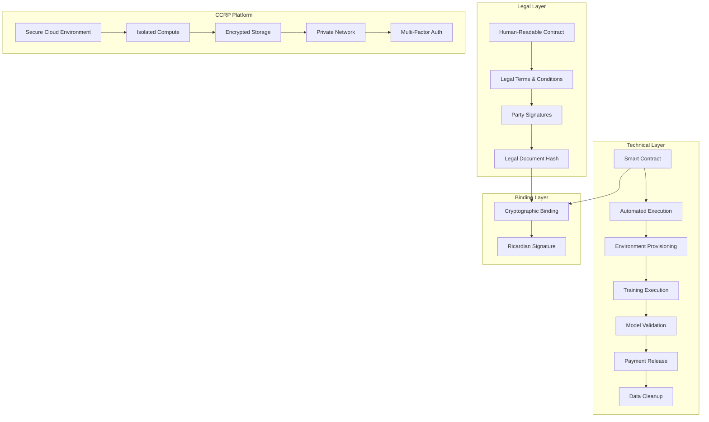
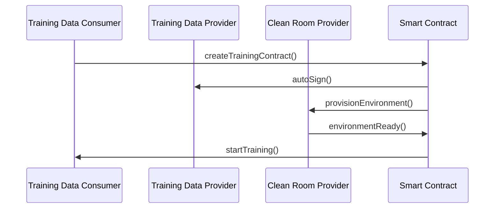
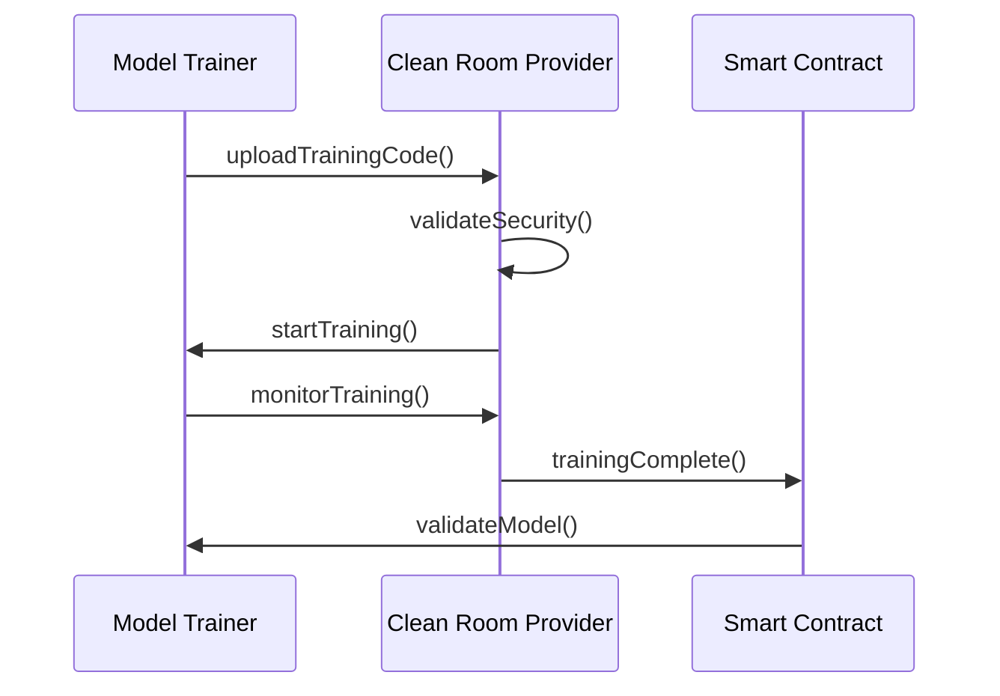
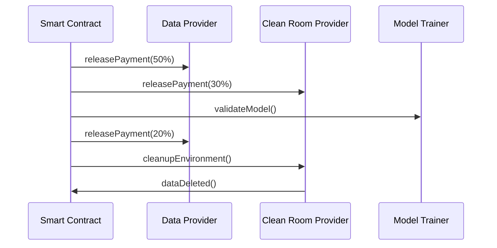

# AI Training Ricardian Contract Implementation Guide

## Overview

This guide demonstrates how to implement **Ricardian Contracts** specifically for **AI model training on private and confidential data** using CCRP (Confidential Clean Room Provider) cloud platforms. The Ricardian pattern combines human-readable legal documents with machine-executable smart contracts, creating a legally enforceable framework for sensitive AI training operations.

## Key Benefits for AI Training

### 1. **Legal Enforceability**
- Human-readable legal terms that courts can interpret
- Machine-executable smart contracts for automated enforcement
- Cryptographic binding between legal document and smart contract

### 2. **Privacy and Security**
- Detailed security specifications for training environments
- Compliance with healthcare regulations (HIPAA, DPDP 2023)
- Automated data deletion and environment cleanup

### 3. **Multi-Party Coordination**
- Clear roles: Data Provider, Model Trainer, CCRP
- Automated workflow execution
- Transparent audit trail

## Implementation Architecture



## Contract Structure

### 1. **Legal Document Components**

#### Party Definitions
```json
{
  "dataProvider": {
    "role": "DATA_PROVIDER",
    "dataOwnership": "ORIGINAL_OWNER",
    "certifications": ["MEDICAL_LICENSE_VERIFIED"]
  },
  "modelTrainer": {
    "role": "MODEL_TRAINER", 
    "expertise": "MACHINE_LEARNING",
    "certifications": ["AI_ETHICS_CERTIFIED"]
  },
  "ccrp": {
    "role": "CONFIDENTIAL_CLEAN_ROOM_PROVIDER",
    "certifications": ["ISO_27001", "SOC_2", "HIPAA", "GDPR"]
  }
}
```

#### Training Environment Specifications
```json
{
  "infrastructure": {
    "compute": {
      "type": "DEDICATED_SERVERS",
      "gpu": "8x NVIDIA A100 (80GB each)",
      "isolation": "PHYSICAL_SEPARATION"
    },
    "security": {
      "encryption": "AES-256-XTS",
      "authentication": "MULTI_FACTOR_AUTH",
      "monitoring": "24X7_SURVEILLANCE"
    }
  }
}
```

### 2. **Smart Contract Functions**

#### Environment Provisioning
```solidity
function provisionEnvironment(
    uint256 contractId, 
    EnvironmentConfig memory config
) external onlyCCRP {
    require(contracts[contractId].status == ContractStatus.ACTIVE);
    
    // Validate environment specifications
    require(config.securityLevel >= MINIMUM_SECURITY_LEVEL);
    require(config.isolationType == ISOLATION_PHYSICAL);
    
    // Provision secure environment
    contracts[contractId].environmentProvisioned = true;
    contracts[contractId].environmentConfig = config;
    
    emit EnvironmentProvisioned(contractId, config);
}
```

#### Training Execution
```solidity
function startTraining(
    uint256 contractId,
    TrainingConfig memory config
) external onlyModelTrainer {
    require(contracts[contractId].environmentProvisioned);
    require(contracts[contractId].dataTransferred);
    
    // Validate training parameters
    require(config.privacyTechniques.length > 0);
    require(config.targetAccuracy >= 0.95);
    
    contracts[contractId].trainingStarted = true;
    contracts[contractId].trainingConfig = config;
    
    emit TrainingStarted(contractId, config);
}
```

#### Model Validation
```solidity
function validateModel(
    uint256 contractId,
    ModelMetrics memory metrics
) external onlyModelTrainer {
    require(contracts[contractId].trainingStarted);
    
    // Validate against agreed metrics
    require(metrics.accuracy >= contracts[contractId].targetAccuracy);
    require(metrics.precision >= 0.90);
    require(metrics.recall >= 0.90);
    
    contracts[contractId].modelValidated = true;
    contracts[contractId].modelMetrics = metrics;
    
    emit ModelValidated(contractId, metrics);
}
```

## CCRP Platform Integration

### 1. **Environment Specifications**

#### Compute Resources
- **Dedicated Servers**: Physical isolation from other tenants
- **GPU Configuration**: 8x NVIDIA A100 (80GB each) for large model training
- **Memory**: 512 GB DDR4 ECC for data processing
- **Storage**: 10 TB NVMe SSD with encryption

#### Security Measures
- **Encryption**: AES-256-XTS for data at rest
- **Network**: Private network with VPN-only access
- **Authentication**: Multi-factor (Smart Card + Biometric + PIN)
- **Monitoring**: 24x7 surveillance with behavior analytics

### 2. **Privacy-Preserving Techniques**

#### Federated Learning
```python
# Example implementation
class FederatedTraining:
    def __init__(self, privacy_budget=1.0):
        self.dp_mechanism = DifferentialPrivacy(privacy_budget)
        
    def train_model(self, local_data):
        # Train on local data with differential privacy
        gradients = self.compute_gradients(local_data)
        noisy_gradients = self.dp_mechanism.add_noise(gradients)
        return noisy_gradients
```

#### Secure Multi-Party Computation
```python
class SecureMPC:
    def __init__(self, parties):
        self.parties = parties
        
    def secure_training(self, data_shares):
        # Perform secure computation across parties
        secure_gradients = self.compute_secure_gradients(data_shares)
        return secure_gradients
```

## Compliance Framework

### 1. **Healthcare Regulations**

#### HIPAA Compliance
- **De-identification**: All PHI removed or encrypted
- **Access Controls**: Role-based access with audit logging
- **Breach Notification**: Automated alerts for security incidents
- **Business Associate Agreements**: Legal framework for data sharing

#### DPDP Act 2023
- **Data Minimization**: Only necessary data for training
- **Purpose Limitation**: Strict use case restrictions
- **Retention Period**: 90-day maximum data retention
- **Data Subject Rights**: Right to erasure and portability

### 2. **Security Standards**

#### ISO 27001
- **Information Security Management**: Comprehensive security framework
- **Risk Assessment**: Regular security evaluations
- **Incident Response**: Automated response procedures

#### SOC 2
- **Service Organization Controls**: Third-party security validation
- **Trust Services Criteria**: Security, availability, processing integrity

## Automated Workflow

### 1. **Contract Activation**


### 2. **Training Execution**


### 3. **Payment and Cleanup**


## Implementation Steps

### 1. **Setup Ricardian Contract**
```javascript
// Create Ricardian contract
const ricardianContract = {
  legalDocument: {
    title: "Confidential AI Model Training Agreement",
    parties: {
      dataProvider: { /* TDP details */ },
      modelTrainer: { /* TDC details */ },
      ccrp: { /* CCRP details */ }
    },
    terms: [ /* Legal terms */ ]
  },
  smartContract: {
    address: "0x...",
    functions: [ /* Smart contract functions */ ]
  }
};

// Generate cryptographic binding
const legalHash = hashDocument(ricardianContract.legalDocument);
const ricardianSignature = signDocument(legalHash, privateKey);
```

### 2. **Deploy Smart Contract**
```solidity
// Deploy AI training smart contract
contract AITrainingRicardianContract {
    mapping(uint256 => TrainingContract) public contracts;
    
    function createTrainingContract(
        bytes32 legalDocumentHash,
        EnvironmentSpecs memory envSpecs,
        TrainingParams memory trainParams
    ) external returns (uint256) {
        // Create contract with Ricardian binding
        uint256 contractId = _createContract(legalDocumentHash);
        _setEnvironmentSpecs(contractId, envSpecs);
        _setTrainingParams(contractId, trainParams);
        return contractId;
    }
}
```

### 3. **Integrate CCRP Platform**
```javascript
// CCRP platform integration
class CCRPPlatform {
  async provisionEnvironment(contractId, specs) {
    // Provision secure environment
    const environment = await this.createIsolatedEnvironment(specs);
    
    // Configure security measures
    await this.configureEncryption(environment);
    await this.setupAccessControls(environment);
    await this.enableMonitoring(environment);
    
    return environment;
  }
  
  async startTraining(contractId, trainingConfig) {
    // Validate training parameters
    this.validateTrainingConfig(trainingConfig);
    
    // Start training with privacy techniques
    const trainingJob = await this.startFederatedTraining(trainingConfig);
    
    return trainingJob;
  }
}
```

## Security Considerations

### 1. **Data Protection**
- **Encryption**: End-to-end encryption for data in transit and at rest
- **Access Controls**: Multi-factor authentication and role-based access
- **Audit Logging**: Comprehensive logging of all data access and modifications
- **Data Minimization**: Only collect and process necessary data

### 2. **Environment Security**
- **Physical Isolation**: Dedicated hardware for sensitive training
- **Network Security**: Private networks with VPN access only
- **Monitoring**: 24x7 surveillance with anomaly detection
- **Incident Response**: Automated alerts and response procedures

### 3. **Compliance Monitoring**
- **Regular Audits**: Quarterly security and compliance audits
- **Penetration Testing**: Regular security assessments
- **Compliance Reporting**: Automated compliance status reporting
- **Breach Notification**: Immediate notification of security incidents

## Benefits for AI Training

### 1. **Legal Certainty**
- Clear legal framework for data sharing and model training
- Enforceable terms for data protection and privacy
- Dispute resolution through legal document terms

### 2. **Automated Execution**
- Smart contract automation of training workflow
- Automated payment release based on milestones
- Automated data cleanup and environment deprovisioning

### 3. **Compliance Assurance**
- Built-in compliance with healthcare regulations
- Automated compliance monitoring and reporting
- Transparent audit trail for regulatory review

### 4. **Cost Efficiency**
- Reduced legal costs through standardized contracts
- Automated workflow reduces manual intervention
- Clear payment terms and milestone tracking

## Future Enhancements

### 1. **Advanced Privacy Techniques**
- Homomorphic encryption for encrypted training
- Zero-knowledge proofs for privacy verification
- Secure enclaves for confidential computing

### 2. **Multi-Jurisdictional Compliance**
- Automated compliance with multiple regulations
- Cross-border data transfer safeguards
- Local regulatory requirement mapping

### 3. **AI Ethics Integration**
- Automated bias detection and mitigation
- Fairness metrics and monitoring
- Ethical AI certification and validation

## Summary

The Ricardian Contract pattern is **perfectly suited** for AI model training on private and confidential data. It provides:

1. **Legal Enforceability**: Human-readable terms with machine execution
2. **Security**: Detailed specifications for CCRP cloud platforms
3. **Compliance**: Built-in support for healthcare and privacy regulations
4. **Automation**: Smart contract-driven workflow execution
5. **Transparency**: Complete audit trail and monitoring

This approach ensures that AI training on sensitive data is both legally sound and technically secure, while providing the automation and transparency needed for enterprise adoption. 