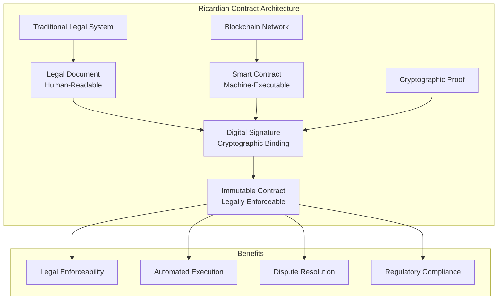

# Ricardian Contract Design Pattern Guide

## Overview

The **Ricardian Contract** is a design pattern that bridges the gap between traditional legal contracts and blockchain smart contracts. It creates a dual-layer system where human-readable legal documents are cryptographically bound to machine-executable smart contracts.

## 🏗️ Core Concept

### The Problem
Traditional smart contracts have limitations:
- **Legal Ambiguity**: Code alone may not be legally enforceable
- **Human Readability**: Complex code is difficult for non-technical parties
- **Dispute Resolution**: Courts need human-readable terms
- **Compliance**: Regulatory requirements need clear legal language

### The Solution
Ricardian Contracts provide:
- **Human Layer**: Traditional legal document in natural language
- **Machine Layer**: Smart contract code for automated execution
- **Cryptographic Binding**: Digital signature linking both layers
- **Legal Enforceability**: Recognizable by courts and regulators



## 🔧 Implementation Components

### 1. Legal Document Structure

```json
{
  "legalDocument": {
    "title": "Data Sharing Agreement",
    "parties": {
      "provider": "Acme Data Corp",
      "consumer": "AI Training Inc",
      "reviewer": "Secure Analytics LLC"
    },
    "recitals": [
      "Provider owns and controls the specified dataset",
      "Consumer desires to train a machine learning model",
      "Reviewer will provide secure processing environment"
    ],
    "terms": [
      {
        "section": "1.0",
        "title": "Data Provision",
        "content": "Provider agrees to provide dataset DS-2024-001..."
      },
      {
        "section": "2.0", 
        "title": "Payment Terms",
        "content": "Consumer agrees to pay $10,000 USD..."
      }
    ],
    "signatures": [
      {
        "party": "provider",
        "name": "John Smith",
        "signature": "0xabcdef...",
        "timestamp": "2024-01-15T10:35:00.000Z"
      }
    ]
  }
}
```

### 2. Smart Contract Integration

```solidity
// Ricardian Contract Smart Contract
contract RicardianContract {
    struct LegalDocument {
        string legalHash;      // Hash of legal document
        string legalText;      // Full legal text
        uint256 effectiveDate;
        uint256 expirationDate;
        bool isActive;
    }
    
    struct Party {
        address partyAddress;
        string name;
        bool hasSigned;
        uint256 signedAt;
    }
    
    mapping(uint256 => LegalDocument) public legalDocuments;
    mapping(uint256 => mapping(address => Party)) public parties;
    
    event ContractCreated(uint256 indexed contractId, string legalHash);
    event PartySigned(uint256 indexed contractId, address indexed party);
    event ContractExecuted(uint256 indexed contractId, string action);
    
    function createRicardianContract(
        string memory legalText,
        uint256 effectiveDate,
        uint256 expirationDate,
        address[] memory partyAddresses
    ) external returns (uint256) {
        uint256 contractId = generateContractId();
        string memory legalHash = keccak256(abi.encodePacked(legalText));
        
        legalDocuments[contractId] = LegalDocument({
            legalHash: legalHash,
            legalText: legalText,
            effectiveDate: effectiveDate,
            expirationDate: expirationDate,
            isActive: true
        });
        
        // Initialize parties
        for (uint i = 0; i < partyAddresses.length; i++) {
            parties[contractId][partyAddresses[i]] = Party({
                partyAddress: partyAddresses[i],
                name: "",
                hasSigned: false,
                signedAt: 0
            });
        }
        
        emit ContractCreated(contractId, legalHash);
        return contractId;
    }
    
    function signContract(uint256 contractId) external {
        require(parties[contractId][msg.sender].partyAddress != address(0), "Not a party to contract");
        require(!parties[contractId][msg.sender].hasSigned, "Already signed");
        
        parties[contractId][msg.sender].hasSigned = true;
        parties[contractId][msg.sender].signedAt = block.timestamp;
        
        emit PartySigned(contractId, msg.sender);
    }
    
    function executeContractAction(uint256 contractId, string memory action) external {
        require(legalDocuments[contractId].isActive, "Contract not active");
        require(legalDocuments[contractId].effectiveDate <= block.timestamp, "Contract not yet effective");
        require(legalDocuments[contractId].expirationDate >= block.timestamp, "Contract expired");
        
        // Execute action based on legal terms
        emit ContractExecuted(contractId, action);
    }
}
```

### 3. Cryptographic Binding

```javascript
// Digital signature that links legal document to smart contract
class RicardianSignature {
  constructor(legalDocument, smartContractAddress) {
    this.legalDocumentHash = this.hashDocument(legalDocument);
    this.smartContractAddress = smartContractAddress;
    this.timestamp = new Date().toISOString();
    this.signatures = [];
  }
  
  hashDocument(document) {
    // Create deterministic hash of legal document
    const documentString = JSON.stringify(document, Object.keys(document).sort());
    return ethers.utils.keccak256(ethers.utils.toUtf8Bytes(documentString));
  }
  
  addSignature(partyAddress, signature, did) {
    this.signatures.push({
      partyAddress,
      signature,
      did,
      timestamp: new Date().toISOString()
    });
  }
  
  verifySignatures() {
    // Verify all signatures are valid
    return this.signatures.every(sig => {
      const message = this.legalDocumentHash + this.smartContractAddress;
      return this.verifySignature(message, sig.signature, sig.partyAddress);
    });
  }
}
```

## 🎯 Benefits of Ricardian Contracts

### 1. **Legal Enforceability**
- Courts can read and understand the legal terms
- Traditional contract law applies
- Dispute resolution through legal system
- Regulatory compliance built-in

### 2. **Automated Execution**
- Smart contract handles routine operations
- Automatic payment processing
- Data transfer automation
- Compliance monitoring

### 3. **Transparency**
- All parties can read the legal terms
- Blockchain provides immutable audit trail
- Public verification of contract state
- Clear dispute resolution process

### 4. **Flexibility**
- Legal terms can be complex and nuanced
- Smart contract handles simple, repetitive tasks
- Human intervention for complex decisions
- Hybrid approach for optimal results

## 🔄 Workflow Implementation

### 1. Contract Creation
```javascript
// Create Ricardian Contract
const ricardianContract = {
  legalDocument: {
    title: "Data Sharing Agreement",
    parties: { provider: "Acme Corp", consumer: "AI Inc" },
    terms: [
      { section: "1.0", title: "Data Provision", content: "..." },
      { section: "2.0", title: "Payment Terms", content: "..." }
    ]
  },
  smartContract: {
    address: "0x5FbDB2315678afecb367f032d93F642f64180aa3",
    functions: ["createContract", "executePayment", "transferData"]
  }
};

// Generate cryptographic binding
const signature = new RicardianSignature(
  ricardianContract.legalDocument,
  ricardianContract.smartContract.address
);
```

### 2. Party Signing
```javascript
// Each party signs both legal document and smart contract
const partySignature = {
  legalDocument: await signLegalDocument(contract.legalDocument),
  smartContract: await signSmartContract(contract.smartContract),
  ricardianBinding: signature.addSignature(partyAddress, combinedSignature)
};
```

### 3. Contract Execution
```javascript
// Automated execution based on legal terms
const executeContract = async (contractId, action) => {
  // Verify legal document hash matches
  const legalHash = await contract.getLegalDocumentHash(contractId);
  const expectedHash = signature.legalDocumentHash;
  
  if (legalHash === expectedHash) {
    // Execute smart contract action
    await contract.executeAction(contractId, action);
  }
};
```

## 🏢 Enterprise Integration

### 1. Contract Management System Integration

```javascript
// Extend existing contract system with Ricardian support
class RicardianContractService {
  async createRicardianContract(contractData) {
    // Create legal document
    const legalDocument = this.createLegalDocument(contractData);
    
    // Deploy smart contract
    const smartContract = await this.deploySmartContract(contractData);
    
    // Create cryptographic binding
    const ricardianSignature = new RicardianSignature(legalDocument, smartContract.address);
    
    // Store in database
    const contract = await db.Contract.create({
      contractId: contractData.contractId,
      legalDocumentHash: ricardianSignature.legalDocumentHash,
      smartContractAddress: smartContract.address,
      ricardianSignature: ricardianSignature.toString(),
      status: 'PENDING_SIGNATURES'
    });
    
    return contract;
  }
  
  async signRicardianContract(contractId, partyAddress, signature) {
    // Verify signature on both legal document and smart contract
    const isValid = await this.verifyRicardianSignature(contractId, partyAddress, signature);
    
    if (isValid) {
      // Update contract status
      await db.Contract.update({
        status: 'ACTIVE'
      }, { where: { contractId } });
      
      // Execute smart contract signing
      await this.smartContract.signContract(contractId, partyAddress);
    }
  }
}
```

### 2. Compliance Integration

```javascript
// DPDP Act 2023 compliance in Ricardian contracts
const dpdpCompliance = {
  dataMinimization: {
    implemented: true,
    description: "Only necessary data is processed",
    legalReference: "Section 4(1) of DPDP Act 2023"
  },
  purposeLimitation: {
    implemented: true,
    description: "Data used only for specified purpose",
    legalReference: "Section 5(1) of DPDP Act 2023"
  },
  retentionLimitation: {
    implemented: true,
    description: "Data retained for 90 days maximum",
    legalReference: "Section 8(1) of DPDP Act 2023"
  },
  consentManagement: {
    implemented: true,
    description: "Explicit consent obtained from data subjects",
    legalReference: "Section 6(1) of DPDP Act 2023"
  }
};
```

## 🔒 Security Considerations

### 1. **Cryptographic Security**
- Use strong hashing algorithms (SHA-256)
- Implement proper signature verification
- Protect private keys and signing processes
- Regular security audits

### 2. **Legal Security**
- Legal document integrity verification
- Signature authenticity validation
- Timestamp verification for legal validity
- Chain of custody documentation

### 3. **Compliance Security**
- Regulatory requirement mapping
- Automated compliance checking
- Audit trail maintenance
- Data protection enforcement

## 📊 Performance Optimization

### 1. **Document Storage**
```javascript
// Efficient legal document storage
const documentStorage = {
  legalDocument: {
    storage: "IPFS", // Decentralized storage
    hash: "QmHash...",
    size: "2.5 KB",
    compression: "gzip"
  },
  smartContract: {
    storage: "blockchain",
    gasOptimized: true,
    batchOperations: true
  }
};
```

### 2. **Verification Optimization**
```javascript
// Fast signature verification
const verificationCache = new Map();
const verifySignature = async (message, signature, publicKey) => {
  const cacheKey = `${message}-${signature}`;
  
  if (verificationCache.has(cacheKey)) {
    return verificationCache.get(cacheKey);
  }
  
  const isValid = await crypto.verify(message, signature, publicKey);
  verificationCache.set(cacheKey, isValid);
  
  return isValid;
};
```

## 🧪 Testing Strategy

### 1. **Legal Document Testing**
```javascript
// Test legal document integrity
describe('Legal Document Tests', () => {
  test('should maintain document integrity', () => {
    const originalHash = ricardianContract.legalDocumentHash;
    const recalculatedHash = hashDocument(legalDocument);
    expect(originalHash).toBe(recalculatedHash);
  });
  
  test('should validate all signatures', () => {
    const allValid = ricardianContract.signatures.every(sig => 
      verifySignature(sig.message, sig.signature, sig.publicKey)
    );
    expect(allValid).toBe(true);
  });
});
```

### 2. **Smart Contract Testing**
```javascript
// Test smart contract execution
describe('Smart Contract Tests', () => {
  test('should execute contract actions', async () => {
    const result = await smartContract.executeAction(
      contractId, 
      'TRANSFER_PAYMENT'
    );
    expect(result.success).toBe(true);
  });
  
  test('should enforce legal terms', async () => {
    const legalTerms = await smartContract.getLegalTerms(contractId);
    expect(legalTerms.retentionPeriod).toBe(90);
  });
});
```

## 📈 Monitoring and Analytics

### 1. **Contract Metrics**
- Contract creation rate
- Signature verification success rate
- Execution success rate
- Dispute resolution time

### 2. **Compliance Metrics**
- DPDP compliance status
- GDPR compliance status
- Data retention compliance
- Security measure implementation

### 3. **Performance Metrics**
- Document processing time
- Signature verification time
- Smart contract execution time
- Storage optimization metrics

## 🔄 Future Enhancements

### 1. **Advanced Features**
- Multi-language legal document support
- Automated legal term extraction
- AI-powered contract analysis
- Dynamic contract modification

### 2. **Integration Enhancements**
- Integration with legal databases
- Automated compliance checking
- Real-time regulatory updates
- Cross-border contract support

### 3. **Security Enhancements**
- Zero-knowledge proof integration
- Advanced cryptographic primitives
- Quantum-resistant signatures
- Enhanced privacy protection

## 📚 Additional Resources

- [Original Ricardian Contract Paper](http://iang.org/papers/ricardian_contract.html)
- [Smart Contract Legal Framework](https://www.legalmatic.com)
- [Blockchain Contract Standards](https://www.ethereum.org/developers/docs)
- [DPDP Act 2023 Guidelines](https://www.meity.gov.in/dpdp)

## 🤝 Support

For questions about Ricardian Contract implementation:

1. Review the [example implementation](./ricardian_contract_example.json)
2. Check the [Contract Management System documentation](./CONTRACT_TEMPLATE_GUIDE.md)
3. Consult legal experts for compliance requirements
4. Contact the development team

---

**Pattern**: Ricardian Contract Design  
**Inventor**: Ian Grigg (1996)  
**Blockchain Adaptation**: 2015+  
**Legal Framework**: Traditional Contract Law + Smart Contracts 