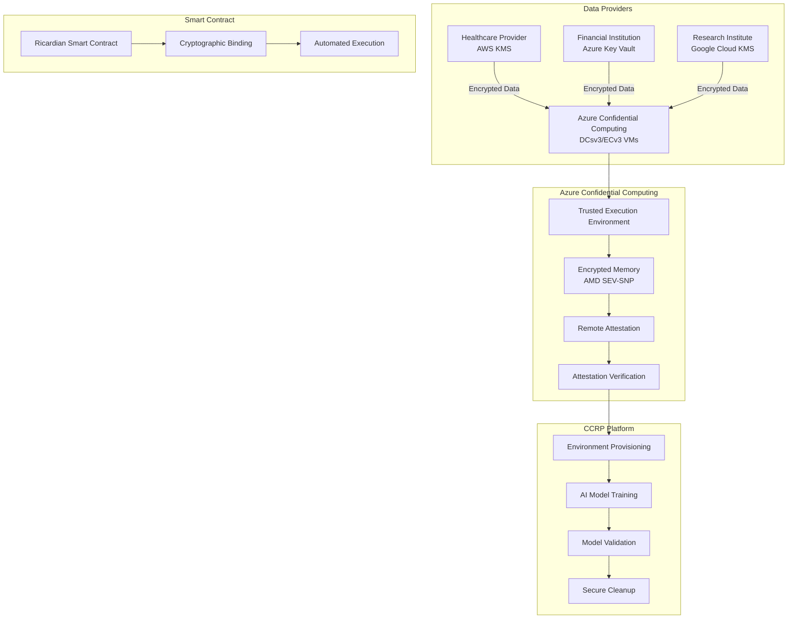

# Azure Confidential Computing Integration with Third-Party KMS

## Overview

This guide demonstrates how to integrate **Azure Confidential Computing** with **third-party Key Management Systems (KMS)** for CCRP environment provisioning in AI model training workflows. This approach provides hardware-level security isolation while maintaining flexibility with different data providers' encryption preferences.

## Architecture Overview



## Azure Confidential Computing Components

### 1. **Hardware Security Features**

#### AMD SEV-SNP (Secure Encrypted Virtualization)
```json
{
  "hardwareFeatures": {
    "memoryEncryption": "AMD SEV-SNP",
    "encryptionScope": "VM_MEMORY_ONLY",
    "attestation": "REMOTE_ATTESTATION",
    "isolation": "HARDWARE_LEVEL",
    "keyProtection": "HARDWARE_BACKED"
  },
  "vmSpecifications": {
    "series": "DCsv3/ECv3",
    "cpu": "AMD EPYC 7763",
    "memory": "512 GB encrypted",
    "gpu": "8x NVIDIA A100",
    "storage": "10 TB encrypted NVMe"
  }
}
```

#### Intel SGX (Software Guard Extensions)
```json
{
  "sgxFeatures": {
    "enclaveType": "CONFIDENTIAL_ENCLAVE",
    "memoryProtection": "ENCLAVE_MEMORY",
    "attestation": "INTEL_ATTESTATION_SERVICE",
    "sealing": "ENCLAVE_SEALING",
    "remoteAttestation": "ENABLED"
  }
}
```

### 2. **Trusted Execution Environment (TEE)**

#### Environment Specifications
```json
{
  "teeConfiguration": {
    "type": "AZURE_CONFIDENTIAL_COMPUTING",
    "hardware": "AMD_SEV_SNP",
    "attestation": {
      "service": "AZURE_ATTESTATION_SERVICE",
      "endpoint": "https://sharedeus2us.attest.azure.net",
      "policy": "CONFIDENTIAL_COMPUTING_POLICY"
    },
    "encryption": {
      "memoryEncryption": "HARDWARE_BACKED",
      "storageEncryption": "AZURE_MANAGED_KEYS",
      "networkEncryption": "TLS_1_3"
    },
    "isolation": {
      "level": "HARDWARE_ISOLATION",
      "boundaries": "VM_LEVEL",
      "memoryProtection": "ENCRYPTED_MEMORY"
    }
  }
}
```

## Third-Party KMS Integration

### 1. **Multi-KMS Architecture**

#### KMS Provider Abstraction
```javascript
// KMS Provider Interface
class KMSProvider {
  constructor(provider, config) {
    this.provider = provider;
    this.config = config;
  }
  
  async decryptData(encryptedData, keyId) {
    switch(this.provider) {
      case 'aws':
        return await this.decryptAWS(encryptedData, keyId);
      case 'azure':
        return await this.decryptAzure(encryptedData, keyId);
      case 'gcp':
        return await this.decryptGCP(encryptedData, keyId);
      case 'hashicorp':
        return await this.decryptHashicorp(encryptedData, keyId);
      default:
        throw new Error(`Unsupported KMS provider: ${this.provider}`);
    }
  }
  
  async verifyAttestation(attestationReport) {
    // Verify attestation with respective KMS
    return await this.verifyWithKMS(attestationReport);
  }
}
```

#### AWS KMS Integration
```javascript
// AWS KMS Integration
class AWSKMSProvider extends KMSProvider {
  constructor(config) {
    super('aws', config);
    this.kms = new AWS.KMS(config);
  }
  
  async decryptAWS(encryptedData, keyId) {
    const params = {
      CiphertextBlob: encryptedData,
      KeyId: keyId,
      EncryptionContext: {
        'attestation-verified': 'true'
      }
    };
    
    const result = await this.kms.decrypt(params).promise();
    return result.Plaintext;
  }
  
  async verifyAttestation(attestationReport) {
    // Verify Azure attestation with AWS KMS
    const params = {
      KeyId: this.config.attestationKeyId,
      Plaintext: attestationReport,
      EncryptionContext: {
        'attestation-service': 'azure-confidential-computing'
      }
    };
    
    return await this.kms.encrypt(params).promise();
  }
}
```

#### Azure Key Vault Integration
```javascript
// Azure Key Vault Integration
class AzureKeyVaultProvider extends KMSProvider {
  constructor(config) {
    super('azure', config);
    this.keyVaultClient = new KeyVaultClient(config);
  }
  
  async decryptAzure(encryptedData, keyId) {
    const result = await this.keyVaultClient.decrypt({
      vaultBaseUrl: this.config.vaultUrl,
      keyName: keyId,
      algorithm: 'RSA-OAEP',
      value: encryptedData
    });
    
    return result.result;
  }
  
  async verifyAttestation(attestationReport) {
    // Verify attestation with Azure Key Vault
    const result = await this.keyVaultClient.verify({
      vaultBaseUrl: this.config.vaultUrl,
      keyName: this.config.attestationKeyName,
      algorithm: 'RS256',
      digest: attestationReport,
      signature: attestationReport.signature
    });
    
    return result.value;
  }
}
```

#### Google Cloud KMS Integration
```javascript
// Google Cloud KMS Integration
class GCPKMSProvider extends KMSProvider {
  constructor(config) {
    super('gcp', config);
    this.kmsClient = new KeyManagementServiceClient(config);
  }
  
  async decryptGCP(encryptedData, keyId) {
    const request = {
      name: keyId,
      ciphertext: encryptedData
    };
    
    const [result] = await this.kmsClient.decrypt(request);
    return result.plaintext;
  }
  
  async verifyAttestation(attestationReport) {
    // Verify attestation with Google Cloud KMS
    const request = {
      name: this.config.attestationKeyName,
      plaintext: attestationReport,
      ciphertext: attestationReport.signature
    };
    
    const [result] = await this.kmsClient.encrypt(request);
    return result.ciphertext;
  }
}
```

### 2. **Data Provider Configuration**

#### Healthcare Provider (AWS KMS)
```json
{
  "dataProvider": {
    "name": "Acme Healthcare Corporation",
    "kmsProvider": "aws",
    "kmsConfig": {
      "region": "us-east-1",
      "keyId": "arn:aws:kms:us-east-1:123456789012:key/abcd1234-5678-90ef-ghij-klmnopqrstuv",
      "encryptionAlgorithm": "AES_256",
      "attestationKeyId": "arn:aws:kms:us-east-1:123456789012:key/attestation-key-1234"
    },
    "dataSpecifications": {
      "format": "DICOM",
      "encryption": "AES_256_GCM",
      "compression": "GZIP",
      "metadata": {
        "patientCount": 50000,
        "imageCount": 250000,
        "dataSize": "2.5 TB"
      }
    }
  }
}
```

#### Financial Institution (Azure Key Vault)
```json
{
  "dataProvider": {
    "name": "Global Financial Services",
    "kmsProvider": "azure",
    "kmsConfig": {
      "vaultUrl": "https://financial-vault.vault.azure.net/",
      "keyName": "financial-data-key",
      "keyVersion": "v1",
      "attestationKeyName": "attestation-verification-key"
    },
    "dataSpecifications": {
      "format": "JSON",
      "encryption": "AES_256_CBC",
      "compression": "LZ4",
      "metadata": {
        "transactionCount": 1000000,
        "recordCount": 5000000,
        "dataSize": "500 GB"
      }
    }
  }
}
```

#### Research Institute (Google Cloud KMS)
```json
{
  "dataProvider": {
    "name": "Advanced Research Institute",
    "kmsProvider": "gcp",
    "kmsConfig": {
      "projectId": "research-institute-123456",
      "location": "us-central1",
      "keyRing": "research-data-keyring",
      "keyName": "research-data-key",
      "attestationKeyName": "attestation-verification-key"
    },
    "dataSpecifications": {
      "format": "PARQUET",
      "encryption": "AES_256_GCM",
      "compression": "SNAPPY",
      "metadata": {
        "experimentCount": 1000,
        "sampleCount": 100000,
        "dataSize": "1 TB"
      }
    }
  }
}
```

## CCRP Environment Provisioning

### 1. **Azure Confidential Computing Setup**

#### VM Provisioning Script
```bash
#!/bin/bash
# Azure Confidential Computing VM Provisioning

# Create resource group
az group create --name ccrp-confidential-rg --location eastus

# Create virtual network
az network vnet create \
  --resource-group ccrp-confidential-rg \
  --name ccrp-vnet \
  --subnet-name ccrp-subnet

# Create confidential VM
az vm create \
  --resource-group ccrp-confidential-rg \
  --name ccrp-confidential-vm \
  --image Canonical:0001-com-ubuntu-server-focal:20_04-lts-gen2:latest \
  --size Standard_DC8s_v3 \
  --admin-username azureuser \
  --generate-ssh-keys \
  --enable-secure-boot \
  --enable-vtpm \
  --security-type ConfidentialVM \
  --os-disk-security-encryption-type DiskWithVMGuestState \
  --os-disk-encryption-set ccrp-encryption-set

# Configure network security
az network nsg create \
  --resource-group ccrp-confidential-rg \
  --name ccrp-nsg

az network nsg rule create \
  --resource-group ccrp-confidential-rg \
  --nsg-name ccrp-nsg \
  --name allow-ssh \
  --protocol tcp \
  --priority 1000 \
  --destination-port-range 22 \
  --access allow
```

#### Docker Container Configuration
```dockerfile
# Confidential Computing Container
FROM ubuntu:20.04

# Install Azure Confidential Computing dependencies
RUN apt-get update && apt-get install -y \
    azure-cli \
    docker.io \
    python3 \
    python3-pip \
    curl \
    wget \
    && rm -rf /var/lib/apt/lists/*

# Install Azure Attestation SDK
RUN pip3 install azure-identity azure-keyvault-keys azure-attestation

# Install KMS client libraries
RUN pip3 install boto3 google-cloud-kms azure-keyvault-keys

# Copy application code
COPY ./src /app
COPY ./kms-providers /app/kms-providers

# Set working directory
WORKDIR /app

# Expose ports
EXPOSE 8080 8443

# Start application
CMD ["python3", "main.py"]
```

### 2. **Multi-KMS Data Decryption**

#### CCRP Data Processing Service
```python
# CCRP Data Processing Service
import asyncio
import json
import logging
from typing import Dict, List
from azure.identity import DefaultAzureCredential
from azure.attestation import AttestationClient
from kms_providers import KMSProviderFactory

class CCRPDataProcessor:
    def __init__(self, config: Dict):
        self.config = config
        self.attestation_client = AttestationClient(
            endpoint=config['attestation_endpoint'],
            credential=DefaultAzureCredential()
        )
        self.kms_providers = {}
        self.setup_kms_providers()
    
    def setup_kms_providers(self):
        """Initialize KMS providers for different data providers"""
        for provider_config in self.config['data_providers']:
            provider_name = provider_config['name']
            kms_type = provider_config['kms_config']['provider']
            
            self.kms_providers[provider_name] = KMSProviderFactory.create(
                kms_type, provider_config['kms_config']
            )
    
    async def provision_environment(self, contract_id: str, env_specs: Dict):
        """Provision confidential computing environment"""
        try:
            # Verify attestation
            attestation_report = await self.get_attestation_report()
            attestation_verified = await self.verify_attestation(attestation_report)
            
            if not attestation_verified:
                raise Exception("Attestation verification failed")
            
            # Provision environment
            environment = await self.create_confidential_environment(env_specs)
            
            # Configure KMS access
            await self.configure_kms_access(environment, contract_id)
            
            return environment
            
        except Exception as e:
            logging.error(f"Environment provisioning failed: {e}")
            raise
    
    async def decrypt_data(self, encrypted_data: bytes, data_provider: str, key_id: str):
        """Decrypt data using appropriate KMS provider"""
        try:
            kms_provider = self.kms_providers[data_provider]
            
            # Verify attestation with KMS
            attestation_verified = await kms_provider.verify_attestation(
                await self.get_attestation_report()
            )
            
            if not attestation_verified:
                raise Exception("KMS attestation verification failed")
            
            # Decrypt data
            decrypted_data = await kms_provider.decrypt_data(encrypted_data, key_id)
            
            return decrypted_data
            
        except Exception as e:
            logging.error(f"Data decryption failed: {e}")
            raise
    
    async def get_attestation_report(self):
        """Get Azure Confidential Computing attestation report"""
        try:
            # Get attestation report from Azure
            attestation_report = await self.attestation_client.get_attestation_report()
            return attestation_report
            
        except Exception as e:
            logging.error(f"Failed to get attestation report: {e}")
            raise
    
    async def verify_attestation(self, attestation_report):
        """Verify attestation report"""
        try:
            # Verify attestation with Azure Attestation Service
            verification_result = await self.attestation_client.verify_attestation(
                attestation_report
            )
            return verification_result.is_valid
            
        except Exception as e:
            logging.error(f"Attestation verification failed: {e}")
            return False
    
    async def create_confidential_environment(self, env_specs: Dict):
        """Create confidential computing environment"""
        try:
            # Create isolated environment with hardware protection
            environment = {
                'type': 'AZURE_CONFIDENTIAL_COMPUTING',
                'hardware': 'AMD_SEV_SNP',
                'memory_encryption': 'ENABLED',
                'attestation': 'VERIFIED',
                'isolation': 'HARDWARE_LEVEL',
                'specifications': env_specs
            }
            
            return environment
            
        except Exception as e:
            logging.error(f"Environment creation failed: {e}")
            raise
    
    async def configure_kms_access(self, environment: Dict, contract_id: str):
        """Configure KMS access for the environment"""
        try:
            # Configure access to different KMS providers
            for provider_name, kms_provider in self.kms_providers.items():
                await kms_provider.configure_environment_access(environment, contract_id)
            
        except Exception as e:
            logging.error(f"KMS access configuration failed: {e}")
            raise
```

### 3. **Smart Contract Integration**

#### Ricardian Contract Extension
```solidity
// Extension to AITrainingRicardianContract.sol
struct KMSConfiguration {
    string provider;           // "aws", "azure", "gcp", "hashicorp"
    string keyId;             // KMS key identifier
    string region;            // KMS region/location
    string attestationKeyId;  // Attestation verification key
    bool attestationVerified; // Whether attestation is verified
}

struct AzureConfidentialSpecs {
    string vmSize;            // "Standard_DC8s_v3"
    string hardwareType;      // "AMD_SEV_SNP"
    bool secureBoot;          // Secure boot enabled
    bool vtpm;               // Virtual TPM enabled
    string encryptionType;    // "DiskWithVMGuestState"
    KMSConfiguration[] kmsConfigs; // Multiple KMS configurations
}

// Add to AITrainingContract struct
AzureConfidentialSpecs azureSpecs;
```

#### Environment Provisioning Function
```solidity
function provisionAzureEnvironment(
    uint256 contractId,
    AzureConfidentialSpecs memory azureSpecs
) external onlyCCRP onlyContractParty(contractId) {
    AITrainingContract storage contract_ = contracts[contractId];
    require(contract_.status == TrainingStatus.CREATED, "Contract not in creation status");
    
    // Validate Azure specifications
    require(bytes(azureSpecs.hardwareType).length > 0, "Hardware type required");
    require(azureSpecs.secureBoot, "Secure boot must be enabled");
    require(azureSpecs.vtpm, "Virtual TPM must be enabled");
    require(azureSpecs.kmsConfigs.length > 0, "At least one KMS configuration required");
    
    // Verify attestation for each KMS
    for (uint i = 0; i < azureSpecs.kmsConfigs.length; i++) {
        require(azureSpecs.kmsConfigs[i].attestationVerified, "KMS attestation not verified");
    }
    
    contract_.azureSpecs = azureSpecs;
    contract_.environmentProvisioned = true;
    contract_.environmentProvisionedAt = block.timestamp;
    contract_.status = TrainingStatus.ENVIRONMENT_READY;
    
    emit EnvironmentProvisioned(contractId, msg.sender, contract_.environmentSpecs);
    emit StatusChanged(contractId, TrainingStatus.ENVIRONMENT_READY);
    
    // Release milestone 1 payment (50%)
    _releaseMilestonePayment(contractId, 1);
}
```

## Security and Compliance

### 1. **Attestation Verification**

#### Multi-KMS Attestation
```python
class AttestationVerifier:
    def __init__(self):
        self.azure_attestation = AzureAttestationService()
        self.kms_verifiers = {
            'aws': AWSKMSAttestationVerifier(),
            'azure': AzureKeyVaultAttestationVerifier(),
            'gcp': GCPKMSAttestationVerifier(),
            'hashicorp': HashicorpVaultAttestationVerifier()
        }
    
    async def verify_multi_kms_attestation(self, contract_id: str, kms_configs: List[Dict]):
        """Verify attestation with multiple KMS providers"""
        verification_results = {}
        
        for kms_config in kms_configs:
            provider = kms_config['provider']
            verifier = self.kms_verifiers[provider]
            
            # Get Azure attestation report
            azure_report = await self.azure_attestation.get_report()
            
            # Verify with specific KMS
            verification_result = await verifier.verify_attestation(
                azure_report, kms_config
            )
            
            verification_results[provider] = verification_result
        
        return verification_results
```

### 2. **Data Flow Security**

#### Encrypted Data Pipeline
```python
class SecureDataPipeline:
    def __init__(self, kms_providers: Dict):
        self.kms_providers = kms_providers
        self.encryption_layers = {
            'transport': 'TLS_1_3',
            'storage': 'AES_256_XTS',
            'memory': 'HARDWARE_ENCRYPTED',
            'computation': 'CONFIDENTIAL_ENCLAVE'
        }
    
    async def process_encrypted_data(self, contract_id: str, data_providers: List[Dict]):
        """Process encrypted data from multiple providers"""
        processed_data = {}
        
        for provider in data_providers:
            provider_name = provider['name']
            kms_provider = self.kms_providers[provider_name]
            
            # Decrypt data in confidential environment
            decrypted_data = await self.decrypt_in_enclave(
                provider['encrypted_data'],
                provider['kms_config'],
                kms_provider
            )
            
            # Process data securely
            processed_data[provider_name] = await self.process_securely(decrypted_data)
        
        return processed_data
    
    async def decrypt_in_enclave(self, encrypted_data: bytes, kms_config: Dict, kms_provider):
        """Decrypt data within confidential enclave"""
        # Verify attestation
        attestation_verified = await kms_provider.verify_attestation(
            await self.get_attestation_report()
        )
        
        if not attestation_verified:
            raise Exception("Attestation verification failed")
        
        # Decrypt within hardware-protected environment
        decrypted_data = await kms_provider.decrypt_data(
            encrypted_data, kms_config['keyId']
        )
        
        return decrypted_data
```

## Implementation Benefits

### 1. **Hardware-Level Security**
- **AMD SEV-SNP**: Hardware memory encryption
- **Intel SGX**: Enclave-based isolation
- **Remote Attestation**: Cryptographic proof of environment integrity
- **Secure Boot**: Verified boot chain

### 2. **Multi-KMS Flexibility**
- **Provider Agnostic**: Support for AWS, Azure, GCP, Hashicorp
- **Attestation Verification**: Each KMS verifies Azure attestation
- **Unified Interface**: Common API for different KMS providers
- **Security Compliance**: Maintains each provider's security standards

### 3. **Regulatory Compliance**
- **HIPAA**: Healthcare data protection
- **GDPR**: EU data privacy
- **DPDP 2023**: Indian data protection
- **SOC 2**: Security controls
- **ISO 27001**: Information security

### 4. **Cost Efficiency**
- **Azure Confidential Computing**: Pay-as-you-use model
- **Multi-tenant**: Shared infrastructure costs
- **Automated Provisioning**: Reduced manual overhead
- **Compliance Automation**: Reduced audit costs

## Summary

This integration provides:

1. **Hardware Security**: Azure Confidential Computing with AMD SEV-SNP
2. **KMS Flexibility**: Support for multiple third-party KMS providers
3. **Attestation Verification**: Cryptographic proof of environment integrity
4. **Automated Workflow**: Smart contract-driven provisioning
5. **Regulatory Compliance**: Built-in compliance with healthcare and privacy regulations

The solution enables CCRP to provision secure training environments that can handle encrypted data from multiple providers using different KMS systems, while maintaining the highest standards of security and compliance. 