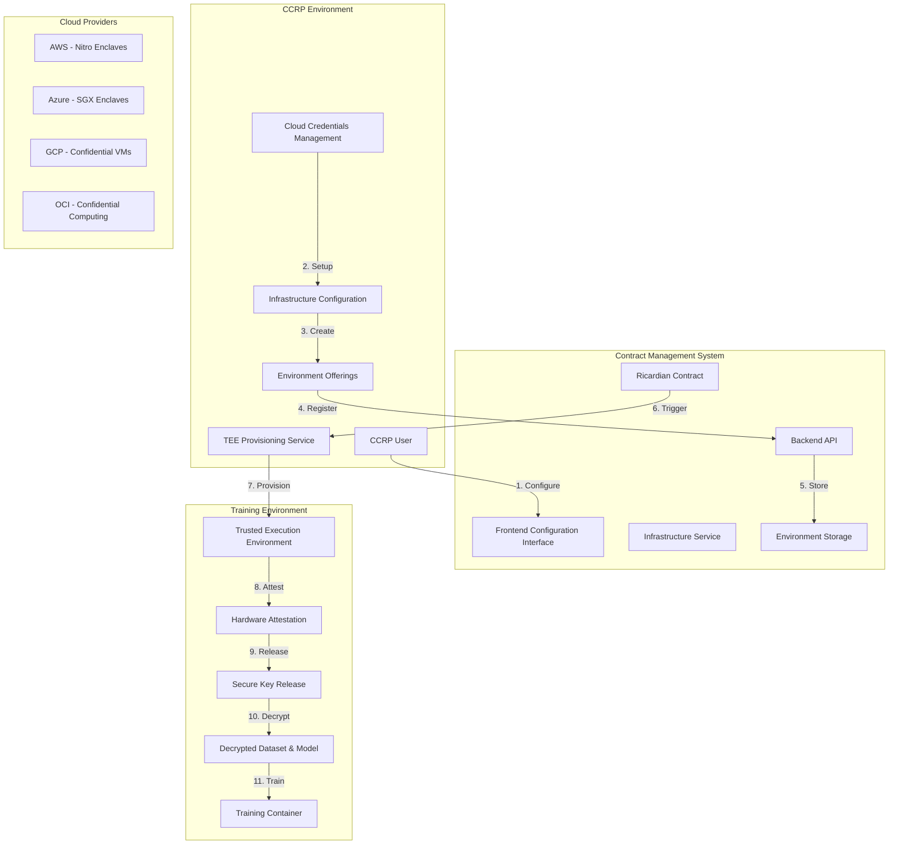

# 🏗️ CCRP Environment Offerings & Configuration Flow

## 📋 Overview

This document outlines the complete flow for how Confidential Clean Room Providers (CCRPs) configure and offer their training environments for AI/ML model training. CCRPs provide the secure infrastructure where encrypted datasets and AI models are decrypted and trained within Trusted Execution Environments (TEEs).

## 🏗️ Architecture Overview



## 🔄 Complete Flow Breakdown

### **Phase 1: CCRP Cloud Credentials & Infrastructure Setup**

#### **1.1 Cloud Credentials Management**
```javascript
// CCRP cloud credentials configuration
class CCRPCloudCredentialsService {
  async configureCloudCredentials(ccrpUser, credentials) {
    try {
      // 1. Validate cloud provider credentials
      const validation = await this.validateCloudCredentials(credentials);
      if (!validation.valid) {
        throw new Error(validation.error);
      }

      // 2. Encrypt and store credentials securely
      const encryptedCredentials = await this.encryptCredentials(credentials);
      
      // 3. Create credential record
      const credentialRecord = await this.createCredentialRecord({
        ccrpUserId: ccrpUser.id,
        cloudProvider: credentials.cloudProvider,
        encryptedCredentials,
        configuration: credentials.configuration,
        status: 'active'
      });

      // 4. Test cloud connectivity
      const connectivityTest = await this.testCloudConnectivity(credentials);
      
      return {
        success: true,
        credentialId: credentialRecord.id,
        connectivityTest,
        message: 'Cloud credentials configured successfully'
      };

    } catch (error) {
      logger.error('Error configuring cloud credentials:', error);
      throw error;
    }
  }

  async validateCloudCredentials(credentials) {
    const validation = {
      valid: true,
      errors: []
    };

    // Validate based on cloud provider
    switch (credentials.cloudProvider) {
      case 'AZURE':
        if (!credentials.azureFields.subscriptionId || 
            !credentials.azureFields.tenantId ||
            !credentials.azureFields.clientId ||
            !credentials.azureFields.clientSecret) {
          validation.valid = false;
          validation.errors.push('Missing required Azure credentials');
        }
        break;
      case 'AWS':
        if (!credentials.awsFields.accessKeyId || 
            !credentials.awsFields.secretAccessKey) {
          validation.valid = false;
          validation.errors.push('Missing required AWS credentials');
        }
        break;
      case 'GCP':
        if (!credentials.gcpFields.projectId || 
            !credentials.gcpFields.serviceAccountKey) {
          validation.valid = false;
          validation.errors.push('Missing required GCP credentials');
        }
        break;
      case 'OCI':
        if (!credentials.ociFields.compartmentId || 
            !credentials.ociFields.userId ||
            !credentials.ociFields.fingerprint ||
            !credentials.ociFields.privateKey) {
          validation.valid = false;
          validation.errors.push('Missing required OCI credentials');
        }
        break;
    }

    return validation;
  }
}
```

#### **1.2 Infrastructure Configuration**
```javascript
// CCRP infrastructure configuration service
class CCRPInfrastructureService {
  async configureInfrastructure(ccrpUser, infrastructureConfig) {
    try {
      // 1. Validate infrastructure configuration
      const validation = await this.validateInfrastructureConfig(infrastructureConfig);
      if (!validation.valid) {
        throw new Error(validation.error);
      }

      // 2. Create infrastructure configuration
      const infrastructure = await this.createInfrastructureConfig({
        ccrpUserId: ccrpUser.id,
        name: infrastructureConfig.name,
        description: infrastructureConfig.description,
        cloudProvider: infrastructureConfig.cloudProvider,
        configuration: {
          compute: infrastructureConfig.compute,
          storage: infrastructureConfig.storage,
          network: infrastructureConfig.network,
          security: infrastructureConfig.security,
          compliance: infrastructureConfig.compliance
        },
        capabilities: infrastructureConfig.capabilities,
        pricing: infrastructureConfig.pricing,
        status: 'active'
      });

      // 3. Test infrastructure provisioning
      const provisioningTest = await this.testInfrastructureProvisioning(infrastructure);

      return {
        success: true,
        infrastructureId: infrastructure.id,
        provisioningTest,
        message: 'Infrastructure configured successfully'
      };

    } catch (error) {
      logger.error('Error configuring infrastructure:', error);
      throw error;
    }
  }

  async validateInfrastructureConfig(config) {
    const validation = {
      valid: true,
      errors: []
    };

    // Validate compute configuration
    if (!config.compute || !config.compute.type) {
      validation.valid = false;
      validation.errors.push('Compute configuration is required');
    }

    // Validate security configuration
    if (!config.security || !config.security.attestationRequired) {
      validation.valid = false;
      validation.errors.push('Security configuration with attestation is required');
    }

    // Validate compliance requirements
    if (!config.compliance || !config.compliance.standards) {
      validation.valid = false;
      validation.errors.push('Compliance standards are required');
    }

    return validation;
  }
}
```

### **Phase 2: Environment Offerings Creation & Registration**

#### **2.1 Environment Offerings Service**
```javascript
// CCRP environment offerings service
class CCRPEnvironmentOfferingsService {
  async createEnvironmentOffering(ccrpUser, offeringConfig) {
    try {
      // 1. Validate offering configuration
      const validation = await this.validateOfferingConfig(offeringConfig);
      if (!validation.valid) {
        throw new Error(validation.error);
      }

      // 2. Create environment offering
      const offering = await this.createOffering({
        ccrpUserId: ccrpUser.id,
        name: offeringConfig.name,
        description: offeringConfig.description,
        type: offeringConfig.type, // 'confidential-computing', 'federated-learning', 'multi-tenant'
        specifications: {
          compute: offeringConfig.computeSpecs,
          storage: offeringConfig.storageSpecs,
          network: offeringConfig.networkSpecs,
          security: offeringConfig.securitySpecs,
          compliance: offeringConfig.complianceSpecs
        },
        capabilities: offeringConfig.capabilities,
        pricing: offeringConfig.pricing,
        availability: offeringConfig.availability,
        status: 'active'
      });

      // 3. Register offering in marketplace
      await this.registerOfferingInMarketplace(offering);

      return {
        success: true,
        offeringId: offering.id,
        message: 'Environment offering created successfully'
      };

    } catch (error) {
      logger.error('Error creating environment offering:', error);
      throw error;
    }
  }

  async validateOfferingConfig(config) {
    const validation = {
      valid: true,
      errors: []
    };

    // Validate required fields
    if (!config.name || !config.description) {
      validation.valid = false;
      validation.errors.push('Name and description are required');
    }

    // Validate specifications
    if (!config.computeSpecs || !config.storageSpecs || !config.securitySpecs) {
      validation.valid = false;
      validation.errors.push('Complete specifications are required');
    }

    // Validate pricing
    if (!config.pricing || !config.pricing.hourlyRate) {
      validation.valid = false;
      validation.errors.push('Pricing configuration is required');
    }

    return validation;
  }
}
```

#### **2.2 TEE Provisioning Service**
```javascript
// CCRP TEE provisioning service
class CCRPTEEProvisioningService {
  async provisionTEEForContract(contract, environmentOffering) {
    try {
      // 1. Validate contract requirements
      const contractValidation = await this.validateContractRequirements(contract);
      if (!contractValidation.valid) {
        throw new Error(contractValidation.error);
      }

      // 2. Provision TEE environment
      const teeEnvironment = await this.provisionTEEEnvironment({
        contractId: contract.contractId,
        environmentOfferingId: environmentOffering.id,
        requirements: contract.teeRequirements,
        specifications: environmentOffering.specifications
      });

      // 3. Configure hardware attestation
      await this.configureHardwareAttestation(teeEnvironment);

      // 4. Setup secure key release
      await this.setupSecureKeyRelease(teeEnvironment, contract);

      // 5. Initialize training container
      const trainingContainer = await this.initializeTrainingContainer(
        teeEnvironment,
        contract
      );

      return {
        success: true,
        teeEnvironment,
        trainingContainer,
        message: 'TEE environment provisioned successfully'
      };

    } catch (error) {
      logger.error('Error provisioning TEE environment:', error);
      throw error;
    }
  }

  async provisionTEEEnvironment(config) {
    // Provision TEE based on cloud provider
    const cloudProvider = config.specifications.cloudProvider;
    
    switch (cloudProvider) {
      case 'AZURE':
        return await this.provisionAzureTEE(config);
      case 'AWS':
        return await this.provisionAWSTEE(config);
      case 'GCP':
        return await this.provisionGCPTEE(config);
      case 'OCI':
        return await this.provisionOCITEE(config);
      default:
        throw new Error(`Unsupported cloud provider: ${cloudProvider}`);
    }
  }
}
```

### **Phase 3: Frontend Configuration Interface**

#### **3.1 CCRP Cloud Credentials Component**
```javascript
// CCRP cloud credentials configuration component
const CCRPCloudCredentials = () => {
  const { currentUser } = useUser();
  const [credentials, setCredentials] = useState([]);
  const [selectedProvider, setSelectedProvider] = useState('AZURE');
  const [formData, setFormData] = useState({
    cloudProvider: 'AZURE',
    secretManager: 'VAULT',
    authMethod: 'SERVICE_PRINCIPAL',
    defaultLocation: 'eastus',
    defaultResourceGroupPrefix: 'training',
    defaultVMSize: 'Standard_D2s_v3',
    enableEncryption: true,
    enableMonitoring: true,
    enableKeyVault: true
  });

  const [azureFields, setAzureFields] = useState({
    subscriptionId: '',
    tenantId: '',
    clientId: '',
    clientSecret: ''
  });

  const handleSaveCredentials = async () => {
    try {
      const credentialsData = {
        ...formData,
        [selectedProvider.toLowerCase() + 'Fields']: 
          selectedProvider === 'AZURE' ? azureFields : {}
      };

      const response = await apiService.saveCloudCredentials(credentialsData);
      
      if (response.success) {
        toast.success('Cloud credentials saved successfully!');
        loadCredentials();
      }
    } catch (error) {
      toast.error('Failed to save cloud credentials');
    }
  };

  return (
    <div className="ccrp-cloud-credentials">
      <Typography variant="h5" gutterBottom>
        Cloud Credentials Configuration
      </Typography>
      
      <Card className="credentials-card">
        <CardContent>
          <FormControl fullWidth margin="normal">
            <InputLabel>Cloud Provider</InputLabel>
            <Select
              value={selectedProvider}
              onChange={(e) => setSelectedProvider(e.target.value)}
            >
              <MenuItem value="AZURE">Microsoft Azure</MenuItem>
              <MenuItem value="AWS">Amazon Web Services</MenuItem>
              <MenuItem value="GCP">Google Cloud Platform</MenuItem>
              <MenuItem value="OCI">Oracle Cloud Infrastructure</MenuItem>
            </Select>
          </FormControl>

          {selectedProvider === 'AZURE' && (
            <Grid container spacing={2}>
              <Grid item xs={12} md={6}>
                <TextField
                  fullWidth
                  label="Subscription ID"
                  value={azureFields.subscriptionId}
                  onChange={(e) => setAzureFields(prev => ({
                    ...prev,
                    subscriptionId: e.target.value
                  }))}
                />
              </Grid>
              <Grid item xs={12} md={6}>
                <TextField
                  fullWidth
                  label="Tenant ID"
                  value={azureFields.tenantId}
                  onChange={(e) => setAzureFields(prev => ({
                    ...prev,
                    tenantId: e.target.value
                  }))}
                />
              </Grid>
              <Grid item xs={12} md={6}>
                <TextField
                  fullWidth
                  label="Client ID"
                  value={azureFields.clientId}
                  onChange={(e) => setAzureFields(prev => ({
                    ...prev,
                    clientId: e.target.value
                  }))}
                />
              </Grid>
              <Grid item xs={12} md={6}>
                <TextField
                  fullWidth
                  label="Client Secret"
                  type="password"
                  value={azureFields.clientSecret}
                  onChange={(e) => setAzureFields(prev => ({
                    ...prev,
                    clientSecret: e.target.value
                  }))}
                />
              </Grid>
            </Grid>
          )}

          <Grid container spacing={2} className="config-options">
            <Grid item xs={12} md={4}>
              <TextField
                fullWidth
                label="Default Location"
                value={formData.defaultLocation}
                onChange={(e) => setFormData(prev => ({
                  ...prev,
                  defaultLocation: e.target.value
                }))}
              />
            </Grid>
            <Grid item xs={12} md={4}>
              <TextField
                fullWidth
                label="Resource Group Prefix"
                value={formData.defaultResourceGroupPrefix}
                onChange={(e) => setFormData(prev => ({
                  ...prev,
                  defaultResourceGroupPrefix: e.target.value
                }))}
              />
            </Grid>
            <Grid item xs={12} md={4}>
              <TextField
                fullWidth
                label="Default VM Size"
                value={formData.defaultVMSize}
                onChange={(e) => setFormData(prev => ({
                  ...prev,
                  defaultVMSize: e.target.value
                }))}
              />
            </Grid>
          </Grid>

          <FormGroup className="security-options">
            <FormControlLabel
              control={
                <Checkbox
                  checked={formData.enableEncryption}
                  onChange={(e) => setFormData(prev => ({
                    ...prev,
                    enableEncryption: e.target.checked
                  }))}
                />
              }
              label="Enable Encryption"
            />
            <FormControlLabel
              control={
                <Checkbox
                  checked={formData.enableMonitoring}
                  onChange={(e) => setFormData(prev => ({
                    ...prev,
                    enableMonitoring: e.target.checked
                  }))}
                />
              }
              label="Enable Monitoring"
            />
            <FormControlLabel
              control={
                <Checkbox
                  checked={formData.enableKeyVault}
                  onChange={(e) => setFormData(prev => ({
                    ...prev,
                    enableKeyVault: e.target.checked
                  }))}
                />
              }
              label="Enable Key Vault"
            />
          </FormGroup>

          <Button
            variant="contained"
            color="primary"
            onClick={handleSaveCredentials}
            className="save-credentials-button"
          >
            Save Cloud Credentials
          </Button>
        </CardContent>
      </Card>
    </div>
  );
};
```

#### **3.2 Infrastructure Configuration Component**
```javascript
// CCRP infrastructure configuration component
const CCRPInfrastructureConfig = () => {
  const [infrastructureConfig, setInfrastructureConfig] = useState({
    name: '',
    description: '',
    cloudProvider: 'AZURE',
    compute: {
      type: 'DEDICATED_SERVERS',
      specifications: {
        cpu: '64 cores (AMD EPYC 7763)',
        memory: '512 GB DDR4 ECC',
        gpu: '8x NVIDIA A100 (80GB each)',
        storage: '10 TB NVMe SSD',
        network: '100 Gbps dedicated'
      },
      isolation: 'PHYSICAL_SEPARATION',
      location: 'ON_PREMISE_SECURE_FACILITY'
    },
    storage: {
      type: 'ENCRYPTED_STORAGE',
      encryption: 'AES-256-XTS',
      keyManagement: 'HSM_PROTECTED',
      backup: 'AIR_GAPPED_BACKUP',
      redundancy: '3X_REPLICATION'
    },
    network: {
      type: 'PRIVATE_NETWORK',
      isolation: 'VPN_ONLY_ACCESS',
      firewall: 'NEXT_GEN_FIREWALL',
      monitoring: '24X7_SURVEILLANCE',
      bandwidth: '100 Gbps dedicated'
    },
    security: {
      authentication: {
        method: 'MULTI_FACTOR_AUTH',
        factors: ['SMART_CARD', 'BIOMETRIC', 'PIN'],
        sessionTimeout: '4 hours',
        maxAttempts: 3
      },
      authorization: {
        model: 'ROLE_BASED_ACCESS',
        roles: ['DATA_SCIENTIST', 'SYSTEM_ADMIN', 'AUDITOR'],
        principle: 'LEAST_PRIVILEGE'
      },
      monitoring: {
        logging: 'COMPREHENSIVE_AUDIT_LOG',
        alerting: 'REAL_TIME_ALERTS',
        analytics: 'BEHAVIOR_ANALYTICS',
        retention: '7 years'
      }
    },
    compliance: {
      standards: ['ISO_27001', 'SOC_2', 'HIPAA', 'GDPR', 'DPDP_2023'],
      certifications: ['FEDRAMP', 'HITRUST'],
      audits: 'QUARTERLY_SECURITY_AUDITS'
    }
  });

  const handleSaveInfrastructure = async () => {
    try {
      const response = await apiService.saveInfrastructureConfig(infrastructureConfig);
      
      if (response.success) {
        toast.success('Infrastructure configuration saved successfully!');
      }
    } catch (error) {
      toast.error('Failed to save infrastructure configuration');
    }
  };

  return (
    <div className="ccrp-infrastructure-config">
      <Typography variant="h5" gutterBottom>
        Infrastructure Configuration
      </Typography>
      
      <Card className="infrastructure-card">
        <CardContent>
          <Grid container spacing={3}>
            <Grid item xs={12} md={6}>
              <TextField
                fullWidth
                label="Infrastructure Name"
                value={infrastructureConfig.name}
                onChange={(e) => setInfrastructureConfig(prev => ({
                  ...prev,
                  name: e.target.value
                }))}
              />
            </Grid>
            <Grid item xs={12} md={6}>
              <TextField
                fullWidth
                label="Cloud Provider"
                value={infrastructureConfig.cloudProvider}
                onChange={(e) => setInfrastructureConfig(prev => ({
                  ...prev,
                  cloudProvider: e.target.value
                }))}
                select
              >
                <MenuItem value="AZURE">Microsoft Azure</MenuItem>
                <MenuItem value="AWS">Amazon Web Services</MenuItem>
                <MenuItem value="GCP">Google Cloud Platform</MenuItem>
                <MenuItem value="OCI">Oracle Cloud Infrastructure</MenuItem>
              </TextField>
            </Grid>
            
            <Grid item xs={12}>
              <TextField
                fullWidth
                label="Description"
                value={infrastructureConfig.description}
                onChange={(e) => setInfrastructureConfig(prev => ({
                  ...prev,
                  description: e.target.value
                }))}
                multiline
                rows={3}
              />
            </Grid>
          </Grid>
        </CardContent>
      </Card>

      <Card className="compute-config-card">
        <CardContent>
          <Typography variant="h6" gutterBottom>
            Compute Configuration
          </Typography>
          <Grid container spacing={2}>
            <Grid item xs={12} md={6}>
              <TextField
                fullWidth
                label="CPU Specification"
                value={infrastructureConfig.compute.specifications.cpu}
                onChange={(e) => setInfrastructureConfig(prev => ({
                  ...prev,
                  compute: {
                    ...prev.compute,
                    specifications: {
                      ...prev.compute.specifications,
                      cpu: e.target.value
                    }
                  }
                }))}
              />
            </Grid>
            <Grid item xs={12} md={6}>
              <TextField
                fullWidth
                label="Memory Specification"
                value={infrastructureConfig.compute.specifications.memory}
                onChange={(e) => setInfrastructureConfig(prev => ({
                  ...prev,
                  compute: {
                    ...prev.compute,
                    specifications: {
                      ...prev.compute.specifications,
                      memory: e.target.value
                    }
                  }
                }))}
              />
            </Grid>
            <Grid item xs={12} md={6}>
              <TextField
                fullWidth
                label="GPU Specification"
                value={infrastructureConfig.compute.specifications.gpu}
                onChange={(e) => setInfrastructureConfig(prev => ({
                  ...prev,
                  compute: {
                    ...prev.compute,
                    specifications: {
                      ...prev.compute.specifications,
                      gpu: e.target.value
                    }
                  }
                }))}
              />
            </Grid>
            <Grid item xs={12} md={6}>
              <TextField
                fullWidth
                label="Storage Specification"
                value={infrastructureConfig.compute.specifications.storage}
                onChange={(e) => setInfrastructureConfig(prev => ({
                  ...prev,
                  compute: {
                    ...prev.compute,
                    specifications: {
                      ...prev.compute.specifications,
                      storage: e.target.value
                    }
                  }
                }))}
              />
            </Grid>
          </Grid>
        </CardContent>
      </Card>

      <Card className="security-config-card">
        <CardContent>
          <Typography variant="h6" gutterBottom>
            Security Configuration
          </Typography>
          <FormGroup>
            <FormControlLabel
              control={
                <Checkbox
                  checked={infrastructureConfig.security.authentication.method === 'MULTI_FACTOR_AUTH'}
                  onChange={(e) => setInfrastructureConfig(prev => ({
                    ...prev,
                    security: {
                      ...prev.security,
                      authentication: {
                        ...prev.security.authentication,
                        method: e.target.checked ? 'MULTI_FACTOR_AUTH' : 'SINGLE_FACTOR_AUTH'
                      }
                    }
                  }))}
                />
              }
              label="Multi-Factor Authentication"
            />
            <FormControlLabel
              control={
                <Checkbox
                  checked={infrastructureConfig.security.authorization.model === 'ROLE_BASED_ACCESS'}
                  onChange={(e) => setInfrastructureConfig(prev => ({
                    ...prev,
                    security: {
                      ...prev.security,
                      authorization: {
                        ...prev.security.authorization,
                        model: e.target.checked ? 'ROLE_BASED_ACCESS' : 'SIMPLE_ACCESS'
                      }
                    }
                  }))}
                />
              }
              label="Role-Based Access Control"
            />
            <FormControlLabel
              control={
                <Checkbox
                  checked={infrastructureConfig.security.monitoring.logging === 'COMPREHENSIVE_AUDIT_LOG'}
                  onChange={(e) => setInfrastructureConfig(prev => ({
                    ...prev,
                    security: {
                      ...prev.security,
                      monitoring: {
                        ...prev.security.monitoring,
                        logging: e.target.checked ? 'COMPREHENSIVE_AUDIT_LOG' : 'BASIC_LOGGING'
                      }
                    }
                  }))}
                />
              }
              label="Comprehensive Audit Logging"
            />
          </FormGroup>
        </CardContent>
      </Card>

      <Button
        variant="contained"
        color="primary"
        onClick={handleSaveInfrastructure}
        className="save-infrastructure-button"
      >
        Save Infrastructure Configuration
      </Button>
    </div>
  );
};
```

#### **3.3 Environment Offerings Component**
```javascript
// CCRP environment offerings component
const CCRPEnvironmentOfferings = () => {
  const [offerings, setOfferings] = useState([]);
  const [newOffering, setNewOffering] = useState({
    name: '',
    description: '',
    type: 'confidential-computing',
    computeSpecs: {
      cpuCores: 64,
      memoryGB: 512,
      gpuCount: 8,
      gpuType: 'A100'
    },
    storageSpecs: {
      capacityTB: 10,
      type: 'NVMe SSD',
      encryption: 'AES-256-XTS'
    },
    securitySpecs: {
      attestationRequired: true,
      encryptionAtRest: true,
      encryptionInTransit: true,
      networkIsolation: true
    },
    complianceSpecs: {
      standards: ['ISO_27001', 'SOC_2', 'HIPAA', 'GDPR'],
      certifications: ['FEDRAMP', 'HITRUST']
    },
    pricing: {
      hourlyRate: 50.00,
      currency: 'USD',
      billingModel: 'pay-per-use'
    },
    availability: {
      regions: ['eastus', 'westus2'],
      maxConcurrentUsers: 10
    }
  });

  const handleCreateOffering = async () => {
    try {
      const response = await apiService.createEnvironmentOffering(newOffering);
      
      if (response.success) {
        toast.success('Environment offering created successfully!');
        loadOfferings();
        setNewOffering({
          name: '',
          description: '',
          type: 'confidential-computing',
          // ... reset other fields
        });
      }
    } catch (error) {
      toast.error('Failed to create environment offering');
    }
  };

  return (
    <div className="ccrp-environment-offerings">
      <Typography variant="h5" gutterBottom>
        Environment Offerings
      </Typography>
      
      <Card className="offerings-list-card">
        <CardContent>
          <Typography variant="h6" gutterBottom>
            Current Offerings
          </Typography>
          {offerings.map((offering) => (
            <Card key={offering.id} className="offering-item">
              <CardContent>
                <Typography variant="h6">{offering.name}</Typography>
                <Typography variant="body2" color="textSecondary">
                  {offering.description}
                </Typography>
                <Chip 
                  label={offering.type} 
                  color="primary" 
                  size="small" 
                  className="offering-type-chip"
                />
                <Typography variant="body2">
                  ${offering.pricing.hourlyRate}/hour
                </Typography>
              </CardContent>
            </Card>
          ))}
        </CardContent>
      </Card>

      <Card className="new-offering-card">
        <CardContent>
          <Typography variant="h6" gutterBottom>
            Create New Offering
          </Typography>
          <Grid container spacing={2}>
            <Grid item xs={12} md={6}>
              <TextField
                fullWidth
                label="Offering Name"
                value={newOffering.name}
                onChange={(e) => setNewOffering(prev => ({
                  ...prev,
                  name: e.target.value
                }))}
              />
            </Grid>
            <Grid item xs={12} md={6}>
              <TextField
                fullWidth
                label="Offering Type"
                value={newOffering.type}
                onChange={(e) => setNewOffering(prev => ({
                  ...prev,
                  type: e.target.value
                }))}
                select
              >
                <MenuItem value="confidential-computing">Confidential Computing</MenuItem>
                <MenuItem value="federated-learning">Federated Learning</MenuItem>
                <MenuItem value="multi-tenant">Multi-Tenant</MenuItem>
                <MenuItem value="dedicated">Dedicated</MenuItem>
              </TextField>
            </Grid>
            <Grid item xs={12}>
              <TextField
                fullWidth
                label="Description"
                value={newOffering.description}
                onChange={(e) => setNewOffering(prev => ({
                  ...prev,
                  description: e.target.value
                }))}
                multiline
                rows={3}
              />
            </Grid>
            <Grid item xs={12} md={4}>
              <TextField
                fullWidth
                label="CPU Cores"
                type="number"
                value={newOffering.computeSpecs.cpuCores}
                onChange={(e) => setNewOffering(prev => ({
                  ...prev,
                  computeSpecs: {
                    ...prev.computeSpecs,
                    cpuCores: parseInt(e.target.value)
                  }
                }))}
              />
            </Grid>
            <Grid item xs={12} md={4}>
              <TextField
                fullWidth
                label="Memory (GB)"
                type="number"
                value={newOffering.computeSpecs.memoryGB}
                onChange={(e) => setNewOffering(prev => ({
                  ...prev,
                  computeSpecs: {
                    ...prev.computeSpecs,
                    memoryGB: parseInt(e.target.value)
                  }
                }))}
              />
            </Grid>
            <Grid item xs={12} md={4}>
              <TextField
                fullWidth
                label="GPU Count"
                type="number"
                value={newOffering.computeSpecs.gpuCount}
                onChange={(e) => setNewOffering(prev => ({
                  ...prev,
                  computeSpecs: {
                    ...prev.computeSpecs,
                    gpuCount: parseInt(e.target.value)
                  }
                }))}
              />
            </Grid>
            <Grid item xs={12} md={6}>
              <TextField
                fullWidth
                label="Hourly Rate ($)"
                type="number"
                value={newOffering.pricing.hourlyRate}
                onChange={(e) => setNewOffering(prev => ({
                  ...prev,
                  pricing: {
                    ...prev.pricing,
                    hourlyRate: parseFloat(e.target.value)
                  }
                }))}
              />
            </Grid>
            <Grid item xs={12} md={6}>
              <TextField
                fullWidth
                label="Max Concurrent Users"
                type="number"
                value={newOffering.availability.maxConcurrentUsers}
                onChange={(e) => setNewOffering(prev => ({
                  ...prev,
                  availability: {
                    ...prev.availability,
                    maxConcurrentUsers: parseInt(e.target.value)
                  }
                }))}
              />
            </Grid>
          </Grid>

          <Button
            variant="contained"
            color="primary"
            onClick={handleCreateOffering}
            className="create-offering-button"
          >
            Create Environment Offering
          </Button>
        </CardContent>
      </Card>
    </div>
  );
};
```

## 🔒 Security Features

### **1. Multi-Cloud Support**
- **Azure**: SGX Enclaves, Confidential VMs, Azure Key Vault
- **AWS**: Nitro Enclaves, AWS KMS, EC2 Confidential Computing
- **GCP**: Confidential VMs, Cloud KMS, Confidential GKE
- **OCI**: Confidential Computing, OCI Vault, Confidential VMs

### **2. Hardware Attestation**
- **TEE Verification**: Hardware attestation verifies TEE integrity
- **Secure Boot**: Verified secure boot process
- **Memory Protection**: Encrypted memory and secure enclaves
- **Network Isolation**: Isolated network environment

### **3. Compliance & Certifications**
- **Standards**: ISO 27001, SOC 2, HIPAA, GDPR, DPDP 2023
- **Certifications**: FEDRAMP, HITRUST
- **Audits**: Quarterly security audits
- **Monitoring**: 24/7 surveillance and real-time alerts

### **4. Infrastructure Security**
- **Encryption**: AES-256-XTS encryption at rest and in transit
- **Key Management**: HSM-protected key management
- **Access Control**: Multi-factor authentication and role-based access
- **Monitoring**: Comprehensive audit logging and behavior analytics

## 📊 Implementation Status

### **✅ Implemented Features**
- Basic cloud credentials management
- Infrastructure configuration service
- Environment offerings creation
- TEE provisioning infrastructure
- Hardware attestation framework

### **🔄 In Progress**
- Complete frontend configuration components
- Multi-cloud TEE provisioning
- Environment marketplace integration
- Advanced security configurations

### **⏳ Pending Implementation**
- Complete CCRP dashboard
- Environment monitoring and management
- Advanced compliance reporting
- Performance optimization and scaling

## 🎯 Next Steps

1. **Complete Frontend Components**: Implement all CCRP configuration components
2. **Multi-Cloud Integration**: Finalize multi-cloud TEE provisioning
3. **Environment Marketplace**: Complete environment offerings marketplace
4. **Monitoring & Management**: Implement environment monitoring and management
5. **Testing**: Comprehensive testing of entire CCRP flow
6. **Documentation**: Complete user documentation and guides

---

**This flow ensures that CCRPs can effectively configure and offer secure training environments with comprehensive security, compliance, and monitoring capabilities for AI/ML model training.**
