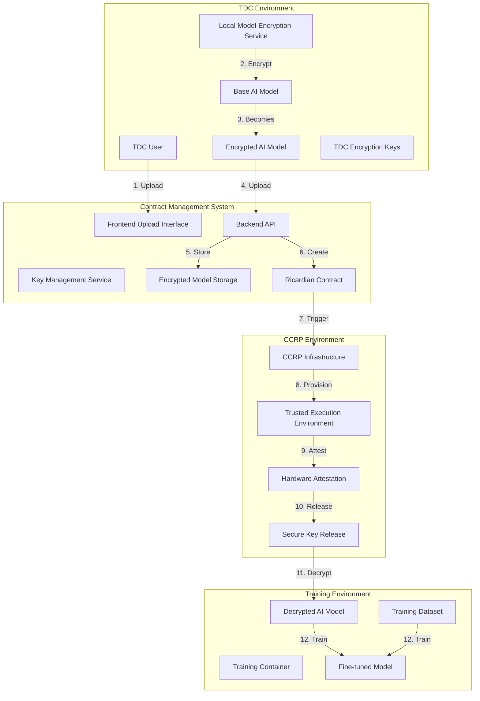

# 🤖 TDC Encrypted AI Model Upload & TEE-Based Decryption Flow

## 📋 Overview

This document outlines the complete flow for how Training Data Consumers (TDCs) upload and configure encrypted AI models that are only decrypted within Trusted Execution Environments (TEEs) as specified in contracts. This ensures maximum model privacy and intellectual property protection throughout the training process.

## 🏗️ Architecture Overview



## 🔄 Complete Flow Breakdown

### **Phase 1: TDC AI Model Preparation & Upload**

#### **1.1 Local Model Encryption (TDC Side)**
```javascript
// TDC performs local encryption before upload
class TDCLocalModelEncryption {
  async prepareModelForUpload(baseModel, contractSpecs) {
    // 1. Generate encryption key locally
    const encryptionKey = await this.generateModelEncryptionKey();
    
    // 2. Encrypt model with TDC's own key
    const encryptedModel = await this.encryptModel(baseModel, encryptionKey);
    
    // 3. Create model metadata
    const metadata = {
      modelId: this.generateModelId(),
      name: baseModel.name,
      description: baseModel.description,
      type: baseModel.type, // e.g., 'transformer', 'cnn', 'rnn'
      framework: baseModel.framework, // e.g., 'pytorch', 'tensorflow', 'huggingface'
      version: baseModel.version,
      size: baseModel.size,
      parameters: baseModel.parameters,
      architecture: baseModel.architecture,
      encryption: {
        algorithm: 'AES-256-GCM',
        keyId: encryptionKey.id,
        encrypted: true,
        tdcControlled: true
      },
      contractRequirements: {
        teeRequired: contractSpecs.teeRequired,
        attestationRequired: contractSpecs.attestationRequired,
        keyReleaseConditions: contractSpecs.keyReleaseConditions,
        trainingConstraints: contractSpecs.trainingConstraints
      },
      intellectualProperty: {
        license: baseModel.license,
        ownership: baseModel.ownership,
        restrictions: baseModel.restrictions,
        attribution: baseModel.attribution
      }
    };
    
    return {
      encryptedModel,
      metadata,
      encryptionKey // Keep locally, never upload
    };
  }

  async encryptModel(model, encryptionKey) {
    // Encrypt model files (weights, config, tokenizer, etc.)
    const encryptedFiles = {};
    
    for (const [filename, fileData] of Object.entries(model.files)) {
      encryptedFiles[filename] = await this.encryptFile(fileData, encryptionKey);
    }
    
    return {
      encryptedFiles,
      modelStructure: model.structure,
      encryptionMetadata: {
        keyId: encryptionKey.id,
        algorithm: 'AES-256-GCM',
        timestamp: new Date().toISOString()
      }
    };
  }
}
```

#### **1.2 Frontend Upload Interface**
```javascript
// Frontend component for TDC AI model upload
const TDCAIModelUpload = () => {
  const [uploadState, setUploadState] = useState({
    step: 'select', // select, encrypt, upload, configure
    model: null,
    encryptionConfig: null,
    contractSpecs: null
  });

  const handleModelSelection = async (model) => {
    // 1. Validate model format and compatibility
    const validation = await validateAIModel(model);
    if (!validation.valid) {
      throw new Error(validation.error);
    }

    // 2. Get contract specifications for encryption requirements
    const contractSpecs = await getContractSpecifications();
    
    setUploadState(prev => ({
      ...prev,
      step: 'encrypt',
      model,
      contractSpecs
    }));
  };

  const handleEncryption = async () => {
    // 1. Perform local encryption
    const encryptionService = new TDCLocalModelEncryption();
    const { encryptedModel, metadata, encryptionKey } = 
      await encryptionService.prepareModelForUpload(
        uploadState.model, 
        uploadState.contractSpecs
      );

    // 2. Store encryption key locally (never upload)
    await storeModelEncryptionKeyLocally(encryptionKey);

    setUploadState(prev => ({
      ...prev,
      step: 'upload',
      encryptedModel,
      metadata,
      encryptionConfig: {
        keyId: encryptionKey.id,
        algorithm: 'AES-256-GCM',
        tdcControlled: true
      }
    }));
  };

  const handleUpload = async () => {
    // 1. Upload encrypted model (never the key)
    const uploadResponse = await apiService.uploadEncryptedAIModel({
      model: uploadState.encryptedModel,
      metadata: uploadState.metadata,
      encryptionConfig: uploadState.encryptionConfig
    });

    // 2. Configure TEE requirements
    await configureTEERequirements(uploadResponse.modelId);

    setUploadState(prev => ({
      ...prev,
      step: 'configure'
    }));
  };

  return (
    <div className="tdc-ai-model-upload">
      {uploadState.step === 'select' && (
        <AIModelSelection onSelect={handleModelSelection} />
      )}
      {uploadState.step === 'encrypt' && (
        <ModelEncryptionProgress onComplete={handleEncryption} />
      )}
      {uploadState.step === 'upload' && (
        <ModelUploadProgress onComplete={handleUpload} />
      )}
      {uploadState.step === 'configure' && (
        <TEEConfiguration modelId={uploadState.metadata.modelId} />
      )}
    </div>
  );
};
```

### **Phase 2: Backend Storage & Contract Integration**

#### **2.1 Backend Model Storage**
```javascript
// Backend API for encrypted AI model storage
class AIModelService {
  async storeEncryptedModel(uploadData, tdcUser) {
    try {
      // 1. Validate encrypted model
      const validation = await this.validateEncryptedAIModel(uploadData);
      if (!validation.valid) {
        throw new Error(validation.error);
      }

      // 2. Store encrypted model in secure storage
      const storageResult = await this.storeInSecureModelStorage(
        uploadData.encryptedModel,
        uploadData.metadata
      );

      // 3. Create model record in database
      const model = await this.createAIModelRecord({
        ...uploadData.metadata,
        storageLocation: storageResult.location,
        tdcUserId: tdcUser.id,
        encryptionConfig: uploadData.encryptionConfig,
        status: 'encrypted_stored'
      });

      // 4. Log encryption event
      await this.logModelEncryptionEvent('AI_MODEL_ENCRYPTED', {
        modelId: model.modelId,
        tdcUserId: tdcUser.id,
        encryptionAlgorithm: uploadData.encryptionConfig.algorithm,
        keyId: uploadData.encryptionConfig.keyId,
        modelType: model.type,
        modelSize: model.size
      });

      return {
        success: true,
        model,
        message: 'Encrypted AI model stored successfully'
      };

    } catch (error) {
      logger.error('Error storing encrypted AI model:', error);
      throw error;
    }
  }

  async storeInSecureModelStorage(encryptedModel, metadata) {
    // Store in cloud storage with additional encryption
    const storageService = new SecureModelStorageService();
    return await storageService.store({
      data: encryptedModel,
      metadata,
      additionalEncryption: true,
      accessControl: 'tee_only',
      modelType: metadata.type
    });
  }

  async validateEncryptedAIModel(uploadData) {
    // Validate model structure, encryption, and compatibility
    const validation = {
      valid: true,
      errors: []
    };

    // Check model structure
    if (!uploadData.encryptedModel.encryptedFiles) {
      validation.valid = false;
      validation.errors.push('Missing encrypted model files');
    }

    // Check encryption configuration
    if (!uploadData.encryptionConfig.tdcControlled) {
      validation.valid = false;
      validation.errors.push('Model encryption must be TDC controlled');
    }

    // Check model compatibility
    const compatibility = await this.checkModelCompatibility(uploadData.metadata);
    if (!compatibility.compatible) {
      validation.valid = false;
      validation.errors.push(...compatibility.errors);
    }

    return validation;
  }
}
```

#### **2.2 Contract Integration**
```javascript
// Contract service integration for AI models
class ContractService {
  async createContractWithEncryptedModel(contractData, modelId) {
    try {
      // 1. Get model information
      const model = await this.getAIModel(modelId);
      
      // 2. Validate TEE requirements
      const teeValidation = await this.validateTEERequirements(
        model.encryptionConfig,
        contractData.teeSpecifications
      );

      // 3. Create Ricardian contract with model encryption terms
      const contract = await this.createRicardianContract({
        ...contractData,
        aiModel: {
          modelId: model.modelId,
          encryption: model.encryptionConfig,
          teeRequirements: {
            attestationRequired: true,
            keyReleaseConditions: [
              'hardware_attestation_verified',
              'contract_terms_accepted',
              'training_environment_isolated',
              'model_usage_restrictions_enforced'
            ],
            decryptionLocation: 'tee_only',
            trainingConstraints: model.contractRequirements.trainingConstraints
          },
          intellectualProperty: model.intellectualProperty
        }
      });

      // 4. Store contract with model encryption metadata
      await this.storeContractWithModelEncryption(contract, model);

      return contract;

    } catch (error) {
      logger.error('Error creating contract with encrypted AI model:', error);
      throw error;
    }
  }
}
```

### **Phase 3: TEE Provisioning & Key Release**

#### **3.1 CCRP TEE Provisioning for AI Models**
```javascript
// CCRP TEE provisioning service for AI models
class CCRPTEEService {
  async provisionTEEForModelTraining(contract) {
    try {
      // 1. Provision confidential computing environment for model training
      const teeEnvironment = await this.provisionConfidentialEnvironment({
        contractId: contract.contractId,
        modelId: contract.aiModel.modelId,
        requirements: contract.aiModel.teeRequirements,
        trainingConstraints: contract.aiModel.trainingConstraints
      });

      // 2. Configure hardware attestation for model protection
      await this.configureModelHardwareAttestation(teeEnvironment);

      // 3. Setup secure key release mechanism for model decryption
      await this.setupSecureModelKeyRelease(teeEnvironment, contract);

      // 4. Initialize training container with model support
      const trainingContainer = await this.initializeModelTrainingContainer(
        teeEnvironment,
        contract
      );

      return {
        teeEnvironment,
        trainingContainer,
        attestationConfig: teeEnvironment.attestation,
        modelProtectionConfig: teeEnvironment.modelProtection
      };

    } catch (error) {
      logger.error('Error provisioning TEE for model training:', error);
      throw error;
    }
  }

  async setupSecureModelKeyRelease(teeEnvironment, contract) {
    // Configure secure key release for TDC model encryption keys
    const keyReleaseConfig = {
      teeEnvironmentId: teeEnvironment.id,
      contractId: contract.contractId,
      modelId: contract.aiModel.modelId,
      releaseConditions: contract.aiModel.teeRequirements.keyReleaseConditions,
      attestationRequired: true,
      keySource: 'tdc_controlled',
      modelProtection: {
        intellectualPropertyProtection: true,
        usageRestrictions: contract.aiModel.intellectualProperty.restrictions,
        attributionRequired: contract.aiModel.intellectualProperty.attribution
      }
    };

    await this.configureModelKeyReleaseService(keyReleaseConfig);
  }
}
```

#### **3.2 Secure Model Key Release Process**
```javascript
// Secure key release service for AI models
class SecureModelKeyReleaseService {
  async initiateModelKeyRelease(contractId, teeEnvironmentId) {
    try {
      // 1. Verify TEE attestation for model protection
      const attestation = await this.verifyTEEAttestation(teeEnvironmentId);
      if (!attestation.verified) {
        throw new Error('TEE attestation failed');
      }

      // 2. Validate contract conditions for model usage
      const contractValidation = await this.validateModelContractConditions(contractId);
      if (!contractValidation.valid) {
        throw new Error('Model contract conditions not met');
      }

      // 3. Request model key from TDC
      const keyRequest = await this.requestModelKeyFromTDC(contractId, {
        teeEnvironmentId,
        attestationProof: attestation.proof,
        contractValidation: contractValidation.proof,
        modelProtectionRequirements: contractValidation.modelProtection
      });

      // 4. Release model key to TEE
      const keyRelease = await this.releaseModelKeyToTEE(
        keyRequest.encryptionKey,
        teeEnvironmentId,
        contractId
      );

      return {
        success: true,
        keyReleaseId: keyRelease.id,
        teeEnvironmentId,
        contractId,
        modelProtectionActive: true
      };

    } catch (error) {
      logger.error('Error in secure model key release:', error);
      throw error;
    }
  }

  async requestModelKeyFromTDC(contractId, requestData) {
    // Contact TDC to release their model encryption key
    const tdcNotification = await this.notifyTDCOfModelKeyRequest(contractId, requestData);
    
    // TDC validates request and releases model key
    const tdcResponse = await this.waitForTDCModelKeyRelease(contractId);
    
    return tdcResponse;
  }
}
```

### **Phase 4: TEE-Based Model Decryption & Training**

#### **4.1 TEE Model Decryption Process**
```javascript
// TEE-based model decryption service
class TEEModelDecryptionService {
  async decryptModelInTEE(encryptedModel, encryptionKey, teeEnvironment) {
    try {
      // 1. Verify TEE environment for model protection
      const teeVerification = await this.verifyTEEEnvironment(teeEnvironment);
      if (!teeVerification.verified) {
        throw new Error('TEE environment verification failed');
      }

      // 2. Perform model decryption within TEE
      const decryptedModel = await this.performTEEModelDecryption(
        encryptedModel,
        encryptionKey,
        teeEnvironment
      );

      // 3. Validate decrypted model
      const modelValidation = await this.validateDecryptedModel(decryptedModel);
      if (!modelValidation.valid) {
        throw new Error('Decrypted model validation failed');
      }

      // 4. Log model decryption event
      await this.logTEEModelDecryptionEvent({
        teeEnvironmentId: teeEnvironment.id,
        modelId: encryptedModel.modelId,
        decryptionTimestamp: new Date().toISOString(),
        verificationProof: teeVerification.proof,
        modelProtectionActive: true
      });

      return {
        decryptedModel,
        decryptionProof: teeVerification.proof,
        validationProof: modelValidation.proof,
        modelProtectionStatus: 'active'
      };

    } catch (error) {
      logger.error('Error in TEE model decryption:', error);
      throw error;
    }
  }

  async performTEEModelDecryption(encryptedModel, encryptionKey, teeEnvironment) {
    // Model decryption happens entirely within the TEE
    // No plaintext model data ever leaves the secure environment
    const modelDecryptionService = new TEEModelDecryptionEngine(teeEnvironment);
    return await modelDecryptionService.decrypt(encryptedModel, encryptionKey);
  }
}
```

#### **4.2 Model Training Execution**
```javascript
// Model training execution within TEE
class TEEModelTrainingService {
  async executeModelTrainingInTEE(contract, decryptedModel, dataset) {
    try {
      // 1. Initialize model training environment within TEE
      const trainingEnvironment = await this.initializeTEEModelTrainingEnvironment(
        contract,
        decryptedModel,
        dataset
      );

      // 2. Execute model training with privacy and IP protections
      const trainingResult = await this.executeModelTrainingWithProtections(
        trainingEnvironment,
        contract.privacyRequirements,
        contract.aiModel.intellectualProperty
      );

      // 3. Validate training results
      const resultValidation = await this.validateModelTrainingResults(
        trainingResult,
        contract.validationRequirements
      );

      // 4. Secure result export with IP protection
      const secureResults = await this.exportModelResultsSecurely(
        trainingResult,
        contract.exportRequirements,
        contract.aiModel.intellectualProperty
      );

      return {
        trainingResult: secureResults,
        validationProof: resultValidation.proof,
        privacyProof: trainingResult.privacyProof,
        ipProtectionProof: trainingResult.ipProtectionProof
      };

    } catch (error) {
      logger.error('Error in TEE model training execution:', error);
      throw error;
    }
  }

  async executeModelTrainingWithProtections(trainingEnvironment, privacyRequirements, ipProtection) {
    // Execute training with both privacy and intellectual property protections
    const protectedTrainingService = new ProtectedModelTrainingService(trainingEnvironment);
    
    return await protectedTrainingService.train({
      model: trainingEnvironment.decryptedModel,
      dataset: trainingEnvironment.dataset,
      privacyProtections: privacyRequirements,
      ipProtections: ipProtection,
      trainingConstraints: trainingEnvironment.contract.trainingConstraints
    });
  }
}
```

## 🎯 Frontend Support Implementation

### **Frontend Components Required**

#### **1. TDC AI Model Upload Component**
```javascript
// Complete TDC AI model upload component
const TDCAIModelUpload = () => {
  const [uploadFlow, setUploadFlow] = useState({
    currentStep: 'selection',
    model: null,
    encryptionConfig: null,
    contractSpecs: null,
    uploadProgress: 0
  });

  const steps = [
    'Model Selection',
    'Local Encryption',
    'Secure Upload',
    'TEE Configuration',
    'Contract Integration'
  ];

  return (
    <div className="tdc-ai-model-upload-container">
      <Stepper activeStep={uploadFlow.currentStep} alternativeLabel>
        {steps.map((label) => (
          <Step key={label}>
            <StepLabel>{label}</StepLabel>
          </Step>
        ))}
      </Stepper>

      <div className="upload-content">
        {uploadFlow.currentStep === 0 && (
          <AIModelSelectionStep 
            onModelSelected={handleModelSelection}
            onNext={handleNextStep}
          />
        )}
        
        {uploadFlow.currentStep === 1 && (
          <LocalModelEncryptionStep
            model={uploadFlow.model}
            contractSpecs={uploadFlow.contractSpecs}
            onEncryptionComplete={handleEncryptionComplete}
            onNext={handleNextStep}
          />
        )}
        
        {uploadFlow.currentStep === 2 && (
          <SecureModelUploadStep
            encryptedModel={uploadFlow.encryptedModel}
            metadata={uploadFlow.metadata}
            progress={uploadFlow.uploadProgress}
            onUploadComplete={handleUploadComplete}
          />
        )}
        
        {uploadFlow.currentStep === 3 && (
          <TEEConfigurationStep
            modelId={uploadFlow.metadata?.modelId}
            onConfigurationComplete={handleConfigurationComplete}
          />
        )}
        
        {uploadFlow.currentStep === 4 && (
          <ContractIntegrationStep
            modelId={uploadFlow.metadata?.modelId}
            onContractCreated={handleContractCreated}
          />
        )}
      </div>
    </div>
  );
};
```

#### **2. AI Model Selection Component**
```javascript
const AIModelSelectionStep = ({ onModelSelected, onNext }) => {
  const [selectedModel, setSelectedModel] = useState(null);
  const [modelFiles, setModelFiles] = useState([]);
  const [modelMetadata, setModelMetadata] = useState({
    name: '',
    description: '',
    type: '',
    framework: '',
    version: '',
    license: '',
    ownership: ''
  });

  const handleFileUpload = async (files) => {
    const modelFiles = Array.from(files).map(file => ({
      name: file.name,
      size: file.size,
      type: file.type,
      data: file
    }));
    
    setModelFiles(modelFiles);
    
    // Auto-detect model type and framework
    const modelInfo = await detectModelInfo(modelFiles);
    setModelMetadata(prev => ({
      ...prev,
      ...modelInfo
    }));
  };

  const handleModelSelection = () => {
    const model = {
      files: modelFiles,
      metadata: modelMetadata,
      structure: analyzeModelStructure(modelFiles)
    };
    
    onModelSelected(model);
    onNext();
  };

  return (
    <div className="ai-model-selection-step">
      <Typography variant="h6" gutterBottom>
        Select AI Model for Upload
      </Typography>
      
      <Card className="model-upload-card">
        <CardContent>
          <Dropzone
            onDrop={handleFileUpload}
            accept={{
              'application/octet-stream': ['.bin', '.safetensors'],
              'application/json': ['.json'],
              'text/plain': ['.txt', '.vocab']
            }}
            multiple
          >
            {({ getRootProps, getInputProps, isDragActive }) => (
              <div {...getRootProps()} className={`dropzone ${isDragActive ? 'active' : ''}`}>
                <input {...getInputProps()} />
                <CloudUploadIcon className="upload-icon" />
                <Typography variant="h6">
                  {isDragActive ? 'Drop model files here' : 'Drag & drop model files'}
                </Typography>
                <Typography variant="body2" color="textSecondary">
                  Supported formats: PyTorch (.bin, .safetensors), TensorFlow (.pb), HuggingFace models
                </Typography>
              </div>
            )}
          </Dropzone>
        </CardContent>
      </Card>

      {modelFiles.length > 0 && (
        <Card className="model-files-card">
          <CardContent>
            <Typography variant="h6" gutterBottom>
              Model Files ({modelFiles.length})
            </Typography>
            <List>
              {modelFiles.map((file, index) => (
                <ListItem key={index}>
                  <ListItemIcon>
                    <DescriptionIcon />
                  </ListItemIcon>
                  <ListItemText
                    primary={file.name}
                    secondary={`${(file.size / 1024 / 1024).toFixed(2)} MB`}
                  />
                </ListItem>
              ))}
            </List>
          </CardContent>
        </Card>
      )}

      <Card className="model-metadata-card">
        <CardContent>
          <Typography variant="h6" gutterBottom>
            Model Metadata
          </Typography>
          <Grid container spacing={2}>
            <Grid item xs={12} md={6}>
              <TextField
                fullWidth
                label="Model Name"
                value={modelMetadata.name}
                onChange={(e) => setModelMetadata(prev => ({ ...prev, name: e.target.value }))}
              />
            </Grid>
            <Grid item xs={12} md={6}>
              <TextField
                fullWidth
                label="Model Type"
                value={modelMetadata.type}
                onChange={(e) => setModelMetadata(prev => ({ ...prev, type: e.target.value }))}
                select
              >
                <MenuItem value="transformer">Transformer</MenuItem>
                <MenuItem value="cnn">CNN</MenuItem>
                <MenuItem value="rnn">RNN</MenuItem>
                <MenuItem value="gan">GAN</MenuItem>
                <MenuItem value="other">Other</MenuItem>
              </TextField>
            </Grid>
            <Grid item xs={12} md={6}>
              <TextField
                fullWidth
                label="Framework"
                value={modelMetadata.framework}
                onChange={(e) => setModelMetadata(prev => ({ ...prev, framework: e.target.value }))}
                select
              >
                <MenuItem value="pytorch">PyTorch</MenuItem>
                <MenuItem value="tensorflow">TensorFlow</MenuItem>
                <MenuItem value="huggingface">HuggingFace</MenuItem>
                <MenuItem value="onnx">ONNX</MenuItem>
                <MenuItem value="other">Other</MenuItem>
              </TextField>
            </Grid>
            <Grid item xs={12} md={6}>
              <TextField
                fullWidth
                label="License"
                value={modelMetadata.license}
                onChange={(e) => setModelMetadata(prev => ({ ...prev, license: e.target.value }))}
                select
              >
                <MenuItem value="mit">MIT</MenuItem>
                <MenuItem value="apache-2.0">Apache 2.0</MenuItem>
                <MenuItem value="gpl-3.0">GPL 3.0</MenuItem>
                <MenuItem value="proprietary">Proprietary</MenuItem>
                <MenuItem value="other">Other</MenuItem>
              </TextField>
            </Grid>
            <Grid item xs={12}>
              <TextField
                fullWidth
                label="Description"
                value={modelMetadata.description}
                onChange={(e) => setModelMetadata(prev => ({ ...prev, description: e.target.value }))}
                multiline
                rows={3}
              />
            </Grid>
          </Grid>
        </CardContent>
      </Card>

      <Button
        variant="contained"
        color="primary"
        onClick={handleModelSelection}
        disabled={modelFiles.length === 0}
        className="select-model-button"
      >
        Select Model
      </Button>
    </div>
  );
};
```

#### **3. Model Encryption Configuration Component**
```javascript
const LocalModelEncryptionStep = ({ model, contractSpecs, onEncryptionComplete }) => {
  const [encryptionState, setEncryptionState] = useState({
    status: 'preparing',
    progress: 0,
    encryptionConfig: null
  });

  useEffect(() => {
    performLocalModelEncryption();
  }, []);

  const performLocalModelEncryption = async () => {
    try {
      setEncryptionState(prev => ({ ...prev, status: 'encrypting' }));

      // 1. Generate model encryption key locally
      const encryptionKey = await generateModelEncryptionKey();
      setEncryptionState(prev => ({ ...prev, progress: 20 }));

      // 2. Encrypt model files
      const encryptedModel = await encryptModelFiles(model, encryptionKey);
      setEncryptionState(prev => ({ ...prev, progress: 70 }));

      // 3. Create model metadata
      const metadata = createModelMetadata(model, encryptionKey, contractSpecs);
      setEncryptionState(prev => ({ ...prev, progress: 90 }));

      // 4. Store key locally (never upload)
      await storeModelEncryptionKeyLocally(encryptionKey);
      setEncryptionState(prev => ({ ...prev, progress: 100 }));

      setEncryptionState(prev => ({
        ...prev,
        status: 'completed',
        encryptionConfig: {
          keyId: encryptionKey.id,
          algorithm: 'AES-256-GCM',
          tdcControlled: true
        }
      }));

      onEncryptionComplete({
        encryptedModel,
        metadata,
        encryptionConfig: encryptionState.encryptionConfig
      });

    } catch (error) {
      setEncryptionState(prev => ({ ...prev, status: 'error', error }));
    }
  };

  return (
    <div className="model-encryption-step">
      <Typography variant="h6" gutterBottom>
        Local AI Model Encryption
      </Typography>
      
      <LinearProgress 
        variant="determinate" 
        value={encryptionState.progress} 
        className="encryption-progress"
      />
      
      <Typography variant="body2" color="textSecondary">
        {encryptionState.status === 'preparing' && 'Preparing model encryption...'}
        {encryptionState.status === 'encrypting' && 'Encrypting AI model locally...'}
        {encryptionState.status === 'completed' && 'Model encryption completed successfully!'}
        {encryptionState.status === 'error' && `Error: ${encryptionState.error}`}
      </Typography>

      {encryptionState.status === 'completed' && (
        <Alert severity="success" className="encryption-success">
          <AlertTitle>Model Encryption Complete</AlertTitle>
          Your AI model has been encrypted locally with your own key. 
          The encryption key remains under your control and is never uploaded to our servers.
          Your intellectual property is protected throughout the training process.
        </Alert>
      )}

      <Card className="encryption-details-card">
        <CardContent>
          <Typography variant="h6" gutterBottom>
            Encryption Details
          </Typography>
          <List>
            <ListItem>
              <ListItemIcon>
                <SecurityIcon />
              </ListItemIcon>
              <ListItemText
                primary="Algorithm"
                secondary="AES-256-GCM"
              />
            </ListItem>
            <ListItem>
              <ListItemIcon>
                <KeyIcon />
              </ListItemIcon>
              <ListItemText
                primary="Key Control"
                secondary="TDC Controlled"
              />
            </ListItem>
            <ListItem>
              <ListItemIcon>
                <ShieldIcon />
              </ListItemIcon>
              <ListItemText
                primary="IP Protection"
                secondary="Active"
              />
            </ListItem>
          </List>
        </CardContent>
      </Card>
    </div>
  );
};
```

#### **4. TEE Configuration for AI Models**
```javascript
const TEEConfigurationStep = ({ modelId, onConfigurationComplete }) => {
  const [teeConfig, setTeeConfig] = useState({
    attestationRequired: true,
    hardwareSecurityModule: true,
    secureEnclave: true,
    networkIsolation: true,
    modelProtection: {
      intellectualPropertyProtection: true,
      usageRestrictions: true,
      attributionRequired: true,
      derivativeWorkProtection: true
    },
    keyReleaseConditions: [
      'hardware_attestation_verified',
      'contract_terms_accepted',
      'training_environment_isolated',
      'model_usage_restrictions_enforced'
    ]
  });

  const handleTEEConfiguration = async () => {
    try {
      const response = await apiService.configureTEERequirements(modelId, teeConfig);
      
      if (response.success) {
        onConfigurationComplete(response.teeConfiguration);
      }
    } catch (error) {
      console.error('Error configuring TEE requirements:', error);
    }
  };

  return (
    <div className="tee-configuration-step">
      <Typography variant="h6" gutterBottom>
        Trusted Execution Environment Configuration
      </Typography>
      
      <FormControl component="fieldset">
        <FormLabel component="legend">Security Requirements</FormLabel>
        <FormGroup>
          <FormControlLabel
            control={
              <Checkbox
                checked={teeConfig.attestationRequired}
                onChange={(e) => setTeeConfig(prev => ({
                  ...prev,
                  attestationRequired: e.target.checked
                }))}
              />
            }
            label="Hardware Attestation Required"
          />
          <FormControlLabel
            control={
              <Checkbox
                checked={teeConfig.hardwareSecurityModule}
                onChange={(e) => setTeeConfig(prev => ({
                  ...prev,
                  hardwareSecurityModule: e.target.checked
                }))}
              />
            }
            label="Hardware Security Module"
          />
          <FormControlLabel
            control={
              <Checkbox
                checked={teeConfig.secureEnclave}
                onChange={(e) => setTeeConfig(prev => ({
                  ...prev,
                  secureEnclave: e.target.checked
                }))}
              />
            }
            label="Secure Enclave Protection"
          />
          <FormControlLabel
            control={
              <Checkbox
                checked={teeConfig.networkIsolation}
                onChange={(e) => setTeeConfig(prev => ({
                  ...prev,
                  networkIsolation: e.target.checked
                }))}
              />
            }
            label="Network Isolation"
          />
        </FormGroup>
      </FormControl>

      <FormControl component="fieldset">
        <FormLabel component="legend">Intellectual Property Protection</FormLabel>
        <FormGroup>
          <FormControlLabel
            control={
              <Checkbox
                checked={teeConfig.modelProtection.intellectualPropertyProtection}
                onChange={(e) => setTeeConfig(prev => ({
                  ...prev,
                  modelProtection: {
                    ...prev.modelProtection,
                    intellectualPropertyProtection: e.target.checked
                  }
                }))}
              />
            }
            label="Intellectual Property Protection"
          />
          <FormControlLabel
            control={
              <Checkbox
                checked={teeConfig.modelProtection.usageRestrictions}
                onChange={(e) => setTeeConfig(prev => ({
                  ...prev,
                  modelProtection: {
                    ...prev.modelProtection,
                    usageRestrictions: e.target.checked
                  }
                }))}
              />
            }
            label="Usage Restrictions Enforcement"
          />
          <FormControlLabel
            control={
              <Checkbox
                checked={teeConfig.modelProtection.attributionRequired}
                onChange={(e) => setTeeConfig(prev => ({
                  ...prev,
                  modelProtection: {
                    ...prev.modelProtection,
                    attributionRequired: e.target.checked
                  }
                }))}
              />
            }
            label="Attribution Required"
          />
          <FormControlLabel
            control={
              <Checkbox
                checked={teeConfig.modelProtection.derivativeWorkProtection}
                onChange={(e) => setTeeConfig(prev => ({
                  ...prev,
                  modelProtection: {
                    ...prev.modelProtection,
                    derivativeWorkProtection: e.target.checked
                  }
                }))}
              />
            }
            label="Derivative Work Protection"
          />
        </FormGroup>
      </FormControl>

      <Typography variant="body2" color="textSecondary" className="tee-info">
        Your AI model will only be decrypted within a verified Trusted Execution Environment
        that meets these security requirements. The decryption key will only be released
        when all conditions are satisfied and your intellectual property is protected.
      </Typography>

      <Button
        variant="contained"
        color="primary"
        onClick={handleTEEConfiguration}
        className="configure-tee-button"
      >
        Configure TEE Requirements
      </Button>
    </div>
  );
};
```

## 🔒 Security Features

### **1. End-to-End Model Encryption**
- **TDC-Controlled Keys**: Model encryption keys remain under TDC control
- **Local Encryption**: AI model encrypted before leaving TDC environment
- **TEE-Only Decryption**: Model decryption only occurs within verified TEE
- **Key Isolation**: Keys never stored in central system

### **2. Intellectual Property Protection**
- **Model Ownership**: Clear ownership and licensing information
- **Usage Restrictions**: Enforced usage restrictions during training
- **Attribution Requirements**: Mandatory attribution for model usage
- **Derivative Work Protection**: Protection against unauthorized derivatives

### **3. Hardware Attestation for Models**
- **TEE Verification**: Hardware attestation verifies TEE integrity
- **Model Protection**: Verified secure environment for model decryption
- **Memory Protection**: Encrypted memory and secure enclaves
- **Network Isolation**: Isolated network environment

### **4. Contract-Based Key Release**
- **Conditional Release**: Keys only released when contract conditions met
- **IP Protection**: Intellectual property protections enforced
- **Multi-Factor Validation**: Multiple validation steps required
- **Audit Trail**: Complete audit trail of key release process

### **5. Training Privacy Protection**
- **Differential Privacy**: Privacy-preserving training techniques
- **Model Isolation**: Models isolated during training
- **Result Protection**: Training results protected and validated
- **Secure Export**: Secure export of training results

## 📊 Implementation Status

### **✅ Implemented Features**
- Basic AI model upload functionality
- Local model encryption service
- Contract creation with model encryption metadata
- TEE provisioning infrastructure
- Hardware attestation framework

### **🔄 In Progress**
- Secure model key release mechanism
- TEE-based model decryption service
- Frontend model upload flow components
- Contract-based model key release conditions

### **⏳ Pending Implementation**
- Complete TDC model upload interface
- TEE configuration components for models
- Secure model key release UI
- Model training execution within TEE
- Result validation and export with IP protection

## 🎯 Next Steps

1. **Complete Frontend Components**: Implement all TDC model upload flow components
2. **Secure Model Key Release**: Finalize secure model key release mechanism
3. **TEE Model Integration**: Complete TEE-based model decryption and training
4. **IP Protection**: Implement comprehensive intellectual property protection
5. **Testing**: Comprehensive testing of entire model flow
6. **Documentation**: Complete user documentation and guides

---

**This flow ensures that TDC AI models remain encrypted and under TDC control until they are securely decrypted within a verified Trusted Execution Environment, providing maximum security and intellectual property protection for sensitive AI models throughout the training process.**
