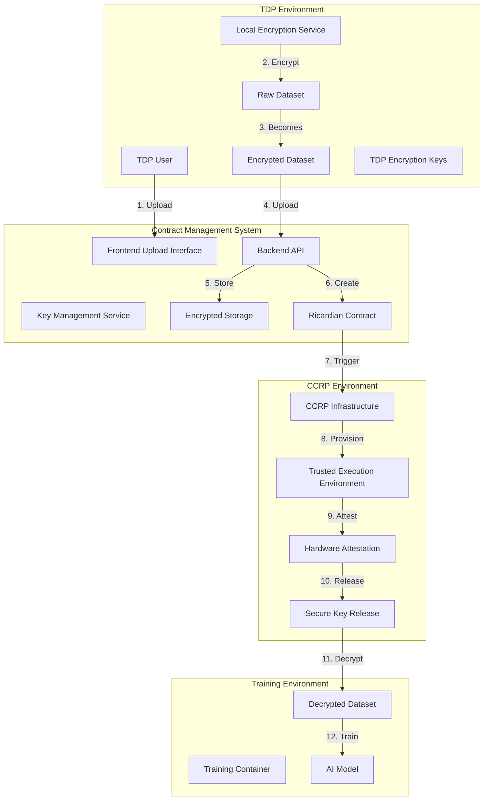

# 🔐 TDP Encrypted Dataset Upload & TEE-Based Decryption Flow

## 📋 Overview

This document outlines the complete flow for how Training Data Providers (TDPs) upload and configure encrypted datasets that are only decrypted within Trusted Execution Environments (TEEs) as specified in contracts. This ensures maximum data privacy and security throughout the training process.

## 🏗️ Architecture Overview



## 🔄 Complete Flow Breakdown

### **Phase 1: TDP Dataset Preparation & Upload**

#### **1.1 Local Dataset Encryption (TDP Side)**
```javascript
// TDP performs local encryption before upload
class TDPLocalEncryption {
  async prepareDatasetForUpload(dataset, contractSpecs) {
    // 1. Generate encryption key locally
    const encryptionKey = await this.generateEncryptionKey();
    
    // 2. Encrypt dataset with TDP's own key
    const encryptedDataset = await this.encryptDataset(dataset, encryptionKey);
    
    // 3. Create dataset metadata
    const metadata = {
      datasetId: this.generateDatasetId(),
      name: dataset.name,
      description: dataset.description,
      size: dataset.size,
      format: dataset.format,
      encryption: {
        algorithm: 'AES-256-GCM',
        keyId: encryptionKey.id,
        encrypted: true,
        tdpControlled: true
      },
      contractRequirements: {
        teeRequired: contractSpecs.teeRequired,
        attestationRequired: contractSpecs.attestationRequired,
        keyReleaseConditions: contractSpecs.keyReleaseConditions
      }
    };
    
    return {
      encryptedDataset,
      metadata,
      encryptionKey // Keep locally, never upload
    };
  }
}
```

#### **1.2 Frontend Upload Interface**
```javascript
// Frontend component for TDP dataset upload
const TDPDatasetUpload = () => {
  const [uploadState, setUploadState] = useState({
    step: 'select', // select, encrypt, upload, configure
    dataset: null,
    encryptionConfig: null,
    contractSpecs: null
  });

  const handleDatasetSelection = async (dataset) => {
    // 1. Validate dataset format and size
    const validation = await validateDataset(dataset);
    if (!validation.valid) {
      throw new Error(validation.error);
    }

    // 2. Get contract specifications for encryption requirements
    const contractSpecs = await getContractSpecifications();
    
    setUploadState(prev => ({
      ...prev,
      step: 'encrypt',
      dataset,
      contractSpecs
    }));
  };

  const handleEncryption = async () => {
    // 1. Perform local encryption
    const encryptionService = new TDPLocalEncryption();
    const { encryptedDataset, metadata, encryptionKey } = 
      await encryptionService.prepareDatasetForUpload(
        uploadState.dataset, 
        uploadState.contractSpecs
      );

    // 2. Store encryption key locally (never upload)
    await storeEncryptionKeyLocally(encryptionKey);

    setUploadState(prev => ({
      ...prev,
      step: 'upload',
      encryptedDataset,
      metadata,
      encryptionConfig: {
        keyId: encryptionKey.id,
        algorithm: 'AES-256-GCM',
        tdpControlled: true
      }
    }));
  };

  const handleUpload = async () => {
    // 1. Upload encrypted dataset (never the key)
    const uploadResponse = await apiService.uploadEncryptedDataset({
      dataset: uploadState.encryptedDataset,
      metadata: uploadState.metadata,
      encryptionConfig: uploadState.encryptionConfig
    });

    // 2. Configure TEE requirements
    await configureTEERequirements(uploadResponse.datasetId);

    setUploadState(prev => ({
      ...prev,
      step: 'configure'
    }));
  };

  return (
    <div className="tdp-dataset-upload">
      {uploadState.step === 'select' && (
        <DatasetSelection onSelect={handleDatasetSelection} />
      )}
      {uploadState.step === 'encrypt' && (
        <EncryptionProgress onComplete={handleEncryption} />
      )}
      {uploadState.step === 'upload' && (
        <UploadProgress onComplete={handleUpload} />
      )}
      {uploadState.step === 'configure' && (
        <TEEConfiguration datasetId={uploadState.metadata.datasetId} />
      )}
    </div>
  );
};
```

### **Phase 2: Backend Storage & Contract Integration**

#### **2.1 Backend Dataset Storage**
```javascript
// Backend API for encrypted dataset storage
class DatasetService {
  async storeEncryptedDataset(uploadData, tdpUser) {
    try {
      // 1. Validate encrypted dataset
      const validation = await this.validateEncryptedDataset(uploadData);
      if (!validation.valid) {
        throw new Error(validation.error);
      }

      // 2. Store encrypted dataset in secure storage
      const storageResult = await this.storeInSecureStorage(
        uploadData.encryptedDataset,
        uploadData.metadata
      );

      // 3. Create dataset record in database
      const dataset = await this.createDatasetRecord({
        ...uploadData.metadata,
        storageLocation: storageResult.location,
        tdpUserId: tdpUser.id,
        encryptionConfig: uploadData.encryptionConfig,
        status: 'encrypted_stored'
      });

      // 4. Log encryption event
      await this.logEncryptionEvent('DATASET_ENCRYPTED', {
        datasetId: dataset.datasetId,
        tdpUserId: tdpUser.id,
        encryptionAlgorithm: uploadData.encryptionConfig.algorithm,
        keyId: uploadData.encryptionConfig.keyId
      });

      return {
        success: true,
        dataset,
        message: 'Encrypted dataset stored successfully'
      };

    } catch (error) {
      logger.error('Error storing encrypted dataset:', error);
      throw error;
    }
  }

  async storeInSecureStorage(encryptedDataset, metadata) {
    // Store in cloud storage with additional encryption
    const storageService = new SecureStorageService();
    return await storageService.store({
      data: encryptedDataset,
      metadata,
      additionalEncryption: true,
      accessControl: 'tee_only'
    });
  }
}
```

#### **2.2 Contract Integration**
```javascript
// Contract service integration
class ContractService {
  async createContractWithEncryptedDataset(contractData, datasetId) {
    try {
      // 1. Get dataset information
      const dataset = await this.getDataset(datasetId);
      
      // 2. Validate TEE requirements
      const teeValidation = await this.validateTEERequirements(
        dataset.encryptionConfig,
        contractData.teeSpecifications
      );

      // 3. Create Ricardian contract with encryption terms
      const contract = await this.createRicardianContract({
        ...contractData,
        dataset: {
          datasetId: dataset.datasetId,
          encryption: dataset.encryptionConfig,
          teeRequirements: {
            attestationRequired: true,
            keyReleaseConditions: [
              'hardware_attestation_verified',
              'contract_terms_accepted',
              'training_environment_isolated'
            ],
            decryptionLocation: 'tee_only'
          }
        }
      });

      // 4. Store contract with encryption metadata
      await this.storeContractWithEncryption(contract, dataset);

      return contract;

    } catch (error) {
      logger.error('Error creating contract with encrypted dataset:', error);
      throw error;
    }
  }
}
```

### **Phase 3: TEE Provisioning & Key Release**

#### **3.1 CCRP TEE Provisioning**
```javascript
// CCRP TEE provisioning service
class CCRPTEEService {
  async provisionTEEForTraining(contract) {
    try {
      // 1. Provision confidential computing environment
      const teeEnvironment = await this.provisionConfidentialEnvironment({
        contractId: contract.contractId,
        datasetId: contract.dataset.datasetId,
        requirements: contract.dataset.teeRequirements
      });

      // 2. Configure hardware attestation
      await this.configureHardwareAttestation(teeEnvironment);

      // 3. Setup secure key release mechanism
      await this.setupSecureKeyRelease(teeEnvironment, contract);

      // 4. Initialize training container
      const trainingContainer = await this.initializeTrainingContainer(
        teeEnvironment,
        contract
      );

      return {
        teeEnvironment,
        trainingContainer,
        attestationConfig: teeEnvironment.attestation
      };

    } catch (error) {
      logger.error('Error provisioning TEE:', error);
      throw error;
    }
  }

  async setupSecureKeyRelease(teeEnvironment, contract) {
    // Configure secure key release for TDP encryption keys
    const keyReleaseConfig = {
      teeEnvironmentId: teeEnvironment.id,
      contractId: contract.contractId,
      datasetId: contract.dataset.datasetId,
      releaseConditions: contract.dataset.teeRequirements.keyReleaseConditions,
      attestationRequired: true,
      keySource: 'tdp_controlled'
    };

    await this.configureKeyReleaseService(keyReleaseConfig);
  }
}
```

#### **3.2 Secure Key Release Process**
```javascript
// Secure key release service
class SecureKeyReleaseService {
  async initiateKeyRelease(contractId, teeEnvironmentId) {
    try {
      // 1. Verify TEE attestation
      const attestation = await this.verifyTEEAttestation(teeEnvironmentId);
      if (!attestation.verified) {
        throw new Error('TEE attestation failed');
      }

      // 2. Validate contract conditions
      const contractValidation = await this.validateContractConditions(contractId);
      if (!contractValidation.valid) {
        throw new Error('Contract conditions not met');
      }

      // 3. Request key from TDP
      const keyRequest = await this.requestKeyFromTDP(contractId, {
        teeEnvironmentId,
        attestationProof: attestation.proof,
        contractValidation: contractValidation.proof
      });

      // 4. Release key to TEE
      const keyRelease = await this.releaseKeyToTEE(
        keyRequest.encryptionKey,
        teeEnvironmentId,
        contractId
      );

      return {
        success: true,
        keyReleaseId: keyRelease.id,
        teeEnvironmentId,
        contractId
      };

    } catch (error) {
      logger.error('Error in secure key release:', error);
      throw error;
    }
  }

  async requestKeyFromTDP(contractId, requestData) {
    // Contact TDP to release their encryption key
    const tdpNotification = await this.notifyTDPOfKeyRequest(contractId, requestData);
    
    // TDP validates request and releases key
    const tdpResponse = await this.waitForTDPKeyRelease(contractId);
    
    return tdpResponse;
  }
}
```

### **Phase 4: TEE-Based Decryption & Training**

#### **4.1 TEE Decryption Process**
```javascript
// TEE-based decryption service
class TEEDecryptionService {
  async decryptDatasetInTEE(encryptedDataset, encryptionKey, teeEnvironment) {
    try {
      // 1. Verify TEE environment
      const teeVerification = await this.verifyTEEEnvironment(teeEnvironment);
      if (!teeVerification.verified) {
        throw new Error('TEE environment verification failed');
      }

      // 2. Perform decryption within TEE
      const decryptedDataset = await this.performTEEDecryption(
        encryptedDataset,
        encryptionKey,
        teeEnvironment
      );

      // 3. Validate decrypted data
      const dataValidation = await this.validateDecryptedData(decryptedDataset);
      if (!dataValidation.valid) {
        throw new Error('Decrypted data validation failed');
      }

      // 4. Log decryption event
      await this.logTEEDecryptionEvent({
        teeEnvironmentId: teeEnvironment.id,
        datasetId: encryptedDataset.datasetId,
        decryptionTimestamp: new Date().toISOString(),
        verificationProof: teeVerification.proof
      });

      return {
        decryptedDataset,
        decryptionProof: teeVerification.proof,
        validationProof: dataValidation.proof
      };

    } catch (error) {
      logger.error('Error in TEE decryption:', error);
      throw error;
    }
  }

  async performTEEDecryption(encryptedDataset, encryptionKey, teeEnvironment) {
    // Decryption happens entirely within the TEE
    // No plaintext data ever leaves the secure environment
    const decryptionService = new TEEDecryptionEngine(teeEnvironment);
    return await decryptionService.decrypt(encryptedDataset, encryptionKey);
  }
}
```

#### **4.2 Training Execution**
```javascript
// Training execution within TEE
class TEETrainingService {
  async executeTrainingInTEE(contract, decryptedDataset, model) {
    try {
      // 1. Initialize training environment within TEE
      const trainingEnvironment = await this.initializeTEETrainingEnvironment(
        contract,
        decryptedDataset,
        model
      );

      // 2. Execute training with privacy protections
      const trainingResult = await this.executeTrainingWithPrivacy(
        trainingEnvironment,
        contract.privacyRequirements
      );

      // 3. Validate training results
      const resultValidation = await this.validateTrainingResults(
        trainingResult,
        contract.validationRequirements
      );

      // 4. Secure result export
      const secureResults = await this.exportResultsSecurely(
        trainingResult,
        contract.exportRequirements
      );

      return {
        trainingResult: secureResults,
        validationProof: resultValidation.proof,
        privacyProof: trainingResult.privacyProof
      };

    } catch (error) {
      logger.error('Error in TEE training execution:', error);
      throw error;
    }
  }
}
```

## 🎯 Frontend Support Implementation

### **Frontend Components Required**

#### **1. TDP Dataset Upload Component**
```javascript
// Complete TDP dataset upload component
const TDPDatasetUpload = () => {
  const [uploadFlow, setUploadFlow] = useState({
    currentStep: 'selection',
    dataset: null,
    encryptionConfig: null,
    contractSpecs: null,
    uploadProgress: 0
  });

  const steps = [
    'Dataset Selection',
    'Local Encryption',
    'Secure Upload',
    'TEE Configuration',
    'Contract Integration'
  ];

  return (
    <div className="tdp-dataset-upload-container">
      <Stepper activeStep={uploadFlow.currentStep} alternativeLabel>
        {steps.map((label) => (
          <Step key={label}>
            <StepLabel>{label}</StepLabel>
          </Step>
        ))}
      </Stepper>

      <div className="upload-content">
        {uploadFlow.currentStep === 0 && (
          <DatasetSelectionStep 
            onDatasetSelected={handleDatasetSelection}
            onNext={handleNextStep}
          />
        )}
        
        {uploadFlow.currentStep === 1 && (
          <LocalEncryptionStep
            dataset={uploadFlow.dataset}
            contractSpecs={uploadFlow.contractSpecs}
            onEncryptionComplete={handleEncryptionComplete}
            onNext={handleNextStep}
          />
        )}
        
        {uploadFlow.currentStep === 2 && (
          <SecureUploadStep
            encryptedDataset={uploadFlow.encryptedDataset}
            metadata={uploadFlow.metadata}
            progress={uploadFlow.uploadProgress}
            onUploadComplete={handleUploadComplete}
          />
        )}
        
        {uploadFlow.currentStep === 3 && (
          <TEEConfigurationStep
            datasetId={uploadFlow.metadata?.datasetId}
            onConfigurationComplete={handleConfigurationComplete}
          />
        )}
        
        {uploadFlow.currentStep === 4 && (
          <ContractIntegrationStep
            datasetId={uploadFlow.metadata?.datasetId}
            onContractCreated={handleContractCreated}
          />
        )}
      </div>
    </div>
  );
};
```

#### **2. Encryption Configuration Component**
```javascript
const LocalEncryptionStep = ({ dataset, contractSpecs, onEncryptionComplete }) => {
  const [encryptionState, setEncryptionState] = useState({
    status: 'preparing',
    progress: 0,
    encryptionConfig: null
  });

  useEffect(() => {
    performLocalEncryption();
  }, []);

  const performLocalEncryption = async () => {
    try {
      setEncryptionState(prev => ({ ...prev, status: 'encrypting' }));

      // 1. Generate encryption key locally
      const encryptionKey = await generateEncryptionKey();
      setEncryptionState(prev => ({ ...prev, progress: 25 }));

      // 2. Encrypt dataset
      const encryptedDataset = await encryptDataset(dataset, encryptionKey);
      setEncryptionState(prev => ({ ...prev, progress: 75 }));

      // 3. Create metadata
      const metadata = createDatasetMetadata(dataset, encryptionKey, contractSpecs);
      setEncryptionState(prev => ({ ...prev, progress: 100 }));

      // 4. Store key locally (never upload)
      await storeEncryptionKeyLocally(encryptionKey);

      setEncryptionState(prev => ({
        ...prev,
        status: 'completed',
        encryptionConfig: {
          keyId: encryptionKey.id,
          algorithm: 'AES-256-GCM',
          tdpControlled: true
        }
      }));

      onEncryptionComplete({
        encryptedDataset,
        metadata,
        encryptionConfig: encryptionState.encryptionConfig
      });

    } catch (error) {
      setEncryptionState(prev => ({ ...prev, status: 'error', error }));
    }
  };

  return (
    <div className="encryption-step">
      <Typography variant="h6" gutterBottom>
        Local Dataset Encryption
      </Typography>
      
      <LinearProgress 
        variant="determinate" 
        value={encryptionState.progress} 
        className="encryption-progress"
      />
      
      <Typography variant="body2" color="textSecondary">
        {encryptionState.status === 'preparing' && 'Preparing encryption...'}
        {encryptionState.status === 'encrypting' && 'Encrypting dataset locally...'}
        {encryptionState.status === 'completed' && 'Encryption completed successfully!'}
        {encryptionState.status === 'error' && `Error: ${encryptionState.error}`}
      </Typography>

      {encryptionState.status === 'completed' && (
        <Alert severity="success" className="encryption-success">
          <AlertTitle>Encryption Complete</AlertTitle>
          Your dataset has been encrypted locally with your own key. 
          The encryption key remains under your control and is never uploaded to our servers.
        </Alert>
      )}
    </div>
  );
};
```

#### **3. TEE Configuration Component**
```javascript
const TEEConfigurationStep = ({ datasetId, onConfigurationComplete }) => {
  const [teeConfig, setTeeConfig] = useState({
    attestationRequired: true,
    hardwareSecurityModule: true,
    secureEnclave: true,
    networkIsolation: true,
    keyReleaseConditions: [
      'hardware_attestation_verified',
      'contract_terms_accepted',
      'training_environment_isolated'
    ]
  });

  const handleTEEConfiguration = async () => {
    try {
      const response = await apiService.configureTEERequirements(datasetId, teeConfig);
      
      if (response.success) {
        onConfigurationComplete(response.teeConfiguration);
      }
    } catch (error) {
      console.error('Error configuring TEE requirements:', error);
    }
  };

  return (
    <div className="tee-configuration-step">
      <Typography variant="h6" gutterBottom>
        Trusted Execution Environment Configuration
      </Typography>
      
      <FormControl component="fieldset">
        <FormLabel component="legend">Security Requirements</FormLabel>
        <FormGroup>
          <FormControlLabel
            control={
              <Checkbox
                checked={teeConfig.attestationRequired}
                onChange={(e) => setTeeConfig(prev => ({
                  ...prev,
                  attestationRequired: e.target.checked
                }))}
              />
            }
            label="Hardware Attestation Required"
          />
          <FormControlLabel
            control={
              <Checkbox
                checked={teeConfig.hardwareSecurityModule}
                onChange={(e) => setTeeConfig(prev => ({
                  ...prev,
                  hardwareSecurityModule: e.target.checked
                }))}
              />
            }
            label="Hardware Security Module"
          />
          <FormControlLabel
            control={
              <Checkbox
                checked={teeConfig.secureEnclave}
                onChange={(e) => setTeeConfig(prev => ({
                  ...prev,
                  secureEnclave: e.target.checked
                }))}
              />
            }
            label="Secure Enclave Protection"
          />
          <FormControlLabel
            control={
              <Checkbox
                checked={teeConfig.networkIsolation}
                onChange={(e) => setTeeConfig(prev => ({
                  ...prev,
                  networkIsolation: e.target.checked
                }))}
              />
            }
            label="Network Isolation"
          />
        </FormGroup>
      </FormControl>

      <Typography variant="body2" color="textSecondary" className="tee-info">
        Your dataset will only be decrypted within a verified Trusted Execution Environment
        that meets these security requirements. The decryption key will only be released
        when all conditions are satisfied.
      </Typography>

      <Button
        variant="contained"
        color="primary"
        onClick={handleTEEConfiguration}
        className="configure-tee-button"
      >
        Configure TEE Requirements
      </Button>
    </div>
  );
};
```

## 🔒 Security Features

### **1. End-to-End Encryption**
- **TDP-Controlled Keys**: Encryption keys remain under TDP control
- **Local Encryption**: Dataset encrypted before leaving TDP environment
- **TEE-Only Decryption**: Decryption only occurs within verified TEE
- **Key Isolation**: Keys never stored in central system

### **2. Hardware Attestation**
- **TEE Verification**: Hardware attestation verifies TEE integrity
- **Secure Boot**: Verified secure boot process
- **Memory Protection**: Encrypted memory and secure enclaves
- **Network Isolation**: Isolated network environment

### **3. Contract-Based Key Release**
- **Conditional Release**: Keys only released when contract conditions met
- **Multi-Factor Validation**: Multiple validation steps required
- **Audit Trail**: Complete audit trail of key release process
- **Revocation**: Ability to revoke key access if conditions violated

### **4. Privacy Protection**
- **Data Minimization**: Only necessary data decrypted
- **Temporary Access**: Keys destroyed after training completion
- **No Persistent Storage**: No plaintext data stored persistently
- **Differential Privacy**: Additional privacy protections during training

## 📊 Implementation Status

### **✅ Implemented Features**
- Basic dataset upload functionality
- Local encryption service
- Contract creation with encryption metadata
- TEE provisioning infrastructure
- Hardware attestation framework

### **🔄 In Progress**
- Secure key release mechanism
- TEE-based decryption service
- Frontend upload flow components
- Contract-based key release conditions

### **⏳ Pending Implementation**
- Complete TDP upload interface
- TEE configuration components
- Secure key release UI
- Training execution within TEE
- Result validation and export

## 🎯 Next Steps

1. **Complete Frontend Components**: Implement all TDP upload flow components
2. **Secure Key Release**: Finalize secure key release mechanism
3. **TEE Integration**: Complete TEE-based decryption and training
4. **Testing**: Comprehensive testing of entire flow
5. **Documentation**: Complete user documentation and guides

---

**This flow ensures that TDP datasets remain encrypted and under TDP control until they are securely decrypted within a verified Trusted Execution Environment, providing maximum security and privacy for sensitive training data.**
