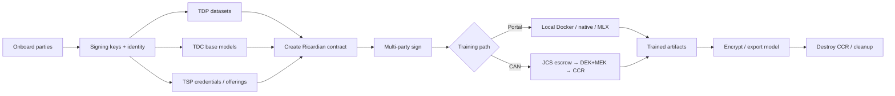

# Participant Onboarding & End-to-End Lifecycle

**Canonical guide** for how parties join the Confidential AI Network (CAN) / Contract Management System and run a complete cycle: onboard → publish datasets & base models → create & sign contracts → provision a clean room → encrypt/decrypt assets → train → export encrypted results → tear down.

This document **unifies** material previously spread across user guides, flow specs, CAN memos, signing docs, and training runbooks. Where portal (CMS) and CAN paths differ, both are called out explicitly.

| Item | Value |
|------|--------|
| Audience | Operators, integrators, AppAdmins, demo facilitators |
| Status | Reflects code + design as of 2026-07 |
| Companion demo | [LOCAL_DEMO_RUNBOOK.md](../training/LOCAL_DEMO_RUNBOOK.md) |
| Glossary | [GLOSSARY.md](../GLOSSARY.md) |
| Azure features & settings | [AZURE_FEATURES_AND_CONFIGURATION.md](../deployment/AZURE_FEATURES_AND_CONFIGURATION.md) — Entra, KV, DEK/MEK, train, Blob, SCITT |
| OCI features & settings | [OCI_FEATURES_AND_CONFIGURATION.md](../deployment/OCI_FEATURES_AND_CONFIGURATION.md) |
| AWS features & settings | [AWS_FEATURES_AND_CONFIGURATION.md](../deployment/AWS_FEATURES_AND_CONFIGURATION.md) |
| GCP features & settings | [GCP_FEATURES_AND_CONFIGURATION.md](../deployment/GCP_FEATURES_AND_CONFIGURATION.md) |
| Azure crypto topology | [AZURE_SECURITY_ARCHITECTURE.md](../production/AZURE_SECURITY_ARCHITECTURE.md) §16 |

---

## 1. Purpose and naming

### 1.1 Parties

| Role | Meaning |
|------|---------|
| **TDP** | Training Data Provider — publishes datasets; approves use under contract |
| **TDC** | Training Data Consumer — creates contracts; supplies base models; receives trained outputs |
| **TSP / CCRP** | Tech Service Provider / Confidential Clean Room Provider — hosts isolated training (TEE, private cloud, or local Docker). UI/docs often say **CCRP**; DB/`partyType` use **TSP** (`ccrp_*` columns map to `tsp*`) |
| **AppAdmin** | Platform administrator — users, health, configuration |

### 1.2 Two execution paths (do not mix casually)

| Path | Namespace | Trust model | Typical use |
|------|-----------|-------------|-------------|
| **Portal / CMS** | `/api/*` + Keycloak UI | Human SSO; optional **platform-managed** encryption; local Docker training | Stakeholder demos, day-to-day portal |
| **CAN / JCS** | `/api/can/jcs/*`, `/api/can/ccr/*` | **Principal-owned** DEK/MEK; escrow gating; attested key delivery (**target**) | Confidential clean-room job coordination |

CAN Phase 1 MVP uses **key-release signals** and **simulated attestation**. Real attested TLS key delivery is Phase 2 ([CAN_GAP_DECISION_MEMO.md](../features/can/CAN_GAP_DECISION_MEMO.md)).

### 1.3 End-to-end at a glance



---

## 2. Trust and crypto model

### 2.1 Non-negotiables (CAN production target)

1. Platform must **not** hold principal-owned **DEK** (dataset) or **MEK** (model) plaintext.
2. Decryption happens **only inside the CCR/TEE**; keys must not persist to disk.
3. Key release is gated by **attestation** bound to an ephemeral CCR identity.
4. Training starts only after **both** DEK and MEK are released (**dual-key escrow**); hard timeout destroys the session.
5. Lifecycle events are append-only / tamper-evident (provenance / SCITT).

### 2.2 Crypto material by stage

| Stage | Material | Who holds | Portal today | CAN target |
|-------|----------|-----------|--------------|------------|
| Onboarding | Keycloak password; optional DID; DEPA ID | Human + IdP | Implemented | Same humans; separate machine principals |
| Contract signing | ECDSA-P256 / RSA UserKey; private key on UserKey row (Vault custody = target) | Party | Implemented (portal path) | Same for legal signatures |
| Dataset encryption | **DEK** (AES-256-GCM) | TDP / data principal | Platform encryption **or** design: TDP-local | Principal-owned only |
| Model encryption | **MEK** | TDC / model owner | Partial / platform path | Principal-owned only |
| Clean-room session | Ephemeral TLS keypair in TEE | CCR only | N/A (local Docker) | Phase 2 |
| Job escrow | DEK/MEK release **signals** | JCS records events | N/A | MVP signals; no key bytes to Node |
| Ledger | Signature + SCITT claim/receipt | Parties + SCITT CCF | Implemented when SCITT enabled | Provenance events on job lifecycle |
| Cleanup | Session destroy + key zeroize | TSP / sweeper | Env status DESTROYED | Escrow expiry → DESTROYED |

### 2.3 Identity split

| Identity | Purpose |
|----------|---------|
| **Keycloak user** (`TDP` / `TDC` / `TSP` / `AppAdmin`) | Portal login, RBAC, human workflows |
| **DID** (`did:web` / `did:ethr` or system-generated) | Optional portable identity on User |
| **Signing key** (`UserKey` / enterprise key) | Ricardian contract digital signatures → SCITT |
| **CAN machine principal** (`did:can:dp:…`, `mo:…`, `ccrp:…`) | Job APIs; MVP: `X-CAN-Principal-Id` header only (no cert auth yet) |

---

## 3. Participant onboarding

### 3.1 Bootstrap (ops)

1. Start stack (`./start-system.sh` or production equivalent).
2. Ensure Keycloak realm is healthy; sync users if needed (`./fix-auth.sh`; from `backend/`: `npm run keycloak:sync`).
3. Optional: SCITT CCF for signature receipts (`SCITT_CCF_ENABLED`).
4. AppAdmin verifies health (`npm run status`).
5. For local training demos: build trainer image and set `TRAINING_EXECUTION_MODE` / `CAN_LOCAL_TRAINING_MODE` / `LOCAL_TRAINING_IMAGE`, then **restart backend** (see [LOCAL_DEMO_RUNBOOK.md](../training/LOCAL_DEMO_RUNBOOK.md)).

### 3.2 Human registration (all roles)

**UI:** `/register` — name, email, party type (**TDP / TDC / TSP** only), organization, **Signing algorithm** (party signing key).  
**API:** `POST /api/auth/register` — also accepts `AppAdmin`; accepts legacy `CCRP` and normalizes to `TSP`. Optional body `signingAlgorithm` (`ECDSA-P256` \| `RSA-2048` \| `RSA-4096`).

| Attribute | Required | Notes |
|-----------|----------|-------|
| `name` | **Yes** | Display name |
| `email` | **Yes** | Unique; becomes Keycloak username |
| `partyType` | **Yes** | Canonical: `TDP` \| `TDC` \| `TSP` \| `AppAdmin`. API alias: `CCRP` → `TSP` |
| `password` | Optional at register | Temp password often issued; **first-login change** expected |
| `organization` | Recommended | Enterprise context |
| `signingAlgorithm` | Recommended for TDP/TDC/TSP | Defaults to `ECDSA-P256`; creates active `UserKey` in the same transaction |
| `description`, `phoneNumber`, `website`, `location` | Optional | Profile |
| `existingDID` + `didVerificationSignature` | Optional | Bring-your-own DID; else system generates |
| `walletAddress`, `publicKey` | Optional | Legacy; not required for enterprise path |

**System-assigned (do not invent):**

| Attribute | Meaning |
|-----------|---------|
| `depaId` | DEPA-style party ID (e.g. `TDP-<uuid>`) |
| `iamUserId` / `iamUsername` | Keycloak linkage — registration fails if Keycloak is down |
| `did`, `didSource`, `didVerified` | DID lifecycle |
| `onboardingStatus`, `profileCompleted`, `firstLogin` | Onboarding state machine |
| `signingKeyCreated` (response) | `true` when a party signing key was minted for TDP/TDC/TSP |

### 3.3 Post-registration checklist (per role)

| Step | TDP | TDC | TSP/CCRP | AppAdmin |
|------|-----|-----|----------|----------|
| First password change | ✓ | ✓ | ✓ | ✓ |
| Complete profile / org | ✓ | ✓ | ✓ | ✓ |
| **Party signing key** (at register) | ✓ | ✓ | ✓ | Optional |
| Configure cloud credentials | — | — | ✓ | — |
| Publish dataset(s) | ✓ | — | — | — |
| Publish / select base model(s) | — | ✓ | — | — |
| Verify DEPA ID visible on profile | ✓ | ✓ | ✓ | ✓ |

### 3.4 Contract signing keys (required for E2E signing)

Without an active signing key, parties cannot create Ricardian contracts or complete cryptographic signatures (`SIGNING_KEY_REQUIRED`).

**Primary path (current):** choose **Signing algorithm** on `/register` (or pass `signingAlgorithm` on `POST /api/auth/register`). The backend creates an active `UserKey` for TDP / TDC / TSP before the user can create or sign contracts.

**Backfill / regenerate:** Profile / signing API → `POST /api/signing/keys/generate` with `algorithm` (`ECDSA-P256` recommended, RSA-2048, or RSA-4096). E2E helpers call this for seeded users that predate registration key minting.

**Current portal implementation:** `UserKey.privateKey` is stored on the user-keys row (intended to be encrypted at rest in production). Older signing guides that describe a separate Key Management unlock-password + Vault custody reflect **design / enterprise target**, not the default registration path.

| UserKey field | Required | Notes |
|---------------|----------|-------|
| `userId` | Yes | Owner |
| `keyId` | Yes | Stable key identifier |
| `keyType` | Yes | Algorithm family |
| `publicKey` | Yes | Stored in DB |
| `privateKey` | Yes | DB column today; Vault-backed custody is the target architecture |
| `keyStatus` | Yes | `active` \| `inactive` \| `revoked` \| `expired` |

Details: [CONTRACT_SIGNING_USER_GUIDE.md](../features/contract-signing/CONTRACT_SIGNING_USER_GUIDE.md) (UX narrative) · `backend/models/UserKey.js` (schema truth).

---

## 4. TDP — datasets

### 4.1 Catalog attributes (API-required)

| Field | Required | Notes |
|-------|----------|-------|
| `datasetId`, `name`, `description` | **Yes** | Catalog identity |
| `category` | **Yes** | `Computer Vision` \| `Natural Language Processing` \| `Audio` \| `Tabular` \| `Multimodal` |
| `size`, `recordCount`, `price`, `license` | **Yes** | Commercial / sizing metadata |
| `ownerId` | **Yes** | Must be a TDP user |
| `data_classification` | **Yes** (default INTERNAL) | PUBLIC … TOP_SECRET |
| `encryption_at_rest`, `encryption_in_transit` | **Yes** (defaults) | Flags |
| `secure_enclave_required`, `attestation_required` | Defaults | TEE policy hints for contracts |
| `encryption_algorithm` | Default AES-256-GCM | |
| `encryption_key_id` | Optional | Reference to DEK / KMS key |
| `tags`, residency, access policy JSON | Optional | Governance |
| `depaId` | Auto | Dataset entity ID |

### 4.2 Physical artifacts (needed for real local training)

Upload under dataset **Training files** (Phase A local storage):

| Attribute | Notes |
|-----------|-------|
| `contentFormat` | `csv` \| `parquet` \| `image_folder` |
| File / folder payload | Stored under `backend/uploads/datasets/…` |
| Artifact count | Must be &gt; 0 for customer-data training; else trainer may fall back to public demos |

See [PHASE_A_LOCAL_ARTIFACTS.md](../training/PHASE_A_LOCAL_ARTIFACTS.md).

### 4.3 Encryption options for datasets

| Mode | Who encrypts | Who holds DEK | Decrypt where | Maturity |
|------|--------------|---------------|---------------|----------|
| **A. Catalog only** | N/A | N/A | N/A | Metadata publish |
| **B. Platform encryption** | Platform on upload | Platform (`platformEncryptionService`) | Platform / trainer path | Implemented — **not** CAN end-state |
| **C. TDP local encrypt** | TDP before upload | TDP only | TEE after attested release | Design ([TDP_ENCRYPTED_DATASET_TEE_FLOW.md](../flows/TDP_ENCRYPTED_DATASET_TEE_FLOW.md)) |
| **D. LUKS large files** | Ops / TDP | Vault-backed | Mounted in secure env | Documented / partial |
| **E. CAN principal DEK** | TDP / DP principal | Principal | CCR via attested TLS | Target (Phase 2) |

**Clean-room rule (target):** ciphertext may be staged in object storage or pulled into CCR; **plaintext and DEK exist only inside the attested TEE** for the job window.

---

## 5. TDC — base models

### 5.1 Catalog AIModel attributes (API-required)

| Field | Required | Notes |
|-------|----------|-------|
| `modelId`, `name`, `description` | **Yes** | |
| `type` | **Yes** | transformer \| cnn \| rnn \| gan \| other |
| `architecture`, `parameters` | **Yes** | |
| `framework` | **Yes** | PyTorch \| TensorFlow \| JAX \| Other |
| `privacyTechnique` | **Yes** | Declared PET |
| `validationMetrics` | **Yes** | Catalog metrics |
| `maxEpochs`, `batchSize`, `learningRate` | **Yes** | Default training hyperparameters |
| HF Hub refs | Optional (dev) | e.g. DistilBERT / AG News demos |
| `depaId` | Auto | AIMODEL entity |

### 5.2 Encrypted model upload

Optional path (`ai-models-upload`): upload weights + metadata; may use platform encryption.  
**CAN target:** TDC encrypts with **MEK** locally; only ciphertext enters the platform/CCR; MEK released to attested CCR after escrow.

Details: [TDC_ENCRYPTED_AI_MODEL_TEE_FLOW.md](../flows/TDC_ENCRYPTED_AI_MODEL_TEE_FLOW.md).

---

## 6. TSP / CCRP — environment setup

### 6.1 Cloud credentials

TSP configures **cloud** credentials so contracts can select a clean-room backend. Secrets stay in an external secret manager — not in the DB.

| Field | Required | Notes |
|-------|----------|-------|
| `tspUserId` | **Yes** | TSP user |
| `cloudProvider` | **Yes** | `AWS` \| `AZURE` \| `GCP` \| `OCI` only on this model |
| `secretName` | **Yes** | Pointer into Vault / secret manager |
| `secretManager` | **Yes** | Which backend holds secrets |
| `authMethod` | Default | e.g. SERVICE_PRINCIPAL |
| Azure `subscriptionId`, `tenantId` | Per provider | |
| GCP `projectId` | Per provider | |
| OCI `compartmentId` | Per provider | |
| Infra defaults | Mostly defaulted | Region, VM size, VNet, encryption flags |

**Local Docker is not a `TSPCloudCredentials.cloudProvider` value.** Demo wizard uses **Local (Docker)** via contract/`cloudProviders` selection, typically with seeded **`ccrp.e2e@test.com`** (“CCRP E2E User”).

### 6.2 Environment offerings & lifecycle

1. TSP publishes **offerings** (regions, TEE types, pricing, isolation) for cloud paths.
2. `TrainingEnvironment` status (cloud/provisioned envs): `PENDING` → `PROVISIONING` → `ACTIVE` → `RUNNING` → … → `DESTROYING` → `DESTROYED`.
3. CAN CCR session states differ (e.g. `REQUESTED` → `ATTESTING` / `READY` / `RUNNING` / `DESTROYED`) — see `canJcsService.js`.
4. CAN escrow sweeper: deadline missed → session destroyed (key zeroize is design-level for real TEEs).

Flow detail: [CCRP_ENVIRONMENT_OFFERINGS_CONFIGURATION_FLOW.md](../flows/CCRP_ENVIRONMENT_OFFERINGS_CONFIGURATION_FLOW.md).

### 6.3 What to configure before contracts

| Checklist item | Local demo | Cloud pilot |
|----------------|------------|-------------|
| TSP user with signing key | ✓ | ✓ |
| Cloud = Local (Docker) or real provider | Local | Azure/OCI/etc. |
| Credentials + secret refs | Optional for local | Required |
| Trainer image built | `local-trainer` | Push to ACR/OCIR |
| Monitoring / budget limits | Optional | Recommended |

---

## 7. Contract creation

### 7.1 Who creates

**TDC** creates the Ricardian contract after datasets and (usually) base models exist.

### 7.2 Required / typical attributes

| Field | Required | Notes |
|-------|----------|-------|
| `datasetSelections[]` | **Yes** | 1–3 datasets: `datasetId`, `individualPrice` |
| Duration / legal terms | **Yes** | Template-driven |
| Price (derived) | **Yes** | Sum of dataset prices + fees |
| `tdcId` | From auth | Must be TDC |
| `tdpId` / multi-TDP | From datasets | Owners of selected datasets |
| `tspId` (CCRP) | Typical | Selected clean-room provider |
| `tspCloudProvider` / `environmentSpecs` | Typical | Local Docker or cloud specs |
| `kmsConfigs` | Typical for wizard | KMS provider placeholders for demo |
| `aiModelIds` | Typical | Base model(s) |
| `trainingParams` | Typical | Epochs, batch, DP flags (`differentialPrivacy`), `fastDevRun` |
| `depaId`, legal hash | Auto / optional | |

### 7.3 Status workflow (simplified)

```
DRAFT → PENDING_TDP (and/or multi-TDP) → PENDING_TSP → SIGNED → EXECUTING → COMPLETED
         ↘ REJECTED / FAILED
```

Exact enum also includes `PENDING_TDC` and multi-TDP statuses — see `backend/models/Contract.js`. There is **no** `CANCELLED` status on the current contract enum (use `REJECTED`).

---

## 8. Contract signing

### 8.1 Prerequisites

- All signing parties have an **active UserKey**.
- Contract is in a signable state (pending their signature).
- Optional: SCITT CCF reachable for receipts.

### 8.2 Procedure (each party)

1. Open contract → review terms, datasets, models, environment, privacy.
2. **Sign Contract** → uses the active registration **party signing key** → submit signature.
3. Receipt stored in SCITT when enabled (best-effort / path-dependent — signing can succeed even if SCITT is down on some routes).
4. Status advances when required parties have signed (typically **TDP(s)** then **TSP/CCRP**; training demos may not hard-gate on TDC signature).

### 8.3 Artifacts produced

| Artifact | Purpose |
|----------|---------|
| Digital signature | Binds party to Ricardian terms |
| SCITT claim / receipt | Tamper-evident ledger proof |
| Contract `SIGNED` | Enables training / CAN release |

---

## 9. Training execution

### 9.1 Portal path (implemented for demos)

1. Contract **SIGNED**.
2. TDC starts training job from UI.
3. Backend mode (`TRAINING_EXECUTION_MODE`): `local-docker` \| `local-native` \| `local-mlx` \| simulation.
4. Trainer reads dataset artifacts (or demo fallback) + model config.
5. Optional Opacus DP-SGD when `differentialPrivacy.enabled`.
6. Results → `TrainingJob` metadata / `metrics.json` under local runs.

**Scope:** Host Docker / native training (not a hardware TEE). See [LOCAL_DEMO_RUNBOOK.md](../training/LOCAL_DEMO_RUNBOOK.md).

### 9.2 CAN / JCS path (MVP)

1. Create job: `POST /api/can/jcs/jobs` with `contractId`, `ccrProvider` (e.g. `local`). Header: `X-CAN-Principal-Id`.
2. Fetch **attestation bundle** (simulated HMAC-signed today).
3. Data principal: `POST .../key-released` with `keyType: DEK`.
4. Model owner: same with `keyType: MEK`.
5. When both ready → **release** → local CCRP executor may start training.
6. Escrow deadline missed → **EXPIRED** / CCR **DESTROYED**.

CCR key-delivery endpoint currently accepts **signals only** (rejects raw key material) — see [CAN_QUICKSTART.md](../features/can/CAN_QUICKSTART.md).

### 9.3 Target clean-room decrypt-and-train sequence

```
CCRP provisions TEE
  → TEE generates ephemeral TLS keypair + attestation
  → Principals verify attestation independently
  → CCR pulls encrypted dataset + encrypted base model
  → TDP delivers DEK over attested TLS into TEE
  → TDC delivers MEK over attested TLS into TEE
  → Decrypt in memory → train → re-encrypt outputs
  → Zeroize keys → destroy CCR session
  → Emit provenance (job created, attestation, key released, started, completed, destroyed)
```

---

## 10. Encryption & decryption for the clean room

### 10.1 Dataset (DEK)

| Step | Actor | Action |
|------|-------|--------|
| Encrypt | TDP | AES-256-GCM with DEK; upload/store **ciphertext only** |
| Stage | Platform / object storage | Hold ciphertext + metadata; access policy `tee_only` |
| Attest | CCR | Prove measurement / identity |
| Release | TDP (DP principal) | DEK → CCR only if attestation + contract + escrow OK |
| Decrypt | CCR | In TEE memory for training window |
| Destroy | CCR / sweeper | Zeroize DEK; tear down session |

### 10.2 Base model (MEK)

Same pattern as DEK, owned by TDC / model owner.

### 10.3 Dual-key escrow

| State | Meaning |
|-------|---------|
| `OPEN` | Waiting for DEK and/or MEK |
| `DEK_RECEIVED` / `MEK_RECEIVED` | One key signalled |
| `BOTH_READY` | Eligible to release/start |
| `RELEASED` | Released to CCR / executor |
| `EXPIRED` / `CANCELLED` | Timeout or cancel — no late key use |

Training runtime “RUNNING” is a **CCR session / TrainingEnvironment** state, not an escrow state. Default escrow window: **~10 minutes** (configurable sweeper).

### 10.4 Platform encryption vs CAN

| | Portal `platformEncryptionService` | CAN target |
|--|-----------------------------------|------------|
| Key custody | Platform may generate/hold DEKs | Principals only |
| Use | Existing uploads / JWT access tokens | Confidential jobs |
| Guidance | OK for demos; do **not** treat as CAN compliance | Required for production CAN |

---

## 11. Trained model upload / download

| Step | Actor | Action |
|------|-------|--------|
| Produce weights | CCR / local trainer | Write run outputs |
| (Target) Re-encrypt | CCR | Encrypt result package for TDC |
| Download | TDC | Portal download of artifacts / encrypted package |
| Provenance | Platform | Link job, contract, privacyMetrics (ε, δ, mechanism) |
| Catalog update | TDC optional | Register trained model as new AIModel |

Local demos often expose **metrics and artifacts on disk** without full MEK re-wrap.

---

## 12. CCRP setup and cleanup

### 12.1 Setup (before or at job start)

1. TSP credentials + offering selected on contract.
2. Provision environment (local Docker namespace / cloud VM / AKS-OKE job).
3. Attach network isolation policy (target: no public egress).
4. Register CCR session with JCS (CAN path).
5. Publish attestation endpoint / bundle.

### 12.2 Cleanup (always)

| Trigger | Actions |
|---------|---------|
| Training completed | Stop containers/VMs; mark env DESTROYED; revoke short-lived access |
| Training failed | Same + retain logs for audit |
| Escrow expired | Destroy CCR; refuse late key release; provenance `EXPIRED` |
| Contract cancelled | Tear down any provisioned resources |

**Checklist:** no leftover plaintext; no DEK/MEK on disk; secrets rotated/revoked; Object Storage staging keys expired; SCITT/provenance events flushed.

---

## 13. Complete E2E checklist (happy path)

Use this as a single run sheet. Mark **Portal** vs **CAN** where noted.

### Phase 0 — Platform

- [ ] Stack healthy (backend, frontend, Keycloak, DB, optional SCITT)
- [ ] `./fix-auth.sh` (and Keycloak user sync) if auth is unhealthy
- [ ] Trainer image built: `docker build -t contractmanagement/local-trainer:latest backend/local-training`
- [ ] `TRAINING_EXECUTION_MODE` / `CAN_LOCAL_TRAINING_MODE` / `LOCAL_TRAINING_IMAGE` set; **backend restarted**
- [ ] For demo wizard CCRP path: seeded **`ccrp.e2e@test.com`** available

### Phase 1 — Onboard

- [ ] TDP, TDC, TSP registered (or seeded E2E users) with **party signing key** at register (or backfilled)
- [ ] First-login passwords changed
- [ ] Each signing party has **active signing key**
- [ ] DEPA IDs present on profiles

### Phase 2 — Assets

- [ ] TDP: dataset catalog complete + training artifacts uploaded (`contentFormat` + files)
- [ ] TDP: classification + encryption flags set
- [ ] TDC: base AIModel in catalog (or HF demo refs)
- [ ] TSP: Local Docker selection **or** cloud credentials ready

### Phase 3 — Contract

- [ ] TDC creates Ricardian contract (datasets, model, TSP, env, KMS, training params)
- [ ] Contract ID recorded

### Phase 4 — Sign

- [ ] TDP(s) sign with UserKey → SCITT receipt if enabled (optional)
- [ ] TSP/CCRP signs
- [ ] Status **SIGNED**

### Phase 5 — Execute

**Portal:**

- [ ] TDC starts training job
- [ ] Job completes; metrics visible

**CAN:**

- [ ] JCS job created; attestation fetched
- [ ] DEK released; MEK released (`DEK_RECEIVED` / `MEK_RECEIVED` → `BOTH_READY`)
- [ ] `POST .../release` → `RELEASED` → local executor / CCR running → completed (or expiry demo)

### Phase 6 — Results & cleanup

- [ ] TDC obtains trained artifacts / encrypted model package
- [ ] Privacy metrics recorded if DP enabled
- [ ] CCR / local env destroyed
- [ ] Audit / provenance queryable by contract or job ID

---

## 14. Implementation maturity matrix

| Capability | Maturity |
|------------|----------|
| Keycloak registration + roles | **Shipped** |
| DEPA IDs on parties/entities | **Shipped** |
| Optional DID on user | **Shipped** |
| Signing keys + Ricardian multi-party sign | **Shipped** |
| SCITT ledger receipts | **Optional / path-dependent** (some routes best-effort on failure) |
| Dataset catalog + local artifact upload | **Shipped** (Phase A) |
| AIModel catalog + upload routes | **Shipped** / partial encrypt |
| TSP cloud credentials model | **Shipped** |
| Local Docker / native / MLX training | **Shipped** |
| Platform encryption service | **Shipped** (legacy trust model) |
| CAN JCS escrow + SSE + sweeper | **MVP** |
| Simulated attestation / key-release signals | **MVP** |
| TDP local encrypt-before-upload UI | **Design / partial** |
| Attested TLS DEK/MEK delivery into TEE | **Design (Phase 2)** |
| Machine principal cert auth | **Stub (Phase 3)** |
| Cloud TEE provision + train + destroy | **Partial / simulated** |
| Full encrypted trained-model wrap for TDC | **Partial** |

---

## 15. Related documents

| Topic | Document |
|-------|----------|
| Local stakeholder demo | [training/LOCAL_DEMO_RUNBOOK.md](../training/LOCAL_DEMO_RUNBOOK.md) |
| CAN MVP APIs | [features/can/CAN_QUICKSTART.md](../features/can/CAN_QUICKSTART.md) |
| CAN non-negotiables & phases | [features/can/CAN_GAP_DECISION_MEMO.md](../features/can/CAN_GAP_DECISION_MEMO.md) |
| TDP encrypt → TEE | [flows/TDP_ENCRYPTED_DATASET_TEE_FLOW.md](../flows/TDP_ENCRYPTED_DATASET_TEE_FLOW.md) |
| TDC model encrypt → TEE | [flows/TDC_ENCRYPTED_AI_MODEL_TEE_FLOW.md](../flows/TDC_ENCRYPTED_AI_MODEL_TEE_FLOW.md) |
| CCRP offerings | [flows/CCRP_ENVIRONMENT_OFFERINGS_CONFIGURATION_FLOW.md](../flows/CCRP_ENVIRONMENT_OFFERINGS_CONFIGURATION_FLOW.md) |
| Signing UX | [features/contract-signing/CONTRACT_SIGNING_USER_GUIDE.md](../features/contract-signing/CONTRACT_SIGNING_USER_GUIDE.md) |
| Key management design | [security/KEY_MANAGEMENT_DESIGN.md](../security/KEY_MANAGEMENT_DESIGN.md) |
| Multi-tenant KMS | [architecture/MULTI_TENANT_KMS_ARCHITECTURE.md](../architecture/MULTI_TENANT_KMS_ARCHITECTURE.md) |
| User guide | [USER_GUIDE.md](../USER_GUIDE.md) |
| Architecture hub | [ARCHITECTURE.md](../ARCHITECTURE.md) |
| Glossary | [GLOSSARY.md](../GLOSSARY.md) |

---

## 16. Appendix — API / model field quick reference

### User (`backend/models/User.js`)

Required: `name`, `email`, `partyType`.  
Important optional/system: `organization`, `did*`, `depaId`, `iamUserId`, onboarding flags.

### Dataset (`backend/models/Dataset.js`)

Required: identity, category, size, recordCount, price, license, ownerId, classification, encryption flags.  
Security: `encryption_key_id`, `encryption_algorithm`, `secure_enclave_required`, `attestation_required`.

### AIModel (`backend/models/AIModel.js`)

Required: modelId, name, description, type, architecture, parameters, framework, privacyTechnique, validationMetrics, maxEpochs, batchSize, learningRate.

### Contract (`backend/models/Contract.js`)

Multi-dataset selections; `tdcId`, `tdpId`, `tspId` (`ccrp_id`); status enums; `environmentSpecs`, `kmsConfigs`, `aiModelIds`, `trainingParams`; signature flags (`tspSigned` → `ccrp_signed`).

### TSPCloudCredentials

Required: `tspUserId`, `cloudProvider`, `secretName`, `secretManager`; provider-specific IDs as applicable.

### UserKey

Required: `userId`, `keyId`, `keyType`, `publicKey`, `privateKey`, `keyStatus`. Private key is a DB column today (Vault custody = target).

### CAN headers

`X-CAN-Principal-Id: <principal>` on all `/api/can/*` calls (MVP).

---

*This guide is the single entry point for participant onboarding and full lifecycle. Prefer it over piecing together individual flow docs; use those flow docs for deep design detail only.*
