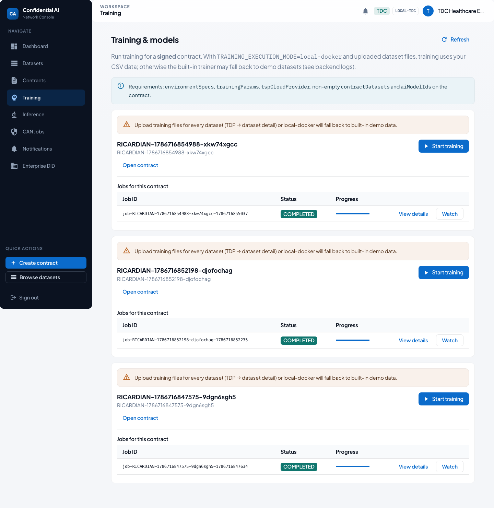
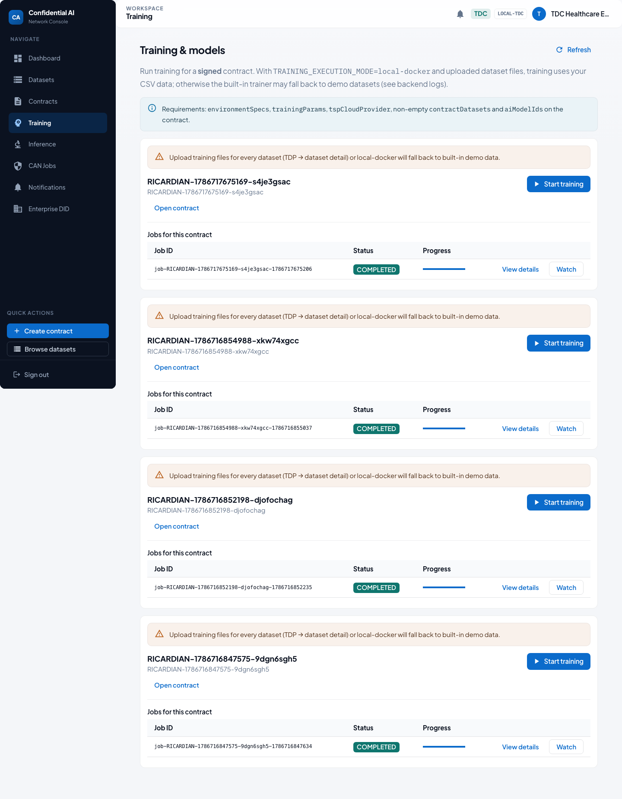
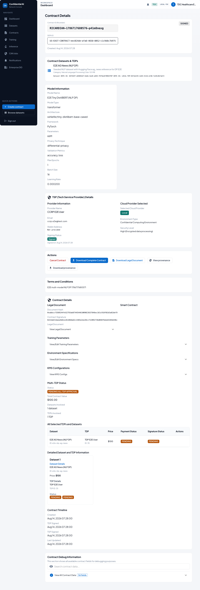
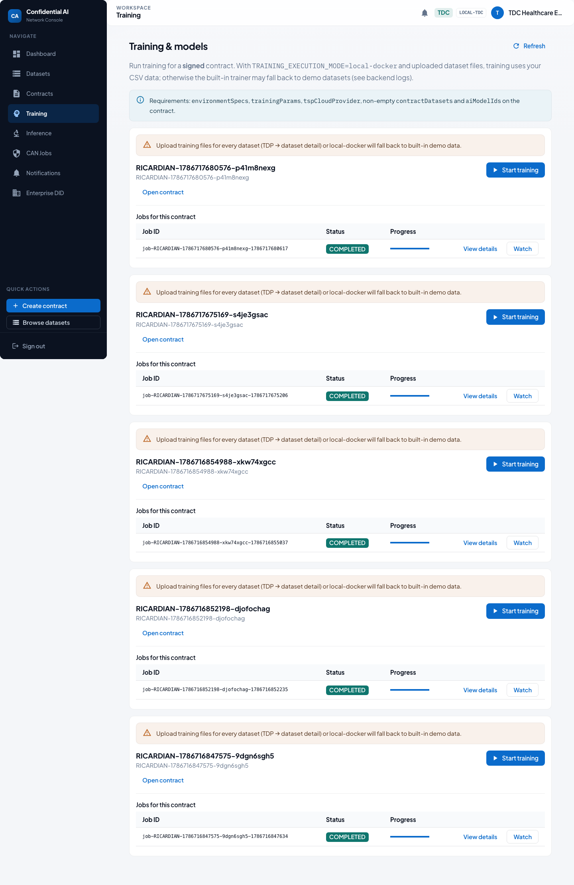
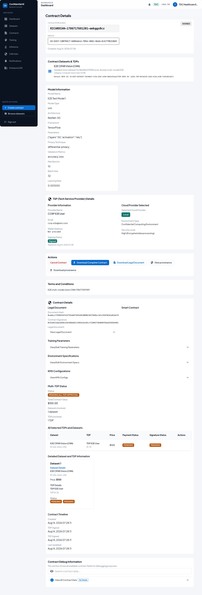
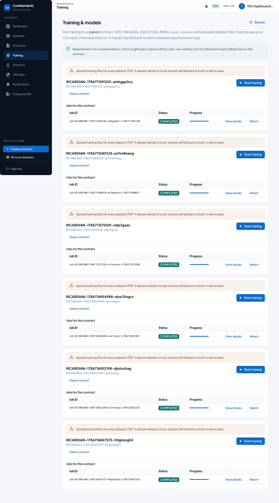
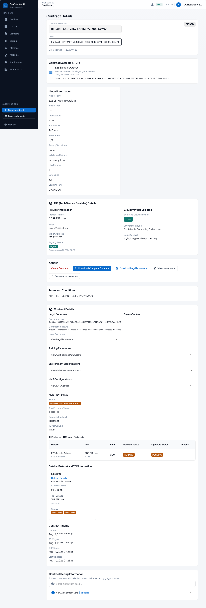
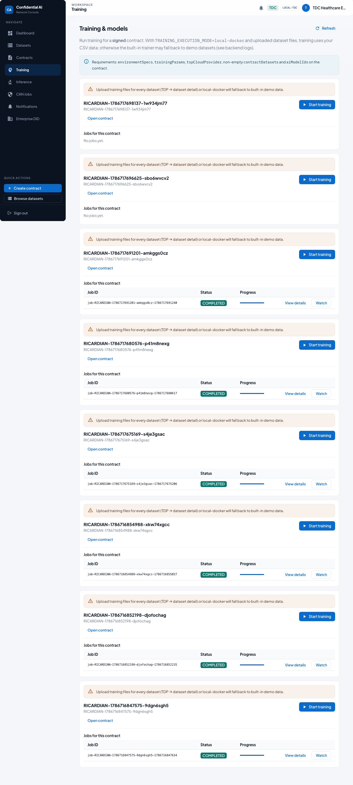

# Multi-Model Contract & Training Guide

> Auto-generated by Playwright (`npm run test:e2e:multi-model-guide` in `frontend/`).
> Screenshots refreshed: **2026-08-14**. Prefer regenerating over hand-editing images.

This guide shows a **separate Ricardian contract** for each catalog model type the platform supports,
and runs **local-docker** training for the modalities the trainer implements today.

## Catalog model types

| Catalog `type` | Local train track | Fixture model | Dataset | Framework / architecture |
|---|---|---|---|---|
| `other` | Tabular (iris / CSV) | `e2e-model-tabular-logreg` | `e2e-dataset-1` | Other / logistic-regression |
| `transformer` | Text + DP-SGD | `e2e-model-nlp-distilbert` | `e2e-nlp-ag-news` | PyTorch / tiny DistilBERT |
| `cnn` | Vision (TinyCNN fastDev) | `MODEL-E2E-001` | `e2e-vision-cifar` | Catalog ResNet-50; train uses TinyCNN + FakeData when `fastDevRun` |
| `rnn` | Catalog only (sign) | `e2e-model-rnn-lstm` | `e2e-dataset-1` | PyTorch / lstm |
| `gan` | Catalog only (sign) | `e2e-model-gan-demo` | `e2e-dataset-1` | PyTorch / dcgan |

## Demo credentials

| Role | Email | Password |
|---|---|---|
| TDC | `tdc.healthcare.2025-09-05t20-39-55@test.com` | `TestNewPassword123!` |
| TDP | `tdp.e2e@test.com` | `TestNewPassword123!` |
| TSP | `ccrp.e2e@test.com` | `TestNewPassword123!` |

## Run results (this generation)

| Track | Contract | Job | Status |
|---|---|---|---|
| Tabular — Logistic Regression | `RICARDIAN-1786717675169-s4je3gsac` | `job-RICARDIAN-1786717675169-s4je3gsac-1786717675206` | **COMPLETED** |
| Text — Tiny DistilBERT + DP-SGD | `RICARDIAN-1786717680576-p41m8nexg` | `job-RICARDIAN-1786717680576-p41m8nexg-1786717680617` | **COMPLETED** |
| Vision — CNN / TinyCNN (fastDev) | `RICARDIAN-1786717691201-amkggs0cz` | `job-RICARDIAN-1786717691201-amkggs0cz-1786717691240` | **COMPLETED** |
| RNN — LSTM (catalog) | `RICARDIAN-1786717696625-sbo6wvcv2` | — | **SIGNED (no train)** |
| GAN — catalog demo | `RICARDIAN-1786717698137-1w934jm77` | — | **SIGNED (no train)** |

## Happy path

### 1. Overview — one contract per model type

The platform catalog supports five AI model **types**: `transformer`, `cnn`, `rnn`, `gan`, and `other`.
This tour creates a **SIGNED** Ricardian contract for each type. Local-docker training runs for **tabular**, **text + DP-SGD**, and **vision**.
`rnn` and `gan` are signed for catalog coverage; dedicated trainers for those architectures are not wired yet.

### 2. TDC Training home (before multi-model runs)

Start from **Training**. Each track below adds a signed contract and (where supported) a completed local job.



### 3. Tabular — Logistic Regression — signed contract

Catalog type **`other`**, framework **Other**, architecture **`logistic-regression`**.
Contract `RICARDIAN-1786717675169-s4je3gsac` is **SIGNED** (TDP + TSP).
Local training is started next for this modality.


### 4. Tabular — Logistic Regression — training completed

Job `job-RICARDIAN-1786717675169-s4je3gsac-1786717675206` finished with status **COMPLETED**.
Modality: **tabular** (`taskType` in contract trainingParams).



### 5. Text — Tiny DistilBERT + DP-SGD — signed contract

Catalog type **`transformer`**, framework **PyTorch**, architecture **`sshleifer/tiny-distilbert-base-cased`**.
Contract `RICARDIAN-1786717680576-p41m8nexg` is **SIGNED** (TDP + TSP).
Local training is started next for this modality.



### 6. Text — Tiny DistilBERT + DP-SGD — training completed

Job `job-RICARDIAN-1786717680576-p41m8nexg-1786717680617` finished with status **COMPLETED**.
Text track includes **Opacus DP-SGD** privacy metrics when the trainer reports them.



### 7. Vision — CNN / TinyCNN (fastDev) — signed contract

Catalog type **`cnn`**, framework **TensorFlow**, architecture **`ResNet-50`**.
Contract `RICARDIAN-1786717691201-amkggs0cz` is **SIGNED** (TDP + TSP).
Local training is started next for this modality.



### 8. Vision — CNN / TinyCNN (fastDev) — training completed

Job `job-RICARDIAN-1786717691201-amkggs0cz-1786717691240` finished with status **COMPLETED**.
Modality: **vision** (`taskType` in contract trainingParams).



### 9. RNN — LSTM (catalog) — signed contract

Catalog type **`rnn`**, framework **PyTorch**, architecture **`lstm`**.
Contract `RICARDIAN-1786717696625-sbo6wvcv2` is **SIGNED** (TDP + TSP).
Catalog-only track: no dedicated local trainer path yet (signing coverage only).



### 10. GAN — catalog demo — signed contract

Catalog type **`gan`**, framework **PyTorch**, architecture **`dcgan`**.
Contract `RICARDIAN-1786717698137-1w934jm77` is **SIGNED** (TDP + TSP).
Catalog-only track: no dedicated local trainer path yet (signing coverage only).


### 11. Training list after multi-model runs

Completed trainable tracks: tabular, text-dp, vision.
Use **View logs** / **View job provenance** on any completed card for run details.



## Related docs

- [Lifecycle screenshot guide](../lifecycle-user-guide/LIFECYCLE_USER_GUIDE.md) (enterprise onboard → one NLP DP train)
- [Participant onboarding & E2E lifecycle](../PARTICIPANT_ONBOARDING_AND_E2E_LIFECYCLE.md)
- [Local training runtime](../../training/TDC_TRAINING_RUNTIME.md)

## Regenerate

```bash
# Stack must be up: backend :5001, frontend :3000, Keycloak, Docker trainer image
cd frontend
BACKEND_URL=http://127.0.0.1:5001 npm run test:e2e:multi-model-guide
```

Optional cleanup afterward: `npm run cleanup:e2e-data` from repo root.
