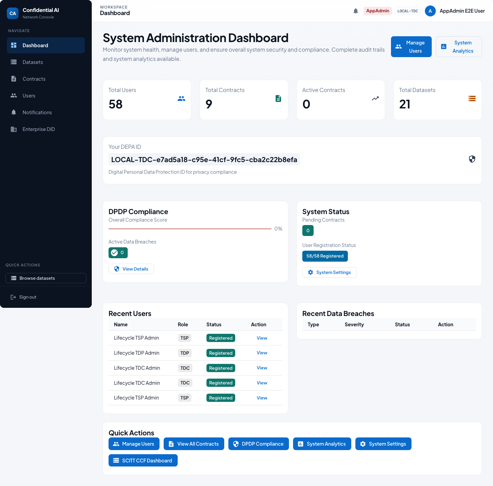
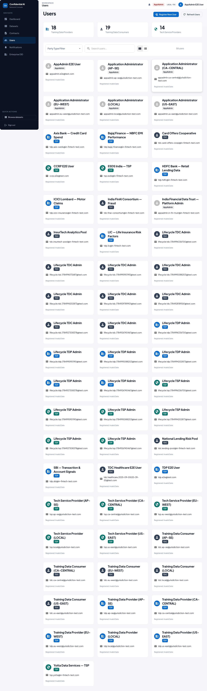
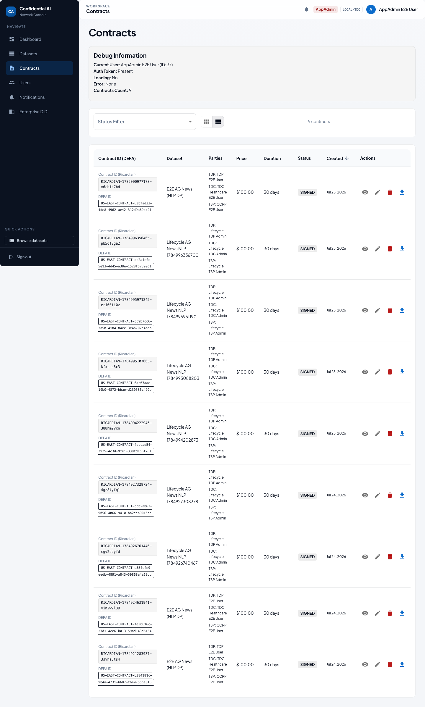
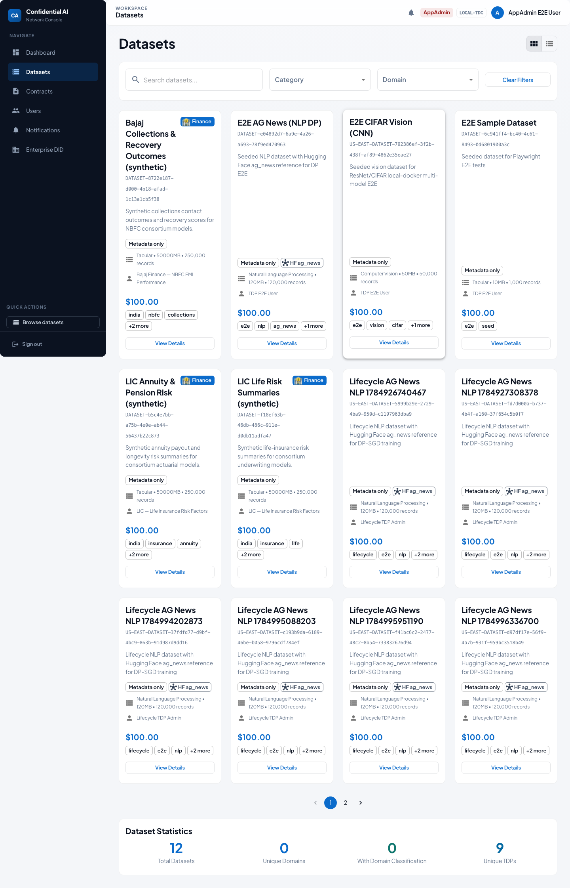
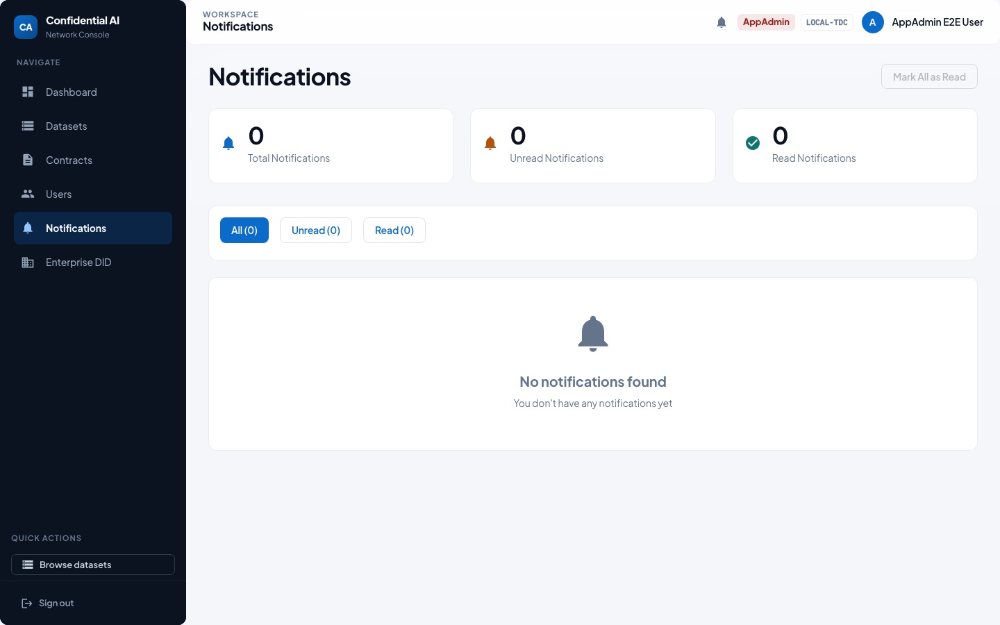

# AppAdmin User Guide — Platform Administrator

> Auto-generated by the Playwright E2E suite (`npm run test:e2e:user-guides` in `frontend/`).
> Screenshots refreshed: **2026-07-25**. Prefer regenerating over hand-editing images.

As AppAdmin you manage users, monitor system health from the admin dashboard, and oversee contracts and datasets across the network.

## Who this is for

| | |
|---|---|
| Role | **AppAdmin** |
| Demo user | `appadmin.e2e@test.com` |
| Password | `TestNewPassword123!` (local E2E seed only) |

## Happy path

### 1. Sign in

1. Open the app and go to **Login**.
2. Enter your email and password.
3. Click **Sign In**. On first login you may be asked to set a new password.

### 2. Admin dashboard

The **admin dashboard** summarizes users, contracts, and overall platform activity.

### 3. Users

**Users** lets you review party types, activation, and onboarding status. Prefer Keycloak-backed flows over direct DB edits.

### 4. Contracts overview

Admins can inspect contracts across parties for support and compliance follow-up.

### 5. Datasets overview

Browse the global **dataset** catalog to verify publishing and visibility.

### 6. Notifications

Operational alerts and system notices appear here.

## Related docs

- [Participant onboarding & E2E lifecycle](../PARTICIPANT_ONBOARDING_AND_E2E_LIFECYCLE.md)
- [Contract signing user guide](../../features/contract-signing/CONTRACT_SIGNING_USER_GUIDE.md)
- [Top-level user guide](../../USER_GUIDE.md)
- [Role user guides index](README.md)
