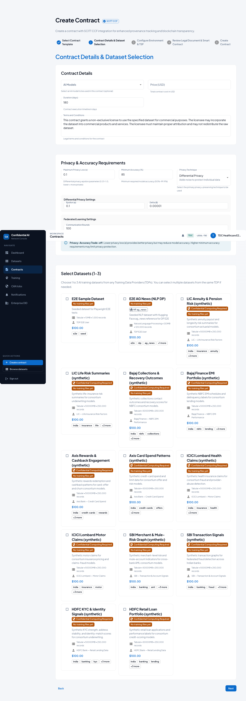
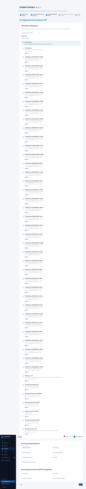
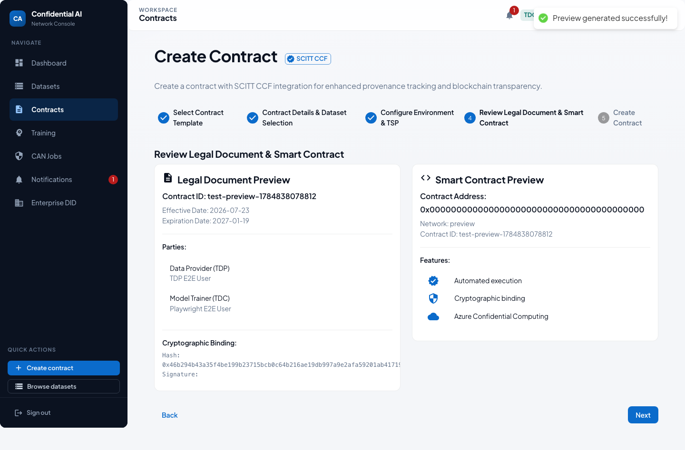
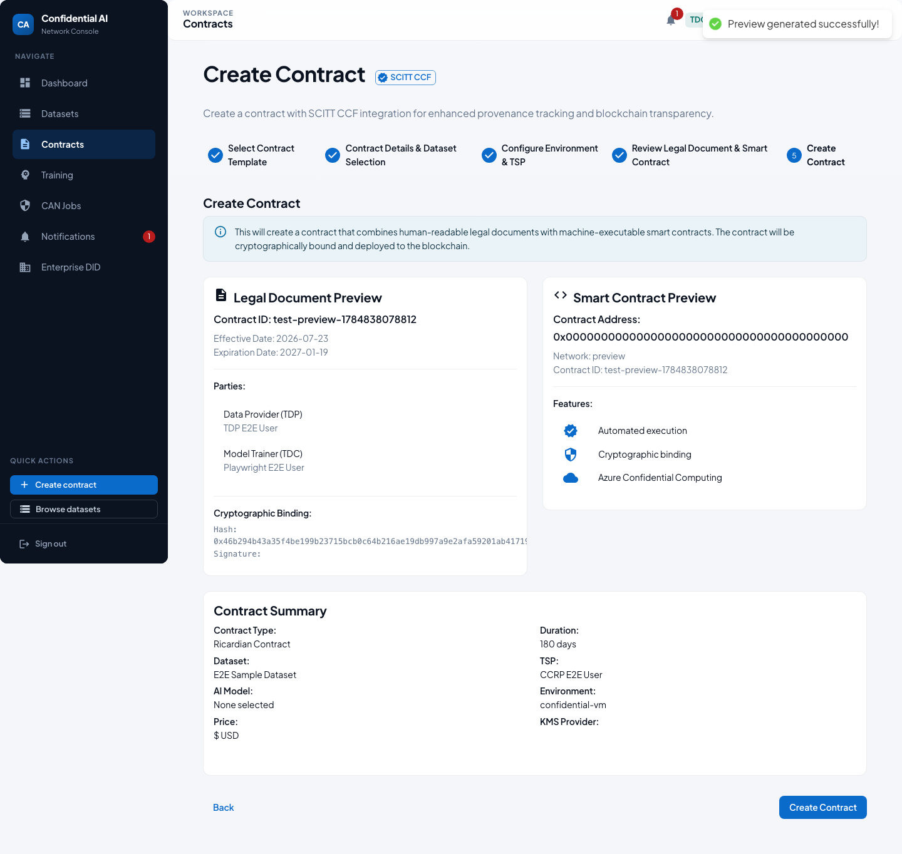
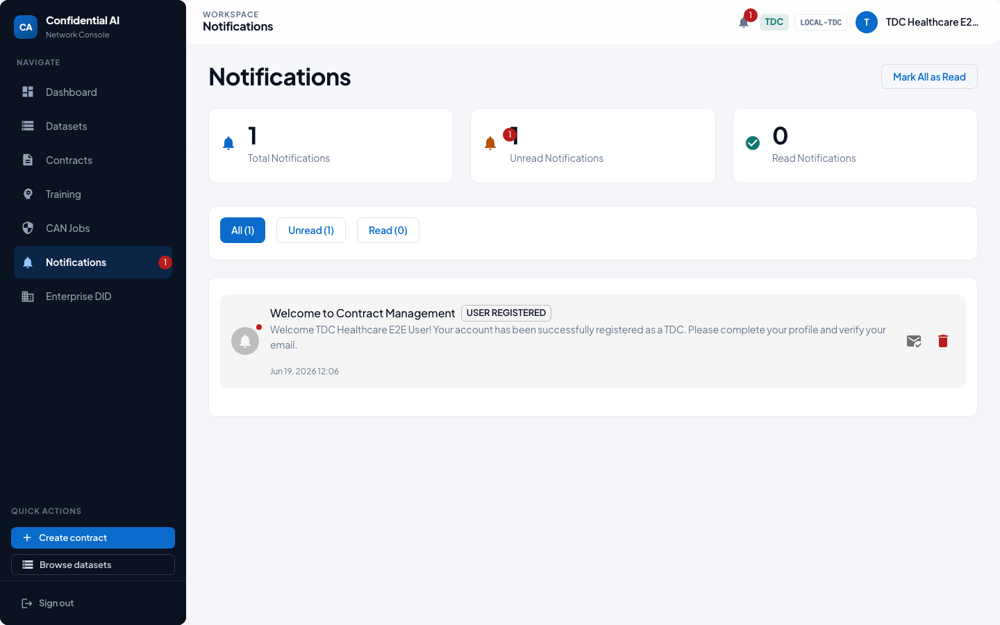

# TDC User Guide — Training Data Consumer

> Auto-generated by the Playwright E2E suite (`npm run test:e2e:user-guides` in `frontend/`).
> Screenshots refreshed: **2026-07-23**. Prefer regenerating over hand-editing images.

As a Training Data Consumer you browse datasets, create and sign Ricardian contracts, run training (portal or CAN), and review outputs.

## Who this is for

| | |
|---|---|
| Role | **TDC** |
| Demo user | `tdc.healthcare.2025-09-05t20-39-55@test.com` |
| Password | `TestNewPassword123!` (local E2E seed only) |

## Happy path

### 1. Sign in

1. Open the app and go to **Login**.
2. Enter your email and password.
3. Click **Sign In**. On first login you may be asked to set a new password.

### 2. Dashboard

After login you land on the **TDC dashboard**: available datasets, your contracts, and quick status.

### 3. Browse datasets

Use **Datasets** to explore the catalog. Open a dataset for modality, size, and access details before contracting.

### 4. Contracts list

**Contracts** shows drafts, pending signatures, and active agreements you participate in.

### 5. Create contract — Step 1: Select template

Open **Create contract** from the sidebar.
The wizard has five steps. Start by choosing a Ricardian **contract template**.

### 6. Create contract — Step 2: Details & datasets

Set price, duration, terms, and privacy/accuracy requirements.
Select **1–3 datasets** from Training Data Providers.

### 7. Create contract — Step 3: Environment & TSP

Optionally filter and select a **TSP** (clean-room / compute provider).
Configure environment and KMS settings for the training session.

### 8. Create contract — Step 4: Review legal & smart contract

Review the generated legal document preview and smart-contract binding before creating the contract.

### 9. Create contract — Step 5: Submit

Confirm and click **Create Contract**. The contract enters **PENDING_TDP_APPROVAL** for dataset owners to sign.

### 10. Training

**Training** starts a job against a fully signed contract, monitors progress, and surfaces privacy metrics when differential privacy is enabled.

### 11. CAN jobs

**CAN Jobs** tracks confidential job coordination (escrow, attestation signals, release) for clean-room runs.

### 12. Notifications

**Notifications** surfaces signature requests, training updates, and system alerts.

## Related docs

- [Participant onboarding & E2E lifecycle](../PARTICIPANT_ONBOARDING_AND_E2E_LIFECYCLE.md)
- [Contract signing user guide](../../features/contract-signing/CONTRACT_SIGNING_USER_GUIDE.md)
- [Top-level user guide](../../USER_GUIDE.md)
- [Role user guides index](README.md)
