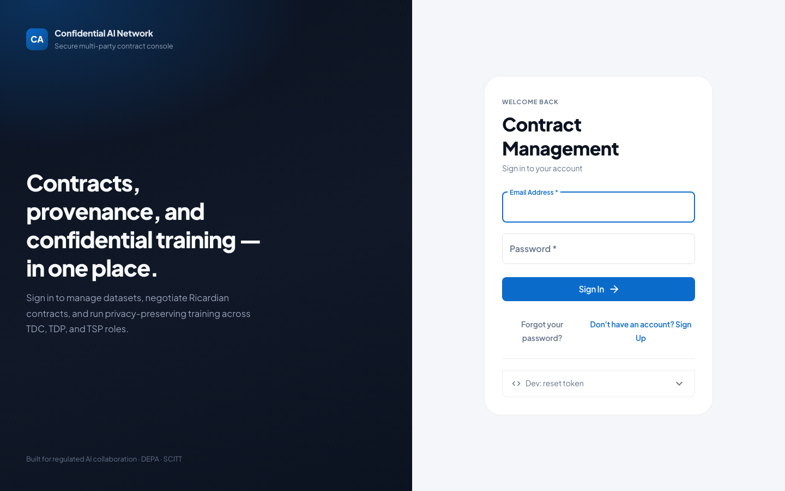
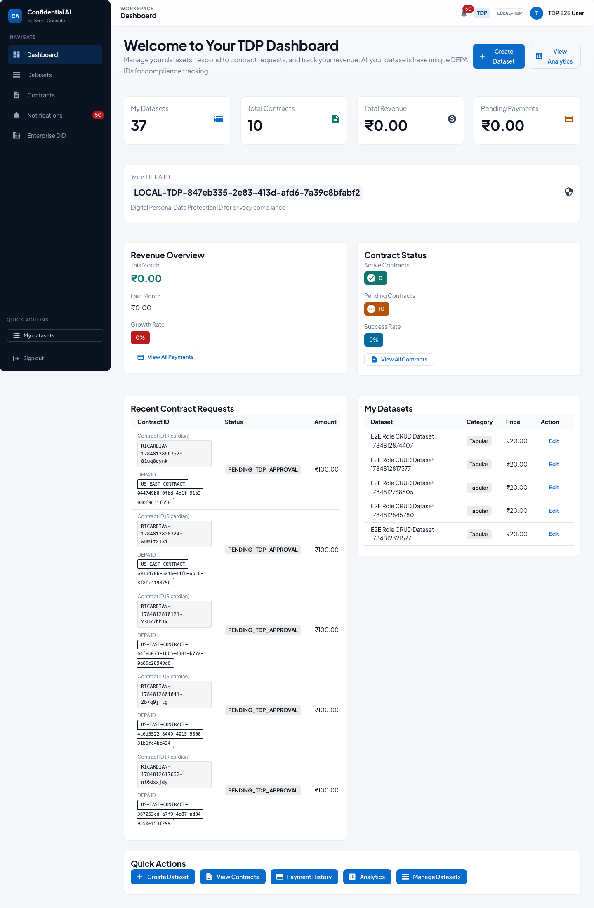
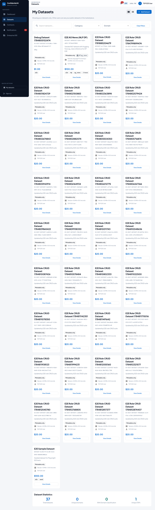
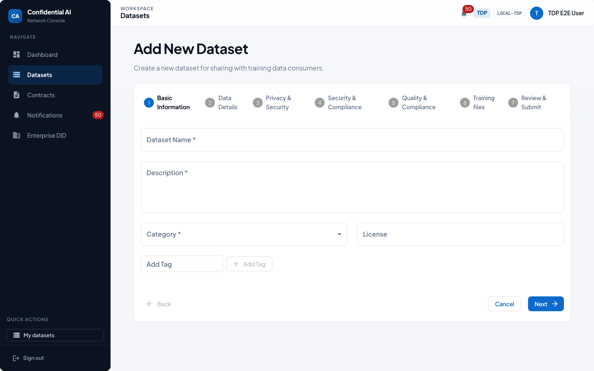
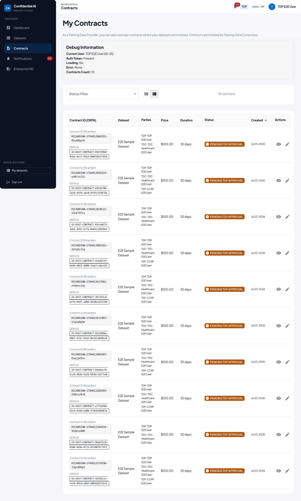
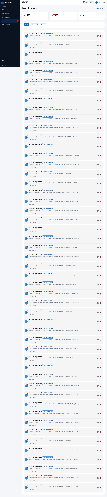

# TDP User Guide — Training Data Provider

> Auto-generated by the Playwright E2E suite (`npm run test:e2e:user-guides` in `frontend/`).
> Screenshots refreshed: **2026-07-23**. Prefer regenerating over hand-editing images.

As a Training Data Provider you publish datasets, review incoming contracts, and monitor how your data is used under approved terms.

## Who this is for

| | |
|---|---|
| Role | **TDP** |
| Demo user | `tdp.e2e@test.com` |
| Password | `TestNewPassword123!` (local E2E seed only) |

## Happy path

### 1. Sign in

1. Open the app and go to **Login**.
2. Enter your email and password.
3. Click **Sign In**. On first login you may be asked to set a new password.

### 2. Dashboard

The **TDP dashboard** summarizes your datasets, contract activity, and outstanding actions.

### 3. My datasets

**Datasets** lists assets you own. Review metadata, visibility, and DEPA identifiers before sharing.

### 4. Publish a dataset

Use **Add dataset** / upload to publish:
1. Provide name, modality, and description.
2. Attach files or catalog references.
3. Set access / licensing and publish.

### 5. Contracts

Review incoming contracts, verify terms for your data, and **sign** when you approve use in a clean room.

### 6. Notifications

Watch for signature requests and dataset access events here.

## Related docs

- [Participant onboarding & E2E lifecycle](../PARTICIPANT_ONBOARDING_AND_E2E_LIFECYCLE.md)
- [Contract signing user guide](../../features/contract-signing/CONTRACT_SIGNING_USER_GUIDE.md)
- [Top-level user guide](../../USER_GUIDE.md)
- [Role user guides index](README.md)
