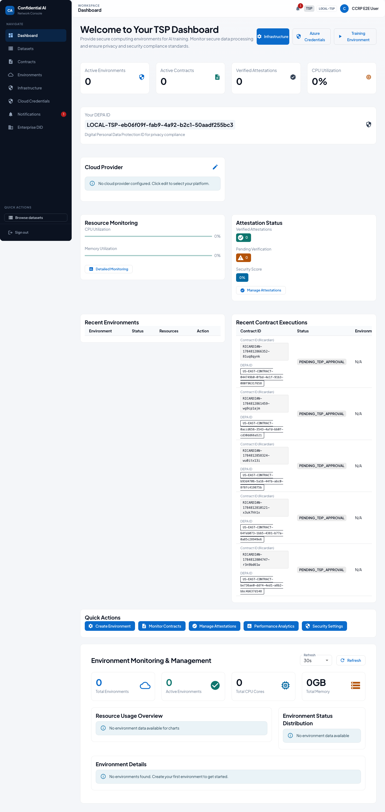
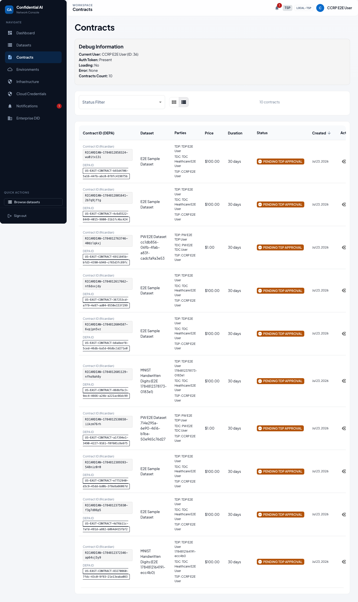
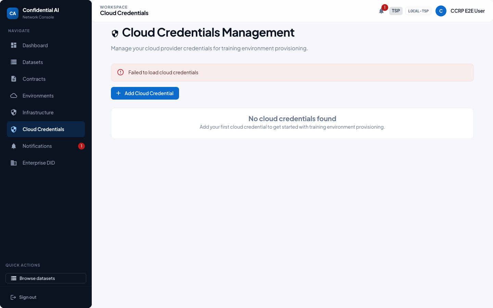
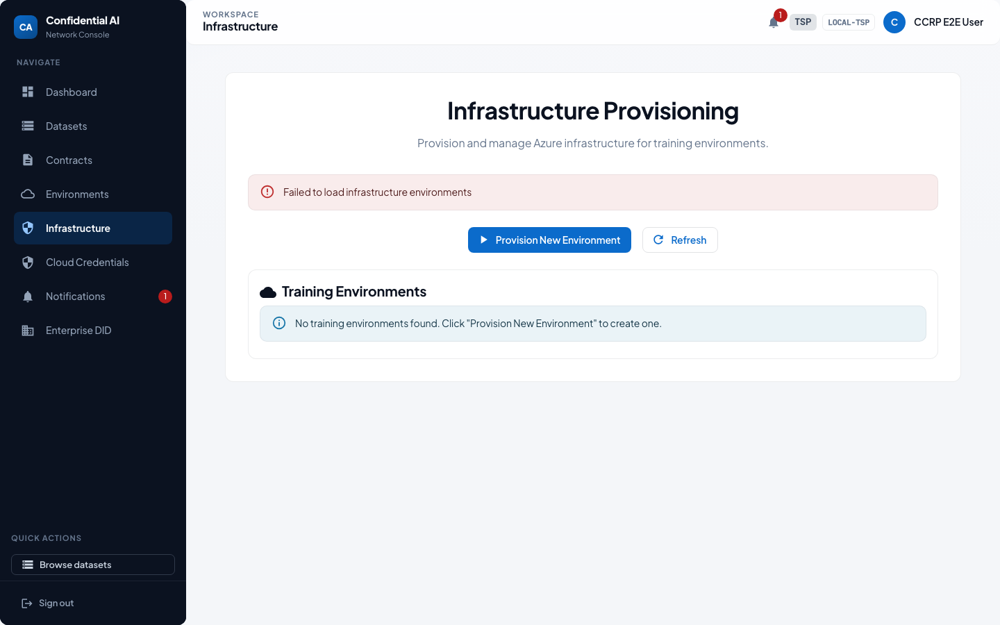
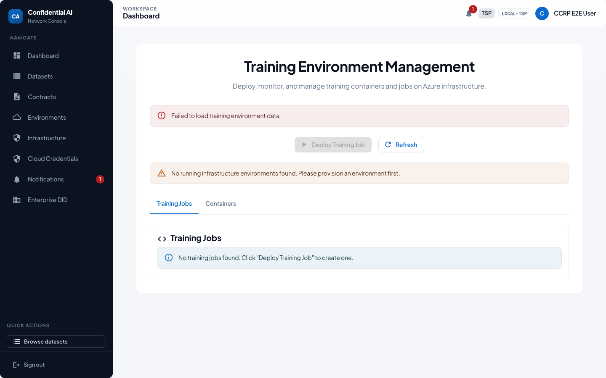
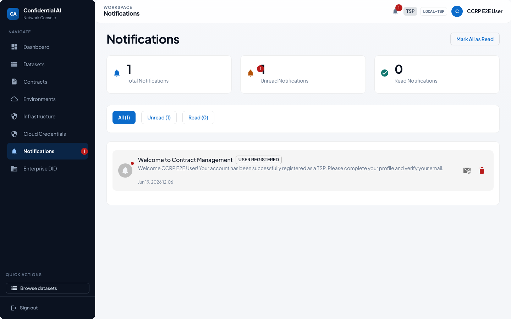

# TSP / CCRP User Guide — Tech Service Provider

> Auto-generated by the Playwright E2E suite (`npm run test:e2e:user-guides` in `frontend/`).
> Screenshots refreshed: **2026-07-23**. Prefer regenerating over hand-editing images.

As a Tech Service Provider (also called CCRP in older docs) you host confidential training environments, manage cloud credentials, and participate in contract signing.

## Who this is for

| | |
|---|---|
| Role | **TSP** |
| Demo user | `ccrp.e2e@test.com` |
| Password | `TestNewPassword123!` (local E2E seed only) |

## Happy path

### 1. Sign in

1. Open the app and go to **Login**.
2. Enter your email and password.
3. Click **Sign In**. On first login you may be asked to set a new password.

### 2. Dashboard

The **TSP dashboard** (labeled CCRP in some older screens) shows environment health and contracts that need your signature or capacity.

### 3. Contracts

Confirm clean-room requirements (TEE / residency / policies), then sign when you can host the job.

### 4. Cloud credentials

Register **cloud credentials** (or Local provider for demos) so contracts can target your offering.

### 5. Infrastructure

**Infrastructure** / provisioning views cover capacity and environment setup for training runs.

### 6. Training environment

Monitor or configure the **training environment** used for local Docker or cloud CCR sessions.

### 7. Notifications

Signature requests and provisioning alerts appear under **Notifications**.

## Related docs

- [Participant onboarding & E2E lifecycle](../PARTICIPANT_ONBOARDING_AND_E2E_LIFECYCLE.md)
- [Contract signing user guide](../../features/contract-signing/CONTRACT_SIGNING_USER_GUIDE.md)
- [Top-level user guide](../../USER_GUIDE.md)
- [Role user guides index](README.md)
