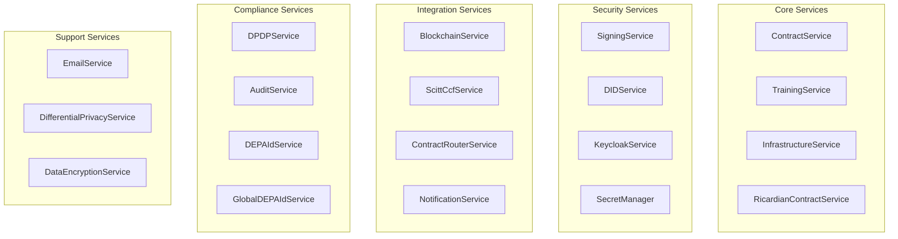
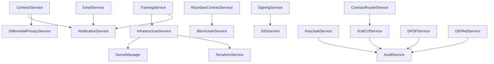

# 🛠️ Backend Services Documentation

## 📋 Overview

This document provides comprehensive documentation for all backend services in the Contract Management System. Each service is documented with its purpose, implementation status, key methods, and integration points.

## 🏗️ Service Architecture

The backend services follow a modular architecture with clear separation of concerns:



## 🔧 Core Services

### 1. ContractService

**Purpose**: Manages the complete contract lifecycle with state machine implementation.

**Implementation Status**: ✅ Complete (95%)

**Key Features**:
- State machine implementation (Draft → PendingTDP → PendingTDC → PendingCCRP → Signed → Executing → Completed)
- Contract validation and business logic
- State transition management
- Error handling and recovery

**Key Methods**:
```javascript
// State management
async createContract(contractData, tdcUser)
async updateContractState(contractId, newState, userId)
async validateStateTransition(currentState, newState, userRole)

// Contract operations
async getContract(contractId)
async getContractsByUser(userId, userRole)
async signContract(contractId, userId, signature)
async rejectContract(contractId, userId, reason)
```

**Integration Points**:
- NotificationService (state change notifications)
- DifferentialPrivacyService (privacy validation)
- Database models (Contract, User, Dataset, AIModel)

### 2. TrainingService

**Purpose**: Orchestrates the complete training lifecycle from contract signing to completion.

**Implementation Status**: ✅ Complete (90%)

**Key Features**:
- Automated training orchestration
- Environment provisioning
- Data access management
- Training execution monitoring
- Result validation

**Key Methods**:
```javascript
// Training orchestration
async startTraining(contractId)
async provisionEnvironment(contract)
async setupDataAccess(environment, contract)
async executeTraining(trainingJob)
async validateResults(trainingJob)

// Training management
async createTrainingJob(contract)
async getTrainingStatus(trainingJobId)
async cancelTraining(trainingJobId)
```

**Integration Points**:
- InfrastructureService (environment provisioning)
- NotificationService (training notifications)
- Database models (TrainingEnvironment, TrainingJob)

### 3. InfrastructureService

**Purpose**: Manages training environment provisioning across multiple cloud providers.

**Implementation Status**: ✅ Complete (85%)

**Key Features**:
- Multi-cloud support (AWS, Azure, GCP, OCI)
- Terraform integration for Infrastructure as Code
- Environment lifecycle management
- Resource monitoring and cleanup

**Key Methods**:
```javascript
// Environment management
async createTrainingEnvironment(contractId, config)
async destroyTrainingEnvironment(environmentId)
async getEnvironmentStatus(environmentId)
async scaleEnvironment(environmentId, newConfig)

// Provider management
async provisionAzureEnvironment(config)
async provisionAWSEnvironment(config)
async provisionGCPEnvironment(config)
async provisionOCIEnvironment(config)
```

**Integration Points**:
- Cloud provider services (awsProvider, azureProvider, gcpProvider, ociProvider)
- TerraformService (Infrastructure as Code)
- Database models (TrainingEnvironment)

### 4. RicardianContractService

**Purpose**: Handles Ricardian contract creation, validation, and management.

**Implementation Status**: ✅ Complete (95%)

**Key Features**:
- Ricardian contract generation
- Legal document binding
- Smart contract integration
- Contract validation

**Key Methods**:
```javascript
// Contract creation
async createRicardianContract(contractData)
async generateLegalDocument(contractData)
async bindToSmartContract(contractId, smartContractAddress)

// Contract validation
async validateRicardianContract(contractId)
async verifyContractIntegrity(contractId)
```

## 🔒 Security Services

### 5. SigningService

**Purpose**: Handles cryptographic signing and verification operations.

**Implementation Status**: ✅ Complete (90%)

**Key Features**:
- ES256 signing and verification
- DID-based signing
- Signature validation
- Key management

**Key Methods**:
```javascript
// Signing operations
async signData(data, privateKey, algorithm = 'ES256')
async verifySignature(data, signature, publicKey, algorithm = 'ES256')
async signWithDID(data, did, privateKey)

// Key management
async generateKeyPair(algorithm = 'ES256')
async validateKeyPair(publicKey, privateKey)
```

### 6. DIDService

**Purpose**: Manages Decentralized Identity (DID) operations and verification.

**Implementation Status**: ✅ Complete (85%)

**Key Features**:
- DID creation and management
- DID document validation
- DID resolution
- Identity verification

**Key Methods**:
```javascript
// DID operations
async createDID(userData)
async resolveDID(did)
async validateDIDDocument(didDocument)
async updateDIDDocument(did, updates)
```

### 7. KeycloakService

**Purpose**: Integrates with Keycloak for authentication and authorization.

**Implementation Status**: ✅ Complete (95%)

**Key Features**:
- User authentication
- Role-based access control
- Token management
- User synchronization

**Key Methods**:
```javascript
// Authentication
async authenticateUser(username, password)
async validateToken(token)
async refreshToken(refreshToken)

// User management
async createUser(userData)
async updateUser(userId, userData)
async deleteUser(userId)
async syncUsers()
```

### 8. SecretManager

**Purpose**: Manages secrets and credentials across multiple cloud providers.

**Implementation Status**: ✅ Complete (80%)

**Key Features**:
- Multi-cloud secret management
- Secret encryption and decryption
- Credential rotation
- Access control

**Key Methods**:
```javascript
// Secret management
async storeSecret(secretName, secretValue, provider)
async retrieveSecret(secretName, provider)
async rotateSecret(secretName, provider)
async deleteSecret(secretName, provider)
```

## 🔗 Integration Services

### 9. BlockchainService

**Purpose**: Handles blockchain operations and smart contract interactions.

**Implementation Status**: ✅ Complete (85%)

**Key Features**:
- Smart contract deployment
- Transaction management
- Event monitoring
- Gas optimization

**Key Methods**:
```javascript
// Blockchain operations
async deployContract(contractCode, constructorArgs)
async sendTransaction(to, data, value)
async getTransactionReceipt(txHash)
async getContractEvents(contractAddress, eventName)
```

### 10. ScittCcfService

**Purpose**: Integrates with SCITT CCF for supply chain transparency and trust.

**Implementation Status**: ✅ Complete (90%)

**Key Features**:
- SCITT CCF integration
- Claim creation and verification
- Provenance tracking
- Trust verification

**Key Methods**:
```javascript
// SCITT CCF operations
async createClaim(claimData)
async verifyClaim(claimId)
async getProvenance(claimId)
async validateTrust(claimId)
```

### 11. ContractRouterService

**Purpose**: Routes contract operations to appropriate backends (SCITT CCF).

**Implementation Status**: ✅ Complete (95%)

**Key Features**:
- Contract operation routing
- Data consistency management
- System health monitoring
- Unified API interface

**Key Methods**:
```javascript
// Routing operations
async routeContractOperation(operation, data)
async ensureDataConsistency(contractId)
async monitorSystemHealth()
async handleBackendFailover()
```

## 📋 Compliance Services

### 12. DPDPService

**Purpose**: Implements DPDP 2023 compliance requirements.

**Implementation Status**: ✅ Complete (90%)

**Key Features**:
- Consent management
- Data processing records
- Privacy impact assessments
- Compliance reporting

**Key Methods**:
```javascript
// DPDP compliance
async recordConsent(userId, purpose, dataTypes, consentType)
async createDataProcessingRecord(recordData)
async generatePrivacyImpactAssessment(assessmentData)
async generateComplianceReport(reportPeriod)
```

### 13. AuditService

**Purpose**: Provides comprehensive audit logging and monitoring.

**Implementation Status**: ✅ Complete (85%)

**Key Features**:
- Audit log management
- Security event monitoring
- Compliance reporting
- Risk assessment

**Key Methods**:
```javascript
// Audit operations
async logAuditEvent(eventData)
async getAuditLogs(filters)
async generateAuditReport(reportPeriod)
async assessSecurityRisks()
```

### 14. DEPAIdService

**Purpose**: Manages DEPA ID generation and validation.

**Implementation Status**: ✅ Complete (95%)

**Key Features**:
- DEPA ID generation
- ID validation
- Jurisdiction management
- ID resolution

**Key Methods**:
```javascript
// DEPA ID operations
async generateDEPAId(entityType, jurisdiction)
async validateDEPAId(depaId)
async resolveDEPAId(depaId)
async updateDEPAId(depaId, updates)
```

## 🔧 Support Services

### 15. EmailService

**Purpose**: Handles email notifications and communications.

**Implementation Status**: ✅ Complete (80%)

**Key Features**:
- Email template management
- Notification delivery
- Email tracking
- Template customization

**Key Methods**:
```javascript
// Email operations
async sendEmail(to, template, data)
async sendNotification(userId, notificationType, data)
async trackEmailDelivery(emailId)
async customizeTemplate(templateId, customizations)
```

### 16. DifferentialPrivacyService

**Purpose**: Implements differential privacy mechanisms for data protection.

**Implementation Status**: ✅ Complete (85%)

**Key Features**:
- Privacy budget management
- Noise injection algorithms
- Privacy loss tracking
- Compliance validation

**Key Methods**:
```javascript
// Differential privacy
async addNoise(data, epsilon, delta)
async managePrivacyBudget(userId, operation, privacyCost)
async validatePrivacyCompliance(data, privacyRequirements)
async generatePrivacyReport(userId)
```

### 17. DataEncryptionService

**Purpose**: Provides data encryption and decryption capabilities.

**Implementation Status**: ✅ Complete (90%)

**Key Features**:
- AES-256-GCM encryption
- Key management
- Field-level encryption
- Audit logging

**Key Methods**:
```javascript
// Encryption operations
async encryptData(data, keyId)
async decryptData(encryptedData)
async encryptField(value, fieldName)
async rotateEncryptionKey(keyId)
```

## 📊 Service Status Summary

| Service | Status | Completion | Key Features |
|---------|--------|------------|--------------|
| ContractService | ✅ Active | 95% | State machine, validation |
| TrainingService | ✅ Active | 90% | Orchestration, monitoring |
| InfrastructureService | ✅ Active | 85% | Multi-cloud, Terraform |
| RicardianContractService | ✅ Active | 95% | Legal binding, validation |
| SigningService | ✅ Active | 90% | ES256, DID signing |
| DIDService | ✅ Active | 85% | DID management, resolution |
| KeycloakService | ✅ Active | 95% | Authentication, RBAC |
| SecretManager | ✅ Active | 80% | Multi-cloud secrets |
| BlockchainService | ✅ Active | 85% | Smart contracts, events |
| ScittCcfService | ✅ Active | 90% | Supply chain trust |
| ContractRouterService | ✅ Active | 95% | Operation routing |
| DPDPService | ✅ Active | 90% | DPDP compliance |
| AuditService | ✅ Active | 85% | Audit logging, monitoring |
| DEPAIdService | ✅ Active | 95% | ID generation, validation |
| EmailService | ✅ Active | 80% | Notifications, templates |
| DifferentialPrivacyService | ✅ Active | 85% | Privacy protection |
| DataEncryptionService | ✅ Active | 90% | Data encryption |

## 🔄 Service Dependencies



## 🚀 Next Steps

1. **Complete AI Safety Services**: Implement content moderation and bias detection
2. **Advanced Privacy**: Add homomorphic encryption and zero-knowledge proofs
3. **Performance Optimization**: Optimize service performance and scalability
4. **Enhanced Monitoring**: Improve service monitoring and alerting
5. **Documentation**: Complete API documentation and integration guides

---

**Last Updated**: September 2, 2025  
**Version**: 1.0.0  
**Status**: Active Development
