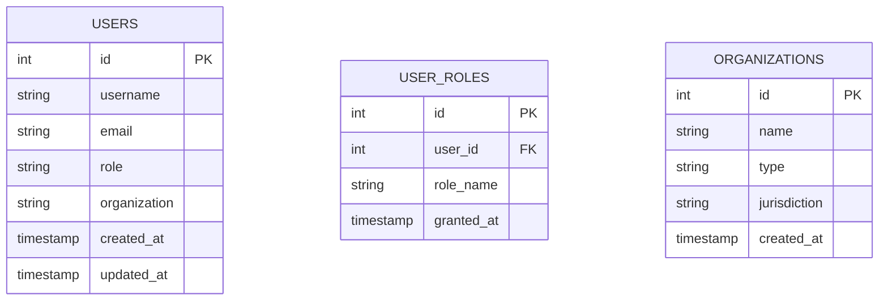
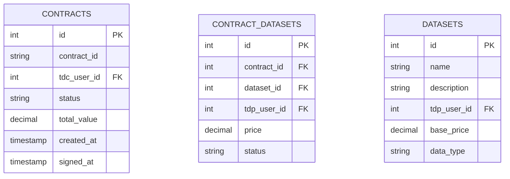
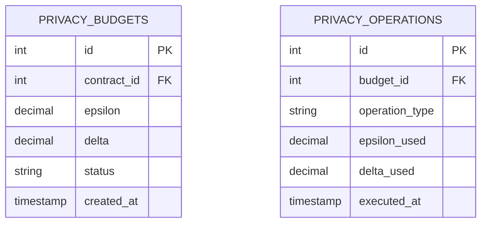
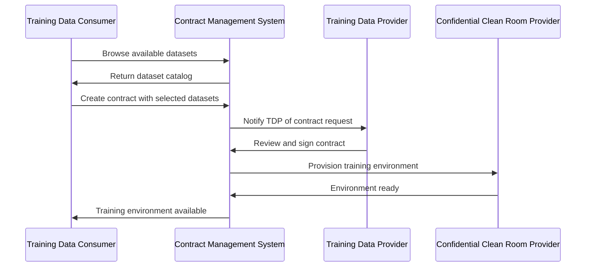
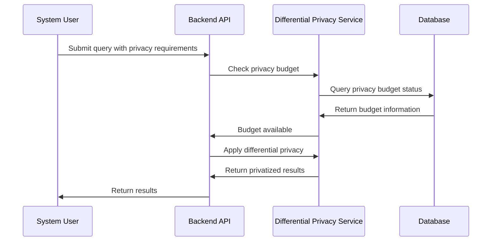

# Contract Management System - Product Requirements Document (PRD)

**Document Version:** 2.0  
**Date:** August 2025  
**Status:** Ready for Next Version Development  
**Author:** Contract Management Team  

## 📋 Executive Summary

The Contract Management System is a comprehensive, multi-tenant platform designed to facilitate secure, privacy-preserving AI training data contracts between Training Data Providers (TDPs), Training Data Consumers (TDCs), and Confidential Clean Room Providers (CCRPs). The system leverages SCITT CCF (Supply Chain Integrity, Transparency, and Trust - Confidential Computing Framework) for high-performance contract execution and differential privacy for data protection.

### Key Value Propositions
- **Multi-Tenant Architecture**: Secure isolation between different organizations
- **Privacy-Preserving**: Built-in differential privacy mechanisms
- **High Performance**: SCITT CCF ledger for fast contract execution
- **Multi-Cloud Support**: AWS, Azure, GCP, and on-premises infrastructure
- **Compliance Ready**: DPDP 2023, GDPR, and enterprise security standards

## 🎯 Product Vision

To create the most secure, scalable, and privacy-preserving contract management platform for AI training data, enabling organizations to collaborate on machine learning projects while maintaining data sovereignty and regulatory compliance.

## 🏗️ System Architecture Overview

### High-Level Architecture
```
┌─────────────────┐    ┌─────────────────┐    ┌─────────────────┐
│   Frontend      │    │   Backend       │    │   SCITT CCF     │
│   (React)       │◄──►│   (Node.js)     │◄──►│   Ledger        │
│   Port: 3000    │    │   Port: 5001    │    │   Port: 8000    │
└─────────────────┘    └─────────────────┘    └─────────────────┘
         │                       │                       │
         │                       │                       │
         ▼                       ▼                       ▼
┌─────────────────┐    ┌─────────────────┐    ┌─────────────────┐
│   Keycloak      │    │   PostgreSQL    │    │   Multi-Cloud   │
│   IAM           │    │   Database      │    │   Infrastructure │
│   Port: 8080    │    │   Port: 5432    │    │   (AWS/Azure/GCP)│
└─────────────────┘    └─────────────────┘    └─────────────────┘
```

## 🎭 User Personas & Roles

### 1. Training Data Provider (TDP)
- **Description**: Organizations that own and provide training datasets
- **Responsibilities**: 
  - Upload and catalog datasets
  - Set pricing and licensing terms
  - Sign contracts for data usage
  - Monitor data access and usage
- **Key Needs**: Data security, fair compensation, usage tracking

### 2. Training Data Consumer (TDC)
- **Description**: Organizations seeking training data for AI model development
- **Responsibilities**:
  - Browse available datasets
  - Create training contracts
  - Execute AI training workflows
  - Pay for data usage
- **Key Needs**: Data quality, cost efficiency, training environment access

### 3. Confidential Clean Room Provider (CCRP)
- **Description**: Organizations providing secure computing environments
- **Responsibilities**:
  - Provision secure training environments
  - Manage cloud infrastructure
  - Ensure data isolation
  - Monitor resource usage
- **Key Needs**: Infrastructure management, security compliance, cost control

### 4. System Administrator
- **Description**: Platform administrators and operators
- **Responsibilities**:
  - User management and access control
  - System monitoring and maintenance
  - Security policy enforcement
  - Compliance reporting
- **Key Needs**: System reliability, security, operational efficiency

## 🚀 Core Features & Requirements

### 1. Multi-Tenant Contract Management

#### 1.1 Contract Creation & Management
- **Requirement**: Support contracts with up to 3 datasets from different TDPs
- **Features**:
  - Multi-dataset contract templates
  - Individual pricing per dataset
  - Independent TDP signing workflow
  - Contract lifecycle management
- **Acceptance Criteria**:
  - [ ] Create contracts with 1-3 datasets
  - [ ] Set individual pricing per dataset
  - [ ] Support independent TDP signing
  - [ ] Track contract status per TDP

#### 1.2 Ricardian Contract Support
- **Requirement**: Generate human-readable legal agreements bound to smart contracts
- **Features**:
  - Legal document generation
  - Smart contract binding
  - Multi-tenant specifications
  - Provenance integration
- **Acceptance Criteria**:
  - [ ] Generate legal documents in multiple formats
  - [ ] Bind legal documents to smart contracts
  - [ ] Include technical parameters
  - [ ] Support multi-tenant configurations

### 2. Differential Privacy Implementation

#### 2.1 Privacy Mechanisms
- **Requirement**: Implement multiple differential privacy mechanisms
- **Features**:
  - Laplace noise mechanism
  - Gaussian noise mechanism
  - Exponential mechanism
  - Geometric mechanism
- **Acceptance Criteria**:
  - [ ] Support all 4 noise mechanisms
  - [ ] Automatic mechanism selection
  - [ ] Privacy budget management
  - [ ] Performance optimization

#### 2.2 Privacy Budget Management
- **Requirement**: Track and manage privacy budgets per contract
- **Features**:
  - Epsilon and Delta budget tracking
  - Budget state management
  - Query optimization
  - Audit logging
- **Acceptance Criteria**:
  - [ ] Track privacy budgets in real-time
  - [ ] Support budget states (ACTIVE, WARNING, EXHAUSTED)
  - [ ] Optimize query execution
  - [ ] Complete audit trail

### 3. SCITT CCF Integration

#### 3.1 Ledger Integration
- **Requirement**: Integrate with Microsoft SCITT CCF for high-performance contract execution
- **Features**:
  - Contract submission to ledger
  - Real-time status updates
  - Audit trail verification
  - Performance monitoring
- **Acceptance Criteria**:
  - [ ] Submit contracts to SCITT CCF ledger
  - [ ] Receive real-time updates
  - [ ] Verify contract integrity
  - [ ] Monitor ledger performance

#### 3.2 Dashboard & Monitoring
- **Requirement**: Provide real-time monitoring of SCITT CCF services
- **Features**:
  - Service health monitoring
  - Performance metrics
  - Error tracking
  - Resource utilization
- **Acceptance Criteria**:
  - [ ] Monitor all SCITT CCF services
  - [ ] Display real-time metrics
  - [ ] Track error rates
  - [ ] Monitor resource usage

### 4. Multi-Cloud Infrastructure

#### 4.1 Cloud Provider Support
- **Requirement**: Support AWS, Azure, GCP, and on-premises infrastructure
- **Features**:
  - Multi-cloud credential management
  - Resource provisioning
  - Cost tracking
  - Security isolation
- **Acceptance Criteria**:
  - [ ] Support all major cloud providers
  - [ ] Manage credentials securely
  - [ ] Provision resources automatically
  - [ ] Track costs per tenant

#### 4.2 Training Environment Provisioning
- **Requirement**: Automatically provision secure training environments
- **Features**:
  - Container-based training
  - Resource allocation
  - Security isolation
  - Monitoring integration
- **Acceptance Criteria**:
  - [ ] Provision training environments
  - [ ] Allocate appropriate resources
  - [ ] Ensure security isolation
  - [ ] Integrate with monitoring

### 5. Security & Compliance

#### 5.1 Authentication & Authorization
- **Requirement**: Implement enterprise-grade authentication and authorization
- **Features**:
  - Keycloak integration
  - Role-based access control
  - Multi-factor authentication
  - Session management
- **Acceptance Criteria**:
  - [ ] Integrate with Keycloak
  - [ ] Implement RBAC
  - [ ] Support MFA
  - [ ] Manage sessions securely

#### 5.2 Data Protection
- **Requirement**: Ensure data security and privacy compliance
- **Features**:
  - Data encryption at rest and in transit
  - KMS integration
  - Audit logging
  - Compliance reporting
- **Acceptance Criteria**:
  - [ ] Encrypt all sensitive data
  - [ ] Integrate with KMS
  - [ ] Maintain audit logs
  - [ ] Generate compliance reports

## 🔧 Technical Requirements

### 1. Backend Architecture

#### 1.1 Technology Stack
- **Runtime**: Node.js 18+
- **Framework**: Express.js
- **Database**: PostgreSQL 15+
- **ORM**: Sequelize
- **Authentication**: Keycloak
- **API**: RESTful with OpenAPI 3.0

#### 1.2 Performance Requirements
- **API Response Time**: < 200ms for 95% of requests
- **Database Query Time**: < 50ms for indexed queries
- **Authentication Time**: < 100ms for token validation
- **Contract Creation**: < 2 seconds end-to-end

#### 1.3 Scalability Requirements
- **Concurrent Users**: 1000+
- **Contracts per Day**: 100+
- **Data Processing**: 1TB+ per day
- **API Requests**: 10,000+ per minute

### 2. Frontend Architecture

#### 2.1 Technology Stack
- **Framework**: React 18+
- **UI Library**: Material-UI (MUI)
- **State Management**: React Context + Hooks
- **Routing**: React Router
- **Build Tool**: Vite

#### 2.2 User Experience Requirements
- **Page Load Time**: < 3 seconds
- **Interactive Response**: < 100ms
- **Mobile Responsiveness**: Yes
- **Accessibility**: WCAG 2.1 AA compliance

### 3. Database Design

#### 3.1 Core Tables
- **Users**: User management and authentication
- **Datasets**: Dataset metadata and pricing
- **Contracts**: Contract definitions and status
- **TrainingJobs**: AI training execution tracking
- **PrivacyBudgets**: Differential privacy budget management
- **AuditLogs**: System activity logging

#### 3.2 Data Requirements
- **Data Retention**: 7 years for compliance
- **Backup Strategy**: Daily backups with point-in-time recovery
- **Data Encryption**: AES-256 for sensitive data
- **Access Control**: Row-level security

### 4. Infrastructure Requirements

#### 4.1 Deployment
- **Containerization**: Docker + Docker Compose
- **Orchestration**: Kubernetes (production)
- **CI/CD**: GitHub Actions
- **Monitoring**: Prometheus + Grafana
- **Logging**: ELK Stack

#### 4.2 Security
- **Network Security**: VPC isolation, security groups
- **Application Security**: OWASP Top 10 compliance
- **Data Security**: Encryption, access controls, audit trails
- **Compliance**: SOC 2, ISO 27001, GDPR, DPDP 2023

## 📊 Data Models

### 1. User Management


### 2. Contract Management


### 3. Privacy Management


## 🔄 Workflows

### 1. Contract Creation Workflow


### 2. Differential Privacy Workflow


## 🧪 Testing Strategy

### 1. Testing Levels
- **Unit Testing**: 90%+ code coverage
- **Integration Testing**: API endpoints and database operations
- **End-to-End Testing**: Complete user workflows
- **Performance Testing**: Load and stress testing
- **Security Testing**: Penetration testing and vulnerability assessment

### 2. Testing Tools
- **Unit Testing**: Jest
- **Integration Testing**: Supertest
- **E2E Testing**: Playwright
- **Performance Testing**: Artillery
- **Security Testing**: OWASP ZAP

## 📈 Success Metrics

### 1. Technical Metrics
- **System Uptime**: 99.9%
- **API Response Time**: < 200ms (95th percentile)
- **Error Rate**: < 0.1%
- **Security Incidents**: 0

### 2. Business Metrics
- **User Adoption**: 100+ organizations
- **Contract Volume**: 1000+ contracts per month
- **Data Processing**: 10TB+ per month
- **Customer Satisfaction**: > 4.5/5

### 3. Compliance Metrics
- **Audit Success Rate**: 100%
- **Compliance Score**: > 95%
- **Incident Response Time**: < 4 hours

## 🚀 Implementation Roadmap

### Phase 1: Foundation (Months 1-3)
- [ ] Core infrastructure setup
- [ ] Database design and implementation
- [ ] Basic authentication system
- [ ] User management

### Phase 2: Core Features (Months 4-6)
- [ ] Contract management system
- [ ] Dataset management
- [ ] Basic API endpoints
- [ ] Frontend foundation

### Phase 3: Advanced Features (Months 7-9)
- [ ] Differential privacy implementation
- [ ] SCITT CCF integration
- [ ] Multi-cloud support
- [ ] Advanced security features

### Phase 4: Production Ready (Months 10-12)
- [ ] Performance optimization
- [ ] Security hardening
- [ ] Compliance certification
- [ ] Production deployment

## 🎯 Next Version Priorities

### 1. Architecture Improvements
- **Microservices Migration**: Break down monolithic backend
- **Event-Driven Architecture**: Implement event sourcing
- **API Gateway**: Centralized API management
- **Service Mesh**: Inter-service communication

### 2. Enhanced Privacy Features
- **Advanced DP Mechanisms**: Rényi DP, Local DP
- **Federated Learning**: Distributed privacy-preserving ML
- **Zero-Knowledge Proofs**: Advanced cryptographic privacy
- **Homomorphic Encryption**: Encrypted computation

### 3. AI/ML Integration
- **Automated Contract Analysis**: AI-powered contract review
- **Predictive Analytics**: Contract success prediction
- **Intelligent Resource Allocation**: ML-based optimization
- **Natural Language Processing**: Contract text analysis

### 4. Enterprise Features
- **Multi-Region Deployment**: Global availability
- **Advanced Analytics**: Business intelligence dashboard
- **Workflow Automation**: BPMN-based processes
- **Integration APIs**: Third-party system integration

## 🔒 Security & Compliance

### 1. Security Standards
- **OWASP Top 10**: Full compliance
- **NIST Cybersecurity Framework**: Implementation
- **ISO 27001**: Certification target
- **SOC 2 Type II**: Audit target

### 2. Compliance Requirements
- **GDPR**: European data protection
- **DPDP 2023**: Indian data protection
- **CCPA**: California privacy
- **HIPAA**: Healthcare data (if applicable)

### 3. Security Controls
- **Access Control**: Role-based, attribute-based
- **Data Protection**: Encryption, tokenization, masking
- **Network Security**: Segmentation, monitoring, intrusion detection
- **Application Security**: Code review, vulnerability scanning, penetration testing

## 💰 Cost Considerations

### 1. Development Costs
- **Team**: 8-12 developers, 6-8 months
- **Infrastructure**: Development and testing environments
- **Tools**: Development tools and licenses
- **Total**: $800K - $1.2M

### 2. Operational Costs
- **Infrastructure**: Cloud services and hosting
- **Maintenance**: Ongoing development and support
- **Compliance**: Audits and certifications
- **Total**: $200K - $400K annually

### 3. ROI Projections
- **Year 1**: Break-even
- **Year 2**: 200% ROI
- **Year 3**: 500% ROI

## 🎉 Conclusion

The Contract Management System represents a significant advancement in secure, privacy-preserving data collaboration. By leveraging cutting-edge technologies like SCITT CCF and differential privacy, the system provides a robust foundation for AI training data contracts while maintaining the highest standards of security and compliance.

The next version should focus on:
1. **Scalability**: Microservices architecture and cloud-native design
2. **Advanced Privacy**: Enhanced differential privacy and cryptographic techniques
3. **AI Integration**: Machine learning for automation and optimization
4. **Enterprise Features**: Advanced analytics, workflow automation, and integrations

This PRD provides a comprehensive roadmap for building a world-class contract management platform that meets the evolving needs of AI data collaboration while maintaining the highest standards of security, privacy, and compliance.

---

**Document Status**: ✅ Complete  
**Next Review**: December 2025  
**Approval**: Pending stakeholder review
