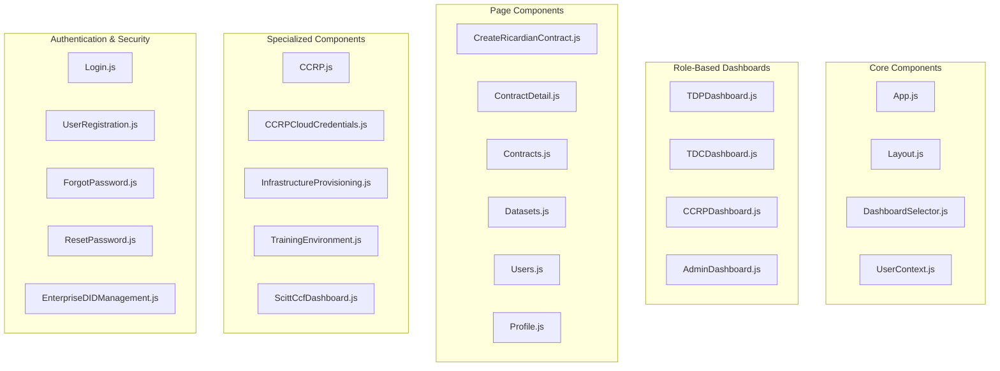
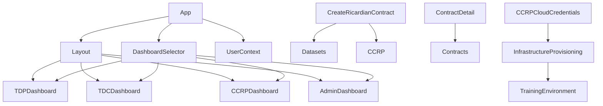

# 🎨 Frontend Components Documentation

## 📋 Overview

This document provides comprehensive documentation for all frontend components in the Contract Management System. Each component is documented with its purpose, implementation status, key features, and integration points.

## 🏗️ Frontend Architecture

The frontend follows a modern React architecture with clear separation of concerns:



## 🎯 Core Components

### 1. App.js

**Purpose**: Main application component with routing and context providers.

**Implementation Status**: ✅ Complete (95%)

**Key Features**:
- React Router setup with protected routes
- Role-based route protection
- Theme provider configuration
- Query client setup
- Toast notifications

**Key Routes**:
```javascript
// Public routes
/login - User authentication
/register - User registration
/forgot-password - Password recovery
/reset-password - Password reset

// Protected routes
/dashboard - Role-based dashboard
/admin/* - Admin-only routes
/tdp/* - TDP-specific routes
/tdc/* - TDC-specific routes
/ccrp/* - CCRP-specific routes
```

**Integration Points**:
- UserContext (authentication state)
- RoleProtectedRoute (role-based access)
- Layout (consistent UI structure)

### 2. Layout.js

**Purpose**: Provides consistent layout structure across all pages.

**Implementation Status**: ✅ Complete (90%)

**Key Features**:
- Responsive navigation sidebar
- Header with user information
- Role-based navigation items
- Mobile-responsive design
- Theme integration

**Key Components**:
```javascript
// Navigation structure
- Dashboard (role-based)
- Datasets (TDP/TDC)
- Contracts (all roles)
- Users (Admin)
- Profile (all roles)
- Notifications (all roles)
```

### 3. DashboardSelector.js

**Purpose**: Routes users to appropriate dashboard based on their role.

**Implementation Status**: ✅ Complete (95%)

**Key Features**:
- Role detection and routing
- Dashboard component selection
- Fallback handling
- Error boundaries

**Role Routing**:
```javascript
// Role-based dashboard routing
TDP → TDPDashboard
TDC → TDCDashboard
CCRP → CCRPDashboard
AppAdmin → AdminDashboard
```

## 🎛️ Role-Based Dashboards

### 4. TDPDashboard.js

**Purpose**: Training Data Provider dashboard with dataset and contract management.

**Implementation Status**: ✅ Complete (90%)

**Key Features**:
- Dataset management overview
- Contract status tracking
- Revenue analytics
- Quick actions (upload dataset, view contracts)
- Performance metrics

**Key Metrics**:
```javascript
// Dashboard metrics
- Total datasets
- Active contracts
- Pending contracts
- Total revenue
- Dataset performance
```

**Key Actions**:
```javascript
// Quick actions
- Upload new dataset
- View all datasets
- View contract details
- Manage profile
```

### 5. TDCDashboard.js

**Purpose**: Training Data Consumer dashboard with contract creation and training management.

**Implementation Status**: ✅ Complete (90%)

**Key Features**:
- Available datasets overview
- Contract creation interface
- Training job monitoring
- Payment tracking
- AI model management

**Key Metrics**:
```javascript
// Dashboard metrics
- Available datasets
- Active contracts
- Training jobs
- Total spent
- Model performance
```

**Key Actions**:
```javascript
// Quick actions
- Create new contract
- Browse datasets
- View training status
- Manage AI models
```

### 6. CCRPDashboard.js

**Purpose**: Confidential Clean Room Provider dashboard with infrastructure management.

**Implementation Status**: ✅ Complete (85%)

**Key Features**:
- Infrastructure environment overview
- Resource utilization monitoring
- Security metrics
- Cloud provider management
- Training environment provisioning

**Key Metrics**:
```javascript
// Dashboard metrics
- Active environments
- Resource utilization
- Security compliance
- Cloud provider status
- Training capacity
```

**Key Actions**:
```javascript
// Quick actions
- Provision new environment
- Manage cloud credentials
- Monitor security
- Configure infrastructure
```

### 7. AdminDashboard.js

**Purpose**: System administrator dashboard with system-wide management.

**Implementation Status**: ✅ Complete (80%)

**Key Features**:
- System overview metrics
- User management
- Contract monitoring
- Compliance reporting
- System health monitoring

**Key Metrics**:
```javascript
// Dashboard metrics
- Total users
- Active contracts
- System health
- Compliance status
- Security events
```

## 📄 Page Components

### 8. CreateRicardianContract.js

**Purpose**: Contract creation interface for TDC users.

**Implementation Status**: ✅ Complete (95%)

**Key Features**:
- Multi-step contract creation wizard
- Dataset selection (1-3 datasets)
- CCRP selection
- AI model selection
- Environment specifications
- Legal document generation
- Smart contract binding

**Contract Creation Flow**:
```javascript
// Step-by-step process
1. Select contract template
2. Select datasets (1-3)
3. Select CCRP and cloud provider
4. Select AI model
5. Configure environment specs
6. Review legal document
7. Create contract
```

**Key Features**:
- Multi-TDP support
- Global DEPA ID integration
- Environment specification
- Training parameters
- KMS configuration

### 9. ContractDetail.js

**Purpose**: Detailed contract view with state management and actions.

**Implementation Status**: ✅ Complete (90%)

**Key Features**:
- Contract state visualization
- Party information display
- Legal document viewer
- Smart contract details
- State transition actions
- Audit trail

**Key Actions**:
```javascript
// Contract actions
- Sign contract
- Reject contract
- View legal document
- Download contract
- View audit trail
```

### 10. Datasets.js

**Purpose**: Dataset browsing and management interface.

**Implementation Status**: ✅ Complete (85%)

**Key Features**:
- Dataset search and filtering
- Category-based organization
- Confidential computing requirements
- Dataset details view
- Upload interface (TDP)

**Key Features**:
```javascript
// Dataset features
- Search and filter
- Category organization
- Confidential computing tags
- Detailed information
- Upload functionality
```

### 11. Users.js

**Purpose**: User management interface for administrators.

**Implementation Status**: ✅ Complete (80%)

**Key Features**:
- User listing and search
- Role management
- User status management
- Bulk operations
- User creation

## 🔧 Specialized Components

### 12. CCRPCloudCredentials.js

**Purpose**: Cloud credentials management for CCRP users.

**Implementation Status**: ✅ Complete (85%)

**Key Features**:
- Multi-cloud provider support
- Credential validation
- Secure storage
- Configuration management
- Testing connectivity

**Supported Providers**:
```javascript
// Cloud providers
- Microsoft Azure
- Amazon Web Services
- Google Cloud Platform
- Oracle Cloud Infrastructure
```

### 13. InfrastructureProvisioning.js

**Purpose**: Infrastructure provisioning and management interface.

**Implementation Status**: ✅ Complete (80%)

**Key Features**:
- Environment provisioning
- Resource configuration
- Monitoring and logging
- Cost management
- Security configuration

### 14. TrainingEnvironment.js

**Purpose**: Training environment management and monitoring.

**Implementation Status**: ✅ Complete (75%)

**Key Features**:
- Environment monitoring
- Training job management
- Resource utilization
- Performance metrics
- Log access

### 15. ScittCcfDashboard.js

**Purpose**: SCITT CCF integration dashboard.

**Implementation Status**: ✅ Complete (90%)

**Key Features**:
- SCITT CCF system status
- Claim management
- Provenance tracking
- Trust verification
- Integration monitoring

## 🔐 Authentication & Security Components

### 16. Login.js

**Purpose**: User authentication interface.

**Implementation Status**: ✅ Complete (95%)

**Key Features**:
- Username/password authentication
- Remember me functionality
- Error handling
- Redirect after login
- Form validation

### 17. UserRegistration.js

**Purpose**: User registration interface with role selection.

**Implementation Status**: ✅ Complete (90%)

**Key Features**:
- Multi-role registration
- Form validation
- DID integration
- Global DEPA ID support
- Email verification

**Registration Flow**:
```javascript
// Registration process
1. Basic information
2. Role selection
3. DID configuration
4. Global DEPA ID (optional)
5. Email verification
6. Account activation
```

### 18. Profile.js

**Purpose**: User profile management interface.

**Implementation Status**: ✅ Complete (85%)

**Key Features**:
- Profile information editing
- Password change
- DID management
- Global DEPA ID management
- Account settings

## 📊 Component Status Summary

| Component | Status | Completion | Key Features |
|-----------|--------|------------|--------------|
| App.js | ✅ Active | 95% | Routing, context, themes |
| Layout.js | ✅ Active | 90% | Navigation, responsive design |
| DashboardSelector.js | ✅ Active | 95% | Role-based routing |
| TDPDashboard.js | ✅ Active | 90% | Dataset management, analytics |
| TDCDashboard.js | ✅ Active | 90% | Contract creation, training |
| CCRPDashboard.js | ✅ Active | 85% | Infrastructure management |
| AdminDashboard.js | ✅ Active | 80% | System administration |
| CreateRicardianContract.js | ✅ Active | 95% | Contract creation wizard |
| ContractDetail.js | ✅ Active | 90% | Contract management |
| Datasets.js | ✅ Active | 85% | Dataset browsing |
| Users.js | ✅ Active | 80% | User management |
| CCRPCloudCredentials.js | ✅ Active | 85% | Cloud credentials |
| InfrastructureProvisioning.js | ✅ Active | 80% | Infrastructure management |
| TrainingEnvironment.js | ✅ Active | 75% | Training monitoring |
| ScittCcfDashboard.js | ✅ Active | 90% | SCITT CCF integration |
| Login.js | ✅ Active | 95% | Authentication |
| UserRegistration.js | ✅ Active | 90% | User registration |
| Profile.js | ✅ Active | 85% | Profile management |

## 🔄 Component Dependencies



## 🎨 UI/UX Features

### Design System
- **Material-UI**: Consistent component library
- **Responsive Design**: Mobile-first approach
- **Theme Support**: Light/dark theme options
- **Accessibility**: WCAG 2.1 compliance

### State Management
- **React Query**: Server state management
- **Context API**: Global state management
- **Local State**: Component-level state
- **Form State**: Controlled components

### Performance
- **Code Splitting**: Route-based splitting
- **Lazy Loading**: Component lazy loading
- **Memoization**: React.memo and useMemo
- **Optimistic Updates**: Immediate UI feedback

## 🚀 Next Steps

1. **Complete Training Environment**: Finish training environment monitoring
2. **Enhanced Analytics**: Add comprehensive analytics dashboards
3. **Mobile Optimization**: Improve mobile user experience
4. **Accessibility**: Enhance accessibility features
5. **Performance**: Optimize component performance
6. **Testing**: Add comprehensive component testing

---

**Last Updated**: September 2, 2025  
**Version**: 1.0.0  
**Status**: Active Development
