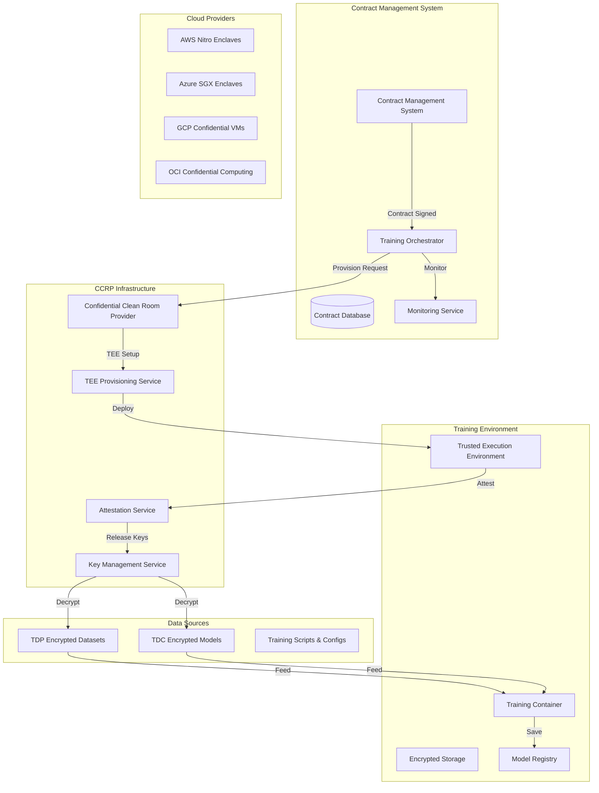
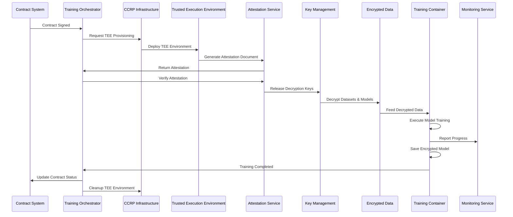

# 🤖 Model Training Environment Implementation Plan

## 📋 Executive Summary

This document outlines a comprehensive implementation plan for setting up and running AI model training based on signed contracts in the DEPA (Decentralized Entity Provider Architecture) system. The plan covers the complete workflow from contract execution to model deployment, ensuring security, privacy, and compliance throughout the process.

## 🎯 Implementation Goals

### **Primary Objectives**
- **Automated Training Execution**: Trigger training when contracts reach "SIGNED" status
- **Secure Environment Provisioning**: Use TEEs (Trusted Execution Environments) for confidential computing
- **Multi-Cloud Support**: Support AWS, Azure, GCP, and OCI with their respective confidential computing offerings
- **Privacy-Preserving Training**: Implement differential privacy and secure multi-party computation
- **End-to-End Monitoring**: Real-time training progress tracking and compliance monitoring

### **Success Metrics**
- **Time to Training**: < 10 minutes from contract signing to training start
- **Environment Provisioning**: < 5 minutes for TEE setup
- **Training Success Rate**: > 95% successful training completions
- **Security Compliance**: 100% attestation verification and audit logging
- **Resource Cleanup**: 100% automatic cleanup after training completion

## 🏗️ System Architecture

### **High-Level Architecture**



### **Training Workflow Sequence**



## 📊 Implementation Phases

### **Phase 1: Foundation & Infrastructure (Weeks 1-2)**

#### **1.1 Training Orchestration Service**
```javascript
// Enhanced TrainingService with TEE integration
class TrainingOrchestrationService {
  constructor() {
    this.contractService = new ContractService();
    this.teeProvisioningService = new TEEProvisioningService();
    this.attestationService = new AttestationService();
    this.monitoringService = new TrainingMonitoringService();
    this.keyManagementService = new KeyManagementService();
  }

  async executeTrainingWorkflow(contractId) {
    try {
      // 1. Validate contract and get all parties
      const contract = await this.validateContract(contractId);
      
      // 2. Provision TEE environment
      const teeEnvironment = await this.provisionTEEEnvironment(contract);
      
      // 3. Setup secure data access
      await this.setupSecureDataAccess(teeEnvironment, contract);
      
      // 4. Deploy training container
      const trainingJob = await this.deployTrainingContainer(teeEnvironment, contract);
      
      // 5. Start monitoring
      await this.startTrainingMonitoring(trainingJob);
      
      return trainingJob;
    } catch (error) {
      await this.handleTrainingFailure(contractId, error);
      throw error;
    }
  }
}
```

#### **1.2 TEE Provisioning Service**
```javascript
class TEEProvisioningService {
  async provisionTEEEnvironment(contract) {
    const provider = contract.ccrp.cloudProvider;
    const config = contract.trainingEnvironment;
    
    switch (provider) {
      case 'AWS':
        return await this.provisionAWSNitroEnclave(config);
      case 'Azure':
        return await this.provisionAzureSGXEnclave(config);
      case 'GCP':
        return await this.provisionGCPConfidentialVM(config);
      case 'OCI':
        return await this.provisionOCIConfidentialComputing(config);
      default:
        throw new Error(`Unsupported cloud provider: ${provider}`);
    }
  }
}
```

#### **1.3 Database Schema Updates**
```sql
-- Training Jobs Table
CREATE TABLE training_jobs (
    id SERIAL PRIMARY KEY,
    job_id VARCHAR(255) UNIQUE NOT NULL,
    contract_id VARCHAR(255) NOT NULL,
    environment_id VARCHAR(255) NOT NULL,
    status VARCHAR(50) NOT NULL DEFAULT 'PENDING',
    provider VARCHAR(50) NOT NULL,
    region VARCHAR(100) NOT NULL,
    created_at TIMESTAMP DEFAULT CURRENT_TIMESTAMP,
    started_at TIMESTAMP,
    completed_at TIMESTAMP,
    error_message TEXT,
    metadata JSONB
);

-- Training Progress Table
CREATE TABLE training_progress (
    id SERIAL PRIMARY KEY,
    job_id VARCHAR(255) NOT NULL,
    progress_percentage DECIMAL(5,2) DEFAULT 0,
    current_epoch INTEGER DEFAULT 0,
    total_epochs INTEGER DEFAULT 0,
    current_loss DECIMAL(10,6),
    validation_accuracy DECIMAL(5,4),
    timestamp TIMESTAMP DEFAULT CURRENT_TIMESTAMP,
    metadata JSONB
);

-- TEE Attestation Table
CREATE TABLE tee_attestations (
    id SERIAL PRIMARY KEY,
    environment_id VARCHAR(255) NOT NULL,
    attestation_document TEXT NOT NULL,
    verification_status VARCHAR(50) NOT NULL,
    verified_at TIMESTAMP,
    expires_at TIMESTAMP,
    metadata JSONB
);
```

### **Phase 2: TEE Integration & Security (Weeks 3-4)**

#### **2.1 Attestation Service**
```javascript
class AttestationService {
  async verifyTEEAttestation(environmentId, attestationDocument) {
    try {
      // Parse attestation document
      const attestation = JSON.parse(attestationDocument);
      
      // Verify hardware attestation
      const isValid = await this.verifyHardwareAttestation(attestation);
      
      if (!isValid) {
        throw new Error('Invalid TEE attestation');
      }
      
      // Store attestation record
      await this.storeAttestationRecord(environmentId, attestationDocument);
      
      // Release decryption keys
      await this.releaseDecryptionKeys(environmentId, attestation);
      
      return true;
    } catch (error) {
      console.error('Attestation verification failed:', error);
      throw error;
    }
  }
}
```

#### **2.2 Secure Key Release**
```javascript
class SecureKeyReleaseService {
  async releaseDecryptionKeys(environmentId, attestation) {
    // Verify attestation matches expected environment
    const expectedEnvironment = await this.getExpectedEnvironment(environmentId);
    
    if (!this.verifyEnvironmentMatch(attestation, expectedEnvironment)) {
      throw new Error('Environment mismatch in attestation');
    }
    
    // Release keys for this specific environment
    const keys = await this.keyManagementService.getEnvironmentKeys(environmentId);
    
    // Encrypt keys with TEE public key
    const encryptedKeys = await this.encryptKeysForTEE(keys, attestation.publicKey);
    
    // Store encrypted keys for TEE access
    await this.storeEncryptedKeys(environmentId, encryptedKeys);
    
    return encryptedKeys;
  }
}
```

### **Phase 3: Training Container Development (Weeks 5-6)**

#### **3.1 Training Container Template**
```dockerfile
# Base training container with TEE support
FROM mcr.microsoft.com/azureml/openmpi4.1.0-ubuntu20.04

# Install required packages
RUN apt-get update && apt-get install -y \
    python3-pip \
    python3-dev \
    build-essential \
    curl \
    wget \
    && rm -rf /var/lib/apt/lists/*

# Install Python packages
COPY requirements.txt /tmp/requirements.txt
RUN pip3 install -r /tmp/requirements.txt

# Copy training scripts
COPY training/ /app/training/
COPY config/ /app/config/

# Set working directory
WORKDIR /app

# Create non-root user for security
RUN useradd -m -u 1000 trainer && chown -R trainer:trainer /app
USER trainer

# Entry point
ENTRYPOINT ["python3", "training/main.py"]
```

#### **3.2 Training Script Framework**
```python
# training/main.py
import os
import json
import logging
from training.contract_parser import ContractParser
from training.data_loader import SecureDataLoader
from training.model_trainer import ModelTrainer
from training.privacy_engine import PrivacyEngine
from training.monitoring import TrainingMonitor

class TrainingOrchestrator:
    def __init__(self):
        self.contract_id = os.getenv('CONTRACT_ID')
        self.job_id = os.getenv('JOB_ID')
        self.environment_id = os.getenv('ENVIRONMENT_ID')
        
        # Initialize components
        self.contract_parser = ContractParser()
        self.data_loader = SecureDataLoader()
        self.model_trainer = ModelTrainer()
        self.privacy_engine = PrivacyEngine()
        self.monitor = TrainingMonitor()
        
    async def execute_training(self):
        try:
            # 1. Parse contract specifications
            contract = await self.contract_parser.parse_contract(self.contract_id)
            
            # 2. Load encrypted datasets
            datasets = await self.data_loader.load_datasets(contract['datasets'])
            
            # 3. Load encrypted models
            models = await self.data_loader.load_models(contract['ai_models'])
            
            # 4. Setup privacy-preserving training
            privacy_config = self.privacy_engine.configure_privacy(contract['privacy_requirements'])
            
            # 5. Execute training
            trained_model = await self.model_trainer.train(
                datasets=datasets,
                base_models=models,
                contract_specs=contract,
                privacy_config=privacy_config,
                progress_callback=self.monitor.update_progress
            )
            
            # 6. Validate model against contract requirements
            validation_results = await self.validate_model(trained_model, contract)
            
            # 7. Save encrypted model
            await self.save_encrypted_model(trained_model, contract)
            
            # 8. Cleanup sensitive data
            await self.cleanup_sensitive_data()
            
            return {
                'status': 'completed',
                'model_id': trained_model.id,
                'validation_results': validation_results
            }
            
        except Exception as e:
            logging.error(f"Training failed: {str(e)}")
            await self.monitor.report_error(str(e))
            raise
```

### **Phase 4: Data Flow & Security (Weeks 7-8)**

#### **4.1 Secure Data Access**
```javascript
class SecureDataAccessService {
  async setupSecureDataAccess(teeEnvironment, contract) {
    // 1. Get encrypted datasets from TDPs
    const encryptedDatasets = await this.getEncryptedDatasets(contract.datasets);
    
    // 2. Get encrypted models from TDCs
    const encryptedModels = await this.getEncryptedModels(contract.aiModels);
    
    // 3. Setup secure storage mounts in TEE
    await this.setupSecureStorageMounts(teeEnvironment, {
      datasets: encryptedDatasets,
      models: encryptedModels
    });
    
    // 4. Configure decryption keys
    await this.configureDecryptionKeys(teeEnvironment, contract);
    
    return {
      datasets: encryptedDatasets,
      models: encryptedModels,
      storageMounts: teeEnvironment.storageMounts
    };
  }
}
```

#### **4.2 Privacy-Preserving Training**
```python
# training/privacy_engine.py
class PrivacyEngine:
    def __init__(self):
        self.differential_privacy = DifferentialPrivacyService()
        self.secure_aggregation = SecureAggregationService()
        self.federated_learning = FederatedLearningService()
    
    def configure_privacy(self, privacy_requirements):
        config = {
            'differential_privacy': None,
            'secure_aggregation': None,
            'federated_learning': None
        }
        
        if privacy_requirements.get('differential_privacy'):
            config['differential_privacy'] = self.differential_privacy.configure(
                epsilon=privacy_requirements['epsilon'],
                delta=privacy_requirements['delta'],
                sensitivity=privacy_requirements['sensitivity']
            )
        
        if privacy_requirements.get('secure_aggregation'):
            config['secure_aggregation'] = self.secure_aggregation.configure(
                threshold=privacy_requirements['threshold'],
                participants=privacy_requirements['participants']
            )
        
        return config
```

### **Phase 5: Monitoring & Management (Weeks 9-10)**

#### **5.1 Training Monitoring Service**
```javascript
class TrainingMonitoringService {
  async startTrainingMonitoring(trainingJob) {
    // Start real-time monitoring
    const monitor = setInterval(async () => {
      try {
        const progress = await this.getTrainingProgress(trainingJob.jobId);
        await this.updateTrainingProgress(trainingJob.jobId, progress);
        
        // Check for completion or failure
        if (progress.status === 'completed' || progress.status === 'failed') {
          clearInterval(monitor);
          await this.handleTrainingCompletion(trainingJob, progress);
        }
      } catch (error) {
        console.error('Monitoring error:', error);
      }
    }, 30000); // Check every 30 seconds
    
    return monitor;
  }
  
  async updateTrainingProgress(jobId, progress) {
    await this.db.trainingProgress.create({
      jobId: jobId,
      progressPercentage: progress.percentage,
      currentEpoch: progress.currentEpoch,
      totalEpochs: progress.totalEpochs,
      currentLoss: progress.loss,
      validationAccuracy: progress.accuracy,
      metadata: progress.metadata
    });
  }
}
```

#### **5.2 Compliance Monitoring**
```javascript
class ComplianceMonitoringService {
  async monitorCompliance(trainingJob, contract) {
    const complianceChecks = [
      this.checkDataAccessCompliance(trainingJob, contract),
      this.checkPrivacyCompliance(trainingJob, contract),
      this.checkSecurityCompliance(trainingJob, contract),
      this.checkAuditLogging(trainingJob, contract)
    ];
    
    const results = await Promise.all(complianceChecks);
    
    // Report any compliance violations
    const violations = results.filter(result => !result.compliant);
    if (violations.length > 0) {
      await this.reportComplianceViolations(trainingJob, violations);
    }
    
    return results;
  }
}
```

### **Phase 6: Testing & Validation (Weeks 11-12)**

#### **6.1 End-to-End Testing**
```javascript
// tests/training-e2e.test.js
describe('Training Environment E2E Tests', () => {
  test('Complete training workflow', async () => {
    // 1. Create test contract
    const contract = await createTestContract();
    
    // 2. Sign contract with all parties
    await signContractWithAllParties(contract.id);
    
    // 3. Trigger training
    const trainingJob = await trainingOrchestrator.executeTrainingWorkflow(contract.id);
    
    // 4. Monitor training progress
    await monitorTrainingProgress(trainingJob.jobId);
    
    // 5. Validate results
    const results = await validateTrainingResults(trainingJob.jobId);
    
    expect(results.status).toBe('completed');
    expect(results.modelId).toBeDefined();
    expect(results.validationResults.accuracy).toBeGreaterThan(0.9);
  });
});
```

#### **6.2 Security Testing**
```javascript
// tests/security.test.js
describe('Training Security Tests', () => {
  test('TEE attestation verification', async () => {
    const environment = await provisionTestTEE();
    const attestation = await getTEEAttestation(environment.id);
    
    const isValid = await attestationService.verifyTEEAttestation(
      environment.id, 
      attestation
    );
    
    expect(isValid).toBe(true);
  });
  
  test('Data encryption in transit', async () => {
    const data = generateTestData();
    const encryptedData = await encryptData(data);
    
    // Verify data is encrypted
    expect(encryptedData).not.toEqual(data);
    expect(encryptedData.encrypted).toBe(true);
  });
});
```

## 🔧 Technical Implementation Details

### **Cloud Provider Integration**

#### **AWS Nitro Enclaves**
```javascript
class AWSNitroEnclaveService {
  async provisionNitroEnclave(config) {
    const ec2 = new AWS.EC2();
    
    const params = {
      InstanceId: config.instanceId,
      EnclaveOptions: {
        Enabled: true,
        EnclaveImageId: config.enclaveImageId
      }
    };
    
    const result = await ec2.modifyInstanceAttribute(params).promise();
    return result;
  }
}
```

#### **Azure SGX Enclaves**
```javascript
class AzureSGXEnclaveService {
  async provisionSGXEnclave(config) {
    const containerClient = new ContainerInstanceManagementClient(
      credential, 
      subscriptionId
    );
    
    const containerGroup = {
      location: config.region,
      containers: [{
        name: 'sgx-training-container',
        image: config.containerImage,
        resources: {
          requests: {
            memoryInGB: config.memoryGB,
            cpu: config.cpuCores
          }
        },
        securityContext: {
          privileged: false,
          capabilities: {
            add: ['SYS_PTRACE']
          }
        }
      }]
    };
    
    return await containerClient.containerGroups.beginCreateOrUpdate(
      resourceGroupName,
      containerGroupName,
      containerGroup
    );
  }
}
```

### **Database Models**

#### **Training Job Model**
```javascript
// backend/models/TrainingJob.js
module.exports = (sequelize, DataTypes) => {
  const TrainingJob = sequelize.define('TrainingJob', {
    id: {
      type: DataTypes.INTEGER,
      primaryKey: true,
      autoIncrement: true
    },
    jobId: {
      type: DataTypes.STRING,
      allowNull: false,
      unique: true
    },
    contractId: {
      type: DataTypes.STRING,
      allowNull: false
    },
    environmentId: {
      type: DataTypes.STRING,
      allowNull: false
    },
    status: {
      type: DataTypes.ENUM(
        'PENDING',
        'PROVISIONING',
        'RUNNING',
        'COMPLETED',
        'FAILED',
        'CANCELLED'
      ),
      defaultValue: 'PENDING'
    },
    provider: {
      type: DataTypes.STRING,
      allowNull: false
    },
    region: {
      type: DataTypes.STRING,
      allowNull: false
    },
    trainingConfig: {
      type: DataTypes.JSONB,
      allowNull: true
    },
    results: {
      type: DataTypes.JSONB,
      allowNull: true
    },
    createdAt: {
      type: DataTypes.DATE,
      defaultValue: DataTypes.NOW
    },
    startedAt: {
      type: DataTypes.DATE,
      allowNull: true
    },
    completedAt: {
      type: DataTypes.DATE,
      allowNull: true
    }
  });
  
  return TrainingJob;
};
```

### **API Endpoints**

#### **Training Management Endpoints**
```javascript
// backend/routes/training.js
router.post('/training/execute/:contractId', async (req, res) => {
  try {
    const { contractId } = req.params;
    const trainingJob = await trainingOrchestrator.executeTrainingWorkflow(contractId);
    
    res.json({
      success: true,
      trainingJob: {
        jobId: trainingJob.jobId,
        status: trainingJob.status,
        environmentId: trainingJob.environmentId
      }
    });
  } catch (error) {
    res.status(500).json({
      success: false,
      error: error.message
    });
  }
});

router.get('/training/status/:jobId', async (req, res) => {
  try {
    const { jobId } = req.params;
    const status = await trainingService.getTrainingStatus(jobId);
    
    res.json({
      success: true,
      status: status
    });
  } catch (error) {
    res.status(500).json({
      success: false,
      error: error.message
    });
  }
});

router.get('/training/progress/:jobId', async (req, res) => {
  try {
    const { jobId } = req.params;
    const progress = await trainingService.getTrainingProgress(jobId);
    
    res.json({
      success: true,
      progress: progress
    });
  } catch (error) {
    res.status(500).json({
      success: false,
      error: error.message
    });
  }
});
```

## 📋 Implementation Checklist

### **Phase 1: Foundation (Weeks 1-2)**
- [ ] Create TrainingOrchestrationService
- [ ] Implement TEEProvisioningService
- [ ] Update database schema for training jobs
- [ ] Create training job models
- [ ] Setup basic monitoring infrastructure

### **Phase 2: TEE Integration (Weeks 3-4)**
- [ ] Implement AttestationService
- [ ] Create SecureKeyReleaseService
- [ ] Integrate with cloud provider TEE services
- [ ] Implement hardware attestation verification
- [ ] Setup secure key management

### **Phase 3: Training Containers (Weeks 5-6)**
- [ ] Create training container templates
- [ ] Implement training script framework
- [ ] Setup privacy-preserving training
- [ ] Create model validation system
- [ ] Implement secure data loading

### **Phase 4: Data Flow (Weeks 7-8)**
- [ ] Implement SecureDataAccessService
- [ ] Setup encrypted data transfer
- [ ] Create privacy engine
- [ ] Implement differential privacy
- [ ] Setup secure aggregation

### **Phase 5: Monitoring (Weeks 9-10)**
- [ ] Create TrainingMonitoringService
- [ ] Implement ComplianceMonitoringService
- [ ] Setup real-time progress tracking
- [ ] Create audit logging system
- [ ] Implement alerting system

### **Phase 6: Testing (Weeks 11-12)**
- [ ] Create end-to-end tests
- [ ] Implement security tests
- [ ] Setup performance tests
- [ ] Create integration tests
- [ ] Validate compliance requirements

## 🚀 Deployment Strategy

### **Development Environment**
1. **Local Testing**: Use Docker containers for local development
2. **Staging Environment**: Deploy to cloud provider staging environment
3. **Integration Testing**: Test with real TEE environments

### **Production Deployment**
1. **Blue-Green Deployment**: Deploy new version alongside existing
2. **Gradual Rollout**: Start with 10% of contracts, increase gradually
3. **Monitoring**: Continuous monitoring of training success rates
4. **Rollback Plan**: Quick rollback capability if issues arise

## 📊 Success Metrics & KPIs

### **Performance Metrics**
- **Training Start Time**: < 10 minutes from contract signing
- **Environment Provisioning**: < 5 minutes for TEE setup
- **Training Success Rate**: > 95% successful completions
- **Resource Utilization**: < 80% of allocated resources

### **Security Metrics**
- **Attestation Success Rate**: 100% successful TEE attestations
- **Data Encryption**: 100% of data encrypted in transit and at rest
- **Access Control**: 100% compliance with contract access requirements
- **Audit Logging**: 100% of operations logged and auditable

### **Compliance Metrics**
- **Privacy Compliance**: 100% compliance with privacy requirements
- **Data Retention**: 100% compliance with data retention policies
- **Cleanup Success**: 100% automatic cleanup after training
- **Regulatory Compliance**: 100% compliance with relevant regulations

## 🔒 Security Considerations

### **Data Protection**
- All data encrypted at rest and in transit
- Keys managed through secure key management service
- TEE attestation required for key release
- Automatic data cleanup after training completion

### **Access Control**
- Role-based access control for all operations
- Multi-factor authentication for sensitive operations
- Audit logging for all access and operations
- Regular security assessments and penetration testing

### **Compliance**
- HIPAA compliance for healthcare data
- GDPR compliance for EU data
- SOC 2 Type II compliance
- Regular compliance audits and assessments

## 📈 Future Enhancements

### **Advanced Features**
- **Federated Learning**: Support for federated learning across multiple parties
- **Multi-Modal Training**: Support for training on multiple data types
- **AutoML Integration**: Automated model selection and hyperparameter tuning
- **Model Versioning**: Version control for trained models

### **Scalability Improvements**
- **Horizontal Scaling**: Support for multiple concurrent training jobs
- **Resource Optimization**: Dynamic resource allocation based on workload
- **Cost Optimization**: Automatic cost optimization for cloud resources
- **Performance Tuning**: Automatic performance optimization

This implementation plan provides a comprehensive roadmap for building a secure, scalable, and compliant model training environment that integrates seamlessly with the existing DEPA contract management system.
