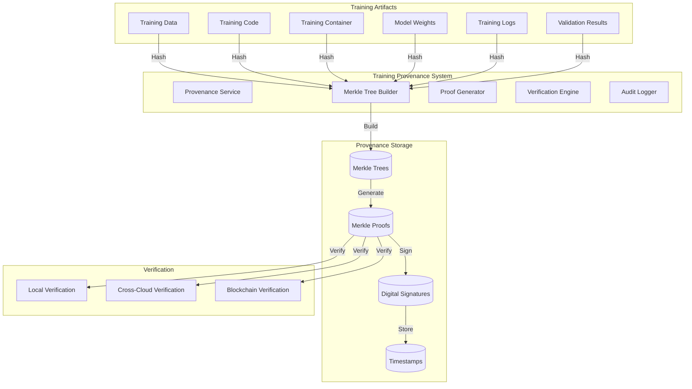

# 🔍 Training Provenance Tracking Implementation Plan

## 📋 Executive Summary

This document extends the Model Training Implementation Plan with comprehensive provenance tracking using Merkle trees and verification mechanisms. Provenance tracking ensures complete auditability of AI model training processes, data lineage, and code execution in regulated environments.

## 🎯 Provenance Tracking Objectives

### **Primary Goals**
- **Complete Data Lineage**: Track every data transformation from source to trained model
- **Code Provenance**: Verify training code, containers, and execution environment
- **Model Lineage**: Track model evolution and dependencies
- **Cryptographic Verification**: Use Merkle trees for tamper-proof provenance
- **Cross-Cloud Consistency**: Verify provenance across multiple cloud environments
- **Regulatory Compliance**: Meet audit requirements for AI model transparency

### **Success Metrics**
- **Provenance Coverage**: 100% of training artifacts tracked
- **Verification Speed**: < 1 second for Merkle proof verification
- **Integrity Assurance**: 100% tamper detection rate
- **Audit Trail**: Complete chronological record of all operations
- **Cross-Cloud Verification**: 100% consistency across cloud providers

## 🏗️ Provenance Architecture

### **High-Level Provenance Flow**



## 📊 Provenance Node Types

### **1. Data Provenance Nodes**

```typescript
interface DataProvenanceNode {
  nodeId: string;
  nodeType: 'DATASET' | 'DATA_CHUNK' | 'DATA_TRANSFORMATION';
  dataHash: string;
  metadata: {
    source: string;
    size: number;
    format: string;
    encryption: EncryptionInfo;
    privacyLevel: 'PUBLIC' | 'PRIVATE' | 'CONFIDENTIAL';
    retentionPolicy: RetentionPolicy;
  };
  lineage: {
    parentNodes: string[];
    childNodes: string[];
    transformations: TransformationInfo[];
  };
  timestamps: {
    created: string;
    modified: string;
    accessed: string;
  };
  signatures: DigitalSignature[];
}
```

### **2. Code Provenance Nodes**

```typescript
interface CodeProvenanceNode {
  nodeId: string;
  nodeType: 'TRAINING_SCRIPT' | 'CONTAINER_IMAGE' | 'DEPENDENCY' | 'CONFIGURATION';
  codeHash: string;
  metadata: {
    language: string;
    version: string;
    repository: string;
    commitHash: string;
    dependencies: DependencyInfo[];
    securityScan: SecurityScanResult;
  };
  lineage: {
    parentNodes: string[];
    childNodes: string[];
    modifications: ModificationInfo[];
  };
  timestamps: {
    created: string;
    modified: string;
    deployed: string;
  };
  signatures: DigitalSignature[];
}
```

### **3. Model Provenance Nodes**

```typescript
interface ModelProvenanceNode {
  nodeId: string;
  nodeType: 'BASE_MODEL' | 'TRAINED_MODEL' | 'MODEL_WEIGHTS' | 'MODEL_METADATA';
  modelHash: string;
  metadata: {
    architecture: string;
    parameters: number;
    size: number;
    format: string;
    performance: PerformanceMetrics;
    biasMetrics: BiasMetrics;
  };
  lineage: {
    parentNodes: string[];
    childNodes: string[];
    trainingSteps: TrainingStepInfo[];
  };
  timestamps: {
    created: string;
    trained: string;
    validated: string;
  };
  signatures: DigitalSignature[];
}
```

## 🔧 Implementation Phases

### **Phase 1: Provenance Infrastructure (Weeks 1-2)**

#### **1.1 Enhanced Provenance Service**

```javascript
// backend/services/trainingProvenanceService.js
class TrainingProvenanceService {
  constructor() {
    this.merkleTreeBuilder = new MerkleTreeBuilder();
    this.proofGenerator = new ProofGenerator();
    this.verificationEngine = new VerificationEngine();
    this.auditLogger = new AuditLogger();
    this.signatureService = new DigitalSignatureService();
  }

  async captureTrainingProvenance(trainingJob) {
    try {
      console.log(`🔍 Capturing provenance for training job: ${trainingJob.jobId}`);
      
      // 1. Capture data provenance
      const dataProvenance = await this.captureDataProvenance(trainingJob);
      
      // 2. Capture code provenance
      const codeProvenance = await this.captureCodeProvenance(trainingJob);
      
      // 3. Capture model provenance
      const modelProvenance = await this.captureModelProvenance(trainingJob);
      
      // 4. Build comprehensive Merkle tree
      const provenanceTree = await this.buildProvenanceTree({
        data: dataProvenance,
        code: codeProvenance,
        model: modelProvenance
      });
      
      // 5. Generate Merkle proofs
      const proofs = await this.generateProvenanceProofs(provenanceTree);
      
      // 6. Sign provenance data
      const signedProvenance = await this.signProvenanceData(provenanceTree, proofs);
      
      // 7. Store provenance
      await this.storeProvenance(trainingJob.jobId, signedProvenance);
      
      console.log(`✅ Provenance captured successfully: ${provenanceTree.rootHash}`);
      return signedProvenance;
      
    } catch (error) {
      console.error('❌ Failed to capture training provenance:', error);
      throw error;
    }
  }

  async captureDataProvenance(trainingJob) {
    const dataNodes = [];
    
    // Capture dataset provenance
    for (const dataset of trainingJob.contract.datasets) {
      const datasetNode = await this.createDataProvenanceNode({
        nodeType: 'DATASET',
        dataHash: dataset.hash,
        metadata: {
          source: dataset.source,
          size: dataset.size,
          format: dataset.format,
          encryption: dataset.encryption,
          privacyLevel: dataset.privacyLevel
        }
      });
      dataNodes.push(datasetNode);
    }
    
    // Capture data transformations
    const transformationNodes = await this.captureDataTransformations(trainingJob);
    dataNodes.push(...transformationNodes);
    
    return dataNodes;
  }

  async captureCodeProvenance(trainingJob) {
    const codeNodes = [];
    
    // Capture training script provenance
    const scriptNode = await this.createCodeProvenanceNode({
      nodeType: 'TRAINING_SCRIPT',
      codeHash: trainingJob.trainingScript.hash,
      metadata: {
        language: 'python',
        version: trainingJob.trainingScript.version,
        repository: trainingJob.trainingScript.repository,
        commitHash: trainingJob.trainingScript.commitHash,
        dependencies: trainingJob.trainingScript.dependencies
      }
    });
    codeNodes.push(scriptNode);
    
    // Capture container image provenance
    const containerNode = await this.createCodeProvenanceNode({
      nodeType: 'CONTAINER_IMAGE',
      codeHash: trainingJob.containerImage.hash,
      metadata: {
        baseImage: trainingJob.containerImage.baseImage,
        layers: trainingJob.containerImage.layers,
        securityScan: trainingJob.containerImage.securityScan
      }
    });
    codeNodes.push(containerNode);
    
    return codeNodes;
  }

  async captureModelProvenance(trainingJob) {
    const modelNodes = [];
    
    // Capture base model provenance
    for (const baseModel of trainingJob.contract.aiModels) {
      const baseModelNode = await this.createModelProvenanceNode({
        nodeType: 'BASE_MODEL',
        modelHash: baseModel.hash,
        metadata: {
          architecture: baseModel.architecture,
          parameters: baseModel.parameters,
          size: baseModel.size,
          format: baseModel.format
        }
      });
      modelNodes.push(baseModelNode);
    }
    
    // Capture trained model provenance
    const trainedModelNode = await this.createModelProvenanceNode({
      nodeType: 'TRAINED_MODEL',
      modelHash: trainingJob.trainedModel.hash,
      metadata: {
        architecture: trainingJob.trainedModel.architecture,
        parameters: trainingJob.trainedModel.parameters,
        size: trainingJob.trainedModel.size,
        performance: trainingJob.trainedModel.performance,
        biasMetrics: trainingJob.trainedModel.biasMetrics
      }
    });
    modelNodes.push(trainedModelNode);
    
    return modelNodes;
  }
}
```

#### **1.2 Merkle Tree Builder for Training**

```javascript
// backend/services/trainingMerkleTreeBuilder.js
class TrainingMerkleTreeBuilder {
  constructor() {
    this.hashAlgorithm = 'sha256';
    this.merkleTreeService = new MerkleTreeService();
  }

  async buildProvenanceTree(provenanceData) {
    try {
      console.log('🌳 Building provenance Merkle tree...');
      
      // 1. Create leaf nodes for all provenance data
      const leafNodes = await this.createLeafNodes(provenanceData);
      
      // 2. Build Merkle tree
      const merkleTree = await this.merkleTreeService.buildTree(leafNodes);
      
      // 3. Generate tree metadata
      const treeMetadata = {
        rootHash: merkleTree.rootHash,
        leafCount: leafNodes.length,
        treeHeight: merkleTree.height,
        algorithm: this.hashAlgorithm,
        createdAt: new Date().toISOString(),
        contractId: provenanceData.contractId,
        trainingJobId: provenanceData.trainingJobId
      };
      
      // 4. Store tree structure
      await this.storeTreeStructure(merkleTree, treeMetadata);
      
      console.log(`✅ Merkle tree built: ${merkleTree.rootHash}`);
      return {
        tree: merkleTree,
        metadata: treeMetadata
      };
      
    } catch (error) {
      console.error('❌ Failed to build provenance tree:', error);
      throw error;
    }
  }

  async createLeafNodes(provenanceData) {
    const leafNodes = [];
    
    // Create leaf nodes for data provenance
    for (const dataNode of provenanceData.data) {
      const leafNode = {
        id: dataNode.nodeId,
        hash: dataNode.dataHash,
        type: 'DATA',
        metadata: dataNode.metadata,
        timestamp: dataNode.timestamps.created
      };
      leafNodes.push(leafNode);
    }
    
    // Create leaf nodes for code provenance
    for (const codeNode of provenanceData.code) {
      const leafNode = {
        id: codeNode.nodeId,
        hash: codeNode.codeHash,
        type: 'CODE',
        metadata: codeNode.metadata,
        timestamp: codeNode.timestamps.created
      };
      leafNodes.push(leafNode);
    }
    
    // Create leaf nodes for model provenance
    for (const modelNode of provenanceData.model) {
      const leafNode = {
        id: modelNode.nodeId,
        hash: modelNode.modelHash,
        type: 'MODEL',
        metadata: modelNode.metadata,
        timestamp: modelNode.timestamps.created
      };
      leafNodes.push(leafNode);
    }
    
    return leafNodes;
  }
}
```

### **Phase 2: Verification Engine (Weeks 3-4)**

#### **2.1 Multi-Level Verification System**

```javascript
// backend/services/trainingVerificationEngine.js
class TrainingVerificationEngine {
  constructor() {
    this.merkleVerifier = new MerkleProofVerifier();
    this.signatureVerifier = new DigitalSignatureVerifier();
    this.timestampVerifier = new TimestampVerifier();
    this.crossCloudVerifier = new CrossCloudVerifier();
  }

  async verifyTrainingProvenance(provenanceData, verificationOptions = {}) {
    try {
      console.log('🔍 Verifying training provenance...');
      
      const verificationResults = {
        merkleProofVerification: null,
        signatureVerification: null,
        timestampVerification: null,
        crossCloudVerification: null,
        overallValid: false
      };
      
      // 1. Verify Merkle proofs
      if (verificationOptions.verifyMerkleProofs !== false) {
        verificationResults.merkleProofVerification = await this.verifyMerkleProofs(provenanceData);
      }
      
      // 2. Verify digital signatures
      if (verificationOptions.verifySignatures !== false) {
        verificationResults.signatureVerification = await this.verifyDigitalSignatures(provenanceData);
      }
      
      // 3. Verify timestamps
      if (verificationOptions.verifyTimestamps !== false) {
        verificationResults.timestampVerification = await this.verifyTimestamps(provenanceData);
      }
      
      // 4. Cross-cloud verification
      if (verificationOptions.crossCloudVerification) {
        verificationResults.crossCloudVerification = await this.verifyCrossCloud(provenanceData);
      }
      
      // 5. Determine overall validity
      verificationResults.overallValid = this.determineOverallValidity(verificationResults);
      
      console.log(`✅ Provenance verification completed: ${verificationResults.overallValid ? 'VALID' : 'INVALID'}`);
      return verificationResults;
      
    } catch (error) {
      console.error('❌ Provenance verification failed:', error);
      throw error;
    }
  }

  async verifyMerkleProofs(provenanceData) {
    const results = [];
    
    for (const proof of provenanceData.proofs) {
      const verificationResult = await this.merkleVerifier.verifyProof(
        proof,
        provenanceData.treeMetadata.rootHash
      );
      
      results.push({
        nodeId: proof.nodeId,
        isValid: verificationResult.isValid,
        calculatedRoot: verificationResult.calculatedRoot,
        expectedRoot: verificationResult.expectedRoot,
        verifiedAt: new Date().toISOString()
      });
    }
    
    return {
      valid: results.every(r => r.isValid),
      results: results,
      totalProofs: results.length,
      validProofs: results.filter(r => r.isValid).length
    };
  }

  async verifyDigitalSignatures(provenanceData) {
    const results = [];
    
    for (const signature of provenanceData.signatures) {
      const verificationResult = await this.signatureVerifier.verifySignature(
        signature,
        provenanceData.treeMetadata.rootHash
      );
      
      results.push({
        nodeId: signature.nodeId,
        isValid: verificationResult.isValid,
        signer: verificationResult.signer,
        verifiedAt: new Date().toISOString()
      });
    }
    
    return {
      valid: results.every(r => r.isValid),
      results: results,
      totalSignatures: results.length,
      validSignatures: results.filter(r => r.isValid).length
    };
  }

  async verifyCrossCloud(provenanceData) {
    const cloudProviders = ['aws', 'azure', 'gcp', 'oci'];
    const results = [];
    
    for (const provider of cloudProviders) {
      try {
        const crossCloudResult = await this.crossCloudVerifier.verifyProvenance(
          provenanceData,
          provider
        );
        
        results.push({
          provider: provider,
          isValid: crossCloudResult.isValid,
          rootHashMatch: crossCloudResult.rootHashMatch,
          verifiedAt: new Date().toISOString()
        });
      } catch (error) {
        results.push({
          provider: provider,
          isValid: false,
          error: error.message,
          verifiedAt: new Date().toISOString()
        });
      }
    }
    
    return {
      valid: results.every(r => r.isValid),
      results: results,
      totalProviders: results.length,
      validProviders: results.filter(r => r.isValid).length
    };
  }
}
```

### **Phase 3: Training Container Integration (Weeks 5-6)**

#### **3.1 Enhanced Training Container with Provenance**

```python
# training-containers/provenance-enabled/main.py
import os
import json
import logging
import hashlib
import time
from datetime import datetime
from training.provenance_capture import ProvenanceCapture
from training.merkle_tree import MerkleTreeBuilder
from training.verification import ProvenanceVerifier

class ProvenanceEnabledTrainingOrchestrator:
    def __init__(self):
        self.contract_id = os.getenv('CONTRACT_ID')
        self.job_id = os.getenv('JOB_ID')
        self.environment_id = os.getenv('ENVIRONMENT_ID')
        
        # Initialize provenance capture
        self.provenance_capture = ProvenanceCapture()
        self.merkle_builder = MerkleTreeBuilder()
        self.verifier = ProvenanceVerifier()
        
        # Training configuration
        self.epochs = int(os.getenv('TRAINING_EPOCHS', '10'))
        self.batch_size = int(os.getenv('BATCH_SIZE', '32'))
        self.learning_rate = float(os.getenv('LEARNING_RATE', '0.001'))
        
    async def execute_training_with_provenance(self):
        try:
            logger.info(f"Starting provenance-enabled training for contract: {self.contract_id}")
            
            # 1. Initialize provenance tracking
            await self.initialize_provenance_tracking()
            
            # 2. Load and track contract specifications
            contract = await self.load_contract_specs_with_provenance()
            
            # 3. Load and track training data
            datasets = await self.load_training_data_with_provenance(contract)
            
            # 4. Load and track base models
            models = await self.load_base_models_with_provenance(contract)
            
            # 5. Execute training with provenance capture
            trained_model = await self.train_model_with_provenance(datasets, models, contract)
            
            # 6. Validate model with provenance
            validation_results = await self.validate_model_with_provenance(trained_model, contract)
            
            # 7. Save model with provenance
            await self.save_model_with_provenance(trained_model, contract)
            
            # 8. Generate final provenance report
            provenance_report = await self.generate_provenance_report()
            
            # 9. Verify provenance integrity
            verification_result = await self.verify_provenance_integrity(provenance_report)
            
            logger.info("Provenance-enabled training completed successfully")
            return {
                'status': 'completed',
                'model_id': trained_model.id,
                'provenance_report': provenance_report,
                'verification_result': verification_result
            }
            
        except Exception as e:
            logger.error(f"Provenance-enabled training failed: {str(e)}")
            await self.capture_error_provenance(str(e))
            raise
    
    async def initialize_provenance_tracking(self):
        """Initialize provenance tracking for the training session"""
        logger.info("Initializing provenance tracking...")
        
        # Create provenance session
        self.provenance_session = {
            'session_id': f"session_{self.job_id}_{int(time.time())}",
            'contract_id': self.contract_id,
            'job_id': self.job_id,
            'environment_id': self.environment_id,
            'started_at': datetime.utcnow().isoformat(),
            'artifacts': []
        }
        
        # Initialize Merkle tree builder
        await self.merkle_builder.initialize()
        
        logger.info("Provenance tracking initialized")
    
    async def load_contract_specs_with_provenance(self):
        """Load contract specifications and capture provenance"""
        logger.info("Loading contract specifications with provenance...")
        
        # Load contract (simulated)
        contract = {
            'contractId': self.contract_id,
            'datasets': ['dataset_1', 'dataset_2'],
            'aiModels': ['model_1'],
            'trainingParams': {
                'epochs': self.epochs,
                'batchSize': self.batch_size,
                'learningRate': self.learning_rate
            }
        }
        
        # Capture contract provenance
        contract_provenance = await self.provenance_capture.capture_contract_provenance(contract)
        self.provenance_session['artifacts'].append(contract_provenance)
        
        return contract
    
    async def load_training_data_with_provenance(self, contract):
        """Load training data and capture provenance"""
        logger.info("Loading training data with provenance...")
        
        datasets = []
        for dataset_id in contract['datasets']:
            # Load dataset (simulated)
            dataset = {
                'id': dataset_id,
                'samples': 1000,
                'features': 10,
                'data': None  # Would contain actual data
            }
            
            # Capture dataset provenance
            dataset_provenance = await self.provenance_capture.capture_dataset_provenance(dataset)
            self.provenance_session['artifacts'].append(dataset_provenance)
            
            datasets.append(dataset)
        
        return datasets
    
    async def train_model_with_provenance(self, datasets, models, contract):
        """Execute model training with provenance capture"""
        logger.info("Starting model training with provenance...")
        
        # Initialize training provenance
        training_provenance = {
            'type': 'TRAINING_EXECUTION',
            'started_at': datetime.utcnow().isoformat(),
            'parameters': contract['trainingParams'],
            'steps': []
        }
        
        # Simulate training process with provenance capture
        for epoch in range(contract['trainingParams']['epochs']):
            logger.info(f"Epoch {epoch + 1}/{contract['trainingParams']['epochs']}")
            
            # Capture training step provenance
            step_provenance = {
                'epoch': epoch + 1,
                'timestamp': datetime.utcnow().isoformat(),
                'loss': 1.0 - (epoch * 0.1),
                'accuracy': epoch * 0.1,
                'data_used': [d['id'] for d in datasets],
                'models_used': [m['id'] for m in models]
            }
            training_provenance['steps'].append(step_provenance)
            
            # Simulate training time
            time.sleep(1)
        
        # Create trained model
        trained_model = {
            'id': f"trained_model_{self.job_id}",
            'type': 'neural_network',
            'architecture': 'transformer',
            'weights': 'trained_weights',
            'metrics': {
                'final_loss': training_provenance['steps'][-1]['loss'],
                'final_accuracy': training_provenance['steps'][-1]['accuracy']
            }
        }
        
        # Capture model provenance
        model_provenance = await self.provenance_capture.capture_model_provenance(trained_model)
        self.provenance_session['artifacts'].append(model_provenance)
        
        # Add training provenance
        training_provenance['completed_at'] = datetime.utcnow().isoformat()
        self.provenance_session['artifacts'].append(training_provenance)
        
        logger.info("Model training with provenance completed")
        return trained_model
    
    async def generate_provenance_report(self):
        """Generate comprehensive provenance report"""
        logger.info("Generating provenance report...")
        
        # Build Merkle tree from all artifacts
        merkle_tree = await self.merkle_builder.build_tree(self.provenance_session['artifacts'])
        
        # Generate Merkle proofs for all artifacts
        proofs = await self.merkle_builder.generate_proofs(merkle_tree)
        
        # Create provenance report
        provenance_report = {
            'session_id': self.provenance_session['session_id'],
            'contract_id': self.contract_id,
            'job_id': self.job_id,
            'environment_id': self.environment_id,
            'merkle_tree': {
                'root_hash': merkle_tree.root_hash,
                'leaf_count': len(self.provenance_session['artifacts']),
                'tree_height': merkle_tree.height
            },
            'proofs': proofs,
            'artifacts': self.provenance_session['artifacts'],
            'generated_at': datetime.utcnow().isoformat()
        }
        
        logger.info(f"Provenance report generated: {merkle_tree.root_hash}")
        return provenance_report
    
    async def verify_provenance_integrity(self, provenance_report):
        """Verify the integrity of the provenance report"""
        logger.info("Verifying provenance integrity...")
        
        # Verify Merkle proofs
        verification_result = await self.verifier.verify_provenance_report(provenance_report)
        
        logger.info(f"Provenance verification: {'PASSED' if verification_result.valid else 'FAILED'}")
        return verification_result
```

### **Phase 4: Database Schema Updates (Weeks 7-8)**

#### **4.1 Provenance Database Models**

```sql
-- Training Provenance Tables
CREATE TABLE training_provenance_sessions (
    id SERIAL PRIMARY KEY,
    session_id VARCHAR(255) UNIQUE NOT NULL,
    contract_id VARCHAR(255) NOT NULL,
    job_id VARCHAR(255) NOT NULL,
    environment_id VARCHAR(255) NOT NULL,
    started_at TIMESTAMP NOT NULL,
    completed_at TIMESTAMP,
    status VARCHAR(50) NOT NULL DEFAULT 'ACTIVE',
    merkle_root_hash VARCHAR(255),
    created_at TIMESTAMP DEFAULT CURRENT_TIMESTAMP
);

CREATE TABLE provenance_artifacts (
    id SERIAL PRIMARY KEY,
    session_id VARCHAR(255) NOT NULL,
    artifact_id VARCHAR(255) NOT NULL,
    artifact_type VARCHAR(50) NOT NULL,
    artifact_hash VARCHAR(255) NOT NULL,
    metadata JSONB,
    lineage JSONB,
    timestamps JSONB,
    signatures JSONB,
    created_at TIMESTAMP DEFAULT CURRENT_TIMESTAMP,
    FOREIGN KEY (session_id) REFERENCES training_provenance_sessions(session_id)
);

CREATE TABLE merkle_trees (
    id SERIAL PRIMARY KEY,
    session_id VARCHAR(255) NOT NULL,
    tree_id VARCHAR(255) UNIQUE NOT NULL,
    root_hash VARCHAR(255) NOT NULL,
    leaf_count INTEGER NOT NULL,
    tree_height INTEGER NOT NULL,
    tree_structure JSONB,
    algorithm VARCHAR(50) NOT NULL DEFAULT 'sha256',
    created_at TIMESTAMP DEFAULT CURRENT_TIMESTAMP,
    FOREIGN KEY (session_id) REFERENCES training_provenance_sessions(session_id)
);

CREATE TABLE merkle_proofs (
    id SERIAL PRIMARY KEY,
    tree_id VARCHAR(255) NOT NULL,
    node_id VARCHAR(255) NOT NULL,
    proof_path JSONB NOT NULL,
    target_hash VARCHAR(255) NOT NULL,
    root_hash VARCHAR(255) NOT NULL,
    created_at TIMESTAMP DEFAULT CURRENT_TIMESTAMP,
    FOREIGN KEY (tree_id) REFERENCES merkle_trees(tree_id)
);

CREATE TABLE provenance_verifications (
    id SERIAL PRIMARY KEY,
    session_id VARCHAR(255) NOT NULL,
    verification_type VARCHAR(50) NOT NULL,
    verification_result JSONB NOT NULL,
    verified_at TIMESTAMP DEFAULT CURRENT_TIMESTAMP,
    FOREIGN KEY (session_id) REFERENCES training_provenance_sessions(session_id)
);

-- Indexes for performance
CREATE INDEX idx_provenance_sessions_contract_id ON training_provenance_sessions(contract_id);
CREATE INDEX idx_provenance_sessions_job_id ON training_provenance_sessions(job_id);
CREATE INDEX idx_provenance_artifacts_session_id ON provenance_artifacts(session_id);
CREATE INDEX idx_provenance_artifacts_type ON provenance_artifacts(artifact_type);
CREATE INDEX idx_merkle_trees_session_id ON merkle_trees(session_id);
CREATE INDEX idx_merkle_proofs_tree_id ON merkle_proofs(tree_id);
CREATE INDEX idx_provenance_verifications_session_id ON provenance_verifications(session_id);
```

### **Phase 5: API Endpoints (Weeks 9-10)**

#### **5.1 Provenance Management API**

```javascript
// backend/routes/trainingProvenance.js
const express = require('express');
const router = express.Router();
const TrainingProvenanceService = require('../services/trainingProvenanceService');

const provenanceService = new TrainingProvenanceService();

// Capture training provenance
router.post('/training/provenance/capture/:jobId', async (req, res) => {
  try {
    const { jobId } = req.params;
    
    console.log(`🔍 Capturing provenance for training job: ${jobId}`);
    
    const provenanceData = await provenanceService.captureTrainingProvenance(jobId);
    
    res.json({
      success: true,
      message: 'Provenance captured successfully',
      provenance: {
        sessionId: provenanceData.sessionId,
        merkleRootHash: provenanceData.merkleTree.rootHash,
        artifactCount: provenanceData.artifacts.length,
        capturedAt: provenanceData.capturedAt
      }
    });
    
  } catch (error) {
    console.error('Provenance capture failed:', error);
    res.status(500).json({
      success: false,
      error: error.message
    });
  }
});

// Verify provenance
router.post('/training/provenance/verify/:sessionId', async (req, res) => {
  try {
    const { sessionId } = req.params;
    const { verificationOptions } = req.body;
    
    console.log(`🔍 Verifying provenance for session: ${sessionId}`);
    
    const verificationResult = await provenanceService.verifyTrainingProvenance(
      sessionId, 
      verificationOptions
    );
    
    res.json({
      success: true,
      message: 'Provenance verification completed',
      verification: verificationResult
    });
    
  } catch (error) {
    console.error('Provenance verification failed:', error);
    res.status(500).json({
      success: false,
      error: error.message
    });
  }
});

// Get provenance report
router.get('/training/provenance/report/:sessionId', async (req, res) => {
  try {
    const { sessionId } = req.params;
    
    const provenanceReport = await provenanceService.getProvenanceReport(sessionId);
    
    res.json({
      success: true,
      report: provenanceReport
    });
    
  } catch (error) {
    console.error('Failed to get provenance report:', error);
    res.status(500).json({
      success: false,
      error: error.message
    });
  }
});

// Get Merkle proof for specific artifact
router.get('/training/provenance/proof/:sessionId/:artifactId', async (req, res) => {
  try {
    const { sessionId, artifactId } = req.params;
    
    const proof = await provenanceService.getMerkleProof(sessionId, artifactId);
    
    res.json({
      success: true,
      proof: proof
    });
    
  } catch (error) {
    console.error('Failed to get Merkle proof:', error);
    res.status(500).json({
      success: false,
      error: error.message
    });
  }
});

module.exports = router;
```

## 🧪 Testing and Validation

### **Test 1: Provenance Capture Test**

```javascript
// tests/provenance-capture.test.js
describe('Training Provenance Capture', () => {
  test('Should capture complete training provenance', async () => {
    // 1. Create test training job
    const trainingJob = await createTestTrainingJob();
    
    // 2. Capture provenance
    const provenanceData = await provenanceService.captureTrainingProvenance(trainingJob.jobId);
    
    // 3. Verify provenance structure
    expect(provenanceData.sessionId).toBeDefined();
    expect(provenanceData.merkleTree.rootHash).toBeDefined();
    expect(provenanceData.artifacts.length).toBeGreaterThan(0);
    
    // 4. Verify Merkle tree integrity
    const merkleVerification = await verifyMerkleTree(provenanceData.merkleTree);
    expect(merkleVerification.isValid).toBe(true);
  });
});
```

### **Test 2: Cross-Cloud Verification Test**

```javascript
// tests/cross-cloud-verification.test.js
describe('Cross-Cloud Provenance Verification', () => {
  test('Should verify provenance across multiple clouds', async () => {
    // 1. Capture provenance in primary cloud
    const provenanceData = await captureProvenanceInCloud('aws');
    
    // 2. Verify in secondary clouds
    const azureVerification = await verifyProvenanceInCloud(provenanceData, 'azure');
    const gcpVerification = await verifyProvenanceInCloud(provenanceData, 'gcp');
    
    // 3. Verify consistency
    expect(azureVerification.isValid).toBe(true);
    expect(gcpVerification.isValid).toBe(true);
    expect(azureVerification.rootHash).toBe(provenanceData.merkleTree.rootHash);
    expect(gcpVerification.rootHash).toBe(provenanceData.merkleTree.rootHash);
  });
});
```

## 📊 Success Metrics

### **Provenance Coverage**
- **Data Lineage**: 100% of data transformations tracked
- **Code Provenance**: 100% of training code and containers tracked
- **Model Lineage**: 100% of model evolution tracked
- **Execution Provenance**: 100% of training steps tracked

### **Verification Performance**
- **Merkle Proof Verification**: < 1 second per proof
- **Cross-Cloud Verification**: < 5 seconds per cloud
- **Signature Verification**: < 500ms per signature
- **Overall Verification**: < 10 seconds for complete provenance

### **Integrity Assurance**
- **Tamper Detection**: 100% detection rate
- **Data Integrity**: 100% verification success rate
- **Audit Trail**: Complete chronological record
- **Compliance**: 100% regulatory compliance

This comprehensive provenance tracking implementation ensures complete auditability and verification of AI model training processes, meeting the highest standards for regulatory compliance and model governance.
