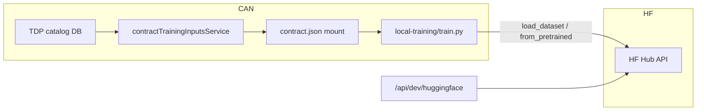

# Hugging Face Hub integration (dev-only)

This document describes how Confidential AI Network (CAN) uses the [Hugging Face Hub](https://huggingface.co) in **local development and test** environments. Production confidential data and trained artifacts remain on CAN-controlled storage (OCI Object Storage, Azure Blob, local `uploads/`) and inside contract-bound execution environments.

## Goals

- Reference public or org-gated **base models** and **benchmark datasets** from the TDP catalog without duplicating Hub metadata in CAN.
- Pass normalized `huggingface` blocks through `contract.json` into the local Docker trainer (`backend/local-training/train.py`).
- Validate Hub repo IDs via a dev-only API when `HUGGINGFACE_INTEGRATION_ENABLED=true`.

## What CAN owns vs what HF provides

| Concern | Owner |
|---------|--------|
| Contracts, Ricardian terms, escrow | CAN |
| TDP confidential uploads | CAN storage + policy |
| Training job provenance | CAN / SCITT |
| Public or gated **catalog references** | HF Hub (dev) |
| Org-private model/dataset repos | HF Enterprise (optional) |
| Actual training in TEE / CCRP | CAN execution path |

## Architecture (dev)



1. **Catalog** — Dataset or AI model rows store `metadata.huggingfaceModel`, `metadata.hfDatasetId`, or a structured `metadata.huggingface` object.
2. **contractTrainingInputsService** — Attaches a normalized `huggingface` block on each dataset/model row in the shaped training bundle.
3. **Trainer** — Reads dataset HF refs from `contract.json`; falls back to `ag_news` when none are set.
4. **Dev API** — Optional Hub metadata fetch and validation (gated; see below).

## Enterprise data and model sovereignty

[Hugging Face Enterprise](https://huggingface.co/enterprise) supports **data and model sovereignty** patterns that align with multi-tenant CAN deployments:

| HF Enterprise capability | CAN alignment |
|--------------------------|---------------|
| Private organization repos | TDP publishes only to org-scoped models/datasets; no public leakage |
| Resource groups & RBAC | Map to TDP teams or DEPA namespaces |
| SSO / SCIM | Same IdP as Keycloak-backed CAN users |
| Gated models & approval workflows | Mirror contract approval before training |
| Org-controlled storage & audit | Complements CAN provenance; not a substitute for TEE |
| Regional / dedicated endpoints (where offered) | Pair with OCI/Azure region pinning in `environmentSpecs` |

**Important:** HF sovereignty controls **who can access Hub repos and where Hub stores artifacts**. CAN still enforces **contract-bound access** to confidential TDP uploads and CCRP execution. For confidential training, keep raw data in CAN/OCI/Azure confidential paths; use HF for base weights and non-sensitive or org-approved reference datasets.

Recommended sovereignty modes:

- `hub-reference` — Public Hub ID in catalog; trainer downloads at run time (dev demos).
- `org-gated` — Private/gated repo; requires `HF_TOKEN` with org read scope.
- `can-staged` — Artifacts copied into `uploads/` under contract policy (future production path).

Set `HUGGINGFACE_SOVEREIGNTY_MODE` and `HUGGINGFACE_ORG_NAMESPACE` in env for documentation and future policy hooks.

## Configuration

See [config/examples/huggingface.env.example](../../config/examples/huggingface.env.example).

```bash
HUGGINGFACE_INTEGRATION_ENABLED=true
HF_TOKEN=hf_...   # optional; required for private/gated repos
HUGGINGFACE_ORG_NAMESPACE=your-org
```

Gating rules (enforced in `huggingfaceIntegrationService.js` and routes):

- `HUGGINGFACE_INTEGRATION_ENABLED=true`
- `NODE_ENV` is `development` or `test`
- Production requires explicit `HUGGINGFACE_ALLOW_IN_PRODUCTION=true` (discouraged)

## Catalog metadata shape

Normalized block attached to training inputs:

```json
{
  "huggingface": {
    "repoType": "dataset",
    "repoId": "ag_news",
    "revision": "main",
    "subset": null,
    "splitTrain": "train",
    "splitTest": "test",
    "gated": false,
    "license": null,
    "sovereignty": "hub-reference"
  }
}
```

Legacy fields still supported on catalog rows:

- Models: `metadata.huggingfaceModel`, or `architecture` containing `org/name`
- Datasets: `metadata.hfDatasetId`, `metadata.huggingfaceDataset`

## Local Docker training

When `TRAINING_EXECUTION_MODE=local-docker`, the backend passes `HF_TOKEN` (from `secrets.env`) into the trainer container for gated Hub models/datasets. `datasets` and `transformers` read this automatically.

```bash
# secrets.env (never commit)
HF_TOKEN=hf_...
```

## Dev API

Base path: `/api/dev/huggingface` (only when integration is enabled)

| Method | Path | Description |
|--------|------|-------------|
| GET | `/status` | Enabled flag, token configured, sovereignty mode |
| GET | `/models/:repoId` | Hub model metadata |
| GET | `/datasets/:repoId` | Hub dataset metadata |
| POST | `/validate` | Body: `{ "repoType": "model\|dataset", "repoId": "org/name" }` |

Example:

```bash
curl -s http://localhost:5001/api/dev/huggingface/status | jq
curl -s http://localhost:5001/api/dev/huggingface/datasets/ag_news | jq
```

## Local demo catalog

`backend/scripts/dev/seed-demo-catalog.js` seeds:

- Dataset `demo-ag-news` with `metadata.hfDatasetId: ag_news`
- Model `demo-model-text-tiny-distilbert` with `metadata.huggingfaceModel: sshleifer/tiny-distilbert-base-cased`

Run text training via TDC local Docker path; trainer loads dataset from contract metadata instead of a hardcoded Hub ID.

## Testing

### Unit tests (`backend`)

| File | What it covers |
|------|----------------|
| `tests/unit/huggingface-integration.test.js` | Service: `validateRepoId`, `normalizeHfBlock`, `extractFromCatalogRow`, `isEnabled` |
| `tests/unit/huggingface-routes.test.js` | Route gating (403 when disabled) |
| `tests/unit/local-docker-training-runner.test.js` | `HF_TOKEN` / `HF_ENDPOINT` passed to Docker args |
| `tests/unit/contract-training-inputs.service.test.js` | `huggingface` blocks on shaped training inputs |

```bash
cd backend
npm run test:unit -- --testPathPattern="huggingface|local-docker|contract-training"
```

### Integration tests (`backend`)

`tests/integration/huggingface.integration.test.js` — status, validate, `/api/debug/env` HF block, disabled gating (uses `test-server`).

```bash
cd backend
npm run test:integration -- --testPathPattern=huggingface
```

`backend/config.test.env` sets `HUGGINGFACE_INTEGRATION_ENABLED=true` for integration runs.

### E2E API smoke (`frontend`)

`frontend/tests/e2e/huggingface-api.spec.js` — no browser UI; hits backend only (paired with `can-jcs-api.spec.js` and opt-in `nlp-dp-training-api.spec.js`).

```bash
cd frontend
npm run test:e2e:api
# NLP + Opacus DP-SGD (local-docker only, opt-in):
E2E_WAIT_FOR_LOCAL_TRAINING=true npm run test:e2e:nlp-dp
```

When integration is disabled on the running backend, gating tests still pass; validate tests skip unless `HUGGINGFACE_INTEGRATION_ENABLED=true`. The NLP DP suite additionally requires `TRAINING_EXECUTION_MODE=local-docker`, `TRAINING_SIMULATION_MODE=false`, and a rebuilt `contractmanagement/local-trainer:latest` image.

## Security notes

- Never commit `HF_TOKEN` or store it in catalog metadata.
- Dev API performs outbound HTTPS to `huggingface.co` only when enabled.
- Confidential TDP uploads must not be pushed to public Hub repos without explicit policy.
- Wire `HUGGINGFACE_VAULT_SECRET_PATH` for hosted dev/staging when moving beyond local `.env`.

## Related docs

- [LOCAL_DEMO_RUNBOOK.md](../training/LOCAL_DEMO_RUNBOOK.md)
- [TDC_TRAINING_RUNTIME.md](../training/TDC_TRAINING_RUNTIME.md)
- [SIEM_INTEGRATION_FRAMEWORK.md](../production/SIEM_INTEGRATION_FRAMEWORK.md)
