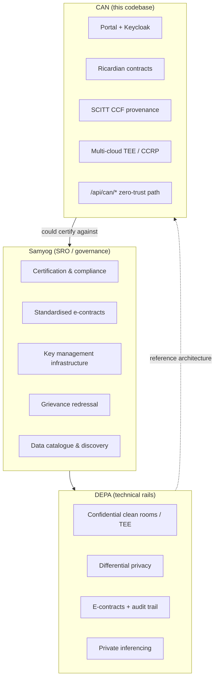

# CAN vs Samyog — comparison

**Samyog** ([samyog.world](https://samyog.world)) is India’s **governance SRO** for DEPA-based AI data collaboration. **CAN (Confidential AI Network)** in this repository is a **deployable software platform** that implements a similar multi-party model (TDP / TDC / CCRP) with contracts, confidential compute, and provenance.

Last updated: 2026-06-17

---

## Stack positioning

---

## At a glance

| Dimension | **Samyog** | **CAN** (this project) |
|-----------|------------|-------------------------|
| **What it is** | Self-regulatory organisation (SRO) + ecosystem orchestrator | Open-source **platform** (portal, APIs, deploy scripts) |
| **Primary job** | Trust, certification, standards adoption, dispute resolution | Run contracts, training jobs, CCR/TEE workflows end-to-end |
| **Anchoring framework** | **DEPA** (India’s data empowerment architecture) | DEPA-**aligned** roles/IDs; also Ricardian contracts, SCITT, global cloud |
| **Who runs it** | Stakeholder-led SRO (iSPIRT ecosystem) | You / your org (OCI, Azure, local Docker) |
| **Parties** | TDP, TDC, **TSP** (tech service provider), data principals | TDP, TDC, **CCRP**, AppAdmin + CAN machine principals |
| **Geographic focus** | India — DPDP, India AI guidelines, sector collaboratives | Multi-cloud, global deploy (OCI/Azure docs); DPDP hooks in code |
| **Maturity** | Early ecosystem: fellowship, gov recognition, open DEPA stack | Working local demo; CAN MVP simulates attestation; prod TEE path partial |

---

## Shared problem

Both target: **high-value institutional data is siloed**, and AI needs training/inference **without raw data leaving boundaries** or trust breaking down.

Shared principles:

- Models come to data, not data to models (clean room / TEE)
- Purpose-bound, consent-aware access
- Cryptographic guarantees + immutable audit trails
- Standardised multi-party agreements
- Differential privacy as a PET, not just anonymisation

---

## Key differences

### Governance vs implementation

| **Samyog** | **CAN** |
|------------|---------|
| Certifies participants | Assumes parties are onboarded via Keycloak/portal |
| Publishes playbooks, grievance process | No built-in SRO or dispute board |
| Curates **Data Collaboratives** by sector | Generic marketplace/catalog; sector packs are optional |
| “DEPA provides the rails; Samyog governs” | **Is** the rails + app layer you deploy |

**Analogy:** Samyog ≈ **Sahamati for DEPA-AI**; CAN ≈ a **deployable platform** you could seek Samyog certification for.

### Product surface

**Samyog delivers (services):**

- Common onboarding & KMI
- Standardised smart contracts (legal + machine-executable)
- Data catalogue & discovery
- Training & ecosystem enablement
- **DEPA Private Inferencing** as a distinct framework

**CAN delivers (software):**

- React portal + role dashboards (TDP/TDC/CCRP)
- Contract lifecycle + Ricardian signing
- Dataset/model catalog, local training runner, TDC training APIs
- SCITT CCF provenance ledger integration
- Parallel CAN path (`/api/can/*`): JCS, escrow gating, simulated attestation (target: principal-owned keys, attested TLS)
- Terraform for OCI/Azure, SIEM framework, Hugging Face dev catalog refs

### Trust model

**Samyog / DEPA (intent):** institution-bound sovereignty, certified TSP CCR/TEE, ledger-backed e-contracts, consent principals in architecture.

**CAN (built vs designed):**

| Layer | Status |
|-------|--------|
| Portal path (Keycloak + platform encryption) | Works for demos; platform may hold keys — not CAN v1 trust model |
| CAN path (`CAN_GAP_DECISION_MEMO`) | Target: platform never sees principal DEK/MEK; keys only inside CCR via attested TLS |
| Today | CAN MVP: simulated attestation, `X-CAN-Principal-Id` header — not production zero-trust |

### Training vs inference

| | **Samyog** | **CAN** |
|---|------------|---------|
| **Training** | DEPA Training (flagship) | Core focus: contract-bound training jobs |
| **Inference** | DEPA Private Inferencing | Not a first-class framework yet |
| **Federated learning** | Not emphasised on homepage | Not core; clean-room-centric |

---

## Role mapping

| DEPA / Samyog | CAN |
|---------------|-----|
| Training Data Provider (TDP) | TDP |
| Training Data Consumer (TDC) | TDC |
| Tech Service Provider (TSP) — CCR/compute | CCRP |
| Data principal (consent owner) | Partially via DPDP/consent flows |
| Samyog (SRO) | *No equivalent* — external |
| DEPA Foundation (standards) | Informed by design; not formally bound |

---

## Strategic relationship

| Scenario | Reading |
|----------|---------|
| **Complementary** | CAN as TSP/CCRP platform certified under Samyog for India sector collaboratives |
| **Aligned competitor (implementation)** | In-house DEPA builds vs this deployable stack |
| **Different market** | CAN for global multi-cloud; Samyog for India DPI-scale governance |
| **CAN gaps vs Samyog** | SRO services, private inferencing product, data-principal consent UX at Samyog depth |

---

## Capability snapshot (approximate)

| Capability | Samyog (ecosystem) | CAN (this repo) |
|------------|-------------------|-----------------|
| National catalogue | Governance-led, building | Local demo catalog + DB |
| Certified clean rooms | Via certified TSPs | Local Docker / simulated TEE; OCI/Azure TF |
| Real hardware attestation | DEPA stack goal | Simulated in CAN MVP |
| E-contracts on ledger | Core DEPA story | Ricardian + SCITT CCF |
| Private inferencing | Explicit framework | Not yet |
| Production zero-trust keys | DEPA KMI vision | Designed in CAN memo; not fully implemented |

---

## Bottom line

- **Samyog** = **who may collaborate, under what rules, with what recourse** — trust and governance for India’s DEPA AI data economy.
- **CAN** = **how a collaboration runs in software** — contracts, escrow, training, TEE/CCRP, provenance, cloud deploy.

They share vocabulary (TDP/TDC, clean rooms, DP, e-contracts) and philosophy. CAN is closest to a **deployable DEPA Training–style platform**; Samyog is what would **govern and certify** such platforms in India — analogous to Sahamati governing Account Aggregators without being the AA application.

---

## Related docs

- [HUGGINGFACE.md](HUGGINGFACE.md) — dev-only Hub catalog integration
- [../features/can/CAN_GAP_DECISION_MEMO.md](../features/can/CAN_GAP_DECISION_MEMO.md) — CAN trust model requirements
- [../ARCHITECTURE.md](../ARCHITECTURE.md) — system architecture
- [Samyog](https://samyog.world) · [DEPA](https://depa.world)
