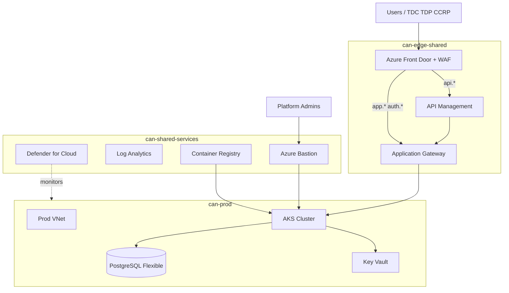

# Azure Security Architecture — Confidential AI Network

This document defines the **recommended Microsoft Azure security architecture** for deploying the Confidential AI Network across **dev, test, staging, and production** environments. It aligns with the [Azure Well-Architected Framework](https://learn.microsoft.com/azure/well-architected/security/) security pillar, Zero Trust principles, and the application stack (React frontend, Node.js API, **Microsoft Entra ID**, PostgreSQL, Redis, optional SCITT CCF, CAN/training workloads on AKS).

**Identity split (important):**

| Environment | Identity provider | Notes |
|-------------|-------------------|-------|
| **Azure** (dev / test / staging / prod) | **Microsoft Entra ID** | SSO, Conditional Access, app roles / groups for TDC·TDP·CCRP·AppAdmin; APIM validates Entra JWTs |
| **Local laptop / docker-compose** | **Keycloak** | Realm `contract-management` for E2E and demos only — **do not deploy Keycloak on Azure** |

### Document set

| Document | Role |
|----------|------|
| **This doc** | **Step-by-step setup runbook**, architecture rationale, topology, environment profiles, governance, **E2E crypto & key flows on Azure** |
| [Azure Features & Configuration](../deployment/AZURE_FEATURES_AND_CONFIGURATION.md) | **Feature catalog** — Entra, KV, signing, DEK/MEK, train, Blob, SCITT + **env vars / profiles** |
| [Azure IAM & Edge Config](../deployment/AZURE_IAM_AND_EDGE_CONFIG.md) | **Implementation reference** — Entra ID groups, RBAC, Front Door, APIM, WAF, **key APIs & Key Vault key types** |
| [Azure Terraform](../../deployment/azure/terraform/README.md) | Baseline IaC (VNet, AKS, PostgreSQL, App Gateway, ACR, K8s manifests) |
| [Azure Readiness](../deployment/AZURE_READINESS.md) | Gap analysis and rollout phases |
| [config.azure.env.example](../../config/examples/config.azure.env.example) | Target Azure environment template |

**Related docs**

- [Participant onboarding & E2E lifecycle](../guides/PARTICIPANT_ONBOARDING_AND_E2E_LIFECYCLE.md) — canonical DEK/MEK / signing / CAN escrow model
- [Production Security Guide](SECURITY_GUIDE.md) — application-layer controls
- [Production Architecture](PRODUCTION_ARCHITECTURE.md) — service topology
- [CCRP Azure integration](../../backend/AZURE_INTEGRATION_GUIDE.md) — per-contract training workloads (separate from platform deploy)
- [Contract signing technical reference](../features/contract-signing/CONTRACT_SIGNING_TECHNICAL_REFERENCE.md) — signing key APIs

---

## Step-by-step: Azure infrastructure setup (new environment)

Use this runbook when onboarding a **new Azure subscription** or standing up a **new environment** (`dev` first, then test → staging → prod).

**Estimated effort:** dev pilot ~1–2 weeks; full four-env stack with edge hardening ~4–8 weeks.

### Phase 0 — Prerequisites

| Item | Action |
|------|--------|
| Azure subscription | Dedicated subscription or management group per customer; billing enabled |
| Region | Choose home region (e.g. `eastus`); plan paired region for prod DR |
| Quota | Request increases for AKS nodes, PostgreSQL, public IPs if needed |
| Tools | Terraform ≥ 1.0, Azure CLI (`az`), `kubectl`, Docker |
| DNS | Control of `example.com` for `app`, `auth`, `api`, `ops` subdomains |
| Corporate IdP | Microsoft Entra ID tenant (or federated Okta / SAML IdP) |

```bash
az login
az account set --subscription "<subscription-id>"
az account show
```

Collect: **subscription ID**, **tenant ID**, bootstrap **service principal** or user with `Owner` on dev resource groups (temporary).

---

### Phase 1 — Management groups, subscriptions & RBAC

**Goal:** Least-privilege structure before any workloads.

1. **Create management group tree** per §3 (`can-platform`, `can-dev`, `can-test`, `can-staging`, `can-prod`).
2. **Create resource group pattern** per environment — [Azure IAM & Edge Config §2](../deployment/AZURE_IAM_AND_EDGE_CONFIG.md).
3. **Create Entra ID security groups** — platform-dev, platform-ops, env users (TDC/TDP/CCRP/AppAdmin) per §1.
4. **Assign RBAC** at resource-group scope — [§3–§7](../deployment/AZURE_IAM_AND_EDGE_CONFIG.md).
5. **Enable Microsoft Defender for Cloud** on subscription; configure regulatory compliance dashboard.
6. **Tagging** — enforce `can-project`, `can-environment`, `can-data-classification` via Azure Policy.

**Exit criteria:** Platform-dev can manage `can-dev-*` resource groups only; cannot modify prod groups.

---

### Phase 2 — Shared services

**Goal:** Registry, secrets, logging, Terraform state — shared across envs.

1. **ACR** — create `cancontractmgmt` in `can-shared-services-rg`; enable geo-replication for prod.
2. **Key Vault** — create vault in `can-dev-data-rg`; enable purge protection in staging/prod.
3. **Key Vault secrets** (dev placeholders):
   - `can-dev-db-password`
   - `can-dev-entra-api-client-secret` (if confidential client used)
   - `can-dev-db-admin-password`
   - TLS cert refs / ACME as needed
4. **Storage accounts** — Terraform state (`canterraformstate`), datasets, training artifacts per env.
5. **Log Analytics** — workspace `can-dev-logs`; diagnostic settings on all edge resources.
6. **Configure Terraform remote state** → Azure Storage backend.

```bash
cd deployment/azure/terraform
cp terraform.tfvars.example terraform.tfvars
# Set subscription_id, tenant_id, location, resource_group_name
```

---

### Phase 3 — Network (per environment)

**Goal:** Isolated VNet, private AKS nodes, controlled egress.

1. **Choose CIDRs** per §5.1 (dev: `10.10.0.0/16`; no overlap across envs).
2. **Run Terraform networking module**:

```bash
cd deployment/azure/terraform
terraform init
terraform plan -var-file=terraform.tfvars
terraform apply -var-file=terraform.tfvars
```

Creates: VNet, public + private subnets, NAT Gateway, NSGs, private DNS zones.

3. **Apply NSG default-deny model** — §5.4 (`nsg-appgw-ingress`, `nsg-aks-nodes`, `nsg-postgres`).
4. **Private DNS** — `backend.can-dev.internal`, `frontend.can-dev.internal` (no Keycloak internal name).
5. **Azure Bastion** — in `can-dev-network-rg`; no SSH from `0.0.0.0/0`.

**Exit criteria:** Private subnet routes `0.0.0.0/0` → NAT; AKS nodes have no public IPs.

---

### Phase 4 — Data layer

**Goal:** PostgreSQL Flexible Server and blob storage with private access only.

1. **PostgreSQL Flexible Server** — Terraform `database` module; **public access disabled**; delegated subnet + private DNS.
2. **Store connection string** in Key Vault `can-dev-db-connection`.
3. **Run DB migrations** from Bastion jump or CI job with `can-dev-db-admin` RBAC only.
4. **Blob Storage** — private endpoints; customer-managed keys from Key Vault in staging/prod.
5. **Defender for SQL** — enable on staging/prod databases.

**Exit criteria:** App subnet reaches PostgreSQL on `5432` via private endpoint only.

---

### Phase 5 — Compute (AKS)

**Goal:** Hardened Kubernetes cluster for app workloads.

1. **AKS cluster** — private cluster API; Azure CNI + Calico network policy; workload identity enabled.
2. **Node pool** — private subnet only; `Standard_D4s_v5`; no spot nodes in prod.
3. **Configure kubectl**:

```bash
az aks get-credentials --resource-group can-dev-compute-rg --name can-dev-aks
kubectl get nodes
```

4. **Namespaces** — `can-ingress`, `can-app`, `can-iam`, `can-data`, `can-training`, `can-ops`.
5. **Workload Identity** — bind AKS SA to Key Vault and Storage RBAC per env.
6. **Install ingress-nginx** (or AGIC) in `can-ingress`.
7. **Install External Secrets Operator** → sync Key Vault secrets into K8s.

**Exit criteria:** `kubectl get pods -A` healthy; nodes have no public IPs.

---

### Phase 6 — Application Gateway & in-cluster apps

1. **Application Gateway WAF v2** — listeners for frontend and API paths (login is Entra-hosted).
2. **Build & push images to ACR**:

```bash
az acr login --name cancontractmgmt
docker build -t cancontractmgmt.azurecr.io/backend:latest backend/
docker build -t cancontractmgmt.azurecr.io/frontend:latest frontend/
docker push cancontractmgmt.azurecr.io/backend:latest
docker push cancontractmgmt.azurecr.io/frontend:latest
```

3. **Deploy K8s manifests** — Terraform `kubernetes_resources` module or `kubectl apply`.
4. **Health checks** — `GET /api/health` on backend; frontend `/`.

**Exit criteria:** `curl -k https://<appgw-fqdn>/api/health` returns 200 from VPN or Bastion port-forward.

---

### Phase 7 — Edge security (Front Door, APIM, WAF)

**Order:** TLS certs → App Gateway listeners → Front Door origin → APIM routes.

1. **TLS certificates** — Key Vault or Azure-managed; hostnames: `app.dev`, `login.dev` (Entra redirect), `api.dev`, `ops.dev`.
2. **Azure Front Door WAF** `can-waf-dev` — OWASP 3.2; **Detection** mode in dev.
3. **API Management** `can-apim-dev`:
   - Hostname `api.dev.example.com`
   - JWT validation → **Microsoft Entra ID** OpenID metadata / JWKS
   - Routes: `/api/health`, `/api/auth/*`, `/api/contracts/*`
4. **Entra ID app registrations** — SPA (public PKCE), API (expose scopes + app roles), backend confidential client as needed.
5. **Custom WAF rules** — login rate limit; block `/api/debug` in prod.

---

### Phase 8 — Identity (Microsoft Entra ID only on Azure)

1. **Entra ID security groups** per env — TDC, TDP, CCRP/TSP, AppAdmin; map to **app roles** on the API registration.
2. **Conditional Access** — MFA for staging/prod; device compliance as required.
3. **APIM JWT** issuer → `https://login.microsoftonline.com/{tenant}/v2.0` (or CIAM tenant if used).
4. **Backend** — validate Entra access tokens; map `roles` / group claims → party types (`TDC`, `TDP`, `TSP`/`CCRP`, `AppAdmin`).
5. **Seed / test users** — Entra guest or cloud-only users in `can-{env}-*-users` groups (no Keycloak sync on Azure).

**Exit criteria:** User signs in with Entra ID → SPA gets Entra token → APIM + API accept token → role-gated call succeeds.

**Out of scope for Azure:** deploying or syncing **Keycloak**. Use Keycloak only for local docker-compose (`./start-system.sh`, Playwright).

---

### Phase 9 — DNS & go-live validation

| Host | Target |
|------|--------|
| `app.dev.example.com` | Front Door / App Gateway public IP |
| `api.dev.example.com` | Front Door → APIM |
| `ops.dev.example.com` | Front Door (Grafana if deployed) |
| Entra redirect URIs | `https://app.dev.example.com/*` (SPA); no separate Keycloak hostname |

Smoke tests: login as TDC/TDP/CCRP via **Entra**; create → sign → training path; rate limits; 401 on unsigned API calls.

---

### Phase 10 — Promote to test / staging / prod

| Env | Azure Policy | WAF mode | MFA |
|-----|--------------|----------|-----|
| dev | Audit | Detection | Off |
| test | Audit | Prevention | Optional |
| staging | Enforce on data RG | Prevention | Admins |
| prod | Enforce + deny assignments | Prevention + bot protection | All users |

- **New resource group subtree** per env; **never** reuse VNet CIDRs.
- **Separate Entra ID app registrations** or distinct redirect URIs per env.
- **Separate Key Vault keys** and ACR image tags (`:staging`, `:prod`).

---

## 1. Design goals

| Goal | Implementation on Azure |
|------|------------------------|
| **Strong environment isolation** | Management groups, separate subscriptions (prod), resource groups, VNets, Key Vaults per env |
| **Least privilege** | Entra ID groups, RBAC, workload identity, deny assignments in prod |
| **Defense in depth** | Front Door WAF → APIM → App Gateway → AKS ingress → network policies |
| **Observable & auditable** | Log Analytics, Microsoft Sentinel, Defender for Cloud, diagnostic settings |
| **Data protection** | Key Vault, PostgreSQL TDE, Blob encryption, private endpoints |
| **Operational safety** | Azure Bastion, PIM for break-glass, change control per env |

---

## 2. High-level reference architecture



**Traffic path (production)**

1. **DNS** — `app.{env}`, `auth.{env}`, `api.{env}`, `ops.{env}`.
2. **Front Door WAF** — TLS termination, OWASP, bot management, geo filtering.
3. **APIM** (`api.{env}`) — JWT validation (**Entra ID** JWKS), rate limits, CORS → App Gateway → backend `:5001`.
4. **App Gateway** — path-based routing to AKS ingress for frontend `:3000` (no Keycloak pool on Azure).
5. **AKS** — private nodes; egress via NAT; PostgreSQL via **private endpoint** only.

---

## 3. Management group & resource group hierarchy

```
Tenant Root Group
├── can-platform                    # Policy definitions, shared monitoring
├── can-shared-services             # ACR, Terraform state, CI/CD agents
├── can-dev
│   ├── can-dev-network-rg
│   ├── can-dev-compute-rg          # AKS, Bastion
│   ├── can-dev-data-rg             # PostgreSQL, Storage, Key Vault
│   └── can-dev-ops-rg              # Alerts, Action Groups
├── can-test  (+ network, compute, data, ops RGs)
├── can-staging
└── can-prod
```

| Resource group | Resources |
|----------------|-----------|
| `can-{env}-network-rg` | VNet, subnets, NSGs, NAT, App Gateway, private DNS |
| `can-{env}-compute-rg` | AKS, node pools, Bastion |
| `can-{env}-data-rg` | PostgreSQL Flexible Server, Blob Storage, Key Vault |
| `can-{env}-ops-rg` | Monitor alerts, Log Analytics diagnostics, on-call Action Groups |

---

## 4. Identity (Microsoft Entra ID on Azure; Keycloak local-only)

| Environment | Entra app / group prefix | Purpose |
|-------------|--------------------------|---------|
| dev | `can-dev-*` | Developer SSO, Entra app-role testing |
| test | `can-test-*` | QA automation, Playwright service principals |
| staging | `can-staging-*` | Pre-prod UAT, partner demos |
| prod | `can-prod-*` | Production TDC / TDP / CCRP / AppAdmin |

**Azure rule:** **Microsoft Entra ID is the sole identity provider** for browser and API auth. App roles / security groups carry party type (`TDC`, `TDP`, `CCRP`/`TSP`, `AppAdmin`). Backend and APIM validate **Entra** JWTs.

**Local rule:** **Keycloak** (`contract-management` realm) remains the IdP for docker-compose / laptop demos and Playwright. Do **not** run Keycloak in Azure resource groups.

| Layer | Component | Responsibility |
|-------|-----------|----------------|
| Corporate IdP | **Entra ID** (or federated SAML into Entra) | Workforce & partner federation, MFA |
| Entra ID | Groups + app roles + Conditional Access | Party-type authorization claims |
| App Gateway / Front Door | TLS + routing | Public ingress to AKS |
| Backend API | JWT validation (Entra issuer) | `authenticateToken` adapted for Entra |
| Local only | Keycloak | Docker Compose E2E — never Azure |

---

## 5. Network segmentation

### 5.1 One VNet per environment

| Environment | VNet CIDR | AKS service CIDR | Pod CIDR (overlay) |
|-------------|-----------|------------------|---------------------|
| dev | `10.10.0.0/16` | `10.96.0.0/16` | `10.244.0.0/16` |
| test | `10.20.0.0/16` | `10.97.0.0/16` | `10.245.0.0/16` |
| staging | `10.30.0.0/16` | `10.98.0.0/16` | `10.246.0.0/16` |
| prod | `10.40.0.0/16` | `10.99.0.0/16` | `10.247.0.0/16` |

### 5.2 Subnet tiers

| Tier | Purpose | Route |
|------|---------|-------|
| Public | App Gateway frontend only | Internet via IGW |
| Private app | AKS nodes | Egress `0.0.0.0/0` → NAT Gateway |
| Private data | PostgreSQL delegated subnet | No internet route |

### 5.3 NSGs — default deny

| NSG | Ingress | Egress |
|-----|---------|--------|
| `nsg-appgw-ingress` | 443 from Front Door / Internet | To AKS ingress |
| `nsg-aks-nodes` | From App Gateway only | NAT + Azure services |
| `nsg-postgres` | 5432 from AKS subnet only | Deny all |

---

## 6. Edge security

| Service | Hostname | Role |
|---------|----------|------|
| Front Door + WAF | All public hostnames | TLS, OWASP, bot management, DDoS |
| API Management | `api.{env}` | JWT validation, rate limits, API versioning |
| Application Gateway | Internal routing | Path-based backend pools to AKS ingress |

Full route tables and JWT policies: [Azure IAM & Edge Config §9–§11](../deployment/AZURE_IAM_AND_EDGE_CONFIG.md).

---

## 7. Compute & container security (AKS)

| Control | Setting |
|---------|---------|
| API server | Private endpoint (prod); authorized IP ranges (dev) |
| Nodes | Private subnet only; no public IPs |
| Identity | Workload Identity + managed identity for ACR pull |
| Network policy | Calico enabled |
| Pod security | Restricted baseline; non-root containers |
| Secrets | External Secrets Operator → Key Vault |

---

## 8. Data security

| Resource | Control |
|----------|---------|
| PostgreSQL Flexible Server | Private endpoint; TDE; automated backups; geo-redundant in prod |
| Blob Storage | Private endpoint; SSE with Key Vault CMK in staging/prod |
| Key Vault | Purge protection (prod); HSM pool for prod keys |
| Redis (if on AKS) | Password in Key Vault; ClusterIP service only |

---

## 9. Security operations

| Service | Scope |
|---------|-------|
| **Microsoft Defender for Cloud** | Subscription-wide; alerts on public exposure, weak TLS, crypto mining |
| **Azure Policy** | Deny public blob access, require HTTPS, enforce tags on `can-{env}-data-rg` |
| **Log Analytics / Sentinel** | Central audit; WAF, APIM, AKS, Entra sign-in logs. App audit: [SIEM Integration Framework](SIEM_INTEGRATION_FRAMEWORK.md). |
| **Azure Bastion** | Admin kubectl/SSH; session logging; no open port 22 |

---

## 10. Environment profiles

Same posture progression as OCI: dev (permissive) → test → staging (prod-like) → prod (enforce all policies, MFA, geo-redundant DB).

---

## 11. Multi-region & disaster recovery (prod)

| Component | Primary | DR region |
|-----------|---------|-----------|
| AKS | Active | Standby cluster (scaled down) |
| PostgreSQL | Active | Geo-redundant backup / read replica |
| Blob Storage | Active | GRS or RA-GRS |
| ACR | Primary region | Geo-replication enabled |
| Front Door | Active-active | Built-in global anycast |

RTO target: **4 h** | RPO target: **15 min** (adjust per SLA).

---

## 12. Application mapping

| Component | Azure service | Security notes |
|-----------|---------------|----------------|
| React frontend | AKS + Front Door | CSP at ingress; MSAL / Entra SPA login |
| Backend API | AKS + APIM | **Entra JWT**; signing gate for TDP/CCRP |
| Identity | **Microsoft Entra ID** | App roles / groups; no Keycloak on Azure |
| PostgreSQL | Flexible Server | Private endpoint; Defender for SQL |
| Redis | AKS or Azure Cache | Key Vault password; private access |
| SCITT CCF | AKS or dedicated VM | Isolated namespace; mTLS to backend |
| CAN / training | AKS `can-training` or DCsv3 | See §16 key release into TEE |
| Playwright E2E | Local or test CI | **Local:** Keycloak. **Azure staging:** Entra test users only |

---

## 16. End-to-end security flows (identity, signing, encryption, CCRP)

This section maps the **full multi-party happy path** onto Azure controls. Canonical application crypto rules live in [PARTICIPANT_ONBOARDING_AND_E2E_LIFECYCLE.md](../guides/PARTICIPANT_ONBOARDING_AND_E2E_LIFECYCLE.md). Below: how those flows should land on Azure, and what is **implemented today** vs **target**.

### 16.1 Identity layers (do not conflate)

| Layer | Who / what | Azure / platform home | Purpose |
|-------|------------|----------------------|---------|
| Human SSO | Entra ID user | Entra + Conditional Access | Enterprise login, MFA |
| App role | Entra app role / group `TDC` · `TDP` · `TSP`/`CCRP` · `AppAdmin` | Entra app registration | Portal RBAC on Azure |
| Local IdP (non-Azure) | Keycloak realm roles | docker-compose only | Laptop / Playwright |
| Party ID | DEPA ID (`US-EAST-TDC-…`) | App DB | Jurisdiction-scoped entity ID |
| Optional DID | `did:web` / `did:ethr` / system DID | App + DID service | Portable identity label |
| Contract signing key | ECDSA-P256 / RSA `UserKey` | App DB today → **Key Vault / MHSM target** | Ricardian signatures |
| Data encryption key (**DEK**) | AES-256-GCM | **TDP / data principal** (target: never platform plaintext) | Dataset ciphertext |
| Model encryption key (**MEK**) | AES-256-GCM | **TDC / model owner** (target: never platform plaintext) | Base-model ciphertext |
| CCR session key | Ephemeral TLS in TEE | Confidential VM / ACI / AKS confidential | Attested key delivery window |
| Infra secrets | DB, Entra client secrets, TLS | **Azure Key Vault** (platform) | Ops secrets — not DEK/MEK |

### 16.2 E2E flow A — Onboard → sign → portal train (Azure Phase 1)

```
Entra SSO (MSAL) → Entra access token → Portal + APIM
  → TDP publishes dataset (ciphertext or demo clear for local)
  → TDC creates Ricardian contract (env + KMS placeholders)
  → TDP then TSP/CCRP sign (authenticated approval; DID recorded as metadata)
  → Optional SCITT claim/receipt
  → TDC starts training (Azure ACI/AKS Job target; local-docker for laptop demos)
  → Register / deploy / infer (demo path)
```

| Step | Azure control | Maturity |
|------|---------------|----------|
| Login | **Entra ID** + APIM JWT | Design; app still Keycloak-centric in code today |
| Role gates | Entra app roles / groups in token | Design — map claims in backend |
| Contract sign API | `POST /api/contracts/:id/sign` + Entra JWT | Authz exists; **DID crypto verify not enforced** |
| Signing private keys | Should be Key Vault–backed HSM keys | **Gap** — portal stores `UserKey` in DB today |
| Training compute | AKS Job / ACI / DCsv3 | Partial (`azureProvider.js`); local-docker is proven demo |
| Artifacts | Blob `can-{env}-training-outputs` + CMK | Design |

### 16.3 E2E flow B — CAN dual-key escrow → CCRP clean room (production target)

```
CCRP provisions TEE (Azure confidential VM / confidential container)
  → TEE generates ephemeral keypair + attestation evidence
  → JCS escrow OPEN (deadline ~10m)
  → TDP encrypts dataset with DEK; stages ciphertext in Blob (tee_only)
  → TDC encrypts base model with MEK; stages ciphertext in Blob
  → Principals verify attestation independently
  → TDP releases DEK → TEE over attested channel (not via Node plaintext)
  → TDC releases MEK → TEE over attested channel
  → Escrow BOTH_READY → RELEASED → train in memory
  → Re-encrypt outputs; zeroize DEK/MEK; destroy CCR
  → Provenance / SCITT events
```

| Rule | Azure implication |
|------|-------------------|
| Platform must **not** hold DEK/MEK plaintext | Backend only sees release **signals** / wrapped keys; Key Vault HSM for wrap keys if used |
| Decrypt only in TEE | Confidential computing SKU (DCsv3 / confidential containers); no disk spill |
| Dual-key gate | Both DEK and MEK released before start; sweeper → EXPIRED/DESTROYED |
| CCRP credentials | Per-TSP Azure SP in Key Vault; workload identity for provisioner |

**Maturity today:** JCS MVP accepts **key-release signals** (rejects raw key bytes to Node). Attestation is **simulated**. Local Docker training is **not** a hardware TEE. Treat clean-room decrypt-and-train as **target** until attestation + attested TLS delivery ship.

### 16.4 Signing key management (contract signatures)

| Concern | Portal today | Azure production target |
|---------|--------------|-------------------------|
| Generate | `/api/signing/keys/generate` (ECDSA-P256 / RSA) | Generate in **Key Vault** (or MHSM); store only key id + public material in app DB |
| Custody | `UserKey.privateKey` on DB row | Private key **never** leaves HSM; sign via Key Vault crypto ops or confidential sidecar |
| Use at sign | UI sends hash/placeholder; backend records signature + optional `did` | Client or backend calls Key Vault **sign**; verify with public key / DID document |
| DID verify | `verifyDIDSignature` helper exists; **not wired** into sign route | Enforce verify when `did` present; fail closed in prod |
| Audit | SCITT claim best-effort | Required SCITT receipt + Sentinel alert on verify failure |

**Azure Key Vault layout (target):**

| Secret / key name pattern | Content | Who can use |
|---------------------------|---------|-------------|
| `can-{env}-user-sign-{depaId}` | RSA/EC signing key | Backend MSI + user-scoped grant via app policy |
| `can-{env}-entra-api-client` | Entra confidential client secret (if used) | Backend MSI / External Secrets |
| `can-{env}-scitt-*` | SCITT CCF client material | SCITT workload identity |

### 16.5 TDP DEK and TDC MEK (data / model encryption)

| Key | Owner | Encrypts | Staging (Azure) | Release |
|-----|-------|----------|-----------------|---------|
| **DEK** | TDP / data principal | Dataset | Blob `can-{env}-datasets` (ciphertext only) | To CCR TEE after attestation + escrow |
| **MEK** | TDC / model owner | Base model | Blob `can-{env}-artifacts` (ciphertext only) | Same |

**Platform encryption service** (portal uploads) may still generate/hold keys for demos — **do not treat as CAN-compliant**. Production CAN requires principal-owned DEK/MEK.

**Optional Azure pattern for wrap keys (not DEK/MEK themselves):**

- TDP/TDC hold DEK/MEK in client HSM or Key Vault **customer** vault.
- Platform Key Vault holds only **KEK** used to wrap session material if a wrap step is required.
- CCRP MSI can unwrap **only** inside confidential compute with attestation policy (Azure Attestation + SKR where applicable).

### 16.6 Secure key release to CCRP (target sequence)

1. **Provision** — CCRP Azure SP creates confidential environment (see [AZURE_INTEGRATION_GUIDE.md](../../backend/AZURE_INTEGRATION_GUIDE.md)).
2. **Attest** — TEE produces evidence; Azure Attestation (or vendor) validates measurement.
3. **Authorize** — Contract `SIGNED`; principals match DEPA IDs; escrow not expired.
4. **Release** — Principals push DEK/MEK over **attested TLS** into TEE (or Azure Secure Key Release from MHSM when SKR is used).
5. **Train** — Decrypt in memory only; no Blob of plaintext keys.
6. **Destroy** — Zeroize; revoke temporary Blob SAS; Key Vault key versions rotated if used; provenance `DESTROYED`.

**Never:** send DEK/MEK plaintext through the Node API, Redis, or application logs.

### 16.7 APIM / RBAC surface for crypto APIs

See [Azure IAM & Edge Config §10](../deployment/AZURE_IAM_AND_EDGE_CONFIG.md) for route table. Minimum role gates:

| API family | Role | Notes |
|------------|------|-------|
| `/api/signing/*` | Authenticated party | Own keys only |
| `/api/contracts/*/sign` | TDP / TSP / TDC per gate | Linked party checks |
| `/api/can/jcs/*` | CAN principal + JWT | Escrow + key-released |
| `/api/ccrp/*` / TSP Azure credentials | TSP/CCRP | Subscription credentials in Key Vault |
| `/api/tdc/training/*` | TDC | Portal train path |
| `/api/tdc/inference/*` | TDC | Deployed artifacts only |

### 16.8 Maturity matrix (honest)

| Capability | Local demo (Keycloak) | Azure pilot (Phase 1) | Azure CAN prod (Phase 3+) |
|------------|----------------------|----------------------|---------------------------|
| Login IdP | Keycloak | **Entra ID** | **Entra ID** |
| Contract sign (authz) | Yes | Yes | Yes + crypto verify |
| Signing keys in HSM | No | Design | Required |
| DID crypto verify on sign | No | Optional | Required if DID claimed |
| DEK/MEK principal custody | Partial | Design | Required |
| Dual-key escrow signals | MVP | Wire to Azure CCR | Required |
| Attested key delivery | Simulated | Design | Required |
| Confidential VM train | No (Docker) | Spike | Required for CAN claims |
| SCITT on Azure | Local compose | Optional | Required for audit |
| Keycloak on Azure | N/A | **Do not deploy** | **Do not deploy** |

### 16.9 Pre-go-live checklist (crypto / CAN)

- [ ] Signing keys migrated off DB plaintext to Key Vault / MHSM
- [ ] Sign path verifies cryptographic signature (and DID when present)
- [ ] Dataset/model Blob containers hold **ciphertext only**; CMK enabled
- [ ] DEK/MEK never logged; Node rejects raw key material on release APIs
- [ ] CCRP path uses confidential SKU + attestation policy
- [ ] Escrow timeout destroys compute; Sentinel alert on EXPIRED with late key attempt
- [ ] Provenance/SCITT events for: signed, attested, key released, started, completed, destroyed
- [ ] Pen test includes key-exfiltration attempts via API and logs

---

## 17. Deployment & IaC alignment

For **per-feature env vars, maturity, and local vs Azure profiles**, see [Azure Features & Configuration](../deployment/AZURE_FEATURES_AND_CONFIGURATION.md).

**Current state:** `deployment/azure/terraform/` provisions VNet, AKS, PostgreSQL, App Gateway public IP, ACR, and baseline K8s workloads. It does **not** yet create management groups, Entra app registrations, Front Door, or APIM.

| Planned module | Purpose |
|----------------|---------|
| `modules/front_door` | Global WAF + routing |
| `modules/apim` | API Management + JWT policies |
| `modules/key_vault` | Per-env secrets, CMK, and **signing / wrap key** policies (§16) |
| `modules/policy` | Azure Policy initiative assignments |
| `modules/confidential_compute` | DCsv3 / confidential container pool for CCRP (Phase 3) |

**Alternative path:** [deploy/azure/deploy-azure.sh](../../deploy/azure/deploy-azure.sh) — single-VM docker-compose deploy via Azure CLI (simpler than AKS).

---

## 18. Pre-go-live checklist (prod)

- [ ] Management group RBAC applied; prod deny assignments active
- [ ] Entra conditional access + MFA for all prod users
- [ ] Front Door WAF in Prevention mode; APIM JWT validation (**Entra**) enabled
- [ ] AKS private cluster; no public node IPs
- [ ] PostgreSQL private endpoint only; backups geo-redundant
- [ ] Key Vault purge protection; no secrets in Terraform state plaintext
- [ ] Blob containers private; Azure Policy enforced on data RG
- [ ] Defender for Cloud alerts routed to on-call
- [ ] **No Keycloak** workloads in Azure RGs; SPA uses MSAL / Entra
- [ ] E2E smoke tests pass against staging (Entra test users) before prod promotion
- [ ] Crypto / CAN checklist in **§16.9** complete for any CAN production claims

---

## 19. Reference URLs

Verified **2026-06-16** (architecture); E2E crypto section added **2026-07-25**.

- [Azure Well-Architected — Security](https://learn.microsoft.com/azure/well-architected/security/)
- [Microsoft Entra ID](https://learn.microsoft.com/entra/identity/)
- [Azure Kubernetes Service](https://learn.microsoft.com/azure/aks/)
- [Azure Application Gateway WAF](https://learn.microsoft.com/azure/web-application-firewall/ag/ag-overview)
- [Azure Front Door](https://learn.microsoft.com/azure/frontdoor/)
- [API Management](https://learn.microsoft.com/azure/api-management/)
- [Azure Key Vault](https://learn.microsoft.com/azure/key-vault/)
- [Azure Attestation](https://learn.microsoft.com/azure/attestation/)
- [Secure Key Release with AKV](https://learn.microsoft.com/azure/key-vault/managed-hsm/secure-key-release-overview)
- [PostgreSQL Flexible Server](https://learn.microsoft.com/azure/postgresql/flexible-server/)
- [Microsoft Defender for Cloud](https://learn.microsoft.com/azure/defender-for-cloud/)
- [Azure Bastion](https://learn.microsoft.com/azure/bastion/bastion-overview)
- [Azure Policy](https://learn.microsoft.com/azure/governance/policy/)
