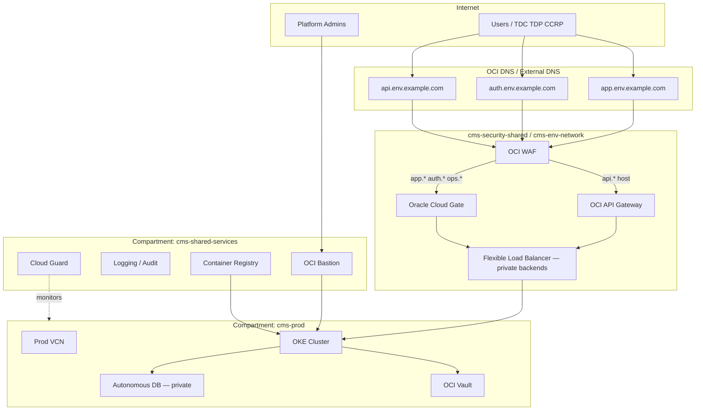

# OCI Security Architecture — Contract Management System

This document defines the **recommended Oracle Cloud Infrastructure (OCI) security architecture** for deploying the Contract Management System across **dev, test, staging, and production** environments. It aligns with OCI Well-Architected Framework security pillars, Zero Trust principles, and the application’s existing stack (React frontend, Node.js API, Keycloak, PostgreSQL/Autonomous Database, Redis, optional SCITT CCF, CAN/training workloads on OKE).

### Document set

| Document | Role |
|----------|------|
| **This doc** | **Step-by-step setup runbook**, architecture rationale, topology, environment profiles, governance |
| [OCI IAM & Edge Config](../deployment/OCI_IAM_AND_EDGE_CONFIG.md) | **Implementation reference** — all IAM groups/policies, Cloud Gate apps, API Gateway routes/JWT, WAF rules |
| [OCI Terraform](../../deployment/oci/terraform/README.md) | Baseline IaC (VCN, OKE, ADB, LB, OCIR, K8s manifests) |
| [OCI Readiness](../deployment/OCI_READINESS.md) | Gap analysis and rollout phases |

Use this document for design reviews and stakeholder alignment. Use **OCI IAM & Edge Config** when writing policies, configuring edge services, or preparing security sign-off.

**Related docs**

- [Production Security Guide](SECURITY_GUIDE.md) — application-layer controls (Keycloak, network policies, secrets)
- [OCI IAM & Edge Config](../deployment/OCI_IAM_AND_EDGE_CONFIG.md) — **full IAM policies, Cloud Gate, API Gateway, WAF** (implementation reference)
- [OCI Terraform deployment](../../deployment/oci/terraform/README.md) — baseline infrastructure modules
- [Production Architecture](PRODUCTION_ARCHITECTURE.md) — service topology

---

## Step-by-step: OCI infrastructure setup (new environment)

Use this runbook when onboarding a **new OCI tenancy** or standing up a **new environment** (`dev` first, then test → staging → prod). Phases are ordered — later steps depend on earlier ones.

**Estimated effort:** dev pilot ~1–2 weeks; full four-env stack with edge hardening ~4–8 weeks.

### Phase 0 — Prerequisites

| Item | Action |
|------|--------|
| OCI tenancy | Dedicated tenancy or top-level `cms` compartment; billing enabled |
| Region | Choose home region (e.g. `us-ashburn-1`); plan DR region for prod |
| Quota | Request increases for OKE nodes, ADB, LB, public IPs if needed |
| Tools | Terraform ≥ 1.0, OCI CLI, `kubectl`, Docker |
| DNS | Control of `example.com` (or customer domain) for `app`, `auth`, `api`, `ops` subdomains |
| Corporate IdP | Okta / Azure AD SAML metadata (staging/prod) |

```bash
# OCI CLI
oci setup config

# API key (if not already created)
openssl genrsa -out ~/.oci/oci_api_key.pem 2048
openssl rsa -pubout -in ~/.oci/oci_api_key.pem -out ~/.oci/oci_api_key_public.pem
# Upload public key in OCI Console → Identity → Users → API Keys
```

Collect OCIDs: **tenancy**, bootstrap **user**, target **compartment** (until compartment tree exists).

---

### Phase 1 — Compartments & IAM foundation

**Goal:** Least-privilege structure before any workloads.

1. **Create compartment tree** per §3 below (`cms-security-shared`, `cms-shared-services`, `cms-dev` + children, etc.). Start with **dev only** if greenfield.
2. **Create IAM groups** — all 12 groups in [OCI IAM & Edge Config §1.1](../deployment/OCI_IAM_AND_EDGE_CONFIG.md).
3. **Assign bootstrap admins** to `cms-tenancy-admins` temporarily; federate other users via corporate IdP.
4. **Create dynamic groups** per env — [§1.2](../deployment/OCI_IAM_AND_EDGE_CONFIG.md).
5. **Apply IAM policies** compartment by compartment — [§3–§7](../deployment/OCI_IAM_AND_EDGE_CONFIG.md). Minimum for first deploy:
   - Tenancy: Cloud Guard, auditors read
   - `cms-shared-services`: CI/CD → OCIR
   - `cms-dev-network`, `cms-dev-compute`, `cms-dev-data`: platform-dev manage
6. **Enable Cloud Guard** at tenancy root; add target on `cms-dev` — §9.1.
7. **Tagging** — enforce `cms-project`, `cms-environment`, `cms-data-classification` on all new resources — §13.

**Exit criteria:** Platform-dev user can manage resources in `cms-dev-*` only; cannot touch prod compartments.

---

### Phase 2 — Shared services

**Goal:** Registry, secrets, logging, Terraform state — shared across envs.

1. **OCIR** — create repo `contract-management` in `cms-shared-services`; note namespace URL.
2. **Vault** — create vault in `cms-dev-data` (dev) and plan prod vault in `cms-prod-data`; enable HSM for prod.
3. **Vault secrets** (dev placeholders):
   - `cms-dev-db-password`
   - `cms-dev-***REMOVED-KEYCLOAK_DB_PASSWORD***-client-secret`
   - `cms-dev-***REMOVED-KEYCLOAK_DB_PASSWORD***-admin-password`
4. **Object Storage** — buckets per [OCI IAM & Edge Config §12](../deployment/OCI_IAM_AND_EDGE_CONFIG.md):
   - `cms-terraform-state` (shared)
   - `cms-dev-datasets-*`, `cms-dev-training-outputs-*`, `cms-dev-artifacts-*`
5. **Logging** — log groups: `cms-dev-audit`, `cms-dev-waf-access`, `cms-dev-api-gw-access`.
6. **Configure Terraform remote state** → `cms-terraform-state` bucket.

```bash
cd deployment/oci/terraform
cp terraform.tfvars.example terraform.tfvars
# Set tenancy_ocid, user_ocid, fingerprint, compartment_id → cms-dev-compute or parent cms-dev
```

---

### Phase 3 — Network (per environment)

**Goal:** Isolated VCN, private workers, controlled egress.

1. **Choose CIDRs** per §5.1 (dev: `10.10.0.0/16`; no overlap with other envs).
2. **Run Terraform networking module** (or full stack):

```bash
cd deployment/oci/terraform
terraform init
terraform plan -var-file=terraform.tfvars
terraform apply -var-file=terraform.tfvars
```

Creates: VCN, public + private subnets, IGW, NAT, Service Gateway, security lists/NSGs.

3. **Apply NSGs** default-deny model — §5.4 (`nsg-lb-ingress`, `nsg-oke-workers`, `nsg-adb`).
4. **Private DNS** — views for `backend.cms-dev.internal`, `***REMOVED-KEYCLOAK_DB_PASSWORD***.cms-dev.internal` — §5.6.
5. **Bastion** — endpoint in `cms-dev-compute`; no SSH from `0.0.0.0/0` — §9.4.

**Exit criteria:** Private subnet routes: `0.0.0.0/0` → NAT; OCI services → Service Gateway; no public IPs on worker subnet.

---

### Phase 4 — Data layer

**Goal:** Autonomous DB and artifact storage with private access only.

1. **Autonomous Database** — Terraform `database` module or Console; OLTP workload; **private endpoint** enabled; public access **disabled**.
2. **Download ADW wallet**; store connection string in Vault `cms-dev-db-connection`.
3. **Run DB migrations** from a Bastion jump or CI job with `AUTONOMOUS_DATABASE_CONNECT` only.
4. **Object Storage** — SSE-KMS with Vault key `cms-dev-artifacts`; Security Zone on `cms-dev-data` (optional for dev, required staging+).
5. **Data Safe** — enable on staging/prod ADB — §8.1.

**Exit criteria:** App subnet can reach ADB on `1522`; ADB has no public endpoint.

---

### Phase 5 — Compute (OKE)

**Goal:** Hardened Kubernetes cluster for app workloads.

1. **OKE cluster** — private API endpoint; Calico network policy; §7.1.
2. **Node pool** — private subnets only; `VM.Standard.E4.Flex`; no preemptible in prod.
3. **Configure kubectl**:

```bash
oci ce cluster create-kubeconfig --cluster-id <cluster-ocid> --file $HOME/.kube/config --region <region> --token-version 2.0.0
kubectl get nodes
```

4. **Namespaces** — §7.2: `cms-ingress`, `cms-app`, `cms-iam`, `cms-data`, `cms-training`, `cms-ops`.
5. **Workload Identity** — bind `cms-dev-oke-workloads` dynamic group to training and External Secrets SAs — [OCI IAM & Edge Config §8](../deployment/OCI_IAM_AND_EDGE_CONFIG.md).
6. **Install ingress-nginx** (or Gateway API) in `cms-ingress`.
7. **Install External Secrets Operator** → sync Vault secrets into K8s.

**Exit criteria:** `kubectl get pods -A` healthy; nodes have no public IPs.

---

### Phase 6 — Load balancer & in-cluster apps

**Goal:** Internal routing before public edge.

1. **Flexible LB** — public listener (443) → backend sets: frontend `:3000`, backend `:5001`, Keycloak `:8080` — Terraform `load_balancer` module.
2. **Build & push images to OCIR**:

```bash
docker login <region>.ocir.io
docker build -t <region>.ocir.io/<namespace>/backend:latest backend/
docker build -t <region>.ocir.io/<namespace>/frontend:latest frontend/
docker push <region>.ocir.io/<namespace>/backend:latest
docker push <region>.ocir.io/<namespace>/frontend:latest
```

3. **Deploy K8s manifests** — Terraform `kubernetes_resources` module or `kubectl apply`:
   - Keycloak DB (or point Keycloak at ADB schema)
   - Keycloak, Redis, backend, frontend
4. **Configure ingress** rules mapping paths to services.
5. **Health checks** — `GET /api/health` on backend; frontend `/`.

**Exit criteria:** `curl -k https://<lb-ip>/api/health` returns 200 from within VPN or Bastion port-forward.

---

### Phase 7 — Edge security (WAF, API Gateway, Cloud Gate)

**Goal:** Internet-facing entry with defense in depth. Configure per [OCI IAM & Edge Config §9–§11](../deployment/OCI_IAM_AND_EDGE_CONFIG.md).

**Order matters:** TLS certs → LB listeners → WAF → API GW / Cloud Gate.

1. **TLS certificates** — OCI Certificates or import; hostnames: `app.dev`, `auth.dev`, `api.dev`, `ops.dev`.
2. **WAF policy** `cms-waf-dev` — attach to public LB; OWASP CRS **log-only** in dev — §11.
3. **API Gateway** `cms-api-gw-dev`:
   - Hostname `api.dev.example.com`
   - JWT auth → Keycloak JWKS (after Phase 8 Keycloak is up)
   - Routes per §10.5; start with `/api/health`, `/api/auth/*`, `/api/contracts/*`
4. **Cloud Gate** apps — §9:
   - `cms-frontend-dev` → `app.dev.example.com`
   - `cms-***REMOVED-KEYCLOAK_DB_PASSWORD***-dev` → `auth.dev.example.com`
5. **Custom WAF rules** — login rate limit, block `/api/debug` in prod (when promoted).

**Exit criteria:** External `https://api.dev.example.com/api/health` works; `https://app.dev.example.com` shows Cloud Gate login.

---

### Phase 8 — Identity (Identity Domain + Keycloak)

**Goal:** Enterprise SSO + application roles (TDC, TDP, CCRP, AppAdmin).

1. **Create Identity Domain** `cms-dev-id` — §4.
2. **Federate corporate IdP** (optional in dev; required prod).
3. **Create Identity Domain groups** — [§1.3](../deployment/OCI_IAM_AND_EDGE_CONFIG.md); map IdP groups.
4. **Keycloak** — import/create realm `contract-management`:
   - Clients: `contract-management-frontend`, `contract-management-client`
   - Roles: `TDC`, `TDP`, `CCRP`, `AppAdmin`, `ADMIN`
   - Store client secret in Vault
5. **Cloud Gate ↔ Keycloak broker** — §9.4.
6. **Sync seed users** (dev/test): run Keycloak sync / equivalent of `scripts/fix-auth-unified.sh` against OCI Keycloak URL.
7. **Update API Gateway JWT** issuer/JWKS to `https://auth.dev.example.com/realms/contract-management`.

**Exit criteria:** User logs in via Cloud Gate → SPA → obtains Keycloak token → `Authorization: Bearer` call to API succeeds.

---

### Phase 9 — DNS & go-live validation

1. **DNS A/CNAME records** (public):

| Host | Target |
|------|--------|
| `app.dev.example.com` | WAF / LB public IP |
| `auth.dev.example.com` | WAF / LB public IP |
| `api.dev.example.com` | WAF / LB public IP |
| `ops.dev.example.com` | WAF / LB public IP (if Grafana deployed) |

2. **Run validation checklist** — [§14](#14-security-checklist-pre-go-live-prod) and [OCI IAM & Edge Config §13](../deployment/OCI_IAM_AND_EDGE_CONFIG.md).
3. **Smoke tests:**
   - Register / login as TDC, TDP, CCRP
   - Create contract → sign → training path (if enabled)
   - Confirm rate limit on `/api/auth/login`
   - Confirm unsigned API calls return 401 on protected routes
4. **Enable monitoring** — alarms in `cms-dev-ops`; log export to SIEM (prod).

---

### Phase 10 — Promote to test / staging / prod

Repeat Phases 3–9 per environment with stricter posture:

| Env | WAF mode | MFA | Security Zone | Data |
|-----|----------|-----|---------------|------|
| dev | Log only | Off | Optional | Synthetic |
| test | Block | Optional | Optional | Anonymized fixtures |
| staging | Block | Admins | On data compartment | Masked schema |
| prod | Block + bot mgmt | All users | On data compartment | Live; no debug routes |

- **New compartment subtree** per env; **never** reuse dev VCN CIDRs.
- **Separate Identity Domain** per env — §4.
- **Separate Vault keys** and OCIR image tags (`:staging`, `:prod`).
- **Prod Deny policies** — [OCI IAM & Edge Config §7.5](../deployment/OCI_IAM_AND_EDGE_CONFIG.md).
- **DR** — §11 (ADB Data Guard, OCIR replication, standby OKE).

---

### Quick reference — commands & paths

| Task | Location / command |
|------|-------------------|
| Terraform deploy | `deployment/oci/terraform/` → `./deploy.sh` or `terraform apply` |
| IAM policies | [OCI IAM & Edge Config](../deployment/OCI_IAM_AND_EDGE_CONFIG.md) |
| VM-only deploy (simpler) | `deploy/oci/deploy-oci.sh` |
| Auth fix after Keycloak URL change | `scripts/fix-auth-unified.sh` (adapt URLs for OCI) |
| Readiness gaps (SCITT, training) | [OCI Readiness](../deployment/OCI_READINESS.md) |

---

## 1. Design goals

| Goal | Implementation on OCI |
|------|------------------------|
| **Strong environment isolation** | Separate compartments, VCNs, identity domains, and encryption keys per environment |
| **Least privilege** | IAM groups, dynamic groups, tag-based access, deny-by-default NSGs |
| **Defense in depth** | WAF → API Gateway / Cloud Gate → LB → OKE ingress → micro-segmentation |
| **Observable & auditable** | Unified Logging, Audit, Cloud Guard, Security Zones, SIEM export |
| **Data protection** | Vault/KMS, Autonomous DB TDE, Object Storage encryption, private DB endpoints |
| **Operational safety** | Bastion (no public SSH), break-glass accounts, change control per env |

---

## 2. High-level reference architecture



**Traffic path (production user-facing)**

1. **DNS** — four public hostnames per environment: `app.{env}`, `auth.{env}`, `api.{env}`, `ops.{env}` (see [OCI IAM & Edge Config §9–§11](../deployment/OCI_IAM_AND_EDGE_CONFIG.md)).
2. **WAF** — terminates TLS, OWASP CRS, bot management, geo/rate limits; splits traffic by hostname.
3. **API Gateway** (`api.{env}`) — JWT validation (Keycloak JWKS), route-level rate limits, CORS, request validation → private LB → backend `:5001`.
4. **Cloud Gate** (`app.{env}`, `auth.{env}`, `ops.{env}`) — Identity Domain SSO + MFA for browser apps; **not** used for `api.{env}`.
5. **Load Balancer** — private backend sets only; forwards to OKE **Ingress Controller** in private subnets.
6. **OKE** — frontend `:3000`, backend `:5001`, Keycloak `:8080`, Redis; egress via NAT; ADB via **private endpoint** only.

---

## 3. Compartment hierarchy

Use a **three-level compartment tree** under a dedicated tenancy (or dedicated top-level compartment). Never deploy all environments in one compartment.

```
Tenancy (or Root CMS Compartment)
├── cms-security-shared          # WAF, Cloud Guard, central logging, SIEM, cert management
├── cms-network-shared           # DRG, hub VCN (optional), DNS zones, FastConnect/VPN landing
├── cms-shared-services          # OCIR, artifact buckets, Terraform state, CI/CD runners
├── cms-identity                 # Identity Domains (or domain admin policies only)
├── cms-dev
│   ├── cms-dev-network
│   ├── cms-dev-compute          # OKE, Bastion
│   ├── cms-dev-data             # ADB dev, Object Storage dev
│   └── cms-dev-ops              # alarms, on-call test integrations
├── cms-test
│   ├── cms-test-network
│   ├── cms-test-compute
│   ├── cms-test-data
│   └── cms-test-ops
├── cms-staging
│   ├── cms-staging-network
│   ├── cms-staging-compute
│   ├── cms-staging-data
│   └── cms-staging-ops
└── cms-prod
    ├── cms-prod-network
    ├── cms-prod-compute
    ├── cms-prod-data
    └── cms-prod-ops
```

### 3.1 Compartment responsibilities

| Compartment | Resources | Notes |
|-------------|-----------|-------|
| **cms-security-shared** | WAF policies, Cloud Guard targets, Security Zones policies, Vulnerability Scanning targets | Centralized security services; read-only to env compartments |
| **cms-network-shared** | DRG, hub VCN, DNS private views, Network Firewall (optional) | Hub-spoke connectivity; no application workloads |
| **cms-shared-services** | OCIR repos, build pipelines, Terraform remote state bucket | Immutable prod images; separate repos or tags per env |
| **cms-{env}-network** | VCN, subnets, NSGs, LB (env-specific), service gateway | One VCN per environment (recommended) |
| **cms-{env}-compute** | OKE, node pools, Bastion endpoint | No public worker nodes |
| **cms-{env}-data** | Autonomous DB, Redis (OKE or managed), Object Storage for datasets/artifacts | **Security Zone**: restrict public buckets |
| **cms-{env}-ops** | Monitoring alarms, notifications, on-call topics | Prod alarms route to PagerDuty/Opsgenie |

### 3.2 IAM policies & principals

Policies attach at the **compartment** where resources live. Use **groups** and **dynamic groups**, not individual users, in policy statements.

**Principal catalog** (12 IAM groups, 4 dynamic groups per env, Identity Domain groups, service accounts): see [OCI IAM & Edge Config §1](../deployment/OCI_IAM_AND_EDGE_CONFIG.md).

**Complete policy statements** by compartment (tenancy root, security-shared, network-shared, shared-services, per-env network/compute/data/ops, prod Deny overlays, tag-based rules): see [OCI IAM & Edge Config §3–§8](../deployment/OCI_IAM_AND_EDGE_CONFIG.md).

**Pattern (illustrative only — do not deploy from this snippet alone):**

```text
# Platform engineers — dev only
Allow group cms-platform-dev to manage all-resources in compartment cms-dev
Allow group cms-platform-dev to read all-resources in compartment cms-shared-services

# Production ops — least privilege
Allow group cms-prod-ops to use cluster-family in compartment cms-prod-compute
Deny group cms-prod-ops to manage autonomous-database-family in compartment cms-prod-data
  where request.permission != 'AUTONOMOUS_DATABASE_CONNECT'

# OKE workload → Vault / Object Storage (per env)
Allow dynamic-group cms-prod-oke-workloads to read secret-bundles in compartment cms-prod-data
Allow dynamic-group cms-prod-oke-workloads to manage objects in compartment cms-prod-data
  where all { target.bucket.name = 'cms-prod-datasets-*' }
```

Use **tag-based authorization** (`cms-environment`, `cms-data-classification`, `cms-project`) for cross-compartment automation — full tag policies in [OCI IAM & Edge Config §7.6](../deployment/OCI_IAM_AND_EDGE_CONFIG.md).

---

## 4. Identity domains (Oracle IAM Identity Domains)

Use **separate Identity Domains per environment** (strong isolation) or **one domain with segregated apps/groups** (lower cost). For regulated/confidential AI training data, **separate domains** are recommended.

| Environment | Identity Domain | Purpose |
|-------------|-----------------|---------|
| **dev** | `cms-dev-id` | Developer SSO, local Keycloak sync testing |
| **test** | `cms-test-id` | QA automation, Playwright service accounts |
| **staging** | `cms-staging-id` | Pre-prod UAT, partner demos |
| **prod** | `cms-prod-id` | TDC / TDP / CCRP / AppAdmin production users |

**Identity Domain groups** (`cms-{env}-tdc-users`, `cms-{env}-app-admins`, etc.) and IdP mapping: [OCI IAM & Edge Config §1.3](../deployment/OCI_IAM_AND_EDGE_CONFIG.md).

### 4.1 Integration with Keycloak

Keycloak remains the **application authorization** source (roles: TDC, TDP, CCRP, AppAdmin). Identity Domain provides **enterprise SSO**:

| Layer | Component | Responsibility |
|-------|-----------|----------------|
| Corporate IdP | Okta / Azure AD / corporate SAML | Workforce & partner federation |
| OCI Identity Domain | SAML/OIDC broker | Per-environment user lifecycle, MFA |
| Cloud Gate | Reverse proxy + SSO | Protects frontend URLs and Keycloak admin console |
| Keycloak | Realm `contract-management` | App roles, client credentials, token issuance |
| Backend API | JWT validation | `authenticateToken` middleware (existing) |

**Production flow**

1. User hits `https://app.example.com` → Cloud Gate → Identity Domain login (MFA).
2. Cloud Gate sets session cookie; forwards to frontend SPA.
3. SPA uses Keycloak OIDC (confidential/public client) for API tokens.
4. API Gateway validates JWT signature (Keycloak JWKS) before traffic reaches OKE.

### 4.2 Service accounts & automation

| Account type | Domain | Storage | Rotation |
|--------------|--------|---------|----------|
| CI/CD pipeline | `cms-shared-services` | OCI Vault secret | 90 days |
| Terraform | `cms-shared-services` | Vault + dynamic group | 90 days |
| E2E / monitoring | per-env domain | Vault; scoped policies | 30–90 days |
| Break-glass admin | prod domain | Hardware MFA; vault sealed | per incident |

Never embed long-lived API keys in Terraform state or container images.

**Full service account inventory and group bindings:** [OCI IAM & Edge Config §1.4](../deployment/OCI_IAM_AND_EDGE_CONFIG.md).

### 4.3 Keycloak clients (application layer)

| Client | Purpose |
|--------|---------|
| `contract-management-frontend` | SPA (public, PKCE) |
| `contract-management-client` | Backend confidential client |
| API Gateway JWT audience | Keycloak realm `contract-management`; JWKS at `auth.{env}` |

Secrets stored in Vault as `cms-{env}-***REMOVED-KEYCLOAK_DB_PASSWORD***-client-secret`. See [OCI IAM & Edge Config §1.5](../deployment/OCI_IAM_AND_EDGE_CONFIG.md).

---

## 5. Network segmentation

### 5.1 Recommended model: one VCN per environment

Each environment gets an **isolated VCN** with non-overlapping CIDRs. Connect to shared services via **DRG hub-spoke** (optional) or keep environments fully isolated (simplest for prod).

| Environment | VCN CIDR | OKE pod CIDR | Service CIDR |
|-------------|----------|--------------|--------------|
| dev | `10.10.0.0/16` | `10.244.0.0/16` | `10.96.0.0/16` |
| test | `10.20.0.0/16` | `10.245.0.0/16` | `10.97.0.0/16` |
| staging | `10.30.0.0/16` | `10.246.0.0/16` | `10.98.0.0/16` |
| prod | `10.40.0.0/16` | `10.247.0.0/16` | `10.99.0.0/16` |

### 5.2 Subnet tiers (per VCN)

```
┌─────────────────────────────────────────────────────────────────┐
│  Public subnets (regional, 2+ ADs)                              │
│  - WAF / LB listeners only                                      │
│  - NO compute instances, NO OKE nodes                           │
└───────────────────────────────┬─────────────────────────────────┘
                                │
┌───────────────────────────────▼─────────────────────────────────┐
│  DMZ / Edge subnets (optional)                                  │
│  - API Gateway deployment                                       │
│  - Cloud Gate connector                                         │
└───────────────────────────────┬─────────────────────────────────┘
                                │
┌───────────────────────────────▼─────────────────────────────────┐
│  Private app subnets (OKE worker nodes)                         │
│  - Route: 0.0.0.0/0 → NAT Gateway                               │
│  - Route: OCI Services → Service Gateway                        │
└───────────────────────────────┬─────────────────────────────────┘
                                │
┌───────────────────────────────▼─────────────────────────────────┐
│  Private data subnets                                           │
│  - Autonomous DB private endpoint                               │
│  - No internet route                                            │
└─────────────────────────────────────────────────────────────────┘
```

### 5.3 Gateways

| Gateway | Placement | Purpose |
|---------|-----------|---------|
| **Internet Gateway** | Public subnets only | WAF/LB ingress |
| **NAT Gateway** | Private app subnets | Controlled egress (updates, external APIs) |
| **Service Gateway** | Private subnets | OCI API, Object Storage, Logging without public internet |
| **DRG** | Hub VCN | Cross-VCN routing (staging→shared OCIR); disable dev→prod |
| **Local Peering** | Avoid for prod | Use DRG for auditable routing |

### 5.4 Network Security Groups (NSGs) — default deny

Apply **NSGs** (preferred over legacy security lists) with explicit allow rules.

**NSG: `nsg-lb-ingress` (public)**

| Direction | Source | Dest | Ports | Notes |
|-----------|--------|------|-------|-------|
| Ingress | `0.0.0.0/0` | LB | 443 | From WAF only in hardened variant: WAF CIDRs |
| Egress | LB | OKE ingress | 443, 8080 | Frontend + Keycloak paths |

**NSG: `nsg-oke-workers`**

| Direction | Source | Dest | Ports |
|-----------|--------|------|-------|
| Ingress | `nsg-lb-ingress` | workers | NodePort / ingress |
| Egress | workers | `nsg-adb` | 1522 |
| Egress | workers | NAT | 443 (external APIs, JWKS) |
| Deny | any | `10.40.0.0/16` data | except ADB NSG |

**NSG: `nsg-adb`**

| Direction | Source | Dest | Ports |
|-----------|--------|------|-------|
| Ingress | `nsg-oke-workers` | ADB | 1522 |
| Egress | none to internet | — | — |

### 5.5 OCI Network Firewall (optional, prod/staging)

For egress filtering beyond NAT:

- Deploy **Network Firewall** in hub or edge subnet.
- Force private subnet egress through firewall policy.
- Allowlist: OCIR, Keycloak JWKS, SCITT endpoints, CAN attestation URLs.
- Log all denied flows to Logging Analytics.

### 5.6 Private DNS

- **Private DNS view** per VCN: `backend.cms-prod.internal`, `***REMOVED-KEYCLOAK_DB_PASSWORD***.cms-prod.internal`.
- Autonomous DB connect strings use **private endpoint** hostnames only.
- No public A records for database or Redis.

---

## 6. Edge security: WAF, API Gateway, Cloud Gate

Edge services enforce **defense in depth** before traffic reaches OKE. WAF is the single internet entry point; traffic **splits by hostname** after WAF (API Gateway for APIs, Cloud Gate for browser apps).

```
Internet → WAF (all hostnames)
            ├── api.{env}.example.com  → API Gateway → private LB → backend:5001
            └── app.{env}.example.com  → Cloud Gate → private LB → frontend:3000
                auth.{env}.example.com → Cloud Gate → private LB → ***REMOVED-KEYCLOAK_DB_PASSWORD***:8080
                ops.{env}.example.com  → Cloud Gate → private LB → grafana (admins)
```

**Full configuration** (every WAF rule, API Gateway route, Cloud Gate app, JWT policy, rate limit): [OCI IAM & Edge Config §9–§11](../deployment/OCI_IAM_AND_EDGE_CONFIG.md).

### 6.1 OCI Web Application Firewall (WAF)

Deploy **one WAF policy per environment** (prod policy stricter than dev). Attach to the **public Load Balancer** fronting all edge hostnames.

| Control | Dev | Test | Staging | Prod |
|---------|-----|------|--------|------|
| OWASP Core Rule Set | Log only | Block | Block | Block |
| Bot management | Off | Basic | Basic | Advanced |
| Rate limiting | Relaxed | Medium | Medium | Strict (per IP + per API key) |
| Geo blocking | Off | Off | Optional | Per compliance |
| File upload limits | 50 MB | 50 MB | 25 MB | 25 MB |

**Protected hostnames**

| Hostname | Backend after WAF |
|----------|-------------------|
| `app.{env}.example.com` | Cloud Gate → frontend |
| `auth.{env}.example.com` | Cloud Gate → Keycloak |
| `api.{env}.example.com` | API Gateway → backend |
| `ops.{env}.example.com` | Cloud Gate → Grafana (admins) |

**Required custom rules** (all envs unless noted): login rate limit (20/min/IP), register (5/min/IP), sign (10/min/IP staging+), block `/api/debug` in **prod**, upload size cap. Full rule table: [OCI IAM & Edge Config §11.4](../deployment/OCI_IAM_AND_EDGE_CONFIG.md).

### 6.2 OCI API Gateway

Hosts **`api.{env}.example.com` only** — all `/api/*` REST traffic. Does **not** sit in front of the React SPA.

| Feature | Configuration |
|---------|---------------|
| **Authentication** | JWT validation — Keycloak issuer + JWKS per env ([§10.2](../deployment/OCI_IAM_AND_EDGE_CONFIG.md)) |
| **Authorization** | Route-level role checks on `realm_access.roles` (`TDC`, `TDP`, `CCRP`, `AppAdmin`) |
| **Rate limiting** | Tiers: anonymous, authenticated, sensitive, admin ([§10.4](../deployment/OCI_IAM_AND_EDGE_CONFIG.md)) |
| **Request validation** | OpenAPI / body validation on POST routes |
| **CORS** | `https://app.{env}.example.com` only |
| **Logging** | Access + execution logs; redact `Authorization`, passwords |
| **Upstream** | Private LB → backend `:5001` |

**Route coverage** — full table aligned with `backend/server.js` mounts (`/api/contracts/*/sign`, `/api/can/*`, `/api/tdc/training/*`, `/api/admin/*`, etc.): [OCI IAM & Edge Config §10.5](../deployment/OCI_IAM_AND_EDGE_CONFIG.md).

**Representative routes**

| Route | Auth | Notes |
|-------|------|-------|
| `GET /api/health` | None | Health probe |
| `POST /api/auth/login` | None + WAF/gateway rate limit | |
| `POST /api/contracts/*/sign` | JWT + `TDP` or `CCRP` | Sensitive tier |
| `POST /api/can/*` | JWT + `CCRP` | Optional mTLS for CCRP principal |
| `GET /api/scitt-ccf/*` | JWT + `AppAdmin` | |
| `GET /api/debug/*` | — | **Blocked at WAF in prod** |

### 6.3 Oracle Cloud Gate

Cloud Gate protects **browser-facing** apps only. API traffic uses API Gateway (§6.2).

| Application | Hostname | Cloud Gate app | Identity Domain group |
|-------------|----------|----------------|----------------------|
| React frontend | `app.{env}` | `cms-frontend-{env}` | `cms-{env}-all-users` + role groups |
| Keycloak (user realm) | `auth.{env}` | `cms-***REMOVED-KEYCLOAK_DB_PASSWORD***-{env}` | All authenticated users |
| Keycloak admin | `auth.{env}/admin/*` | `cms-***REMOVED-KEYCLOAK_DB_PASSWORD***-admin-{env}` | `cms-{env}-app-admins` + IP allowlist |
| Grafana (ops) | `ops.{env}` | `cms-grafana-{env}` | `cms-{env}-platform-admins` |

**Per-environment posture**

| Setting | dev | test | staging | prod |
|---------|-----|------|---------|------|
| MFA | Off | Optional | Required (admins) | **Required (all)** |
| Session idle timeout | 8 h | 4 h | 2 h | **30 min** |
| Corporate IdP federation | Optional | Recommended | Required | **Required** |
| Keycloak admin IP allowlist | Off | Off | On | On |

**Full app YAML specs, CSP headers, IdP → Identity Domain → Keycloak broker flow:** [OCI IAM & Edge Config §9](../deployment/OCI_IAM_AND_EDGE_CONFIG.md).

---

## 7. Compute & container security (OKE)

### 7.1 Cluster hardening

| Control | Setting |
|---------|---------|
| **Cluster endpoint** | Private API endpoint; access via Bastion + kubectl |
| **Node shape** | Dedicated VM.Standard.E4.Flex (prod); no preemptible |
| **Node placement** | Private subnets only |
| **Pod Security** | PSA `restricted` namespace for app workloads |
| **Network policies** | Default deny; allow ingress from ingress-nginx only |
| **Secrets** | External Secrets Operator → OCI Vault |
| **Image pull** | OCIR with IAM auth; scan on push |
| **RBAC** | Separate K8s RBAC per team; no cluster-admin for apps — see [OCI IAM & Edge Config §8](../deployment/OCI_IAM_AND_EDGE_CONFIG.md) |

### 7.2 Workload layout (namespace per tier)

| Namespace | Workloads | Exposure |
|-----------|-----------|----------|
| `cms-ingress` | ingress-nginx / Gateway API | From LB only |
| `cms-app` | frontend, backend | Internal |
| `cms-iam` | Keycloak, Keycloak DB | Cloud Gate + internal |
| `cms-data` | Redis | Internal only |
| `cms-training` | CAN jobs, training sidecars | No ingress from internet |
| `cms-ops` | prometheus, fluent-bit | Admin VPN / Bastion |

Align with existing app ports: frontend **3000**, backend **5001**, Keycloak **8080**.

### 7.3 Vulnerability Scanning

- Enable **OCI Vulnerability Scanning** on OCIR repositories.
- Block deploy if **CRITICAL** CVEs without exception ticket.
- Scan OKE worker images on schedule.

---

## 8. Data security

### 8.1 Autonomous Database

| Control | Prod | Non-prod |
|---------|------|----------|
| **Access** | Private endpoint only | Private preferred; public disabled |
| **TDE** | Oracle-managed keys | Oracle-managed or Vault |
| **Customer-managed keys** | Vault HSM key (prod) | Optional |
| **Audit** | Unified Audit + DB audit | Unified Audit |
| **Backup** | Daily + monthly long-term | Shorter retention |
| **Data Safe** | Enabled (SQL firewall, user assessment) | Optional on staging |

### 8.2 Object Storage (datasets & training artifacts)

- Buckets in **cms-{env}-data** compartment (naming and IAM: [OCI IAM & Edge Config §12](../deployment/OCI_IAM_AND_EDGE_CONFIG.md)).
- **Security Zone**: deny public buckets in prod/staging.
- Encryption: **SSE-KMS** with env-specific Vault key.
- Pre-authenticated requests: **disabled** in prod.
- Lifecycle: dev 30d, test 90d, staging 180d, prod per contract retention.

### 8.3 OCI Vault & keys

| Key | Env | Rotation | Used by |
|-----|-----|----------|---------|
| `cms-prod-db-cmk` | prod | 365d | ADB TDE |
| `cms-prod-app-secrets` | prod | 90d | Keycloak client secret, JWT signing |
| `cms-prod-artifacts` | prod | 365d | Object Storage SSE |
| `cms-{env}-tls` | all | 90d | Cert import for LB (or use OCI Certificates) |

Never store secrets in Terraform `.tfvars` in git; use Vault references.

---

## 9. Security operations & governance

### 9.1 Oracle Cloud Guard

Enable Cloud Guard at **tenancy root** with targets on each `cms-*` compartment.

| Detector | Action |
|----------|--------|
| Public bucket | Remediate / alert |
| Open security list (0.0.0.0/0:22) | Remediate |
| Instance without Bastion | Alert |
| Crypto mining | Isolate + alert |
| IAM policy overly permissive | Ticket |

**Responder rules (prod)**

- Auto-remediate public Object Storage ACLs.
- Notify `#security` on critical findings; no auto-delete of prod DB.

### 9.2 Security Zones

Apply **Security Zone** to `cms-prod-data` and `cms-staging-data`:

- Deny public Object Storage buckets.
- Deny compute instances in public subnets.
- Deny DB systems without encryption.
- Require Vault for secret creation.

### 9.3 Logging, audit, SIEM

| Log type | Destination | Retention |
|----------|-------------|-----------|
| OCI Audit | Logging + archive bucket | 1y prod, 90d non-prod |
| WAF / API GW access | Logging Analytics | 90d–1y |
| OKE container logs | Logging + optional SIEM | 90d prod |
| Keycloak audit | Logging | 1y prod |
| App audit (contracts, sign) | App DB + export | per compliance |

Export to enterprise SIEM (Splunk, Sentinel) via **Service Connector Hub**.

### 9.4 Bastion & admin access

- **No SSH/RDP from internet** to any instance or node.
- Admins use **OCI Bastion** port forwarding to private OKE API or jump host.
- Prod kubectl access: Bastion + MFA + approval workflow.
- Session recordings logged.

---

## 10. Environment-specific profiles

### 10.1 Development

| Area | Posture |
|------|---------|
| Compartment | `cms-dev` only |
| Identity | `cms-dev-id`; developers in `cms-dev-users` |
| Network | Single VCN; WAF log-only |
| Data | Synthetic data only; no production copies |
| Cloud Guard | Detect only |
| Break-glass | Allowed with ticket |

### 10.2 Test (QA / automation)

| Area | Posture |
|------|---------|
| Compartment | `cms-test` |
| Identity | Service accounts for Playwright CI |
| Network | WAF block mode; API Gateway rate limits |
| Data | Anonymized fixtures; rotate weekly |
| Pipelines | OCIR tags `test-*`; no prod image promotion |

### 10.3 Staging

| Area | Posture |
|------|---------|
| Compartment | `cms-staging` |
| Identity | Mirrors prod groups; separate domain |
| Network | **Same architecture as prod**, smaller shapes |
| Data | Masked copy of prod schema (no raw PII) |
| Release gate | Security scan + pen test sign-off before prod |

### 10.4 Production

| Area | Posture |
|------|---------|
| Compartment | `cms-prod` with Security Zones |
| Identity | MFA mandatory; quarterly access review |
| Network | WAF + API GW + Cloud Gate + private OKE/ADB |
| Change control | Blue/green or canary on OKE |
| Backups | Cross-region ADB backup; Object Storage replication |
| DR | Warm standby in second region (see §11) |

---

## 11. Multi-region & disaster recovery (prod)

| Component | Primary | DR region |
|-----------|---------|-----------|
| OKE | Active | Standby cluster (scaled down) |
| ADB | Active | Autonomous Data Guard cross-region |
| Object Storage | Active | Replication policy |
| OCIR | Primary region | Cross-region replication |
| DNS | Active-active or failover | Health-checked failover to DR WAF |
| Vault | Region-local keys | DR keys pre-provisioned; break-glass procedure |

RTO target: **4 h** | RPO target: **15 min** (adjust per contract SLA).

---

## 12. Application mapping (Contract Management System)

| Component | OCI service | Security notes |
|-----------|-------------|----------------|
| React frontend | OKE + Cloud Gate | CSP headers at ingress; no secrets in bundle |
| Backend API | OKE + API Gateway | JWT via Keycloak; signing gate for TDP/CCRP |
| Keycloak | OKE + Cloud Gate (admin) | External DB on ADB; Vault for client secrets |
| PostgreSQL / ADB | Autonomous DB | Private endpoint; SQL Firewall (Data Safe) |
| Redis | OKE or OCI Cache | Password in Vault; no public access |
| SCITT CCF | OKE or dedicated VM | Isolate namespace; mTLS to backend |
| CAN / training | OKE `cms-training` | Confidential computing where required; no inbound |
| Playwright E2E | test compartment CI | Uses seeded users; no prod credentials |

---

## 13. Deployment & IaC alignment

**Current state:** `deployment/oci/terraform/` provisions VCN, OKE, ADB, LB, OCIR, and baseline K8s workloads. It does **not** yet create compartments, IAM policies, WAF, API Gateway, or Cloud Gate.

Extend Terraform (or OCI Resource Manager stacks) using specs in [OCI IAM & Edge Config](../deployment/OCI_IAM_AND_EDGE_CONFIG.md):

| Module (proposed) | Purpose | Spec |
|-------------------|---------|------|
| `modules/compartments` | Compartment tree + IAM policies | [OCI_IAM_AND_EDGE_CONFIG.md](../deployment/OCI_IAM_AND_EDGE_CONFIG.md) §2–§7 |
| `modules/iam` | Groups, dynamic groups, policy statements | §1, §3–§8 |
| `modules/identity` | Identity Domain apps (via API/null_resource) | §1.3, §9 |
| `modules/waf` | WAF policy + LB attachment | §11 |
| `modules/api_gateway` | Gateway + routes + JWT | §10 |
| `modules/cloud_gate` | Manual / SDK — no official TF resource | §9 |
| `modules/cloud_guard` | Targets + responder rules | §9 (this doc) |
| `modules/security_zone` | Zone policies on data compartments | §9.2 (this doc) |
| `modules/bastion` | Bastion + session logging | §9.4 (this doc) |
| `modules/vault` | Keys for DB, app secrets, artifacts | §8.3 (this doc) |

**Tagging standard** (required on all resources):

```yaml
cms-project: contract-management
cms-environment: dev | test | staging | prod
cms-owner: platform-team
cms-data-classification: public | internal | confidential | restricted
cms-cost-center: <code>
```

---

## 14. Security checklist (pre-go-live prod)

Use this checklist for architecture sign-off. For **actionable IAM/edge validation steps**, also complete [OCI IAM & Edge Config §13](../deployment/OCI_IAM_AND_EDGE_CONFIG.md).

### Identity & access

- [ ] All 12 IAM groups created; users assigned via federated IdP ([§1.1](../deployment/OCI_IAM_AND_EDGE_CONFIG.md))
- [ ] Dynamic groups and matching rules applied per env ([§1.2](../deployment/OCI_IAM_AND_EDGE_CONFIG.md))
- [ ] Compartment policies applied (§3–§7 of IAM doc); prod Deny policies active
- [ ] Separate Identity Domain for prod; MFA enforced
- [ ] No local OCI user passwords; federated IdP only
- [ ] Break-glass accounts sealed in Vault; tested quarterly
- [ ] Keycloak realm roles match TDC/TDP/CCRP/AppAdmin
- [ ] Keycloak client secrets in Vault; not in K8s plain ConfigMaps

### Network

- [ ] No public IPs on OKE workers or databases
- [ ] NSGs default-deny verified with connectivity tests
- [ ] Four hostnames resolve: `app`, `auth`, `api`, `ops`
- [ ] WAF attached; OWASP CRS blocking enabled ([§11](../deployment/OCI_IAM_AND_EDGE_CONFIG.md))
- [ ] API Gateway JWT validation on all protected routes ([§10](../deployment/OCI_IAM_AND_EDGE_CONFIG.md))
- [ ] Cloud Gate protecting `app.*`, `auth.*`, `ops.*` — **not** `api.*` ([§9](../deployment/OCI_IAM_AND_EDGE_CONFIG.md))
- [ ] `GET /api/debug/*` blocked at WAF in prod

### Data

- [ ] ADB private endpoint only; Data Safe enabled
- [ ] Object Storage buckets private; Security Zone active; bucket IAM per §12
- [ ] Vault keys rotated; no secrets in git or images
- [ ] OKE workload identity can read Vault secrets and dataset buckets

### Operations

- [ ] Cloud Guard enabled with prod responders
- [ ] Audit logs exported to SIEM
- [ ] Bastion-only admin access documented
- [ ] Incident response runbook linked to on-call
- [ ] Backup/restore drill completed

### Application

- [ ] Keycloak sync procedure documented for prod (equivalent to `./fix-auth.sh`)
- [ ] Contract signing gate tested (TDP/CCRP linkage)
- [ ] Rate limits on `/api/auth/login` and `/api/contracts/*/sign` verified at WAF + API Gateway
- [ ] Unauthenticated sign request returns 401 at gateway

---

## 15. Reference URLs

Oracle documentation URLs change periodically. Verified **2026-06-15** (HTTP 200).

- [OCI Security Guide](https://docs.oracle.com/en-us/iaas/Content/Security/Concepts/security_guide.htm)
- [OCI Well-Architected — Security & Compliance pillar](https://docs.oracle.com/en/solutions/oci-best-practices/effective-strategies-security-and-compliance1.html) — full TOC: [OCI Best Practices](https://docs.oracle.com/en/solutions/oci-best-practices/toc.htm)
- [Cloud Guard](https://docs.oracle.com/en-us/iaas/cloud-guard/home.htm)
- [OCI WAF](https://docs.oracle.com/en-us/iaas/Content/WAF/home.htm)
- [API Gateway](https://docs.oracle.com/en-us/iaas/Content/APIGateway/home.htm)
- [Oracle App Gateway (Cloud Gate)](https://docs.oracle.com/en-us/iaas/Content/Identity/appgateways/understand-app-gateway.htm) — Cloud Gate runs inside App Gateway for Identity Domain SSO
- [Identity Domains](https://docs.oracle.com/en-us/iaas/Content/Identity/domains/overview.htm)
- [Securing Kubernetes Engine (OKE)](https://docs.oracle.com/en-us/iaas/Content/Security/Reference/oke_security.htm) — see also [OKE security best practices](https://docs.oracle.com/en-us/iaas/Content/ContEng/Tasks/contengbestpractices_topic-Security-best-practices.htm)
- [Security Zones](https://docs.oracle.com/en-us/iaas/Content/security-zone/using/security-zones.htm) — product home: [Security Zones](https://docs.oracle.com/en-us/iaas/security-zone/home.htm)
- [Bastion](https://docs.oracle.com/en-us/iaas/Content/Bastion/home.htm)

---

**Document version:** 1.2  
**Last updated:** 2026-06-15  
**Owner:** Platform / Security Engineering  
**Status:** Recommended architecture — edge/IAM implementation details in [OCI IAM & Edge Config](../deployment/OCI_IAM_AND_EDGE_CONFIG.md); codify via Terraform modules per §13.
