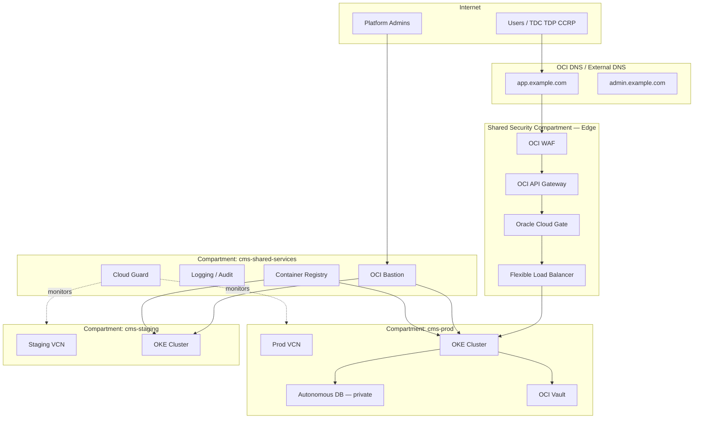

# OCI Security Architecture — Contract Management System

This document defines the **recommended Oracle Cloud Infrastructure (OCI) security architecture** for deploying the Contract Management System across **dev, test, staging, and production** environments. It aligns with OCI Well-Architected Framework security pillars, Zero Trust principles, and the application’s existing stack (React frontend, Node.js API, Keycloak, PostgreSQL/Autonomous Database, Redis, optional SCITT CCF, CAN/training workloads on OKE).

**Related docs**

- [Production Security Guide](SECURITY_GUIDE.md) — application-layer controls (Keycloak, network policies, secrets)
- [OCI Terraform deployment](../../deployment/oci/terraform/README.md) — baseline infrastructure modules
- [Production Architecture](PRODUCTION_ARCHITECTURE.md) — service topology

---

## 1. Design goals

| Goal | Implementation on OCI |
|------|------------------------|
| **Strong environment isolation** | Separate compartments, VCNs, identity domains, and encryption keys per environment |
| **Least privilege** | IAM groups, dynamic groups, tag-based access, deny-by-default NSGs |
| **Defense in depth** | WAF → API Gateway / Cloud Gate → LB → OKE ingress → micro-segmentation |
| **Observable & auditable** | Unified Logging, Audit, Cloud Guard, Security Zones, SIEM export |
| **Data protection** | Vault/KMS, Autonomous DB TDE, Object Storage encryption, private DB endpoints |
| **Operational safety** | Bastion (no public SSH), break-glass accounts, change control per env |

---

## 2. High-level reference architecture



**Traffic path (production user-facing)**

1. **DNS** resolves to WAF public endpoint (or WAF in front of LB).
2. **WAF** terminates TLS, applies OWASP rules, bot management, geo/rate limits.
3. **API Gateway** (for `/api/*`) validates JWT/API keys, throttling, request validation, routing to backend upstream.
4. **Cloud Gate** protects browser sessions for SPA + Keycloak admin flows (SSO with Identity Domain).
5. **Load Balancer** (private backend sets only) forwards to OKE **Ingress Controller** in private subnets.
6. **OKE** runs frontend, backend, Keycloak, Redis; egress via NAT; DB via **private endpoint** only.

---

## 3. Compartment hierarchy

Use a **three-level compartment tree** under a dedicated tenancy (or dedicated top-level compartment). Never deploy all environments in one compartment.

```
Tenancy (or Root CMS Compartment)
├── cms-security-shared          # WAF, Cloud Guard, central logging, SIEM, cert management
├── cms-network-shared           # DRG, hub VCN (optional), DNS zones, FastConnect/VPN landing
├── cms-shared-services          # OCIR, artifact buckets, Terraform state, CI/CD runners
├── cms-identity                 # Identity Domains (or domain admin policies only)
├── cms-dev
│   ├── cms-dev-network
│   ├── cms-dev-compute          # OKE, Bastion
│   ├── cms-dev-data             # ADB dev, Object Storage dev
│   └── cms-dev-ops              # alarms, on-call test integrations
├── cms-test
│   ├── cms-test-network
│   ├── cms-test-compute
│   ├── cms-test-data
│   └── cms-test-ops
├── cms-staging
│   ├── cms-staging-network
│   ├── cms-staging-compute
│   ├── cms-staging-data
│   └── cms-staging-ops
└── cms-prod
    ├── cms-prod-network
    ├── cms-prod-compute
    ├── cms-prod-data
    └── cms-prod-ops
```

### 3.1 Compartment responsibilities

| Compartment | Resources | Notes |
|-------------|-----------|-------|
| **cms-security-shared** | WAF policies, Cloud Guard targets, Security Zones policies, Vulnerability Scanning targets | Centralized security services; read-only to env compartments |
| **cms-network-shared** | DRG, hub VCN, DNS private views, Network Firewall (optional) | Hub-spoke connectivity; no application workloads |
| **cms-shared-services** | OCIR repos, build pipelines, Terraform remote state bucket | Immutable prod images; separate repos or tags per env |
| **cms-{env}-network** | VCN, subnets, NSGs, LB (env-specific), service gateway | One VCN per environment (recommended) |
| **cms-{env}-compute** | OKE, node pools, Bastion endpoint | No public worker nodes |
| **cms-{env}-data** | Autonomous DB, Redis (OKE or managed), Object Storage for datasets/artifacts | **Security Zone**: restrict public buckets |
| **cms-{env}-ops** | Monitoring alarms, notifications, on-call topics | Prod alarms route to PagerDuty/Opsgenie |

### 3.2 IAM policy pattern (example)

Policies are attached at the **compartment** where resources live. Use **groups**, not user principals, in policies.

```hcl
# Platform engineers — dev/test only
Allow group cms-platform-dev to manage all-resources in compartment cms-dev
Allow group cms-platform-dev to read all-resources in compartment cms-shared-services

# Staging deployers — limited write
Allow group cms-release-managers to use cluster-family in compartment cms-staging-compute
Allow group cms-release-managers to read repos in compartment cms-shared-services

# Production — break-glass + change window
Allow group cms-prod-ops to use cluster-family in compartment cms-prod-compute
Allow group cms-prod-ops to read secret-family in compartment cms-prod-data
Deny group cms-prod-ops to manage database-family in compartment cms-prod-data
  where request.permission != 'AUTONOMOUS_DATABASE_CONNECT'

# Cloud Guard service
Allow service cloudguard to read all-resources in tenancy
Allow service cloudguard to use network-security-groups in tenancy
```

**Dynamic groups** (for OKE workloads):

```hcl
# Instance principal for nodes in prod only
Allow dynamic-group cms-prod-oke-nodes to read secret-bundles in compartment cms-prod-data
Allow dynamic-group cms-prod-oke-nodes to use keys in compartment cms-prod-data
Allow dynamic-group cms-prod-oke-nodes to manage objects in compartment cms-prod-data
  where all { target.bucket.name = 'cms-prod-artifacts-*', any { request.permission = 'OBJECT_READ', request.permission = 'OBJECT_WRITE' } }
```

Use **tag-based authorization** (`cms-environment`, `cms-data-classification`) for cross-compartment automation.

---

## 4. Identity domains (Oracle IAM Identity Domains)

Use **separate Identity Domains per environment** (strong isolation) or **one domain with segregated apps/groups** (lower cost). For regulated/confidential AI training data, **separate domains** are recommended.

| Environment | Identity Domain | Purpose |
|-------------|-----------------|---------|
| **dev** | `cms-dev-id` | Developer SSO, local Keycloak sync testing |
| **test** | `cms-test-id` | QA automation, Playwright service accounts |
| **staging** | `cms-staging-id` | Pre-prod UAT, partner demos |
| **prod** | `cms-prod-id` | TDC / TDP / CCRP / AppAdmin production users |

### 4.1 Integration with Keycloak

Keycloak remains the **application authorization** source (roles: TDC, TDP, CCRP, AppAdmin). Identity Domain provides **enterprise SSO**:

| Layer | Component | Responsibility |
|-------|-----------|----------------|
| Corporate IdP | Okta / Azure AD / corporate SAML | Workforce & partner federation |
| OCI Identity Domain | SAML/OIDC broker | Per-environment user lifecycle, MFA |
| Cloud Gate | Reverse proxy + SSO | Protects frontend URLs and Keycloak admin console |
| Keycloak | Realm `contract-management` | App roles, client credentials, token issuance |
| Backend API | JWT validation | `authenticateToken` middleware (existing) |

**Production flow**

1. User hits `https://app.example.com` → Cloud Gate → Identity Domain login (MFA).
2. Cloud Gate sets session cookie; forwards to frontend SPA.
3. SPA uses Keycloak OIDC (confidential/public client) for API tokens.
4. API Gateway validates JWT signature (Keycloak JWKS) before traffic reaches OKE.

### 4.2 Service accounts & automation

| Account type | Domain | Storage | Rotation |
|--------------|--------|---------|----------|
| CI/CD pipeline | `cms-shared-services` | OCI Vault secret | 90 days |
| Terraform | `cms-shared-services` | Vault + dynamic group | 90 days |
| E2E / monitoring | per-env domain | Vault; scoped policies | 30–90 days |
| Break-glass admin | prod domain | Hardware MFA; vault sealed | per incident |

Never embed long-lived API keys in Terraform state or container images.

---

## 5. Network segmentation

### 5.1 Recommended model: one VCN per environment

Each environment gets an **isolated VCN** with non-overlapping CIDRs. Connect to shared services via **DRG hub-spoke** (optional) or keep environments fully isolated (simplest for prod).

| Environment | VCN CIDR | OKE pod CIDR | Service CIDR |
|-------------|----------|--------------|--------------|
| dev | `10.10.0.0/16` | `10.244.0.0/16` | `10.96.0.0/16` |
| test | `10.20.0.0/16` | `10.245.0.0/16` | `10.97.0.0/16` |
| staging | `10.30.0.0/16` | `10.246.0.0/16` | `10.98.0.0/16` |
| prod | `10.40.0.0/16` | `10.247.0.0/16` | `10.99.0.0/16` |

### 5.2 Subnet tiers (per VCN)

```
┌─────────────────────────────────────────────────────────────────┐
│  Public subnets (regional, 2+ ADs)                              │
│  - WAF / LB listeners only                                      │
│  - NO compute instances, NO OKE nodes                           │
└───────────────────────────────┬─────────────────────────────────┘
                                │
┌───────────────────────────────▼─────────────────────────────────┐
│  DMZ / Edge subnets (optional)                                  │
│  - API Gateway deployment                                       │
│  - Cloud Gate connector                                         │
└───────────────────────────────┬─────────────────────────────────┘
                                │
┌───────────────────────────────▼─────────────────────────────────┐
│  Private app subnets (OKE worker nodes)                         │
│  - Route: 0.0.0.0/0 → NAT Gateway                               │
│  - Route: OCI Services → Service Gateway                        │
└───────────────────────────────┬─────────────────────────────────┘
                                │
┌───────────────────────────────▼─────────────────────────────────┐
│  Private data subnets                                           │
│  - Autonomous DB private endpoint                               │
│  - No internet route                                            │
└─────────────────────────────────────────────────────────────────┘
```

### 5.3 Gateways

| Gateway | Placement | Purpose |
|---------|-----------|---------|
| **Internet Gateway** | Public subnets only | WAF/LB ingress |
| **NAT Gateway** | Private app subnets | Controlled egress (updates, external APIs) |
| **Service Gateway** | Private subnets | OCI API, Object Storage, Logging without public internet |
| **DRG** | Hub VCN | Cross-VCN routing (staging→shared OCIR); disable dev→prod |
| **Local Peering** | Avoid for prod | Use DRG for auditable routing |

### 5.4 Network Security Groups (NSGs) — default deny

Apply **NSGs** (preferred over legacy security lists) with explicit allow rules.

**NSG: `nsg-lb-ingress` (public)**

| Direction | Source | Dest | Ports | Notes |
|-----------|--------|------|-------|-------|
| Ingress | `0.0.0.0/0` | LB | 443 | From WAF only in hardened variant: WAF CIDRs |
| Egress | LB | OKE ingress | 443, 8080 | Frontend + Keycloak paths |

**NSG: `nsg-oke-workers`**

| Direction | Source | Dest | Ports |
|-----------|--------|------|-------|
| Ingress | `nsg-lb-ingress` | workers | NodePort / ingress |
| Egress | workers | `nsg-adb` | 1522 |
| Egress | workers | NAT | 443 (external APIs, JWKS) |
| Deny | any | `10.40.0.0/16` data | except ADB NSG |

**NSG: `nsg-adb`**

| Direction | Source | Dest | Ports |
|-----------|--------|------|-------|
| Ingress | `nsg-oke-workers` | ADB | 1522 |
| Egress | none to internet | — | — |

### 5.5 OCI Network Firewall (optional, prod/staging)

For egress filtering beyond NAT:

- Deploy **Network Firewall** in hub or edge subnet.
- Force private subnet egress through firewall policy.
- Allowlist: OCIR, Keycloak JWKS, SCITT endpoints, CAN attestation URLs.
- Log all denied flows to Logging Analytics.

### 5.6 Private DNS

- **Private DNS view** per VCN: `backend.cms-prod.internal`, `keycloak.cms-prod.internal`.
- Autonomous DB connect strings use **private endpoint** hostnames only.
- No public A records for database or Redis.

---

## 6. Edge security: WAF, API Gateway, Cloud Gate

### 6.1 OCI Web Application Firewall (WAF)

Deploy **one WAF policy per environment** (prod policy stricter than dev).

| Control | Dev | Test | Staging | Prod |
|---------|-----|------|--------|------|
| OWASP Core Rule Set | Log only | Block | Block | Block |
| Bot management | Off | Basic | Basic | Advanced |
| Rate limiting | Relaxed | Medium | Medium | Strict (per IP + per API key) |
| Geo blocking | Off | Off | Optional | Per compliance |
| File upload limits | 50 MB | 50 MB | 25 MB | 25 MB |

**Protect**

- `app.{env}.example.com` — React SPA
- `auth.{env}.example.com` — Keycloak (admin console restricted by IP + Cloud Gate)

**Recommended prod rules**

- Block SQLi, XSS, path traversal on `/api/*`
- Challenge suspicious bots on login endpoints
- Custom rule: block `POST /api/auth/login` > 20 req/min/IP
- Attach WAF to Load Balancer or API Gateway depending on entry point

### 6.2 OCI API Gateway

Place **API Gateway** in front of backend REST APIs (`/api/*`).

| Feature | Configuration |
|---------|---------------|
| **Authentication** | JWT validation (Keycloak JWKS URL per env) |
| **Authorization** | Route-level scopes (`tdc`, `tdp`, `ccrp`, `appadmin`) |
| **Rate limiting** | Per route: e.g. contract sign 10/min, training 5/min |
| **Request validation** | OpenAPI spec from backend swagger export |
| **CORS** | Allow only frontend origin |
| **Logging** | Full request logs to Logging service (PII redaction) |
| **Upstream** | Private LB or direct OKE ingress (private) |

**Route examples**

| Route | Auth | Upstream |
|-------|------|----------|
| `GET /api/health` | None | backend |
| `POST /api/auth/login` | None + WAF rate limit | backend |
| `POST /api/contracts/*/sign` | JWT + role `TDP\|CCRP` | backend |
| `POST /api/can/*` | JWT + mTLS (CCRP principal) | backend |
| `GET /api/scitt-ccf/*` | JWT + AppAdmin | backend |

### 6.3 Oracle Cloud Gate

Cloud Gate sits **in front of browser-facing apps** (not a replacement for API Gateway on machine-to-machine traffic).

| Application | Cloud Gate app | Identity Domain app |
|-------------|----------------|---------------------|
| React frontend | `cms-frontend-prod` | SSO + MFA |
| Keycloak admin | `cms-keycloak-admin-prod` | Admin group only |
| Grafana (ops) | `cms-grafana-prod` | SRE group |

**Configuration**

- Enforce MFA for prod admin paths.
- Session idle timeout: 30 min (prod), 8 h (dev).
- IP allowlist for Keycloak master console.
- Integrate with **Identity Domain** SAML/OIDC; Keycloak broker trusts corporate IdP.

---

## 7. Compute & container security (OKE)

### 7.1 Cluster hardening

| Control | Setting |
|---------|---------|
| **Cluster endpoint** | Private API endpoint; access via Bastion + kubectl |
| **Node shape** | Dedicated VM.Standard.E4.Flex (prod); no preemptible |
| **Node placement** | Private subnets only |
| **Pod Security** | PSA `restricted` namespace for app workloads |
| **Network policies** | Default deny; allow ingress from ingress-nginx only |
| **Secrets** | External Secrets Operator → OCI Vault |
| **Image pull** | OCIR with IAM auth; scan on push |
| **RBAC** | Separate K8s RBAC per team; no cluster-admin for apps |

### 7.2 Workload layout (namespace per tier)

| Namespace | Workloads | Exposure |
|-----------|-----------|----------|
| `cms-ingress` | ingress-nginx / Gateway API | From LB only |
| `cms-app` | frontend, backend | Internal |
| `cms-iam` | Keycloak, Keycloak DB | Cloud Gate + internal |
| `cms-data` | Redis | Internal only |
| `cms-training` | CAN jobs, training sidecars | No ingress from internet |
| `cms-ops` | prometheus, fluent-bit | Admin VPN / Bastion |

Align with existing app ports: frontend **3000**, backend **5001**, Keycloak **8080**.

### 7.3 Vulnerability Scanning

- Enable **OCI Vulnerability Scanning** on OCIR repositories.
- Block deploy if **CRITICAL** CVEs without exception ticket.
- Scan OKE worker images on schedule.

---

## 8. Data security

### 8.1 Autonomous Database

| Control | Prod | Non-prod |
|---------|------|----------|
| **Access** | Private endpoint only | Private preferred; public disabled |
| **TDE** | Oracle-managed keys | Oracle-managed or Vault |
| **Customer-managed keys** | Vault HSM key (prod) | Optional |
| **Audit** | Unified Audit + DB audit | Unified Audit |
| **Backup** | Daily + monthly long-term | Shorter retention |
| **Data Safe** | Enabled (SQL firewall, user assessment) | Optional on staging |

### 8.2 Object Storage (datasets & training artifacts)

- Buckets in **cms-{env}-data** compartment.
- **Security Zone**: deny public buckets in prod/staging.
- Encryption: **SSE-KMS** with env-specific Vault key.
- Pre-authenticated requests: **disabled** in prod.
- Lifecycle: dev 30d, test 90d, staging 180d, prod per contract retention.

### 8.3 OCI Vault & keys

| Key | Env | Rotation | Used by |
|-----|-----|----------|---------|
| `cms-prod-db-cmk` | prod | 365d | ADB TDE |
| `cms-prod-app-secrets` | prod | 90d | Keycloak client secret, JWT signing |
| `cms-prod-artifacts` | prod | 365d | Object Storage SSE |
| `cms-{env}-tls` | all | 90d | Cert import for LB (or use OCI Certificates) |

Never store secrets in Terraform `.tfvars` in git; use Vault references.

---

## 9. Security operations & governance

### 9.1 Oracle Cloud Guard

Enable Cloud Guard at **tenancy root** with targets on each `cms-*` compartment.

| Detector | Action |
|----------|--------|
| Public bucket | Remediate / alert |
| Open security list (0.0.0.0/0:22) | Remediate |
| Instance without Bastion | Alert |
| Crypto mining | Isolate + alert |
| IAM policy overly permissive | Ticket |

**Responder rules (prod)**

- Auto-remediate public Object Storage ACLs.
- Notify `#security` on critical findings; no auto-delete of prod DB.

### 9.2 Security Zones

Apply **Security Zone** to `cms-prod-data` and `cms-staging-data`:

- Deny public Object Storage buckets.
- Deny compute instances in public subnets.
- Deny DB systems without encryption.
- Require Vault for secret creation.

### 9.3 Logging, audit, SIEM

| Log type | Destination | Retention |
|----------|-------------|-----------|
| OCI Audit | Logging + archive bucket | 1y prod, 90d non-prod |
| WAF / API GW access | Logging Analytics | 90d–1y |
| OKE container logs | Logging + optional SIEM | 90d prod |
| Keycloak audit | Logging | 1y prod |
| App audit (contracts, sign) | App DB + export | per compliance |

Export to enterprise SIEM (Splunk, Sentinel) via **Service Connector Hub**.

### 9.4 Bastion & admin access

- **No SSH/RDP from internet** to any instance or node.
- Admins use **OCI Bastion** port forwarding to private OKE API or jump host.
- Prod kubectl access: Bastion + MFA + approval workflow.
- Session recordings logged.

---

## 10. Environment-specific profiles

### 10.1 Development

| Area | Posture |
|------|---------|
| Compartment | `cms-dev` only |
| Identity | `cms-dev-id`; developers in `cms-dev-users` |
| Network | Single VCN; WAF log-only |
| Data | Synthetic data only; no production copies |
| Cloud Guard | Detect only |
| Break-glass | Allowed with ticket |

### 10.2 Test (QA / automation)

| Area | Posture |
|------|---------|
| Compartment | `cms-test` |
| Identity | Service accounts for Playwright CI |
| Network | WAF block mode; API Gateway rate limits |
| Data | Anonymized fixtures; rotate weekly |
| Pipelines | OCIR tags `test-*`; no prod image promotion |

### 10.3 Staging

| Area | Posture |
|------|---------|
| Compartment | `cms-staging` |
| Identity | Mirrors prod groups; separate domain |
| Network | **Same architecture as prod**, smaller shapes |
| Data | Masked copy of prod schema (no raw PII) |
| Release gate | Security scan + pen test sign-off before prod |

### 10.4 Production

| Area | Posture |
|------|---------|
| Compartment | `cms-prod` with Security Zones |
| Identity | MFA mandatory; quarterly access review |
| Network | WAF + API GW + Cloud Gate + private OKE/ADB |
| Change control | Blue/green or canary on OKE |
| Backups | Cross-region ADB backup; Object Storage replication |
| DR | Warm standby in second region (see §11) |

---

## 11. Multi-region & disaster recovery (prod)

| Component | Primary | DR region |
|-----------|---------|-----------|
| OKE | Active | Standby cluster (scaled down) |
| ADB | Active | Autonomous Data Guard cross-region |
| Object Storage | Active | Replication policy |
| OCIR | Primary region | Cross-region replication |
| DNS | Active-active or failover | Health-checked failover to DR WAF |
| Vault | Region-local keys | DR keys pre-provisioned; break-glass procedure |

RTO target: **4 h** | RPO target: **15 min** (adjust per contract SLA).

---

## 12. Application mapping (Contract Management System)

| Component | OCI service | Security notes |
|-----------|-------------|----------------|
| React frontend | OKE + Cloud Gate | CSP headers at ingress; no secrets in bundle |
| Backend API | OKE + API Gateway | JWT via Keycloak; signing gate for TDP/CCRP |
| Keycloak | OKE + Cloud Gate (admin) | External DB on ADB; Vault for client secrets |
| PostgreSQL / ADB | Autonomous DB | Private endpoint; SQL Firewall (Data Safe) |
| Redis | OKE or OCI Cache | Password in Vault; no public access |
| SCITT CCF | OKE or dedicated VM | Isolate namespace; mTLS to backend |
| CAN / training | OKE `cms-training` | Confidential computing where required; no inbound |
| Playwright E2E | test compartment CI | Uses seeded users; no prod credentials |

---

## 13. Deployment & IaC alignment

Extend existing Terraform under `deployment/oci/terraform/`:

| Module (proposed) | Purpose |
|-------------------|---------|
| `modules/compartments` | Compartment tree + IAM policies |
| `modules/identity` | Identity Domain apps (via API/null_resource) |
| `modules/waf` | WAF policy + LB attachment |
| `modules/api_gateway` | Gateway + routes + JWT |
| `modules/cloud_guard` | Targets + responder rules |
| `modules/security_zone` | Zone policies on data compartments |
| `modules/bastion` | Bastion + session logging |

**Tagging standard** (required on all resources):

```yaml
cms-project: contract-management
cms-environment: dev | test | staging | prod
cms-owner: platform-team
cms-data-classification: public | internal | confidential | restricted
cms-cost-center: <code>
```

---

## 14. Security checklist (pre-go-live prod)

### Identity & access

- [ ] Separate Identity Domain for prod; MFA enforced
- [ ] No local OCI user passwords; federated IdP only
- [ ] Break-glass accounts sealed in Vault; tested quarterly
- [ ] Keycloak realm roles match TDC/TDP/CCRP/AppAdmin

### Network

- [ ] No public IPs on OKE workers or databases
- [ ] NSGs default-deny verified with connectivity tests
- [ ] WAF attached; OWASP CRS blocking enabled
- [ ] API Gateway JWT validation on all protected routes
- [ ] Cloud Gate protecting frontend and Keycloak admin

### Data

- [ ] ADB private endpoint only; Data Safe enabled
- [ ] Object Storage buckets private; Security Zone active
- [ ] Vault keys rotated; no secrets in git or images

### Operations

- [ ] Cloud Guard enabled with prod responders
- [ ] Audit logs exported to SIEM
- [ ] Bastion-only admin access documented
- [ ] Incident response runbook linked to on-call
- [ ] Backup/restore drill completed

### Application

- [ ] `./fix-auth.sh` / Keycloak sync procedure documented for prod
- [ ] Contract signing gate tested (TDP/CCRP linkage)
- [ ] Rate limits on `/api/auth/login` and `/api/contracts/*/sign`

---

## 15. Reference URLs

- [OCI Security Guide](https://docs.oracle.com/en-us/iaas/Content/Security/Concepts/security_guide.htm)
- [OCI Well-Architected Framework — Security](https://docs.oracle.com/en/solutions/oci-well-architected-framework/security-and-compliance.html)
- [Cloud Guard](https://docs.oracle.com/en-us/iaas/cloud-guard/home.htm)
- [OCI WAF](https://docs.oracle.com/en-us/iaas/Content/WAF/home.htm)
- [API Gateway](https://docs.oracle.com/en-us/iaas/Content/APIGateway/home.htm)
- [Oracle Cloud Gate](https://docs.oracle.com/en/cloud/paas/access-gateway/)
- [Identity Domains](https://docs.oracle.com/en-us/iaas/Content/Identity/domains/overview.htm)
- [OKE Security](https://docs.oracle.com/en-us/iaas/Content/ContEng/Concepts/contengsecurity.htm)
- [Security Zones](https://docs.oracle.com/en-us/iaas/Content/SecurityZone/home.htm)
- [Bastion](https://docs.oracle.com/en-us/iaas/Content/Bastion/home.htm)

---

**Document version:** 1.0  
**Last updated:** 2026-06-15  
**Owner:** Platform / Security Engineering  
**Status:** Recommended architecture — implement via Terraform modules and change-controlled rollout per environment.
