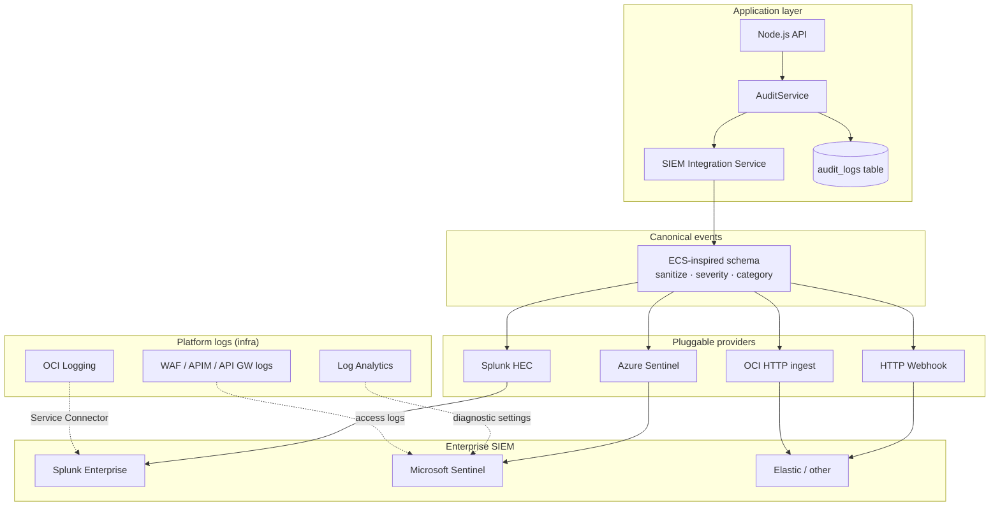

# SIEM Integration Framework

Central security event export for the **Confidential AI Network** — application audit logs, platform logs, and alert routing to enterprise SIEMs.

## Document set

| Document | Role |
|----------|------|
| **This doc** | Framework architecture, event taxonomy, application config |
| [deployment/siem/README.md](../../deployment/siem/README.md) | Platform log forwarding (OCI, Azure, on-prem) |
| [SECURITY_GUIDE.md](SECURITY_GUIDE.md) | Application security controls |
| [OCI Security Architecture](OCI_SECURITY_ARCHITECTURE.md) | OCI Service Connector → SIEM |
| [Azure Security Architecture](AZURE_SECURITY_ARCHITECTURE.md) | Log Analytics → Sentinel |

---

## 1. Architecture overview



**Two log paths:**

1. **Application audit** — `AuditService` → database + real-time SIEM export via `backend/services/siem/`.
2. **Platform / infra** — WAF, API Gateway, AKS/OKE, Keycloak container logs → cloud logging → SIEM (see [deployment/siem/README.md](../../deployment/siem/README.md)).

---

## 2. Application framework (`backend/services/siem/`)

| Module | Purpose |
|--------|---------|
| `canonicalEvent.js` | Normalizes audit rows to a single schema; redacts secrets |
| `siemIntegrationService.js` | Loads providers from env; fan-out export |
| `providers/httpWebhookProvider.js` | Generic POST (OCI Functions, Elastic, custom) |
| `providers/splunkHecProvider.js` | Splunk HTTP Event Collector |
| `providers/azureSentinelProvider.js` | Log Analytics Data Collector API |
| `providers/ociLoggingProvider.js` | CloudEvents wrapper to OCI HTTP ingest |

### Enable SIEM export

```bash
# config.env or config/system.env
SIEM_ENABLED=true
SIEM_PROVIDERS=sentinel,splunk
SIEM_ENVIRONMENT=prod

SIEM_SENTINEL_WORKSPACE_ID=<workspace-id>
SIEM_SENTINEL_SHARED_KEY=<shared-key>
SIEM_SENTINEL_LOG_TYPE=CANAudit

SIEM_SPLUNK_HEC_URL=https://splunk.corp.example:8088
SIEM_SPLUNK_HEC_TOKEN=<hec-token>
```

Full variable list: [config/examples/siem.env.example](../../config/examples/siem.env.example).

### Verify status

```bash
# Admin JWT required
curl -s -H "Authorization: Bearer $TOKEN" http://localhost:5001/api/security/siem | jq
```

---

## 3. Canonical event schema

Every provider receives the same JSON shape:

```json
{
  "@timestamp": "2026-06-16T12:00:00.000Z",
  "event": {
    "id": "uuid",
    "kind": "event",
    "category": ["authentication"],
    "type": ["AUTH_LOGIN"],
    "action": "AUTH_LOGIN",
    "outcome": "success",
    "severity": 4
  },
  "can": {
    "project": "ConfidentialAINetwork",
    "environment": "prod",
    "source": "audit-service",
    "schema_version": "1.0"
  },
  "user": { "id": "42" },
  "source": { "ip": "10.0.1.5", "user_agent": "..." },
  "message": "AUTH_LOGIN user=42",
  "details": { "success": true }
}
```

**Automatic redaction:** fields matching `password`, `token`, `secret`, `key`, `authorization` are replaced with `***REDACTED***`.

### Event categories

| Prefix / type | Category | Examples |
|---------------|----------|----------|
| `AUTH_*` | authentication | login, logout, MFA failure |
| `CONSENT_*` | consent | DPDP consent grant/withdraw |
| `SECURITY_*` | security | threat detection, IP block |
| `DATA_ACCESS` | data_access | dataset read, export |
| `CONTRACT_*`, `SIGN_*` | contract | create, sign, revoke |
| Training-related | training | job start, model register |

---

## 4. Provider reference

### HTTP Webhook (`webhook`)

| Variable | Description |
|----------|-------------|
| `SIEM_WEBHOOK_URL` | POST endpoint |
| `SIEM_WEBHOOK_HEADERS` | Optional JSON headers |

Use for OCI Functions forwarding to Splunk, Elastic ingest pipelines, or internal collectors.

### Splunk HEC (`splunk`)

| Variable | Default |
|----------|---------|
| `SIEM_SPLUNK_HEC_URL` | required |
| `SIEM_SPLUNK_HEC_TOKEN` | required |
| `SIEM_SPLUNK_INDEX` | `can_security` |
| `SIEM_SPLUNK_SOURCETYPE` | `can:audit` |

### Microsoft Sentinel (`sentinel`)

Uses the [Log Analytics Data Collector API](https://learn.microsoft.com/azure/azure-monitor/logs/data-collector-api).

| Variable | Description |
|----------|-------------|
| `SIEM_SENTINEL_WORKSPACE_ID` | Log Analytics workspace ID |
| `SIEM_SENTINEL_SHARED_KEY` | Primary or secondary key |
| `SIEM_SENTINEL_LOG_TYPE` | Custom log table name (`CANAudit`) |

Create analytics rules in Sentinel on `CANAudit` for auth failures, contract signing anomalies, etc.

### OCI HTTP ingest (`oci`)

| Variable | Description |
|----------|-------------|
| `SIEM_OCI_LOGGING_ENDPOINT` | HTTP endpoint (Function / custom) |
| `SIEM_OCI_AUTH_HEADER` | Optional `Authorization` value |

Payload uses CloudEvents 1.0 envelope. For native OCI → Splunk/Sentinel routing of **infra** logs, use Service Connector Hub (see deployment guide).

---

## 5. Platform SIEM wiring

### OCI

| Log source | OCI service | SIEM path |
|------------|-------------|-----------|
| Audit API calls | OCI Audit | Logging → Service Connector → Splunk/Sentinel |
| WAF / API GW | OCI Logging | Log group → Connector |
| OKE containers | OCI Logging | Cluster log → Connector |
| App audit (this framework) | Backend pod | `SIEM_*` env → direct API |

### Azure

| Log source | Azure service | SIEM path |
|------------|---------------|-----------|
| Activity / resource logs | Azure Monitor | Diagnostic settings → Log Analytics |
| WAF / APIM / App GW | Diagnostic settings | Log Analytics → Sentinel |
| AKS containers | Container Insights | Log Analytics |
| App audit (this framework) | Backend pod | `SIEM_SENTINEL_*` or Splunk HEC |

### On-premises / hybrid

| Component | Recommendation |
|-----------|----------------|
| Splunk | HEC provider + Universal Forwarder on VMs |
| Elastic | Webhook provider → Logstash HTTP input |
| QRadar | Webhook → QRadar DSM HTTP receiver |

---

## 6. Sentinel analytics rules (starter)

| Rule | KQL (on `CANAudit`) | Severity |
|------|---------------------|----------|
| Brute force login | `CANAudit | where event_action startswith "AUTH_" and event_outcome == "failure" | summarize count() by source_ip, bin(TimeGenerated, 5m) | where count_ > 10` | High |
| Contract signed after hours | `CANAudit | where event_action contains "SIGN" | extend hour = datetime_part("hour", TimeGenerated) | where hour < 6 or hour > 22` | Medium |
| Data export spike | `CANAudit | where event_category has "data_access" | summarize count() by user_id, bin(TimeGenerated, 1h) | where count_ > 50` | Medium |

---

## 7. Retention & compliance

| Store | Dev | Prod |
|-------|-----|------|
| `audit_logs` (PostgreSQL) | 90 days | 1–7 years (per policy) |
| Log Analytics / OCI Logging | 90 days | 1 year |
| SIEM (Splunk/Sentinel) | 90 days | 1–7 years |

Align `AUDIT_RETENTION_DAYS` with regulatory requirements (DPDP, GDPR). SIEM export is **additive** — database remains source of truth for compliance reports via `AuditService.generateAuditReport()`.

---

## 8. Operations

### Health check

- `GET /api/security/siem` — provider configuration status (no secrets exposed)
- `npm run status` — general system health

### Failure behavior

- SIEM export is **non-blocking** — audit rows always persist to DB first
- Provider failures are logged to stdout; they do not fail API requests
- Set `SIEM_ENABLED=false` in dev to disable export

### Adding a custom provider

1. Extend `backend/services/siem/providers/baseProvider.js`
2. Register in `PROVIDER_REGISTRY` in `siemIntegrationService.js`
3. Add env vars to `config/examples/siem.env.example`
4. Document in this file

---

## 9. Related

- [deployment/siem/README.md](../../deployment/siem/README.md) — Fluent Bit, Service Connector, diagnostic settings
- [config/examples/siem.env.example](../../config/examples/siem.env.example)
- [OCI IAM & Edge Config](../deployment/OCI_IAM_AND_EDGE_CONFIG.md) — logging checklists
- [Azure IAM & Edge Config](../deployment/AZURE_IAM_AND_EDGE_CONFIG.md) — Log Analytics checklists
