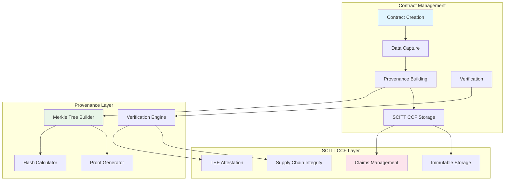

# 🔍 Merkle Tree Provenance Integration Status

## 📋 Document Information
- **Version**: 2.0.0
- **Status**: Design Complete - Implementation Pending
- **Created**: 2025-01-08
- **Last Updated**: 2025-01-08
- **Integration**: SCITT CCF + Merkle Tree Provenance
- **Author**: Contract Management System Team

---

## 🎯 **Current Status**

### **✅ What's Complete**
1. **Merkle builders & proof generators** — `MerkleTreeBuilder`, `ProofGenerator`, `HashCalculator`
2. **Auditor role + UI** — read-only contract list, Merkle audit-tree inspector, proof verify (`/api/auditor/*`, `/auditor/*`)
3. **Durable audit leaves** — tree derived from contract + training jobs + SCITT claims + models
4. **Provenance report APIs** — contract / job JSON bundles used by TDC and Auditor
5. **Database models** — `MerkleTree`, `ProvenanceNode` schema present

### **🚧 Remaining / partial**
1. Legacy in-memory `/api/provenance` session routes still disabled
2. Cross-cloud Merkle replication / SCITT root anchoring not GA everywhere
3. No dedicated Auditor self-registration in the public UI (seed + Keycloak sync)

See also: [AUDITOR_ROLE.md](../features/AUDITOR_ROLE.md)

---

## 🎯 **Legacy status note (superseded)**

The checklist below was written when design preceded code. Prefer the section above.

### **✅ What's Complete (historical checklist)**
1. **Comprehensive Design Documentation** - Full Merkle Tree Provenance architecture documented
2. **UML 4+1 Architecture Integration** - Provenance integrated into system architecture
3. **SCITT CCF Integration Plan** - Provenance services designed to work with SCITT CCF
4. **Database Schema Design** - Provenance tables and relationships defined
5. **Service Layer Architecture** - Provenance service interfaces designed

### **🚧 What's Pending (historical — partially done)**
1. **Actual Implementation** - ~~No JavaScript/Node.js code~~ → builders + auditor APIs exist
2. **Database Tables** - Provenance tables designed; Merkle models present
3. **API Endpoints** - Auditor + provenance-report paths live
4. **Frontend Components** - Auditor dashboard + audit-tree UI shipped
5. **Testing & Validation** - Expand coverage for auditor verify path

---

## 🏗️ **Architecture Integration**

### **SCITT CCF + Merkle Tree Synergy**

The current architecture integrates Merkle Tree Provenance with SCITT CCF Ledger:



### **Key Benefits of Integration**

1. **🔒 Enhanced Security**: SCITT CCF provides immutable storage + Merkle trees provide cryptographic verification
2. **📊 Complete Audit Trail**: Every data transformation tracked with cryptographic proofs
3. **🌐 Cross-Cloud Consistency**: Provenance verified across multiple cloud environments
4. **⚡ High Performance**: SCITT CCF handles high throughput + Merkle trees provide efficient verification
5. **🔍 Regulatory Compliance**: Comprehensive provenance for audit and compliance requirements

---

## 📊 **Implementation Roadmap**

### **Phase 1: Core Infrastructure (Week 1-2)**
- [ ] Create provenance database tables
- [ ] Implement `ProvenanceService` class
- [ ] Implement `MerkleTreeBuilder` class
- [ ] Implement `HashCalculator` class
- [ ] Implement `ProofGenerator` class

### **Phase 2: SCITT CCF Integration (Week 3-4)**
- [ ] Integrate provenance with `ScittCcfService`
- [ ] Update contract creation to include provenance
- [ ] Implement provenance capture during training
- [ ] Add provenance verification endpoints

### **Phase 3: API & Frontend (Week 5-6)**
- [ ] Create provenance API routes
- [ ] Build provenance dashboard components
- [ ] Implement provenance visualization
- [ ] Add provenance verification UI

### **Phase 4: Testing & Validation (Week 7-8)**
- [ ] Unit tests for provenance services
- [ ] Integration tests with SCITT CCF
- [ ] End-to-end provenance workflow testing
- [ ] Performance testing and optimization

---

## 🗄️ **Database Schema**

### **Provenance Tables**

```sql
-- Merkle Tree Structures
CREATE TABLE merkle_trees (
    id SERIAL PRIMARY KEY,
    tree_id VARCHAR(255) UNIQUE NOT NULL,
    contract_id VARCHAR(255) NOT NULL,
    tree_type VARCHAR(50) DEFAULT 'BINARY_MERKLE_TREE',
    hash_algorithm VARCHAR(20) DEFAULT 'SHA256',
    max_depth INTEGER DEFAULT 32,
    root_hash VARCHAR(255) NOT NULL,
    node_count INTEGER DEFAULT 0,
    created_at TIMESTAMP DEFAULT CURRENT_TIMESTAMP,
    updated_at TIMESTAMP DEFAULT CURRENT_TIMESTAMP
);

-- Individual Tree Nodes
CREATE TABLE provenance_nodes (
    id SERIAL PRIMARY KEY,
    node_id VARCHAR(255) UNIQUE NOT NULL,
    tree_id VARCHAR(255) NOT NULL,
    node_type VARCHAR(100) NOT NULL,
    data_hash VARCHAR(255) NOT NULL,
    parent_hash VARCHAR(255),
    left_child_hash VARCHAR(255),
    right_child_hash VARCHAR(255),
    level INTEGER NOT NULL,
    position INTEGER NOT NULL,
    metadata JSONB,
    timestamp TIMESTAMP DEFAULT CURRENT_TIMESTAMP,
    is_verified BOOLEAN DEFAULT FALSE,
    FOREIGN KEY (tree_id) REFERENCES merkle_trees(tree_id)
);

-- Data Capture Events
CREATE TABLE provenance_captures (
    id SERIAL PRIMARY KEY,
    capture_id VARCHAR(255) UNIQUE NOT NULL,
    contract_id VARCHAR(255) NOT NULL,
    capture_type VARCHAR(100) NOT NULL,
    data_source VARCHAR(255) NOT NULL,
    data_hash VARCHAR(255) NOT NULL,
    merkle_proof JSONB,
    verification_status VARCHAR(50) DEFAULT 'PENDING',
    captured_at TIMESTAMP DEFAULT CURRENT_TIMESTAMP,
    verified_at TIMESTAMP,
    FOREIGN KEY (contract_id) REFERENCES contracts(contract_id)
);

-- Verification Results
CREATE TABLE provenance_verifications (
    id SERIAL PRIMARY KEY,
    verification_id VARCHAR(255) UNIQUE NOT NULL,
    capture_id VARCHAR(255) NOT NULL,
    verification_method VARCHAR(100) NOT NULL,
    status VARCHAR(50) NOT NULL,
    details JSONB,
    verified_at TIMESTAMP DEFAULT CURRENT_TIMESTAMP,
    FOREIGN KEY (capture_id) REFERENCES provenance_captures(capture_id)
);
```

---

## 🔧 **Service Implementation**

### **ProvenanceService Class**

```javascript
class ProvenanceService {
    constructor() {
        this.merkleTreeBuilder = new MerkleTreeBuilder();
        this.hashCalculator = new HashCalculator();
        this.proofGenerator = new ProofGenerator();
    }

    async createProvenanceTree(contractId, data) {
        // Build Merkle tree from contract data
        const tree = await this.merkleTreeBuilder.buildTree(data);
        
        // Store tree in database
        const treeRecord = await this.storeTree(contractId, tree);
        
        return treeRecord;
    }

    async addProvenanceNode(treeId, nodeData) {
        // Add new node to existing tree
        const node = await this.merkleTreeBuilder.addNode(treeId, nodeData);
        
        // Update tree root hash
        await this.updateTreeRoot(treeId);
        
        return node;
    }

    async generateMerkleProof(treeId, nodeId) {
        // Generate proof for specific node
        return await this.proofGenerator.generateProof(treeId, nodeId);
    }

    async verifyProvenanceProof(proof, expectedHash) {
        // Verify proof against expected hash
        return await this.proofGenerator.verifyProof(proof, expectedHash);
    }
}
```

---

## 🎯 **Next Steps**

### **Immediate Actions Required**

1. **Database Setup**
   - Create provenance tables in main database
   - Add indexes for performance
   - Set up foreign key relationships

2. **Service Implementation**
   - Implement `ProvenanceService` class
   - Implement supporting utility classes
   - Add error handling and logging

3. **SCITT CCF Integration**
   - Update `ScittCcfService` to use provenance
   - Modify contract creation workflow
   - Add provenance to claims

4. **API Development**
   - Create provenance API routes
   - Add authentication and authorization
   - Implement input validation

### **Success Criteria**

- [ ] Provenance trees created for all contracts
- [ ] Merkle proofs generated and verified
- [ ] SCITT CCF claims include provenance data
- [ ] API endpoints respond within 100ms
- [ ] Frontend displays provenance information
- [ ] Verification process works end-to-end

---

## 📚 **References**

### **Technical Documentation**
- [MERKLE_TREE_PROVENANCE_IMPLEMENTATION.md](./MERKLE_TREE_PROVENANCE_IMPLEMENTATION.md) - Original design document
- [UML_4PLUS1_ARCHITECTURE.md](../architecture/UML_4PLUS1_ARCHITECTURE.md) — 4+1 views (includes Auditor Merkle path)
- [SCITT_CCF_INTEGRATION_README.md](./SCITT_CCF_INTEGRATION_README.md) - SCITT CCF integration details

### **Implementation Resources**
- [Merkle Tree Implementation Guide](https://en.wikipedia.org/wiki/Merkle_tree)
- [SCITT CCF Ledger Documentation](https://github.com/microsoft/scitt-ccf-ledger)
- [Cryptographic Hash Functions](https://en.wikipedia.org/wiki/Cryptographic_hash_function)

---

## 🎯 **Summary**

**Merkle Tree Provenance is fully designed and architecturally integrated but not yet implemented.** The system is ready for implementation with:

- ✅ **Complete Architecture Design** - Provenance integrated with SCITT CCF
- ✅ **Database Schema** - All tables and relationships defined
- ✅ **Service Layer Design** - Provenance services architected
- ✅ **Integration Plan** - Clear roadmap for implementation
- 🚧 **Implementation Pending** - No actual code written yet

The integration will provide **comprehensive provenance tracking** with **cryptographic verification** and **immutable storage** through SCITT CCF, creating a **world-class audit trail** for regulatory compliance and model governance.

---

**Last Updated**: 2025-01-08  
**Version**: 2.0.0 - Design Complete  
**Status**: 🚧 Implementation Pending  
**Next Milestone**: Database Schema Creation
