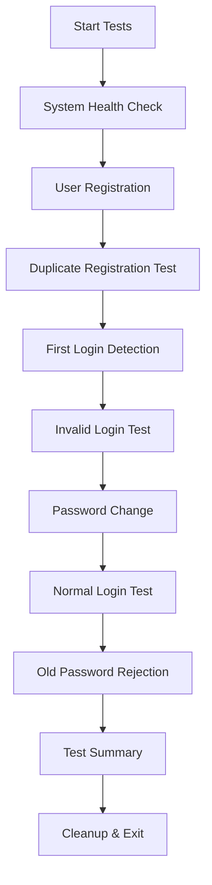

# E2E Test Documentation

## Playwright suites (primary)

The main E2E harness lives under **`frontend/tests/e2e/`** (Playwright). See **[frontend/tests/e2e/README.md](../../frontend/tests/e2e/README.md)**.

| Command | Scope |
|---------|--------|
| `npm run test:e2e:chromium` | Core UI flows (auth, contracts, dashboard, training) |
| `npm run test:e2e:api` | Backend API only: `can-jcs-api.spec.js`, `huggingface-api.spec.js` |
| `npm run test:e2e:physical` | Opt-in real Docker training (`E2E_PHYSICAL_TRAINING=true`) |

**Prerequisites:** backend at `BACKEND_URL` / port 5001; for HF validate tests set `HUGGINGFACE_INTEGRATION_ENABLED=true` on the backend.

---

## Legacy: User Registration and First Login (Mocha)

The section below describes the older **Mocha** runner for registration/first-login. For new work, prefer Playwright under `frontend/tests/e2e/`.

### Overview

This document describes the End-to-End (E2E) test suite for the user registration and first login flow in the Contract Management System. The tests validate the complete user onboarding process from registration through first-time password change.

## Test Coverage

### 1. User Registration Flow
- ✅ **Successful Registration**: Validates API registration with proper response format
- ✅ **Duplicate Prevention**: Ensures duplicate email addresses are rejected
- ✅ **Field Validation**: Tests required field validation during registration
- ✅ **Response Format**: Verifies all expected fields are present in registration response

### 2. First Login Detection
- ✅ **First Login Identification**: Confirms system detects first-time login attempts
- ✅ **Proper Response Format**: Validates `requiresPasswordChange` and `isFirstLogin` flags
- ✅ **No Access Token**: Ensures no access token is provided for first-login users
- ✅ **Invalid Credentials**: Tests rejection of incorrect passwords

### 3. First Login Password Change
- ✅ **Password Update**: Tests successful password change via `/api/auth/first-login-password`
- ✅ **Current Password Validation**: Ensures current password is verified before change
- ✅ **Password Strength**: Validates new password meets security requirements
- ✅ **First Login Flag Clearing**: Confirms `firstLogin` flag is set to `false` after change
- ✅ **Endpoint Security**: Ensures endpoint only works for first-login users

### 4. Post-Password Change Login
- ✅ **Normal Login**: Tests successful login with new password
- ✅ **Access Token Generation**: Validates proper token generation for authenticated users
- ✅ **Old Password Rejection**: Confirms old temporary password no longer works
- ✅ **User State Update**: Verifies user's `firstLogin` status is properly updated

### 5. Integration and Error Handling
- ✅ **API Endpoint Availability**: Confirms all required endpoints are accessible
- ✅ **Response Format Validation**: Ensures API responses match frontend expectations
- ✅ **Malformed Request Handling**: Tests graceful handling of invalid requests
- ✅ **Concurrent Registration**: Validates handling of simultaneous registration attempts

## Test Files

### 1. `tests/e2e-user-registration-first-login.js`
Comprehensive Mocha-based test suite with detailed assertions and error handling.

**Features:**
- Uses Mocha testing framework
- Detailed test descriptions and assertions
- Proper test isolation and cleanup
- Comprehensive error validation

### 2. `run-e2e-tests.js`
Standalone test runner that can be executed independently.

**Features:**
- No external testing framework dependencies
- Colored console output
- Verbose logging option
- Exit codes for CI/CD integration
- Real-time test progress reporting

## Running the Tests

### Prerequisites
Before running the tests, ensure:
- Backend server is running on `localhost:5001`
- Frontend server is running on `localhost:3000` (for integration tests)
- Keycloak is properly configured and running
- Database is accessible and properly migrated

### Test Execution Options

#### 1. Simple E2E Test Runner
```bash
npm run test:e2e
```

#### 2. Verbose E2E Test Runner
```bash
npm run test:e2e:verbose
```

#### 3. Mocha-based Test Suite
```bash
npm run test:e2e:mocha
```

#### 4. Direct Execution
```bash
node run-e2e-tests.js
```

### Configuration Management

The E2E test suite uses the centralized configuration system, loading settings from:
- **`config.env`**: Main configuration file (non-sensitive settings)
- **`secrets.env`**: Sensitive configuration (passwords, tokens, etc.)

This ensures consistency with all other system components and follows the project's configuration management best practices.

### Configuration Validation

Before running tests, validate your configuration:
```bash
npm run test:config
```

This will:
- Load and validate `config.env` and `secrets.env`
- Test backend and frontend connectivity
- Show current configuration settings
- Verify all required variables are present

### Environment Variables

The test suite automatically loads configuration from the centralized files. Key variables include:

| Variable | Source | Description |
|----------|--------|-------------|
| `BACKEND_URL` | `config.env` | Backend API base URL |
| `FRONTEND_URL` | `config.env` | Frontend application URL |
| `KEYCLOAK_URL` | `config.env` | Keycloak authentication server |
| `DB_HOST`, `DB_PORT`, `DB_NAME` | `config.env` | Database connection settings |
| `DB_PASSWORD` | `secrets.env` | Database password |
| `TEST_TIMEOUT` | Environment or default | Test timeout in milliseconds |
| `VERBOSE` | Environment or default | Enable verbose logging |

### Example Usage
```bash
# Run configuration validation first
npm run test:config

# Run E2E tests (uses config.env automatically)
npm run test:e2e

# Run with verbose output
npm run test:e2e:verbose

# Override specific settings if needed
TEST_TIMEOUT=30000 npm run test:e2e
```

## Test Data

Each test run creates a unique test user with:
- **Email**: `e2e-test-{timestamp}@example.com`
- **Name**: `E2E Test User`
- **Party Type**: `TDC`
- **Temporary Password**: Generated by system during registration
- **New Password**: `NewSecurePassword123!`

## Expected Test Flow



## API Endpoints Tested

### Registration
- **POST** `/api/auth/register`
- **Expected Response**: User data, login credentials, next steps

### Login
- **POST** `/api/auth/login`
- **Expected Response**: First-login detection or normal login with tokens

### First Login Password Change
- **POST** `/api/auth/first-login-password`
- **Expected Response**: Success confirmation and first-login completion

## Success Criteria

All tests must pass for the E2E suite to be considered successful:

1. **Registration**: User can be created with valid data
2. **First Login Detection**: System properly identifies first-time login
3. **Password Change**: User can successfully change password on first login
4. **Normal Login**: User can login normally after password change
5. **Security**: Old passwords are rejected, duplicate registrations prevented
6. **Error Handling**: Invalid requests are handled gracefully

## Troubleshooting

### Common Issues

#### Backend Not Running
```
Error: connect ECONNREFUSED 127.0.0.1:5001
```
**Solution**: Start the backend server with `npm run server` or `./scripts/script-manager.sh system start`

#### Keycloak Not Configured
```
Error: Current password is incorrect or password update failed
```
**Solution**: Ensure Keycloak is running and properly configured with the backend

#### Database Connection Issues
```
Error: User not found
```
**Solution**: Verify database is running and migrations are applied

#### Frontend Integration Issues
```
Error: 404 Not Found on API endpoints
```
**Solution**: Check that all required API routes are registered in the backend

### Debug Mode

Enable verbose logging to see detailed test execution:
```bash
VERBOSE=true npm run test:e2e
```

This will show:
- Individual API request/response details
- Test step progression
- Detailed error information
- User data and credentials used

## CI/CD Integration

The test suite is designed for CI/CD integration:

- **Exit Codes**: Returns 0 for success, 1 for failure
- **JSON Output**: Can be configured to output machine-readable results
- **Timeout Handling**: Configurable timeouts prevent hanging builds
- **Environment Variables**: All configuration via environment variables

### Example CI Configuration
```yaml
test-e2e:
  runs-on: ubuntu-latest
  steps:
    - name: Start Services
      run: ./scripts/script-manager.sh system start
    - name: Wait for Services
      run: sleep 30
    - name: Run E2E Tests
      run: npm run test:e2e
      env:
        TEST_TIMEOUT: 30000
```

## Future Enhancements

Potential improvements to the test suite:

1. **Frontend UI Testing**: Add Selenium/Playwright tests for actual UI interaction
2. **Performance Testing**: Add response time assertions
3. **Load Testing**: Test concurrent user registration/login
4. **Security Testing**: Add tests for SQL injection, XSS prevention
5. **Mobile Testing**: Add tests for mobile-specific flows
6. **Multi-Environment**: Support for testing across different environments

## Contributing

When adding new tests:

1. Follow the existing test structure and naming conventions
2. Add proper error handling and cleanup
3. Update this documentation with new test coverage
4. Ensure tests are idempotent and can run multiple times
5. Add appropriate assertions for both success and failure cases

## Support

For issues with the E2E tests:

1. Check the troubleshooting section above
2. Run tests in verbose mode for detailed output
3. Verify all prerequisites are met
4. Check system logs for backend/Keycloak errors
5. Ensure all services are running and properly configured
